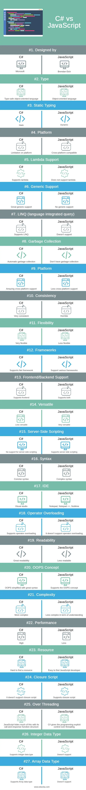

# C#

## Resources:
- ✔️ Principles of OOP: https://journey.study/v2/learn/materials/oop-principles-1q2023
- ✔️ What is .NET? https://journey.study/v2/learn/materials/pages/tools/about-dotnet.md
- ✔️ C# vs JS: https://www.educba.com/c-sharp-vs-js/
- Overview of Classes, Structs abd Records: https://learn.microsoft.com/en-us/dotnet/csharp/fundamentals/object-oriented/
- Compiled vs Interpreted lanugages: https://www.geeksforgeeks.org/difference-between-compiled-and-interpreted-language/

- .NET tutorials: https://dotnet.microsoft.com/en-us/learn
- ✔️ Step-by step tutorial inside browser: https://learn.microsoft.com/en-us/dotnet/csharp/tour-of-csharp/tutorials/hello-world?tutorial-step=1
- ✔️ Microsoft basic tutorial: https://learn.microsoft.com/en-gb/shows/csharp-101/?wt.mc_id=educationalcsharp-c9-scottha
- ✔️ Collection of tutorials: https://learn.microsoft.com/en-us/dotnet/csharp/tour-of-csharp/tutorials/
- Another basic C# free tutorial on codeacademy: https://www.codecademy.com/learn/learn-c-sharp
- Classes and Objects bank account tuts:    https://learn.microsoft.com/en-us/dotnet/csharp/fundamentals/tutorials/classes
                                            https://learn.microsoft.com/en-us/dotnet/csharp/fundamentals/tutorials/oop
- Full Microsoft video course: https://www.youtube.com/playlist?list=PLdo4fOcmZ0oVxKLQCHpiUWun7vlJJvUiN                                

## Fundamentals and basic concepts:
- Introduction to C#:
    - In any kind of programming, there are 2 basic elements: DATA and OPERATIONS that are performed on the data (Youtube - Videos; Facebook - User data)
    - The programmer's role:
        - have an **algorithmic mind** to be able to define the steps that lead from the initial state of raw data to the desired outcome
        - they need to be able to define the data as information:
            - **abstraction:** coming up with a way to represent some concrete or abstract idea in a way that a computer could work with it (real world "things" represented as objects with properties)

- Static vs Dynamic typing:
    - **Dynamic:** You create data and the tpye is defined later, based on it's content (Javascript, Python)
    - **Static:** You need to define the type of the data when you create it (C, C++, C#, Java)

- C# is an object-oriented programming language. The four basic principles of object-oriented programming contribute to writing more testable, flexible, and maintainable code, and they are:
    - **Abstraction**   Modeling the relevant attributes and interactions of entities as classes to define an abstract representation of a system.
                        (Representing the problem domain with a simplified model)
    - **Encapsulation** Hiding the internal state and functionality of an object and only allowing access through a public set of functions.
                        (Hiding the inner workings of a component by only allowing access to it through a public set of functions)
    - **Inheritance**   Ability to create new abstractions based on existing abstractions.
    - **Polymorphism**  Ability to implement inherited properties or methods in different ways across multiple abstractions.

- What is **.NET** ?
    - a framework (=a set of tools and libraries) developed & maintained by Microsoft
    - Besides the libraries that support these use cases, the platform also includes:
        - **.NET compilers (Roslyn)**
        - **Base Class Library (BCL)**
        - **Common Language Runtime (CLR)**
            - a virtual machine that handles the execution of applications
            - provides services like thread management, garbage collection, type-safety, exception handling
            - *common* refers to the support of multiple languages (C#, Visual Basic, F# -> these all run on the CLR)
                - an **IL** (Intermediate Language) is created from the code, which is a compressed format
                - Then the CLR translates it into machine code during execution, using **JIT** (Just-in-Time compilation)
    - The main **strength of .NET** versus other ecosystems comes from the fact that languages and the framework are **being developed by the same entity**
    - **.NET** vs **.NET Framework**:
        - **.NET** is multi-platform, while **.NET Framework** is the original Windows only version

- **C#** vs **JavaScript**:
    - Summary: 
        - C# is a strictly typed object-oriented programming language, and it’s used to develop console applications
        - Desktop applications and C# cannot run without the .NET framework
        - JavaScript is a client-side scripting language used primarily for making interactive effects in web applications. It can execute in any web browser.
    
    - The main **advantages of C#**:
        - Language-Integrated Query (LINQ) expressions make the strongly-typed query a first-class language construct.
        - Supports encapsulation, inheritance, and polymorphism because it’s an object-oriented language.
        - Supports inline XML documentation comments.
        - It is statically typed.
        - It has an operator and conversion overloading.
    
    - Jounrey article comparison:
        - JavaScript is a prototype-based language, but c# is not.
        - Javascript is a scripting language for web browsers. It also is known as New PHP, but C# doesn’t provide any feature like this.
        - JavaScript is dynamically and weakly typed, but C# is statically and strongly.
        - JavaScript’s primary programming paradigm is procedural, but C# primary programming paradigm is (class-based) object-oriented.
        - Javascript doesn’t have an Integer datatype, but C# has an integer data type.
        - Javascript doesn’t have array datatype, but C# supports array data type.
        - In JavaScript, we use “function [function name],” and in C#, we use “void [function name]” or other function types.
        - C# runs the .NET framework, and it is best for making Desktop Applications while Javascript runs in a browser, so for making games and quiz other applications, JavaScript is better.
        - C# is a compiled programming language. JavaScript is a scripting language. So, JavaScript can fail due to syntactic errors at runtime.
    
    

    - ChatGPT comparison:
        - Typing System:
            JavaScript is **dynamically** typed, meaning variable types are determined at runtime and can change.
            C# is **statically** typed, with explicit type declarations and type checking at compile time.
        - Execution Environment:
            JavaScript is **primarily used for web development, running on browsers**, but also on servers (Node.js).
            C# is a **general-purpose language mainly used in .NET framework**, often for desktop applications, server-side applications, and more recently, web development with Blazor.
        - Syntax and Language Features:
            JavaScript syntax is influenced by C, but it includes more **functional programming features**.
            C# syntax is similar to Java and C++, and it **supports both object-oriented** and increasingly more **functional programming** styles.
        - Memory Management:
            JavaScript uses **automatic memory management** (garbage collection) with limited direct control.
            C# also uses garbage collection but **offers more options for memory management** and optimization.
        - Concurrency Model:
            JavaScript **historically used a single-threaded, event-driven model**, but now supports concurrency with Web Workers and **async/await**.
            C# **supports multi-threading** and various advanced concurrency and parallelism models.
        - Community and Ecosystem:
            JavaScript has a vast **ecosystem mainly around web technologies and Node.js**.
            C# is **strongly associated with Microsoft and the .NET ecosystem**, with a focus on enterprise applications, gaming (Unity), and more recently, cross-platform development.
    

## Data types:
- **BASICS:**
    - Output to console:
            Console.WriteLine("string text");

    - Create a variable:
            var container = "this is the value of the container";

- **STRINGS:**
    - Create variable and use `string literal` to display it's value:
            string myName = "Gabor";                    // Using value type to create variable(!)
            string aFriend = "Dori";
            Console.WriteLine($"Hello, my name is {myName}");
            Console.WriteLine("Hello " + aFriend);

    - Using `length` property:
            string myName = "Gabor"
            Console.WriteLine($"{myName} consists of {myName.Length} characters");

- **NUMBERS:**
    - Creating numbers:
            int number = 6;                                     // Integer division always results in an integer! (So it only returns the whole part of the result)

    - Min and Max values that they can represent (based on PC memory):
            int max = int.MaxValue;                     // 2147483647
            int min = int.MinValue;                     // -2147483647

            // OVERFLOW: We flip at the ends, so if we add 1 to the max, we get the first possible negative value
            // We need different types from int to express larger or different numbers

    - `float` and `double`
            float number = 4.5                                  // A single precision floating point number
            double number = 4.5                                 // A double-precision floating point number (Double-precision is a relative term that describes the numbers of binary digits used to store the value)

            // double third = 1.0 / 3.0;                        // 0.333333333333333 -> There is a limit to the decimals the computer can store

    - `decimal` number type has a larger range as `int`, but not as big as `double`. In return, they store a lot more precision:

            // decimal c = 1.0M;
            // decimal d = 3.0M;
            // Console.WriteLine(c / d);                        // 0.3333333333333333333333333333 -> The limit increased (also note the letter 'M' at the end, saying that it's a decimal! Otherwise it would consider it a "double")
    
    - `long` and `short` are also number types

- **ARRAYS, LISTS & COLLECTIONS:**
    - **Lists:**
        - Create a **list** in online browser environment (or add `using System.Collections.Generic` to imports):
                var names = new List<string> { "Juan", "Ana", "Felipe" };       // A "List" of "<string>"s
                foreach (var name in names)
                {
                    Console.WriteLine($"Hello {name.ToUpper()}!");
                }
        
        - Create a **list** in your own environment:
                List<string> names = ["Juan", "Ana", "Felipe"];
                foreach (var name in names)
                {
                    Console.WriteLine($"Hello {name.ToUpper()}!");
                }

## Conditionals / Branches:
- Conditional `if` statemens:
        int a = 5;
        int b = 6;
        if (a + b > 10)
            {
            Console.WriteLine("The answer is greater than 10.");
            }
        else
            {
            Console.WriteLine("The answer is less or equal to 10.");
            }
        
        // we can combine conditions as in JS: if 
        if ((a + b + c > 10) && (a == b))
        if ((a + b + c > 10) || (a == b))

## Loops:
- `while` loop:
        int counter = 0;
        while (counter < 10)
        {
            Console.WriteLine($"Hello World! The counter is {counter}");
            counter++;
        }
- `do while` loop (the condition is executed first, then checked):
        int counter = 0;
        do
        {
            Console.WriteLine($"Hello World! The counter is {counter}");
            counter++;
        } while (counter < 10);
- `for` loop:
        for (int counter = 0; counter < 10; counter++)
        {
            Console.WriteLine($"Hello World! The counter is {counter}");
        }
- `foreach`:
        foreach (var name in names)
        {
            Console.WriteLine($"Hello {name.ToUpper()}!");
        }

## Data types:
- **C# file system:**
    - `using System;` - imports System library (same as writing System.Console.Writeline("") every time )
    - `namespace ConsoleApp6` - groups and organizes code (in case of multiple classes, it's good to keep the ones together that belong together)
    - `class Program` - this is the class we are working in
    - `static void Main(string[] args)` - this is the method we are wokring in (void refers to the return value - void doesn't return anything)

### **String methods:**
- Trim:
        greeting.Trim();
        greeting.TrimStart();
        greeting.TrimEnd();

- Replace:
        string sayhello = "Hello World!"
        sayHello.Replace("Hello", "Greetings")      // "Hello World!" -> "Greetings World!" 
        sayHello.ToUpper()                          // "Hello World!" -> "HELLO WORLD!" 
        sayHello.ToLower()                          // "Hello World!" -> "hello world!"

- Search:
        string songLyrics = "You say goodbye, and I say hello";
        songLyrics.Contains("goodbye")              // True
        songLyrics.Contains("greetings")            // False

        songLyrics.StarsWith("You")                 // True
        songLyrics.EndsWith("Me")                   // False

### **Numbers methods:**
- Basic Math operations: + - / * %
- Math class methods:
        Math.PI
        int.MaxValue;
        int.MinValue;

### **Array-List-Collection methods:**
- Indexing:
        names[0] -> refers to the first element
        names[names.Count - 1] -> refers to the last element
- Add/remove elements:
        names.Add("Bill");
        names.Remove("Ana");
- Length of a list:
        names.Count
- Searching:
        var index = names.IndexOf("Felipe");        // Returns -1 if it doesn't find something

        // So it's a good practice to add an if statement, to do the action only if the item is found:
        if (index != -1)
        {
            Console.WriteLine($"The name {names[index]} is at index {index}");
        }
- Sort (modifies items in place, so modifies the original list):
        names.Sort();                               // Recognizes the data type, and uses Quicksort/Introsort to sort data (so numbers in an ascending order, strings alphabetically)
        foreach (var name in names)
        {
            Console.WriteLine($"Hello {name.ToUpper()}!");
        }
    
