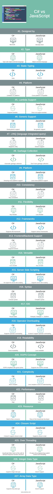

# C#

## Useful keyboard shortcuts:
Alt + Insert - Generate Code (constructor, overwites!)

Alt + <- / -> - Go Back / Forward
Ctrl + LClick - Jump into method / Class

Alt + Shift + F - reformat code
Ctrl + Alt + I - Auto indent
Ctrl + Shift + R - Refactor selected (eg. extract class)

## Resources:
- **Theorical:**
    - ❌ Type system in C#: https://learn.microsoft.com/en-us/dotnet/csharp/fundamentals/types/
    - ❌ Attributes: (eg. [Test]) https://learn.microsoft.com/en-us/dotnet/csharp/advanced-topics/reflection-and-attributes/

- **Tutorials:**
    - ❌ Another basic C# free tutorial on codeacademy: https://www.codecademy.com/learn/learn-c-sharp
    - ✔️ Setting up a project in Rider: https://journey.study/v2/learn/materials/pages/tools/csharp-helloworld-rider                      
    - ✔️ Microsoft basic tutorial: https://learn.microsoft.com/en-gb/shows/csharp-101/?wt.mc_id=educationalcsharp-c9-scottha
    - ✔️ More MSFT tuts (more in sidebar in the link!):    https://learn.microsoft.com/en-us/dotnet/csharp/fundamentals/tutorials/classes

- **Further reads (non-mandatory):**
    - 💭 Memory management: https://endjin.com/blog/2022/07/understanding-the-stack-and-heap-in-csharp-dotnet
    - 💭 Naming conventions: https://github.com/ktaranov/naming-convention/blob/master/C%23%20Coding%20Standards%20and%20Naming%20Conventions.md
    - 💭 NUnit cheatsheet: https://www.automatetheplanet.com/nunit-cheat-sheet/
    - 💭 LINQ cheatsheet: https://www.tutorialsteacher.com/linq
    - 💭 Clean Code Principles: https://journey.study/v2/learn/materials/cc-csharp-1q2023
    - 💭 Architecture checklist: https://journey.study/v2/learn/materials/arch-checklist-csharp-1q2023

## FUNDAMENTALS AND BASIC CONCEPTS:
- Introduction to C#:
    - In any kind of programming, there are 2 basic elements: DATA and OPERATIONS that are performed on the data (Youtube - Videos; Facebook - User data)
    - The programmer's role:
        - have an **algorithmic mind** to be able to define the steps that lead from the initial state of raw data to the desired outcome
        - they need to be able to define the data as information:
            - **abstraction:** coming up with a way to represent some concrete or abstract idea in a way that a computer could work with it (real world "things" represented as objects with properties)

- Static vs Dynamic typing:
    - **Dynamic:** You create data and the tpye is defined later, based on it's content (Javascript, Python)
    - **Static:** You need to define the type of the data when you create it (C, C++, C#, Java)

- What is **.NET** ?
    - a framework (=a set of tools and libraries) developed & maintained by Microsoft
    - Besides the libraries that support these use cases, the platform also includes:
        - **.NET compilers (Roslyn)**
        - **Base Class Library (BCL)**
        - **Common Language Runtime (CLR)**
            - a virtual machine that handles the execution of applications
            - provides services like thread management, garbage collection, type-safety, exception handling
            - *common* refers to the support of multiple languages (C#, Visual Basic, F# -> these all run on the CLR)
                - an **IL** (Intermediate Language) is created from the code, which is a compressed format
                - Then the CLR translates it into machine code during execution, using **JIT** (Just-in-Time compilation)
    - The main **strength of .NET** versus other ecosystems comes from the fact that languages and the framework are **being developed by the same entity**
    - **.NET** vs **.NET Framework**:
        - **.NET** is multi-platform, while **.NET Framework** is the original Windows only version

- **C#** vs **JavaScript**:
    - Summary: 
        - C# is a strictly typed object-oriented programming language, and it’s used to develop console applications
        - Desktop applications and C# cannot run without the .NET framework
        - JavaScript is a client-side scripting language used primarily for making interactive effects in web applications. It can execute in any web browser.
    
    - The main **advantages of C#**:
        - Language-Integrated Query (LINQ) expressions make the strongly-typed query a first-class language construct.
        - Supports encapsulation, inheritance, and polymorphism because it’s an object-oriented language.
        - Supports inline XML documentation comments.
        - It is statically typed.
        - It has an operator and conversion overloading.
    
    - Journey article comparison:
        - JavaScript is a prototype-based language, but c# is not.
        - Javascript is a scripting language for web browsers. It also is known as New PHP, but C# doesn’t provide any feature like this.
        - JavaScript is dynamically and weakly typed, but C# is statically and strongly.
        - JavaScript’s primary programming paradigm is procedural, but C# primary programming paradigm is (class-based) object-oriented.
        - Javascript doesn’t have an Integer datatype, but C# has an integer data type. (?)
        - Javascript doesn’t have array datatype, but C# supports array data type. (?)
        - In JavaScript, we use “function [function name],” and in C#, we use “void [function name]” or other function types.
        - C# runs the .NET framework, and it is best for making Desktop Applications while Javascript runs in a browser, so for making games and quiz other applications, JavaScript is better.
        - C# is a compiled programming language. JavaScript is a scripting language. So, JavaScript can fail due to syntactic errors at runtime.
    
    

    - ChatGPT comparison:
        - Typing System:
            JavaScript is **dynamically** typed, meaning variable types are determined at runtime and can change.
            C# is **statically** typed, with explicit type declarations and type checking at compile time.
        - Execution Environment:
            JavaScript is **primarily used for web development, running on browsers**, but also on servers (Node.js).
            C# is a **general-purpose language mainly used in .NET framework**, often for desktop applications, server-side applications, and more recently, web development with Blazor.
        - Syntax and Language Features:
            JavaScript syntax is influenced by C, but it includes more **functional programming features**.
            C# syntax is similar to Java and C++, and it **supports both object-oriented** and increasingly more **functional programming** styles.
        - Memory Management:
            JavaScript uses **automatic memory management** (garbage collection) with limited direct control.
            C# also uses garbage collection but **offers more options for memory management** and optimization.
        - Concurrency Model:
            JavaScript **historically used a single-threaded, event-driven model**, but now supports concurrency with Web Workers and **async/await**.
            C# **supports multi-threading** and various advanced concurrency and parallelism models.
        - Community and Ecosystem:
            JavaScript has a vast **ecosystem mainly around web technologies and Node.js**.
            C# is **strongly associated with Microsoft and the .NET ecosystem**, with a focus on enterprise applications, gaming (Unity), and more recently, cross-platform development.
    
- **C# file system:**
    - NEW vs OLD template: https://learn.microsoft.com/en-gb/dotnet/core/tutorials/top-level-templates
        - New: 
            - As if we were writing everything inside the `Main` function 
            - All functions created here are local functions, so we can't add access modifiers to them(eg `private` or `public`), they will be `static` 
    - `using System;`:
        - imports System library, that we need to use the Console (same as writing System.Console.Writeline("") every time )
        - `using` is called the **Using directive**, that allows the import of **TYPES** (Classes, interfaces, structs) from a namespace
        - Whenever you want to use a class that is defined in another namespace than the current class, you need to import that namespace, or use the fully qualified name of the class.
    - `namespace ConsoleApp6` 
        - they are **collections of TYPEs**
        - groups and organizes code (in case of multiple classes, it's good to keep the ones together that belong together)
        - the default namespace of a project in Rider is the project's name (eg. "HelloWorld") and this is also the best practice
    - `class Program` 
        - classes are blueprints or schematics from which objects will be create at runtime
        - this is the class we are working in
        - class modifier (eg. `internal`) means where we can use this class. `public` would mean we can use it outside the project as well.
    - `static void Main(string[] args)` 
        - this is the method we are wokring in, the entry point of the application (void refers to the return value - void doesn't return anything)
        - The compiler looks for the method called exactly `Main` to run, so if we rename it, it won't run
        - Access modifier: `public` 
            - it's best practice to keep it `public`
            - this could also be `protected` or `private`
        - `static` (read more in **Anatomy of a method** section):
        - `void` is the return type, which means the method doesn't return anything.
        - `string[] args`:
            - an input parameter of a string array called args
            - used to pass parameters into the application from the command line

- **Build process and execution:**
    - **Build process:**
        - When clicking "Run", the **building** process is initialized:
            1.  The .NET **compiler** (called Roslyn) **performs static analysis to validate the syntax** and semantics of the code. 
                If any errors are found, the build process is halted.
            2.  The compiler **generates a compressed version** of the source code. The target language is called the **IL** or **CIL** (*Common Intermediate Language*). 
                This is a CPU- and platform-independent instruction set that can be executed in any environment that supports it.
            3.  The generated CIL code is written into `.dll` files called **assemblies**. 
                The generated assemblies (and any other third-party assemblies our code requires) are placed in the project's output directory, along with an executable (.exe) if our project is runnable (e.g. a console app.). 
                For Class Library type projects, no executables are generated.
                (Output directory path: *{SolutionName}{ProjectName}\bin\Debug\net8.0* // *HelloWorld\HelloWorld\bin\Debug\net8.0* )
    - **Program execution:**
        - If the build was successful, the app will be run
        - The execution is performed by a platform called `runtime`, which in .NET is called the **CLR** (*Common Language Runtime*)
            - "common" means it's used for all .NET languages (C#, Visual Basic, F#, Visual C++), as they all compile to the same CIL.
        - **C#** is a **managed language**, which means the memory management is done automatically by the runtime.
            - The CLR takes of the memory allocation when a new object is created
            - CLR has a component called **Garbage Collector**, that constatly looks for unused objects, that could free up space.
            - CLR also proveides services like *boundaries*, *reflection* and *type safety*
        - The CLR takes the generated CIL or IL code from the assemblies, and translates it into machine code (1s and 0s), and this code will be run in the end.

- **Memory management in C#:**
    - There are 2 types of memory in C# to store data:
        - **The stack:**
            - Its main purpose is to control the execution flow of the program by tracking the method calls
            - Local variables, specific to the executing method are also stored here.
            - These are short-lived variables that go out of scope once the method which declared them finished the execution.
            - Any `value types` by default will be allocated on the stack.
        - **The heap:**
            - Used to store data that needs to survive through the specific method calls.
            - This area of the memory is managed by the **Garbage Collector**.
            - By default, any `reference types` you create gets allocated on the heap.
    
    - **Equality overriding:**
        - By default, equality is checked by reference (so it checks if a variable and another variable point to the same reference in the memory), so:

                // When we create "card2", we only copy the reference:
                Card card1 = new Card("Ace", Suit.Spades);
                Card card2 = card1;

                Console.WriteLine(card1 == card2); // Prints True

                // The objects are identical, but point to a different place in the memory:
                Card card1 = new Card("Ace", Suit.Spades);
                Card card2 = new Card("Ace", Suit.Spades);

                Console.WriteLine(card1 == card2); // Prints False
        
        - If we want the equality to be *based on the attributes we define* (not on the references), we need to implement our own equality method.
            - This is a design choice that we need to think about when creating the model class:
                - Overwrite `Equals` & `GetHashCode` methods inherited from `Object` *base class* (see tutorial at the end)
                - After override, we should compare not with `==`, but with `obj1.Equals(obj2)` method
    
    - `using` keyword:
        - `using` as a Directive:
            - used at the beginning of a C# file to import namespaces, eg.: `using System;`
                - lets youuse these namespaces directly, without typing the whole "route" before calling a resource
        - `using` as a Statement:
            - The `using` statement is used to **define a scope at the end of which an object will be disposed automatically**
            - a key practice in resource management and avoiding resource leaks in .NET applications

                    using (var streamReader = new StreamReader("file.txt"))     // StreamReader implements `IDisposable`
                    {
                        // Use streamReader here
                    }
                    // streamReader is automatically disposed here, even if an exception is thrown. (= streamReader.Dispose() method is called)
            - **When to use it?**
                - Particularly useful for **managing the lifecycle** of objects that implement the `IDisposable` interface, such as **file streams**, **database connections**, etc.
                - When working with resources that need explicit cleanup (files, network connections, or database connections).
                - To ensure resources are disposed of properly, even in the case of an error or exception.
    
    - `IDisposable` interface:
        - The `IDisposable` interface in C# is used for implementing the `Dispose` pattern:
            - This pattern is all about providing a mechanism for **releasing unmanaged resources** held by an object, such as **file streams**, **database connections**, or resources allocated directly from the operating system:
                - Classes in the `Microsoft.Data.Sqlite` namespaces, such as `SqliteConnection` or `SqliteCommand` implement the `IDisposable` interface
        - The primary purpose of `IDisposable` is to free unmanaged resources that are not handled by the garbage collector in .NET (prevent resource leaks in applications)
        - **How it works:**
            - The `IDisposable` interface declares a single method: void `Dispose()`
            - You can put them in a `using` block or statement, and the `Dispose` method is automatically called on them when they go out of scope:

                    using (var resourceHolder = new ResourceHolder())
                    {
                        // Use the resource
                    }
                    // Dispose is automatically called when exiting the using block

            - When an object implements `IDisposable`, it is indicating that it **holds resources that need explicit cleanup**
                - The `Dispose` method contains calls that free up used resources, for example in the case of `SqliteConnection` it calls the `Close` method to close the connection properly.
            - If a class implements `IDisposable`, always make sure to call `Dispose` or use them through a `using` block.

## DATA TYPES and BUILDING BLOCKS OF CODE:
- **BASICS:**
    - Output to console:
            Console.WriteLine("string text");

    - Create a variable:
            var container = "this is the value of the container";
    
    - Create regions to separate functionalities and structurize the file:

                #region User Input
                // CODE GOES HERE
                #endregion

- **STRINGS:**
    - Create variable and use `string literal` to display it's value:
            string myName = "Gabor";                    // Using value type to create variable(!)
            string aFriend = "Dori";
            Console.WriteLine($"Hello, my name is {myName}");
            Console.WriteLine("Hello " + aFriend);

    - Using `length` property:
            string myName = "Gabor"
            Console.WriteLine($"{myName} consists of {myName.Length} characters");
    
    - Parsing strings (full description here: https://journey.study/v2/learn/materials/parsing-strings-csharp-1q2023):
        - convert one data type into another (eg. read a `string` input from the console and output an `int`)
        - Methods used:
            - `Console.ReadLine() ?? "";` - we use this to read the input from the console (the `??` operator is called the **null-coalescing operator**)
            - `Int32.Parse(input);` - then we used this line to convert (parse) it to an `int` type
            - `Console.ReadKey();` - it's used to wait for an input from the user (it avoids closing the application after completion of the task)
            - Using the `TryParse` method:
                    
                    private static bool ParseInput(string input, out int number)
                    {
                        return Int32.TryParse(input, out number);
                    }

                    // Code breakdown:
                    1. The TryParse method will try to perform the parse operation on the input data, and if it's not successful, it will return false
                    2. It won't throw any exceptions, but it will still give you information that the operation has failed (the program execution can continue)
                    3. If the parse operation is successful, the method will return true, and the parsed value will be assigned to the out parameter, in our case called number
                    4. The "out" modifier is quite similar to the "ref" modifier, in that it causes the parameter to be passed by reference. The "out" variable however does not have to be initialized, as in the case of "ref".

- **NUMBERS:**
    - Creating numbers:
            int number = 6;                                     // Integer division always results in an integer! (So it only returns the whole part of the result)

    - All types are implemented to support all:
        - **arithmetic** (+, -, *, /, %)
        - **comparison** (<, >, <=, >=)
        - **equality operators** (==, !=)

    - Min and Max values that they can represent (based on PC memory):
            int max = int.MaxValue;                     // 2147483647
            int min = int.MinValue;                     // -2147483647

            // OVERFLOW: We flip at the ends, so if we add 1 to the max, we get the first possible negative value
            // We need different types from int to express larger or different numbers

    - `float` and `double`
            float number = 4.5                                  // A single precision floating point number
            double number = 4.5                                 // A double-precision floating point number (Double-precision is a relative term that describes the numbers of binary digits used to store the value)

            // double third = 1.0 / 3.0;                        // 0.333333333333333 -> There is a limit to the decimals the computer can store

    - `decimal` number type has a larger range as `int`, but not as big as `double`. In return, they store a lot more precision:

            // decimal c = 1.0M;
            // decimal d = 3.0M;
            // Console.WriteLine(c / d);                        // 0.3333333333333333333333333333 -> The limit increased (also note the letter 'M' at the end, saying that it's a decimal! Otherwise it would consider it a "double")
    
    - `long` and `short` are also number types

- **ARRAYS, COLLECTIONS & ENUM TYPE:**
    - **Arrays:**
        - Arrays are the most basic form of collection in C#.
        - They are fixed-size, zero-indexed, and strongly typed.
        - Syntax: 
                
                // Declare:
                int[] numbers = new int[5];

                // Declare and set array element values.
                int[] array2 = new int[] { 1, 2, 3, 4, 5, 6 };
                int[] array2 = { 1, 2, 3, 4, 5, 6 };        // For simple arrays we can omit the 2nd "new int[]", because the compiler already knows (for 3D we need to keep this!)

        - **Multidimensional arrays:**
            - 2 dimensions:

                    // Declare like this: (means that there are 4 elements, each of them can have 2 more elements inside)
                    int[,] array2DDeclaration = new int[4, 2];

                    // Initialization:
                    int[,] array2DInitialization = {       // 4 elements, 2 items in each
                        { 1, 2 },
                        { 3, 4 },
                        { 5, 6 },
                        { 7, 8 }
                    };      

                    // Access elements:
                    System.Console.WriteLine(array2DInitialization[0, 1]);      // gets 2
                    System.Console.WriteLine(array2DInitialization[1, 0]);      // gets 3

                    // Iteration throught elements:
                    int[,] numbers2D = { { 9, 99 }, { 3, 33 }, { 5, 55 } };

                    foreach (int i in numbers2D)
                    {
                        System.Console.Write($"{i} ");
                    }

                    // Output: 9 99 3 33 5 55

                    // Iteration using a nested loop:
                    for (int i = 0; i < myArray.GetLength(0); i++)      // Iterating through rows
                    {
                        for (int j = 0; j < myArray.GetLength(1); j++)  // Iterating through columns
                        {
                            Console.Write(myArray[i, j] + " ");
                        }
                    }

                    // Get the length of one of the array's dimensions:
                    GetLength(dimension)        // dimension can be 0 or 1
            
            - 3 dimensions:

                    // Declare:
                    int[,,] array3DDeclaration = new int[4, 2, 3];      // 4 arrays, consisting 2 arrays with 3 items in each

                    // Initialize:
                    int[,,] array3D = new int[,,] {     // Additional "new int[,,] required!
                        { 
                            { 1, 2, 3 },                // 3 items in 2 items in 4 items
                            { 4, 5, 6 }
                        },
                        {
                            { 7, 8, 9 },
                            { 10, 11, 12 }
                        },
                        {
                            { 13, 14, 15 },                
                            { 16, 17, 18 }
                        },
                        {
                            { 19, 20, 21 },
                            { 22, 23, 24 }
                        }
                    };

                    // Access elements:
                    System.Console.WriteLine(array3D[1, 0, 1]);     // gets 8
                    System.Console.WriteLine(array3D[1, 1, 2]);     // gets 12

                    // Iteration throught elements (better to use a nested loop, for better control):
                    for (int i = 0; i < array3D.GetLength(0); i++)
                    {
                        for (int j = 0; j < array3D.GetLength(1); j++)
                        {
                            for (int k = 0; k < array3D.GetLength(2); k++)
                            {
                                System.Console.Write($"{array3D[i, j, k]} ");
                            }
                            System.Console.WriteLine();
                        }
                        System.Console.WriteLine();
                    }

                    // Output (including blank lines): 
                    // 1 2 3
                    // 4 5 6
                    // 
                    // 7 8 9
                    // 10 11 12
                    //
                    // 13 14 15
                    // 16 17 18
                    //
                    // 19 20 21
                    // 22 23 24
                    //
            
            // Add rank, GetLowerBound, GetUpperBound, GetLength(dimension)

    - **Collections**
        - In general, Collections belong to the `System.Collections` or `System.Collections.Generic` namespace, and can be of different types:
        - **Lists:** 
            - `List<T>`
            - Create a **list** in online browser environment (or add `using System.Collections.Generic` to imports):
                    var names = new List<string> { "Juan", "Ana", "Felipe" };       // A "List" of "<string>"s
                    foreach (var name in names)
                    {
                        Console.WriteLine($"Hello {name.ToUpper()}!");
                    }
            
            - Create a **list** in your own environment:
                    List<string> names = ["Juan", "Ana", "Felipe"];
                    foreach (var name in names)
                    {
                        Console.WriteLine($"Hello {name.ToUpper()}!");
                    }
            
            - `SortedList<T>`
                - It's basically a `Dictionary<T>`, with the difference that its items are sorted (in ascending order by default). 
                    - Every time a new item gets added, `IComparer<T>` interface determines where in the list to add the new item, to maintain the sorting
                
                - Example:

                        // Initialize:
                        SortedList<string, string> openWith = new SortedList<string, string>();

                        // Add items to it:
                        openWith.Add("txt", "notepad.exe");
                        openWith.Add("bmp", "paint.exe");
                        openWith.Add("dib", "paint.exe");
                        openWith.Add("rtf", "wordpad.exe");

                        // If we try adding an item, that's already in there, we get thrown an exception:
                        openWith.Add("txt", "winword.exe");     // ArgumentException is thrown (element with this key already exists)
                        
                        // Remove an item:
                        openWith.Remove("doc");

                        // Refer to an item:
                        Console.WriteLine(openWith["rtf"]);     // Prints "wordpad.exe"

                        // Overwrite an item:
                        openWith["rtf"] = "winword.exe";

                        // If the key doesn't exist yet, a new item gets added with the value:
                        openWith["doc"] = "winword.exe";

                        // To avoid overwriting this way, we can check with "ContainsKey" first:
                        if (!openWith.ContainsKey("ht"))
                        {
                            openWith.Add("ht", "hypertrm.exe");
                            Console.WriteLine($"Value {openWith["ht"]} added for key = 'ht'");
                        }

                        // It's more efficient to use TryGetValue:
                        string value = "";      // We create a placeholder for "out" value
                        if (openWith.TryGetValue("tif", out value))
                        {
                            Console.WriteLine(value);
                        }
                        else
                        {
                            Console.WriteLine("Key = 'tif' is not found.");
                        }

                        // IEnumerable iteration results in iteration through KVPs:
                        foreach( KeyValuePair<string, string> kvp in openWith )
                        {
                            Console.WriteLine($"Key: {kvp.Key}, Value: {kvp.Value}");
                        }

                        // But we can easiliy retrieve just a list of the keys or the values:
                        IList<string> ivalues = openWith.Values;    // We use IList (the interface of List, to maintain encapsulation) 
                        IList<string> ikeys = openWith.Keys;

                        // This way we can use indexing:
                        Console.WriteLine(openWith.Values[0]);      // Prints the first value
                        Console.WriteLine(openWith.Keys[2]);        // Prints the third key's name

        - **Dictionaries:**
            - `Dictionary<TKey, TValue>`: A collection of key-value pairs.
                - Use:

                        // Create new dictionary syntax:
                        Dictionary<string, int> myDictionary = new Dictionary<string, int>();

                        // Add items:
                        myDictionary.Add("apple", 1);
                        myDictionary.Add("banana", 2);

                        // Remove items:
                        myDictionary.Remove("apple");
                        
                        // Refer to items by key:
                        int value = myDictionary["apple"]; // value will be 1

                        // Check for existance:
                        if (myDictionary.ContainsKey("apple"))
                        {
                            int value = myDictionary["apple"];
                        }

                        // Update an item:
                        myDictionary["apple"] = 5; // Updates the value associated with "apple" to 5

                        // Retrieving Items
                            - By Key: Iterate through all keys using `myDictionary.Keys`.
                            - By Value: Iterate through all values using `myDictionary.Values`.

                        // Or iterate through all Key-Value pairs:
                        foreach (KeyValuePair<string, int> kvp in myDictionary)
                        {
                            Console.WriteLine($"Key: {kvp.Key}, Value: {kvp.Value}");
                        }

                - Other commonly used methods:
                    - `myDictionary.TryGetValue()`: attempts to get the value associated with a specified key (If the key is found, it returns true and assigns the value to the out parameter, otherwise returns false)

                            // Initial setup for all method examples:
                            Dictionary<string, int> myDictionary = new Dictionary<string, int>
                            {
                                {"apple", 5},
                                {"banana", 3},
                                {"orange", 2}
                            };

                            // TryGetValue:
                            if (myDictionary.TryGetValue("apple", out int appleCount))
                            {
                                Console.WriteLine($"The count of apples is {appleCount}.");
                            }
                            else
                            {
                                Console.WriteLine("Apple key not found.");
                            }

                    - `myDictionary.ContainsKey()`: checks if a specified key exists in the dictionary

                            if (myDictionary.ContainsKey("banana"))
                            {
                                Console.WriteLine("The dictionary contains the key 'banana'.");
                            }
                            else
                            {
                                Console.WriteLine("The key 'banana' is not in the dictionary.");
                            }

                    - `myDictionary.ContainsValue()`: checks if a specific value exists in the dictionary

                            if (myDictionary.ContainsValue(2))
                            {
                                Console.WriteLine("There is a fruit with a quantity of 2.");
                            }
                            else
                            {
                                Console.WriteLine("No fruit has a quantity of 2.");
                            }

                    - `myDictionary.Clear` - Removes all key-value pairs

                - There are 4 types of dictionaries:
                    - Dictionary            
                    - Hashtable             // returns an object (boxing and unboxing concept)
                    - ConcurrentDictionary  // try methods (working with API delayed execution ?)
                    - ImmutableDictionary   // use it if you don't want to update data inside

        - **HashSet:**
            - `HashSet<T>`: A set of unique elements.
                - only stores unique elements and doesn't store key-value pairs
                - It's mainly used for **checking the presence or absence** of elements

                - Use:

                        // Initial setup:
                        HashSet<string> myHashSet = new HashSet<string>
                        {
                            "apple",
                            "banana",
                            "orange"
                        };

                        // Add elements:
                        myHashSet.Add("grape");     // Returns bool if (true if item wasn't yet in HashSet and was added successfully)

                        // Remove an item:
                        myHashSet.Remove("apple");  // Returns bool if (true if item was found and removed)

                        // Contains - check if something is in it:
                        if (myHashSet.Contains("banana"))
                        {
                            Console.WriteLine("The HashSet contains 'banana'.");
                        }
                        else
                        {
                            Console.WriteLine("'Banana' is not in the HashSet.");
                        }

        - **Queue & Stack:**
            - `Queue<T>`:
                - follows the First-In-First-Out (FIFO) principle
                    - The **first item added** to the queue is the **first one to be removed**
                - Key Operations:
                    - `Enqueue(T item)`: Adds an item to the end of the queue.
                    - `Dequeue()`: Removes and returns the item at the beginning of the queue.
                    - `Peek()`: Returns the item at the beginning of the queue without removing it.
                    - `Count`: Gets the number of elements contained in the queue.

                    - Examples:

                            Queue<string> queue = new Queue<string>();
                            queue.Enqueue("Apple");
                            queue.Enqueue("Banana");
                            queue.Enqueue("Cherry");

                            string first = queue.Dequeue();  // Removes and returns "Apple"
                            string next = queue.Peek();      // Returns "Banana" without removing it

            - `Stack<T>`:  
                - follows the Last-In-First-Out (LIFO) principle:
                    - The **last item added** to the stack is the **first one to be removed**
                - Key Operations:
                    - `Push(T item)`: Adds an item to the top of the stack.
                    - `Pop()`: Removes and returns the item at the top of the stack.
                    - `Peek()`: Returns the item at the top of the stack without removing it.
                    - `Count`: Gets the number of elements contained in the stack.

                    - Examples:

                            Stack<string> stack = new Stack<string>();
                            stack.Push("Apple");
                            stack.Push("Banana");
                            stack.Push("Cherry");

                            string top = stack.Pop();  // Removes and returns "Cherry"
                            string next = stack.Peek(); // Returns "Banana" without removing it

        - **Tuple:** (not a collection!)
            - It's not a collection, but since it's just a language feature, it was best to place it here
                - Tuples do not provide built-in enumeration or iteration capabilities like collections!

            - A **Tuple** is a way to group multiple values into a single, lightweight, **immutable** data structure
                - 1 tuple is like 1 item in a Dictionary, a KVP in essence, but with multiple "Items" in it
                - A better way to visualize it is saying it's like an object, that has a different value for each of its keys. The keys are called "Item1", "Item2" and so on, but we can rename the keys (see below)
            - they can hold elements of different types, allowing for a mix of data types within the same tuple
            
            - Example of its use:

                    // Initializing a tuple with two elements
                    var person = ("John", 30); // Tuple with a string and an int

                    // Accessing tuple elements with "ItemN" keyword:
                    Console.WriteLine($"Name: {person.Item1}, Age: {person.Item2}");

                    // Assigning names to tuple elements
                    var namedPerson = (Name: "Jane", Age: 35);
                    Console.WriteLine($"Name: {namedPerson.Name}, Age: {namedPerson.Age}");

                    // Using tuples to return multiple values from a method
                    (string, int) GetPerson()       // We create a method, that's return type is a tuple -> (string, int)
                    {
                        return ("Alice", 28);       // We return values according to the tuple type's specified values 
                    }

                    var (name, age) = GetPerson();  // We assign it to a var with the same value types, making it also a tuple

                    // Deconstructing a tuple
                    var cityWithPopulation = ("New York", 8_336_817);
                    (string cityName, int cityPopulation) = cityWithPopulation;
                    Console.WriteLine($"City: {cityName}, Population: {cityPopulation}");

        - `ICollection` interface:
            - Defines a collection of objects (part of .NET Framework's collection classes, included in the `System.Collections` namespace)
            - It also has a Generic and Non-Generic version (means **type** is sepcified or not)
            - `ICollection` extends the `IEnumerable` interface and provides additional functionality:
                - add/remove items
                - determining the numebr of items in the collection
                - check for a specific item
            - Some of the key members:
                - `Count`: Gets the number of items in the collection.
                - `IsReadOnly`: Gets a value indicating whether the collection is read-only.
                - `Add`: Adds an item to the collection.
                - `Clear`: Removes all items from the collection.
                - `Contains`: Determines whether the collection contains a specific item.
                - `CopyTo`: Copies the elements of the collection to an array, starting at a particular index.
        
    - **Enum:**
        - "Enumeration":
            - It's a **value type** that helps you define a group of named constants (*represent a fixed set of distinct values*)
            - Each constant in the enum representsan integral value (eg. `int`, `byte`, `long`) -> for readability these are raplaced with descriptive names
            - We use them when there is a set of options we can pick from, but these are not expandable (eg. card suits, days of the week, etc.)
            - By default, the underlying type of each element in the enum is `int`, and the first enumerator has the value `0`
        - Example:
                
                // Declare an enum:
                enum DayOfWeek
                {
                    Sunday,     // value = 0
                    Monday,     // value = 1
                    Tuesday,
                    Wednesday,
                    Thursday,
                    Friday,
                    Saturday    // value = 6
                }

                // Alternative declaration if we wnat any other type than "int":
                enum DayOfWeek : long
                {
                    Monday = 1,
                    ...
                }

                // Call it's values:
                DayOfWeek today = DayOfWeek.Wednesday;  // note the type here is the name of the enum!

                if (today == DayOfWeek.Wednesday)       // we use dot notation to express a value
                {
                    Console.WriteLine("It's Wednesday!");
                }

                // More operations:

                // If we have this enum:
                public enum Season
                {
                    Spring,     // 0
                    Summer,     // 1
                    Autumn,     // 2
                    Winter      // 3
                }

                // Save a specific Enum into a variable of it's own type:
                Season a = Season.Autumn;
                or
                var a = (Season)2;
                Console.WriteLine(${a})             // will print "Autumn"
                Console.WriteLine(${(int)a})        // will print "2"

                var b = (Season)1;
                Console.WriteLine(b);               // output: Summer

                var c = (Season)4;
                Console.WriteLine(c);               // output: 4 (there's no 4th item in "Season" enum)

                // Determine the length of an enum:
                int numberOfSeasons = Enum.GetNames(typeof(Season)).Length      // Get the length of "Season" enum

        - `IEnumerable`: (*more here: https://www.youtube.com/watch?v=UfT-st9dl8Q&ab_channel=AngelSix*)
            - interface (within `System.Collections` namespace):
            - provides a single unified access to any built-in collection in C# (so you can use it with any type of collection)
            - defines a standard way to iterate over a collection of items
            - perform operations such as filtering, sorting, and mapping
            
            - It has 2 versions:
                - **Non-generic IEnumerable:** represents a sequence of objects (no specific type)
                - **Generic IEnumerable:** represents a sequence of objects of a specific type (allows you to work with the `Type` rather than an `object`, which is much more flexible).

            - How it works:
                - `IEnumerator` interface -> has a single method `GetEnumerator()` -> returns an `IEnumerator` object -> use it to iterate through the collection
                - `IEnumerator` object (instance) -> has 2 methods:
                    - `MoveNext()`: moves the iterator to the next item in the collection and returns a bool value indicating whether there are more items to be traversed.
                    - `Reset()`: resets the iterator to its initial position
                    - `Current { get; }`

                - This is all built in into C# (so using foreach or a LINQ method means you are implicitly using `IEnumerable`):

                        List<int> numbers = new List<int> {1,2,3,4,5}; // List<T> implements `IEnumerable`

                        foreach (int number in numbers) // The compiler calls the `GetEnumerator` method 
                        {
                            Console.WriteLine(number);
                        }

                        // Behind the scenes, when calling a foreach on an array, this is what happens really:
                        
                        var enumerator = array.GetEnumerator();
                        
                        while(enumerator.MoveNext())                // meaning: do this while there is a next item
                        {
                            Console.WriteLine(enumerator.Current);
                        }
                
            - **Best practices:**
                - IEnumerable in method parameters:
                    - generally a good idea to have the input parameter as `IEnumerable` (unless you need more specific properties)
                    - this method supports polymorphism (you can pass an Array or List or anything else that implements `IEnumerable` -> broad usage)

                            public void PrintNumbers(IEnumerable<int> numbers)
                            {
                                foreach (int number in numbers)
                                {
                                    Console.WriteLine(number);
                                }
                            }
                    
                - Return type:
                    - Generally you want to be more specific
                    - But for example if the return value is for an API, you are better off with `IEnumerable`, as you don't know the exact usage
                    - `yield return`:
                        - used in context of an iterator (return a sequence of values, one at a time):

                                public IEnumerable<int> GenerateEvenNumbers(int count)
                                {
                                    int i = 0;
                                    while (i < count)
                                    {
                                        yield return i * 2;     // This MUST be an IEnumerable type!
                                        i++;
                                    }
                                }

## CONDITIONALS / BRANCHES:
- Conditional `if` statemens:
        int a = 5;
        int b = 6;
        if (a + b > 10)
            {
            Console.WriteLine("The answer is greater than 10.");
            }
        else
            {
            Console.WriteLine("The answer is less or equal to 10.");
            }
        
        // we can combine conditions as in JS: if 
        if ((a + b + c > 10) && (a == b))
        if ((a + b + c > 10) || (a == b))
- Switch statements: (same as JS)
        switch (dayNum)                             // Condition to check in cases
        {
            case 0:                                 // Means if (dayNum == 0) is true
                dayName = "Sunday";
                break;                              // break is needed, otherwise the code would keep running
            case 1:
                dayName = "Monday";
                break;
            case 2:
                dayName = "Tuesday";
                break;
            ...
            case 6:
                dayName = "Saturday";
                break;
            default:                                // "else" case, if none of the above is true
                dayName = "Invalid Day Number!";
                break;
        }

## LOOPS:
- `while` loop:
        int counter = 0;
        while (counter < 10)
        {
            Console.WriteLine($"Hello World! The counter is {counter}");
            counter++;
        }
- `do while` loop (the condition is executed first, then checked):
        int counter = 0;
        do
        {
            Console.WriteLine($"Hello World! The counter is {counter}");
            counter++;
        } while (counter < 10);
- `for` loop:
        for (int counter = 0; counter < 10; counter++)
        {
            Console.WriteLine($"Hello World! The counter is {counter}");
        }
- `foreach`:
        foreach (var name in names)
        {
            Console.WriteLine($"Hello {name.ToUpper()}!");
        }
- **Jump statements:**
    - Used to break out of the loop before it's finished (to save time and resources)
        - `break;` - end the loop and carry on with the code
        - `continue;` - end the current loop and carry on with the next one (skip code from within the loop)
        - `return` - break out of a method completely (not just loops!). If it's inside a loop, the loop will also end (even multiple loops!)

## TYPES:
- **CLASSES, STRUCTS AND RECORDS (CUSTOM TYPES):**
    - **DEFINITION:**
        - `Class`: A class in C# is a **blueprint** from which objects are created. It defines a type by **encapsulating data and behavior** (methods) that operate on the data. (**bundles data** (fields, properties) and methods (functions) together.)
        - the definition of a **type** is like a blueprint that specifies what the **type** can do (a **class**, **struct**, or **record**)
        - A class or struct can specify how accessible each of its members is to code outside of the class or struct:
            - Methods and variables that aren't intended to be used from outside of the class or assembly can be hidden

    - **MEMBERS:**
        - The members of a type include all fields, properties, methods, constructors and more
        - In C#, there are no global variables or methods as there are in some other languages:
            - Even a program's entry point, the Main method, must be declared within a class or struct
        - **Members types:**
            - **Fields** (eg `public string name`)
                - a field stores a piece of data within an object (acts just like a variable)
                - can have a number of modifiers, including: `public`, `private`, `static`, and `readonly`
                - If no access modifier is provided, a field is `private` by `default`.
                - eg.: "name", "size" are typical fields

                - **Initialize** static fields either via **inline initialization** (directly where they are declared) or using a **static constructor:**
                    - **inline initialization:**
                        - `StaticValue` is a static field of `MyClass`, and it's assigned a value of `5` directly at its **declaration**
                        - The values are assigned **before** the constructor (so we could perform operations with these in the constructor?)
                                
                                public class MyClass
                                {
                                    public static int StaticValue = 5; // Inline initialization

                                    // Other members of the class...
                                }

                    - **static constructor:**
                        - A static constructor is used to initialize static fields or to perform a particular action that needs to be executed once for the type. 
                        - It's called automatically before the first instance is created or any static members are referenced.

                                public class MyClass
                                {
                                    public static int StaticValue;

                                    static MyClass() // Static constructor
                                    {
                                        StaticValue = 5;
                                    }

                                    // Other members of the class...
                                }

                    - **Combined use:**
                            
                            public class MyClass
                            {
                                // Inline initialization of static fields
                                public static int StaticValue1 = 5;
                                public static int StaticValue2 = 10;

                                // Static constructor
                                static MyClass()
                                {
                                    // You can use StaticValue1 and StaticValue2 here
                                    int sum = StaticValue1 + StaticValue2;

                                    // Perform operations
                                    Console.WriteLine($"Sum of static values: {sum}");
                                }

                                // Other members of the class...
                            }

            - **Properties** (eg `Name`, `Bank Account Number` or `Owner`)
                - a property is a member of an object that controls how one field may be accessed and/or modified
                - a way to define what values are valid and disallow those that are not
                - good practice to make **fields** `private` and **properties** `public` (part of the encapsulation process)
                - A property defines two methods: 
                    - a `get()` method that describes how a field can be accessed
                    - a `set()` method that describes how a field can be modified
                - We name it the same as the `field` we want to access/set value, but with a Capital letter:
                        
                        public class Freshman
                        {
                            private string firstName;           // note lowercase naming!

                            public string FirstName             // note Capitalized naming!
                            {
                                get { return firstName; }       // No ";" after setters/getters or method definitions!
                                set { firstName = value; }
                            }
                        }

                - Auto-Implemented property:
                    - Reads and writes to a private field, like other properties, but it does not require explicit definitions for the accessor methods nor the field
                    - Used with the `{ get; set; }` syntax:

                            public class HotSauce
                            {
                                public string Title { get; set; }
                                public string Origin { get; set; }
                            }

                - **Read-only:**
                    - A property that can only be read, not set (except in the constructor or initialization context).
                    - It ensures that the property can't be modified with external code:

                            public class Person
                            {
                                public string Name { get; }

                                public Person(string name)
                                {
                                    Name = name;
                                }
                            }

                - **Init-only:**
                    - allow properties to be settable at the time of object creation but immutable thereafter with the `init` accessor
                    - more flexible way of read-only, because we can set the initial value at each object initialization:

                            public class Person
                            {
                                public string Name { get; init; }
                            }

                            // Usage:
                            var person1 = new Person { Name = "Alice" };
                            var person2 = new Person { Name = "Goeorge" };

                            // This won't work:
                            person1.Name = "Bob"; // This line would cause a compile-time error

                - **Computed properties:**
                    - They don't store a value directly, but a calculation, that returns a value (based on other fields' or propery values):

                            public class Rectangle
                            {
                                public double Width { get; set; }
                                public double Height { get; set; }

                                // Computed property
                                public double Area
                                {
                                    get { return Width * Height; }
                                }
                            }

            - **Methods** (eg `MakeDeposit()` ):
                - They are functions attached to the object
                - Special methods: 
                    - `get;` and `set;` are methods to control access of the object's properties
                    - when we create a property and set it to `private`, we can specify a getter and a setter separately inside a property:
                            // Inside the class:
                            private int _age;

                            public int Age              // Create custom getter and setter for _age property
                            {
                                get { return _age; }    // `get` gets executed when we call the _age property
                                set { _age = value; }   // `set` gets executed when we try to assign a new value to _age
                            }

                            // or add complexity:
                                set {
                                    if (value > 0)
                                    { 
                                        _age = value;   // "value" is the placeholder for our input;
                                    }
                                    else
                                    {
                                        _age = 0;       // if the value we are trying to set is a negative number, the default will be 0
                                    }
                                }
                    - We then also have to update the initial "_age" property in the constructor to "Age", so the constructor calls the getter, and that sets the value

                            // Properties with auto-properties and mutable values:
                            public class Card {
                                public Suit Suit { get; set; }                  // use "init" instead of "set" if you want to make it immutable, or just remove "set"
                                public string Symbol { get; set; }
                            }

            - **Constructors** (has the same name as the class and assigns the initial values to a new object created from eg. the *BankAccount* type, using `new` keyword)
                - We can by default create a class without a constructor, by assigning values to it's properties later:
                        
                        // Book.cs class file:
                        class Book
                        {
                            public string title;
                            public string author;
                            public int releasDate;
                        }

                        // Program.cs file:
                        Book book1 = new Book();            // create an instance with empty parentheses
                        book1.title = "Lord of the Rings";
                        book1.author = "JRR Tolkien";
                        book1.releasDate = 1954;

                - Create book with constructor:
                        
                        // Add a method to the class with it's own name as the method's name:
                        class Book
                        {
                            public string title;
                            public string author;
                            public int releasDate;

                            public Book(string title, string author, int releaseDate)
                            {
                                this.title = title;                 // "this." can be omitted as it works without it as well
                                this.author = author;
                                this.releaseDate = releaseDate;
                            }
                        }

                - derived class constructor: If you want to create a derived class, you need to add a default constructor
                - `this`: The `this` qualifier is only required when a local variable or parameter has the same name as that field or property:
                        
                        // Inside the constructor, where name is an initial parameter:
                        this.Owner = name;
                        
                        // same as:
                        Owner = name

                        // But we can also use it to avoid duplication of code in overloading constructors:
                        public Forest(int area, string country)
                        { 
                            this.Area = area;
                            this.Country = country;
                        }

                        public Forest(int area)
                        { 
                            this.Area = area;
                            this.Country = "Unknown";
                        }

                        // Avoid writing "this.Area = area;" twice in the code:
                        public Forest(int area, string country)
                        { 
                            this.Area = area;
                            this.Country = country;
                        }

                        public Forest(int area) : this(area, "Unknown")     // using "this" we call the first constructor with name and "Unknown" arguments
                        { 
                            Console.WriteLine("Country property not specified. Value defaulted to 'Unknown'.");
                        }

                        // Or if possible, use default values instead:
                        public Forest(int area, string country = "Unknown")
                        {
                            this.Area = area;
                            this.Country = country;
                        }

            - **OTHER:**
                - Constants       
                - Events
                - Finalizers
                - Indexers
                - Operators
                - Nested Types
    
    - **ACCESSIBILITY:**
        - *Client code:* Meant to be accessed from outside the class or struct
        - By default, fields, properties, and methods are `private`, and classes are `public`.
        - Access modifiers:
            - public
            - protected
            - internal  (means that the method is not available after the assembly)
            - protected internal
            - private
            - private protected
    
    - **INHERITANCE:**
        - To organize your classes and create class hierarchies:
            - We use it when we have a class with some functionality, and we need another class which is very similar but has some additional or slightly different behaviour (eg car -> electric car)
        - Classes (but not structs!) can "inherit"
        - Classes can inherit attributes (**properties**) and behaviour (**methods**) from other classes:
            - A class derived from a **Base class** will automatically get all the `public`, `protected` and `internal` members of the base class, **except its constructors and finalizers** (so `private` members are excluded!)
        - The class which inherits is called a *subclass*, *derived class*, or *child class* and the class from which we are inheriting is called the *superclass*, *base class* or *parent class* (in C# there can be only one base class!)
        - Abstract class: one or more of their methods have no implementation -> the derived class will provide the missing implementation
        - Sealed class: A class that doesn't allow inheriting
            
        - The **Object** base class:
            - It's a special built-in class located in `System` namespace
            - It's the base class of any new class created, so these 2 are equivalent:
                    
                    public class Card 
                    {
                        //...
                    }

                    public class Card : Object      // The ":" means the class in inheriting from "Object" class (but it's unnecessary, as this is the default)
                    {
                        //...
                    }
        - **Upcasting vs Downcasting:**
            - In general:
                - Upcasting and downcasting are part of the polymorphism behaviour in OOP. 
                - **Upcasting** is straightforward and safe, allowing a derived class to be treated as its base class.
                - **Downcasting** is more risky, as it involves treating a general type as a more specific type
                
            - **upcasting:** 
                - creating an inherited superclass/baseclass or implemented interface reference from a subclass reference (safe):

                        Dog dog = new Dog();
                        IAnimal animal = dog;       // We create "animal" from another Class's instance (a dog can be an IAnimal type, but an animal can't be a Dog type!)

            - **downcasting:** 
                - creating a subclass reference from a superclass or interface reference (unsafe, as the object needs to be an instance of the base class we are casting into)
                    
                        Dog dog = new Dog();
                        Animal animal = dog;
                        Dog puppy = (Dog)animal;       // "Dog" type correctly

                        // can lead to runtime errors if the superclass cannot be cast to the specified subclass:
                        
                        // Dog inherits from Pet. An implicit downcast throws a compile-time error:
                        Animal animal = new Animal();
                        Dog dog = animal;

                        // Every downcast must be explicit, using the cast operator, like (TYPE). This fixes the compile-time error but raises a new runtime error.
                        Animal animal = new Animal();
                        Dog dog = (Animal)animal;         // "Animal" type instead of "Dog", so it won't work

                - `is` and `as` operators for safe downcasting:
                    - Using `is` operator: Checks if the object can be downcast to a specified type:

                            if (animal is Dog)
                            {
                                Dog dog = (Dog)animal;
                                // Use dog
                            }

                    - Using `as` operator: Tries to downcast and returns null if the downcasting is not possible.

                            Dog dog = animal as Dog;
                            if (dog != null)
                            {
                                // Use dog
                            }

    - **CONVERSION:**
        - **implicit:** happens automatically, if there is no data loss (eg. `int` can be converted to `double`, but not the other way around)
        - **explicit:** requires operator to create transformation:

                // simple conversion:
                double myDouble = 3.2;
                int myInt = (int)myDouble;

                // using Convert class methods:
                string favNumber = Console.ReadLine();
                int favNum = Convert.ToInt32(favNumber);

    - **CATEGORIES:**
        - **Generic types:** 
            - Classes, structs, and records can be defined with one or more type parameters
            - When creating an instance from the class `List<T>` by passing it a parameter: `List<string>` or `List<int>`
        - **Static types:** (read more in **Anatomy of a method** section)
            - Classes (but not structs or records) can be declared as static
            - A static class can contain only static members and can't be instantiated with the new keyword
            - Classes, structs, and records can contain static members
        - **Nested types:**
            - Nested within another **type**
        - **Partial types:**
            - You can define part of a class, struct, or method in one code file and another part in a separate code file
        - **Anonymous types:**
            - Anonymous types are defined by their named data members
            - In situations where it isn't convenient or necessary to create a named class you use anonymous types

    - **ININITIALIZING AN OBJECT:**
        - **Object initializer:**
            - You can instantiate and initialize class or struct objects, and collections of objects, by assigning values to its properties
        - **Implicitly Typed Local Variables:**
            - Within a class or struct method, you can use implicit typing to instruct the compiler to determine a variable's type at compile time (specify type instead of using `var`)
    
    - **RECORDS: *(=an immutable data type with value-based equality)***
        - *It's just a class that you don't want to change later*
        - You can add the record modifier to a `class` or a `struct` (`record class` or `record struct`)
        - Records are types with built-in behavior for value-based equality, with the following features:
            - Concise syntax for creating a reference type with immutable properties.
            - Value equality: Two variables of a record type are equal if they have the same type, and if, for every field, the values in both records are equal. 
              Classes use reference equality: two variables of a class type are equal if they refer to the same object.
            - Concise syntax for nondestructive mutation. A `with` expression lets you create a new record instance that is a copy of an existing instance but with specified property values changed.
            - Built-in formatting for display. The `ToString` method prints the record type name and the names and values of public properties.
            - Support for inheritance hierarchies in record classes. Record `classes` support inheritance. Record `structs` don't support inheritance.
            - You can add methods, properties and other members to a records just as you would to a class. You can even add mutable properties
    
    - **STRUCTS:**
        - They are "light-versioned" classes
        - They are value types and can be used to create objects that behave like built-in types
        - Characteristics & comparison:
            - Struct cannot have a default constructor (a constructor without parameters) or a destructor.
            - Structs are value types and are copied on assignments.
            - Structs are value types, while classes are reference types.
            - Structs can be instantiated without using a new operator.
            - A struct cannot inherit from another struct or class, and it cannot be the base of a class. All structs inherit directly from the System.ValueType, which inherits from System.Object.
            - Struct cannot be a base class. So, Struct types cannot abstract and are always implicitly sealed.
            - Abstract and sealed modifiers are not allowed, and struct members cannot be protected or protected internals.
            - Function members in a struct cannot be abstract or virtual, and the override modifier is allowed only to the override methods inherited from the System.ValueType.
            - Struct does not allow the instance field declarations to include variable initializers. However, static fields of a struct are allowed to include variable initializers.
            - A struct can implement interfaces.
            - A struct can be used as a nullable type and can be assigned a null value.
        - Comparison chart:  
        

        - Example code:
                
                struct Location
                {
                    public int x, y;

                    public Location(int x, int y)
                    {
                        this.x = x;
                        this.y = y;
                    }
                }

                class Program
                {
                    static void Main(string[] args)
                    {
                        Location a = new Location(20, 20);
                        Location b = a;
                        a.x = 100;

                        // Print the value of b.x
                        Console.WriteLine(b.x);

                        // Output: 20
                    }
                }

    - **INTERFACES:**                
        - `interface`:
            - **Overview:**
                - **Definition:** An interface is a contract that defines how different parts of a program communicate with each other (it defines the main public controls of a class, without specifying them - this is later done when a class implements them)
                - It is an **abstract type** in C# that defines a **contract**:
                    - Any class or struct that implements an interface must provide an implementation of the members defined in the interface. (that's why ISP is important, to only use the interfaces we need)
                - The interface is then used to facilitate communication between objects.
                - Instead of using a reference of a concrete type, the objects talk to each other via this interface.
                - This will lead `Components` to depend on **abstractions** rather than **implementations*
                    - They can have default implementations, but the usual case for them is to only define the method signatures, and leave the actual implementation to classes that implement the interface.
                    - They don't have any constructors, as interfaces are abstract types - they cannot be instantiated.
                - We should rather have many smaller, more specific interfaces, as opposed to one huge interface with many operations. (very similar to SRP!)
                    - But it doesn't mean that each interface should only have 1 method, but that the methods should be related to the same functionality
                
                - contains definitions for a group of related functionalities that a class can implement:
                    - The Interface defines all the members that the class that implements it has (similar to a virtual method in a baseclass)
                    - The implementing class defines how these members should behave (similar to an override of a virtual method) 
                    - An interface can contain methods and properties, but they can not declare instance data such as fields, auto-implemented properties, or property-like events. 
                - Create one by using `interface` keyword, and naming should be something like `ICardGenerator`:

                        public interface ICardGenerator
                        {
                            List<Card> Generate(int[] numbers, string[] symbols, string[] suits);
                        }

            - **Benefits:**
                - they guarantee how a class behaves and helps organize and modularize components of software
                - You can inherit multiple intefaces (but only one class!)
                - extra security

            - **Example:**

                    // The ICar interface has three properties. Any class that implements this interface must have these three properties:
                    interface ICar
                    {
                        string LicensePlate { get; }
                        double Speed { get; }
                        int Wheels { get; }
                    }

                    // The IAccount interface has three methods to implement:
                    public interface IAccount
                    {
                        void PayInFunds ( decimal amount );
                        bool WithdrawFunds ( decimal amount );
                        decimal GetBalance ();
                    }

                    // Implementation:
                    public class CustomerAccount : IAccount, IAutomobile
                    {
                        public void PayInFunds ( decimal amount )       // These will also become public!
                        {
                            // Implementation happens inside the Class
                        }
                        public bool WithdrawFunds ( decimal amount );
                        {
                            // Implementation happens inside the Class
                        }
                        public decimal GetBalance ();
                        {
                            // Implementation happens inside the Class
                        }

                        // If multiple interfaces are implemented, you should also implements all the members from that one!
                    }

- **BASIC TYPES:** *Full list of C# types: https://learn.microsoft.com/en-us/dotnet/csharp/language-reference/builtin-types/built-in-types*
    - **Built-in types (*=primitives*):**
        - Numbers:
            - `int` - range from -2,147,483,648 to 2,147,483,648 (because it's stored on 32bits, so 2^31-1, or 4,294,967,295)
            - `short` - a 16-bit signed number, so it's range is -32,768 to 32,767
            - `long` - a 64-bit number, so the range is -9,223,372,036,854,775,808 to 9,223,372,036,854,775,807
            - `float` - A single precision floating point number
            - `double` - A double-precision floating point number (Double-precision is a relative term that describes the numbers of binary digits used to store the value)
            - `decimal` number type has a larger range as `int`, but not as big as `double`. In return, they store a lot more precision. There is also a letter `m` at the end of the number
        - Text: (implemented with an iterator, so it is possible to iterate a string like you would do with a collection)
            - `char`
            - `string` 
        - `bool`
        - `byte`
    - **Framework types:**
        - `Array`:
            - a simple data structure in which you can store multiple variables of the same type
            - They represent a contiguous area in the memory, where the elements are placed next to each other
            - The size of the array (the number of elements it holds) needs to be specified at creation (different from JS!), so it's **not dynamic**!
            - The base class they inherit from is `System.Array`
            - Declaration example:
                    int[] array1 = { 4, 8, 15, 16, 23, 42};     // Create instantly
                    int[] array2 = new int[5];                  // Create placeholder by specifying number of elements (eg. 5) , and add them later

                    // Or initialize, then fill:
                    string[] favSongs;
                    favSongs = new string[]
                    {
                        "item1",
                        "item2",
                        ...
                        "itemn"
                    };

        - `List<T>`:
            - It's an indexable collection
            - Very similar to arrays, but it's **dynamic**, so in most cases it's prefered to use a list
            - `<T>` refers to the type of items it stores
        - `Console`:
            - Derived from the `System.Console` class
            - It's a `static` class
            - All the functionality is realted to console in and output (since we will be working with Console Applications, the main user interactions happens through the console)
        - `DateTime`:
            - Anything date related can be created with it
        - `Random`:
            - Generates random numbers
        - `Thread`:
            - A `thread` is a unit of execution (in this module we are only working in a singlethreaded environment) -> so we will only have 1 thread, the **main thread**
            - `Thread.Sleep` method can be used to defer (delay?) the execution of the current thread by 'x' milliseconds

- **REFERENCE vs VALUE TYPES:** 
    - The **reason** we can store types differently is that it helps to reduce the occurrance of runtime exceptions:
        - a **value type** can never be `null` -> the will never throw a `NullReferenceException` (one of the most common exceptions in OOP languages)

    - **REFERENCE types:**
        - These **don't hold data directly**, but hold a *reference* or *pointer* to a **memory location** on the **heap**, where the actual object is stored
        - All **class types** are reference types (eg the `string` and `object` class is a reference type, but also `Arrays` and `Strings`, although the last one is special as it's immutable)
        - A `null` is also a reference type, but it has no value referenced (?)
        - Declaring multiple variables that point to the same object makes it possible to modify that object through multiple variables, if it's **mutable**. 
          (if it's set to **immutable**, like strings, we can't modify them, all modifications will create a new object):

                int[] numbers1 = {1,2,3};       // "Array" is a mutable reference type, so it is possible to change its elements after it's been created
                int[] numbers2 = numbers1;      // numbers1 is a variable that contains a reference to an int[] object, which is what will be copied to numbers2 as well! (so they reference the same memory location)

                numbers2[0] = 0;
                numbers1[1] = 0;

                Console.WriteLine(String.Join(",", numbers1)); //Prints 0,0,3
                Console.WriteLine(String.Join(",", numbers2)); //Prints 0,0,3

                Console.ReadKey();
        
        - Object reference:
            - we also refer to reference to a class's `superclass`:

                    // Woman inherits from Human, which inherits from Animal, and it implements IPerson:
                    class Human : Animal
                    class Woman : Human, IPerson

                    // All of these references are valid:
                    Woman eve = new Woman();
                    Human h = eve;
                    Animal a = eve;
                    IPerson p = eve;

    - **VALUE types:**
        - These **hold their data directly** and are **stored on the stack**
        - All built-in numeric types (`int`, `double`, `decimal`) and `bool`, `char`, `byte`, `enum` and even `DateTime` are value types.
        - To create a new `value` type, we need to use the `struct` keyword istead of `class` (the object reference will behave as a value type)
        - If you assign a value type variable to another, the value itself will be copied, and they both live on separately:

                int number1 = 0;
                int number2 = number1;          // number1's value gets copied as the value of number2, but they will live independently

                number1++;

                Console.WriteLine(number1); //Prints 1
                Console.WriteLine(number2); //Prints 0

                Console.ReadKey();
        
        - **Nullable value types:**
            - they are an extension of the basic value types that allow the value types to represent the **normal range of values for their type**, plus an additional `null` value
            - This is needed, because **value types** such as `int`, `double`, `bool`, etc., cannot be `null` (they always have a `default` value)
            - Thet are represented with a `?` mark at the end of their type:
                - **Regular Value Type:**       int i = 0;      // Cannot be `null`
                - **Nullable Value Type:**      int? i = null;  // Can be `null`
            - How to use them:
                - You can check if it has a value using `HasValue` and access the value using `Value`:

                        int? nullableInt = null;

                        if (nullableInt.HasValue)
                        {
                            Console.WriteLine("Has Value: " + nullableInt.Value);
                        }
                        else
                        {
                            Console.WriteLine("Does not have a value."); // This will be executed.
                        }
            - **Null-Coalescing Operator** `??`
                - used with nullable types, in order to specify a `default value` to be used when a **nullable type** is `null`:

                        int? nullableInt = null;
                        int nonNullableInt = nullableInt ?? 0; // nonNullableInt will be 0
        
    - **Using them with method parameters:**
        - When passing parameters into methods, the default behaviour is **pass by value**:
            - For **reference types** -> the reference is passed (because the reference type's value is the reference itself) -> we can make modifications to them inside the method:

                    int[] numbers = { 1, 2 };

                    PrintNumbers(numbers);      // Prints 1, 2

                    ChangeToZero(numbers);
                    PrintNumbers(numbers);      // Prints 0, 0 -> the modification was successful!

                    private void ChangeToZero(int[] arr)
                    {
                        arr[0] = 0;
                        arr[1] = 0;
                    }

                    private void PrintNumbers(int[] arr)
                    {
                        Console.WriteLine(String.Join(", ", arr));
                    }

            - For **value types** -> the actual value is passed -> we can't use it the same way:

                    int counter = 0;
            
                    Increment(counter);
                    
                    Console.WriteLine(counter);     // Prints 0, so the modification was unsuccessful (because we were trying to modify the original value)
                    Console.ReadKey();
                    
                    private static void Increment(int num)
                    {
                        num += 1;
                    }

                    // So we can modify the code with the "ref" keyword:

                    int counter = 0;
                    
                    Increment(ref counter);         // ref also needs to be specified by the caller
                    
                    Console.WriteLine(counter);     // Prints 1
                    Console.ReadKey();

                    private static void Increment(ref int num)
                    {
                        num += 1;
                    }

                    // But a more realistic scenario is to just return a value from the local method (which will be a new integer):

                    int counter = 0;

                    counter = Increment(counter);   // We assign it a new value, not try to modify the original
                    
                    Console.WriteLine(counter);     // Prints 1
                    Console.ReadKey();

                    private static int Increment(int num)
                    {
                        return num + 1;             // The returned value will be a new integer
                    }
            
## METHODS:
- **Overview:**
    - In C# methods and functions are the same
    - They are the most basic **building blocks** of the code after the loops and conditionals
    - The main roles are:
        - Avoid code repetition by reusing code blocks
        - Make the code more readable for humans

- **Anatomy of a method/Modifyiers:** 
    - **Method signature:** 
        - the method's name and the parameters together `MethodName(parameters)` -> this is a unique identifier of the method (name is with Capital letter! *PascalCase*)
    - **Modifiers:**
        - Access modifiers like `private`, `public` or `protected` control the access to the Class's data:
            - `private`: means that the method can only be invoked from within the `Program` class
            - `protected`: a protected member can be accessed by the current class and any class that inherits from it (any other class doesn't have access)
        - Return value:
            - `void` refers to what it returns 
            - it could also be `string` or `int`
        - Other keywords:
            - `static`:
                - the method belongs to the class itself (and won't be created in objects created from the class) 
                - therefore it can't be invoked through an object reference, only by the class name (eg. `Program.method()`)
                    - invoke it/ call it by specifying the class name: `Program.Main();` instead of calling it from the instance (eg. `Song.songCount` instead of `song1.songCount`);
                    - if we want to call something from the `Main()` method, we need to make it `static` (because `Main` is also `static`, and it's the compiler's reqirement).
                    - Since *inside static methods* we don't have an object reference of the enclosing type (in this case, Program), we can only call other static methods from it.
                - `static` **method**:
                    - eg. `Math.Sqrt(144)` -> we can use it without creating a separate object ( `Math` is a static class - can't even create an instance of it!)
                - `static` methods can't be overwritten
                - `static` **constructor**:
                    - is run once per type, not per instance
                    - must be parameterless
                    - is invoked before the type is instantiated or a static member is accessed
                    - eg.:
                            class Forest
                            {
                            static Forest()
                            { 
                                Console.WriteLine("Type Initialized");  // This will run every time we intialize a forest object, so we could count the number of objects created fro example with this
                            }
                            }

                            Forest f = new Forest();        // This line triggers the static method

            - `virtual` keyword indicates a method in the *base class*, that the *derived class* can overwrite (you can only change the content, not the signature or the return type!):
                - If a *base class* has a `virtual` method, it means it will check first if the *derived class* we are pointing to or referencing has that method, and implement that instead. If it doesn't, it will use the definition in the *base class*
                - These are the methods in `Object` class, that we can consider overwriting, when creating a derived class:
                    - `Equals`: By default, equlaity is checked by reference, but we can override this to check for its attributes
                    - `GetHashCode`: used when the object is placed in a hash map like collection, for example the `Dictionary`
                    - `ToString`
                    - (`Finalize`)
                - How to use it:
                    - Parent class:

                            public virtual void Method()
                            {
                                // CODE
                            }

                    - Derived class:

                            public override void Method()
                            {
                                // NEW CODE
                            }
            - `abstract` keyword (modifier) describes an incomple Class, that the subclass needs to complete it on implementation:
                - Use the `abstract` modifier in a class declaration to indicate that *a class is intended only to be a base class* of other classes, not instantiated on its own.
                - The complete implementation of an `abstract` member must be marked with `override`:

                        abstract class Shape
                        {
                            public abstract int GetArea();
                        }

                        class Square : Shape
                        {
                            int side;
                            public Square(int n) => side = n;

                            // GetArea method is required to avoid a compile-time error.
                            public override int GetArea() => side * side;
                        }
                
                - **Class** -> can't be instantiated
                - **Method** -> a function without a body (`abstract` MUST be overwritten in subclass! // vs. // `virtual` -> CAN be overwritten)

- **Method/member overloading:**
    - it means creating multiple elements with the same name, which only differ in the numbers of parameters
    - the return type **MUST** be the same for all members/methods!
    - This is beneficial, because we can create simple or more complex functions, based on the requirements (so we don't need to call the difficult one in all cases):
            
            // For example, we can add a single string parameter, or an array of strings as a parameter:
            private static void PrintMessage(string message)
            {
                Console.WriteLine(message); 
            }

            private static void PrintMessage(string[] messages)
            {
                foreach (string message in messages)
                {
                    Console.WriteLine(message);
                }
            }

            // In this case, the type of the argument will determine which method will be invoked

- **Instance vs. Static methods:**
    - `static` methods are the ones that are called inside `Main()`, or we have to specifiy the Class name as well:
        - Access them through the **CLASS**
        - Some string methods work like this:

                String.Join(", ", messages);    // messages is an array of strings, on which we perform the Join method

    - `instance` methods on the other hand, **require** an object reference to be invoked:
        - Access them through the **OBJECT reference**
        - Most of the string methods for example are `instance` methods:
                
                message.ToUpper()               // message has to be a string on which we can invoke the method

- **Local method**
    - it's a method within another method - these are only accessible from the enclosing method
    - This is very important in the new Rider template, where we can only work within the `Main()` method, so **all methods will be local methods!**

- `out`:
    - A method can only return one value, but sometimes you need to output two pieces of information
    - Calling a method that uses an `out` parameter is one way to **return multiple values**.
    - For example, the `Int32.TryParse()` method tries to parse its input as an integer. 
        - If it can properly parse the input, the method returns true and sets its out variable to the new value.
        - If it cannot properly parse the input, the method returns false and sets the out variable to 0.

                int result;                                                 // First we need to declare a variable for "result"
                public static bool TryParse (string s, out int result)      // This is what the signature should look like with the "out" keyword
                {   
                    // Parsing logic...
                    result = **the parsed result**;                         // we first add value to the "out" parameter
                    return true/false **based on success**;                 // then we return as normal with the return value
                }

                // Then we can call it like this:
                int number;
                bool success = Int32.TryParse("10602", out number);         // "success" will be "true", and "number" will get the parsed value

                int number2;
                bool success2 = Int32.TryParse(" !!! ", out number2);       // in this case the parsing can't be done, so "success2" will be false, and "number2" will be 0

- `params` modifier:
    - a keyword we use in a method declaration, which has to be the last parameter (and there can only 1 `params`)
    - params refers to a single-dimensional array of parameters
    - When calling a method, the `params` argument should be one of the follwoing:
        - A comma-separated list of arguments of the type of the array elements.
        - An array of arguments of the specified type.
        - No arguments. If you send no arguments, the length of the params list is zero.
    
    - Example:

        // We can declare a method like this:
        public static void UseParams(params int[] list)     // we specified an array of integers, with the name "list"
        {
            foreach(var param in params)
            {
                Console.Write(param);
            }
        }

        // We can now pass arguments like this:
        UseParams(1, 2, 3, 4);
        UseParams();        // It also accepts zero arguments

        // Or passing an already created array:
        int[] myIntArray = { 5, 6, 7, 8, 9 };
        UseParams(myIntArray);

- **Expression-bodied Definitions** (*=arrow function*)
    - can only be used when a method contains one expression
    - The classic way of defining a method:
            
            bool IsEven(int num)
            {
            return num % 2 == 0;
            }

    - Same with expression-bodied definition:

            bool isEven(int num) => num % 2 == 0;

- **Lambda expression:** same as an anonymous function written directly as a parameter of a method:
    - Expressions used to create **anonymous functions** in C#
    - Very commonly used with LINQ methods

    - Simple examples:

            // Traditional way:
            bool makesContact = Array.Exists(spaceRocks, HitGround);

            static bool HitGround(string s)
            {
                return s == "meteorite";
            }

            // Same with Lambda expression:
            bool makesContact = Array.Exists(spaceRocks, (string s) => s == "meteorite");

            // We can make it even shorter:
            bool hasEvenNumbers = Array.Exists(numbers, num => num % 2 == 0 );      // since % returns a number, the type can be omitted. Also if we only have 1 argument, we can also omit ()
    
    - **Delegates:**
        - Functions: First class citizens in C# (means we can create a function, then assign it to a variable)
        - `delegate`: 
            - a type that represents references to methods with a particular parameter list and return type
            - built in type in .NET, that encapsulates a function

                    // Let's declare a function
                    private int Square(int x)
                    {
                        return x * x;
                    }

                    // Elsewhere
                    Func<int, int> square = Square;

                    // We can now invoke the Square function through the square delegate like this:
                    int squareOfTwo = square(2);
            
            - `Func<int, int>`: 
                - this is a `delegate` type, that gets 1 **input** (`int`) and **returns** another value (`int`)
                - the last parameter is always the **return** value, and we can have up to 16 **input** values (eg. `Func<int, int, double>` get 2 parameterss (int, int), and returns a double value)
                - we can also create a parameterless one: `Func<int>`, which will return an `int` but require no input parameters
    
    - **Using lambdas:**
        - To create a lambda expression, you specify **input parameters** on the *left side* of the lambda operator `=>` and an **expression or a statement block** on the *other side*:

                // Simple in-line version
                Func<int, int> square = x => x * x;     // We don't need to specify the type of 'x', because we are using "Func". If we used "var", then we would have to specify

                // Or with statement body (for more complex calculations):
                Func<int,int> square = x =>
                {
                    return x * x;
                };
        
        - We can even create lambdas without any parameters:

                var hello = () => "Hello";              // We can use "var" here, beacause there is no return value (the var type will be Func<string> )
                var square = (int x) => x * x;          // When we use a param with "var", we also need to specify its type (as opposed to "x" when using Func)

- **Extension method:**
    - From basics:
        - You can "extend" a class without creating a derived class by creating a separate type
        - That type contains methods that can be called as if they belonged to the original type

    - An **extension method** is a language feature in C#, that lets you add functionality to a class, struct, enum, interface, or a record without modifying its original source code.
    - Let's see the process through an example:
        - A Method created to determine if a Date is between 2 other dates:

                public bool IsBetween(DateTime input, DateTime start, DateTime end)
                {
                    return (input > start && input < end);
                }

        - if you need this method to be widely available in different parts of the application, you could make it `static` to keep it in the `static class` (*=utility class*):

                public static class DateTimeUtils                                                   // the method is added to a static class
                {
                    public static bool IsBetween(DateTime input, DateTime start, DateTime end)      // static was added to the signature as well
                    {
                        return (input > start && input < end);
                    }
                }

        - This results in the method being available for use anywhere, using it's class:
                
                var input = DateTime.Now;
                var start = DateTime.Now.AddYears(-1);
                var end = DateTime.Now.AddYears(1);

                var isBetween = DateTimeUtils.isBetween(input, start, end);     // We call it using "DateTimeUtils" (the name of the class!)
        
        - Since utility classes introduce static references to the code (which causes problems during unit testing), we need to use extension methods:

                public static class DateTimeUtils                                                       // We still place it in a static class!
                {
                    public static bool IsBetween(this DateTime input, DateTime start, DateTime end)     // we add "this" keyword to the first parameter, so now we can call it from the inctance as well
                    {
                        return (input > start && input < end);
                    }
                }
        
        - Now we can invoke it using the instance of the class:
                
                var input = DateTime.Now;
                var start = DateTime.Now.AddYears(-1);
                var end = DateTime.Now.AddYears(1);

                var isBetween = input.IsBetween(start, end);        // We are calling it now on "input", not on "DateTimeUtils"

- **Functions as objects:**
    - functions can be treated as objects by using `delegates`, `lambda expressions`, and the `Func<>` and `Action<>` delegate types (in support of functional programming)
        - `delegate`: 
            - a type that represents references to methods
            -  delegate instance can refer to any method that **matches its signature**:

                    public delegate void DisplayMessage(string message);        // We create a delegate

                    public class Program
                    {
                        public static void ShowMessage(string message)          // This is the method/function we will be using as an object
                        {
                            Console.WriteLine(message);
                        }

                        static void Main(string[] args)
                        {
                            DisplayMessage messageDelegate = ShowMessage;       // We create an instance of the delegate we defined previously by adding "ShowMessage" as its reference
                            messageDelegate("Hello, World!");                   // Calls ShowMessage
                        }
                    }
        - `Func<TResult>`:
            - a built-in generic `delgate` type, used for methods that **return a value**:

                    Func<int, int, int> add = (x, y) => x + y;      // param1 & param2 are the parameter types, the last is the return type (we are also using a lambda expression!)
                    int result = add(5, 10);
            
            - We can use it to pass functions as parameters to other functions, or to return functions from other functions:

                    // Pass Func<> as a param: (higher order functions)
                    public void ExecuteOperation(Func<int, int, int> operation, int a, int b)
                    {
                        var result = operation(a, b);
                        Console.WriteLine(result);
                    }

                    ExecuteOperation((x, y) => x + y, 5, 10); // Passes a lambda function

                    // Return a Func<>:
                    public Func<int, int> GetMultiplier(int factor)
                    {
                        return x => x * factor;
                    }

                    var multiplier = GetMultiplier(5);
                    Console.WriteLine(multiplier(3)); // Outputs 15

        - `Action`:
            - a built-in generic `delgate` type, used for methods that **return void**

                    Action<string> greet = name => Console.WriteLine("Hello, " + name);     // Here we only use 1 param for the input, because there is no return type
                    greet("Alice");

## ARCHITECTURE PRINCIPLES:
- **The 4 basic OOP principles:**
    - C# is an object-oriented programming language. The four basic principles of object-oriented programming contribute to writing more testable, flexible, and maintainable code, and they are:
    - **Abstraction**
        - Representing a real world entity with a simplified model by creating the relevant attributes and interactions only.
        - The process of creating an `instance` is called **instantiation** aka. **példányosítás**.
        - eg. creating a `Class` that represents a `car`

        - `abstract` is not the same as **Abstraction**! (see later with method Anatomy)

    - **Encapsulation**
        - Collect a set of members (Properties, methods, etc.) into a class to create an entity
        - Hiding the internal state and functionality of an object and only allowing access through a public set of functions.
        - eg.: Creating a `Class` with **members**, **properties** and **methods**, then setting access with `public` or `private` keywords, or by creating a `readonly` collection

    - **Inheritance**   
        - Ability to create new abstractions based on existing abstractions (**sub-class** inherits from **base-class**)
        - we can inherit from only 1 class, but from multiple interfaces!
        - eg.: `car` superclass is used to create `electricCar` sub-class
            
    - **Polymorphism**  
        - Ability to implement inherited properties or methods in different ways across multiple abstractions
        - types
            - static polymorphism (=overloading based on constructor's parameters)
            - dynamic polymorphism (=overwriting using `virtual` or `abstract` keywords) 
        - eg.: `Chef` class has a `virtual` function called `MakeSpecialDish()`, which its sub-class can `overwrite` and define a different function body for the same signature

- **Simplicity** or **Robustness**:
        - **Robustness**:
            - using inheritance (or enums) by creating sub-classes and a base-class
            - better scalability
            - worse performance
            - more difficult to maintain
            - leaves less space fo incorrect use of class
        - **Simplicity**: (sample https://journey.study/v2/learn/materials/cards-german-deck-csharp-1q2023)
            - avoid inheritance, and create multiple independent classes instead of a base-class and subclasses 
            - worse for scalability
            - better performance
            - easier to maintain
            - might lead to incorrect use of class

- **Composition vs Inheritance:**
    - When deciding between **composition** and **inheritance**, you can use the following paradigm:
        - If the relationship between the classes/objects can be described with the term **'is a(n)'**, it's probably an **inheritance**. 
            - Eg. a car **is a** vehicle: **Base class** is `Car` and **Sub-class** is `ElectricCar`
        - If the relationship between the classes/objects can be described with the term **'has a(n)'**, it's a **composition**.
            - Eg. a car **has an** engine: `Car` class will have a **Property** called `Engine`

- **SOLID** Design Principles Summary:

    - **S**: The Single Responsibility Principle (SRP)
        - **Summary:**  
            - Every class and method inside should only do 1 thing
            - Organize your code by functionality (Model, Service, UI, Utils)
            - *Inheritance* vs. *Composition* principles
        - **Definition:**
            - A class or method should have only one reason to change, meaning it should have only one job or responsibility.
        - **Example:** 
            - A `User` class handles user `properties` but delegates logging user `activities` to a separate *UserActivityLogger* class.

    - **O**: The Open/Closed Principle (OCP)
        - **Summary:**
            - We create `base-classes` for the classes we would need to update later, so instead of modifying a class, we leave the `base-class` untouched and we only create a new `sub-class` that uses it
        - **Definition:** 
            - Software entities (classes, modules, functions, etc.) should be open for extension, but closed for modification.
        - **Example:** 
            - We have a class, that can calculates the area of a rectangle. If we later introduce other shapes as well, the AreaCalculator should still be able to work (so we create a `Shape` base `abstract`(!) class with `abstract` Calculation method, and each shape will have their own sub-class, with the Calculation method being `overwritten` for each shape)
    
    - **L**: The Liskov Substitution Principle (LSP)
        - **Summary:**
            - Whenever we create a model of something, we should see what else will we groping it with and create a baseclass for it first (eg. `Shape` -> `Circle`, `Rectangle`; `Animal` -> `Cow`, `Dog`, `Cat`) 
            - You learn how to drive a `Car`, not how to drive a `Ford`. This is the principle's main purpose
        - **Definition:** 
            - objects of a superclass/baseclass should be replaceable with objects of its subclasses without affecting the flow of the program (eg. when we make a `List<IAnimal>`, we should be able to add any class that was based upon this (eg. `ICow`, `IDog`, `ICat`))
        - **Example:**  
            - If `Bird` is a base class and `Duck` is a subclass, then you should be able to replace `Bird` with `Duck` without altering the program's behavior, assuming they share behaviors like `fly()`.
            - You learn how to drive a `Car`, not how to drive a `Ford` - this is the principle you should remember
    
    - **I**: The Interface Segregation Principle (ISP):
        - **Summary:**
            - use interfaces for classes whenever possible, but only implement what is really used by the class (avoid forcing the implementation of unused methods!)
            - Subdivide interfaces by functionality if you implement them into multiple different classes
        - **Definition:** 
            - Clients (eg. a class) should not be forced to depend on methods it does not use (means shouldn't implement methods, that are not used by the class)
        - **Example:** 
            - Instead of one large `IWorker` interface with methods like `Work`, `Eat`, and `Rest`, have separate interfaces like `IWork`, `IEat`, and `IRest`, and implement them as needed in *different worker classes*.
    
    - **D**: The Dependency Inversion Principle (DIP)
        - **Summary:**
            - Dependencies of a class should be instances of interfaces, and should be created in the Program class. (this means passing the control to the Program class or later an external IoC container or framework)
            - The dependencies should be added to their constuctors (constructor injection)        
        - **Definition:**
            - the principle of having high-level modules, low-level modules and details depend on abstractions rather than on concrete implementations (through the use of interfaces)
            - Consists of 2 sub elements:
                - **Inversion of Control (IOC)**: transfering the control of an object/instance to the program/container
                - **Dependency Injection (DI)**: a technique that helps to achieve IoC, by adding dependencies to a class's constuctor (when we instantiate, we pass an instnace of the dependency as well!)
        - **Example:** 
            - A `PaymentProcessor` class depends on an `IPaymentGateway` interface rather than a concrete `CreditCardPaymentGateway` class, allowing for different payment methods to be introduced without changing the `PaymentProcessor`'s code.
            - A `NotificationManager` class depends on an `INotificationService` interface rather than a concrete `EmailNotificationService` class, allowing for different message types to be introduced without changing the `NotificationManager`'s code. (see example in details)

- **Desing Patterns:** *(design patterns catalog: https://refactoring.guru/design-patterns/catalog )*
    - **Overview:**
        - a set of software architectural solutions that became standardized
        - no design pattern will ever replace geniune thinking and problem solving -> don't try to fit a pattern! (overengineering issue)
            - every pattern introduces *additional complexity* to the application, so there is a cost associated with their usege
            - there should always be a *cost-benefit analysis* attached to the decision of **introducing a pattern**
        - **Benefits:**
            - it's easier to communiacate using their names:
                - eg. "let's use the *Singleton* pattern for this problem!"
        - Commonly used patterns:
            - **The Factory** and **Abstract Factory**
            - **The Builder**
            - **The Singleton**
            - **The Observer**
        - Slighlty less common, but still important:
            - **The Composite**
            - **The Decorator**
            - **The State**
            - **The Repository**

    - **Design patterns in detail:**
        - **THE FACTORY PATTERN:** *( https://refactoring.guru/design-patterns/factory-method/csharp/example#lang-features )*
            - solves the problem of creating product objects without specifying their concrete classes (compiled at runtime)
            - works very well with the Liskov Substitution Principle (LSP), which states that a baseclass and its subclasses should be interchangeable
            - should be used for creating objects instead of using a direct constructor call (`new` operator):
                - use interfaces or abstract objects (eg "Furniture")
                - each product is a sub-class of this (eg "Chair", "Table")
                - define an "object creator" abstract class or interface (eg "FurnitureFactory"), with a method like `createFurniture`
                - Use subclasses for "FurnitureFactory" that deliver specific objects (eg. "ChairFactory")
                - This way we only need to update the factory classes when we introduce a new product
                
            - useful when you need to provide a **high level of flexibility** for your code
            - the *return type* of the factory methods is usually declared as either an abstract class or an interface

            - **Example:**

                    // Create a base abstract class to be able to group the subclasses:
                    public abstract class Animal        // We could also use IAnimal interface instead, depends on the situation
                    {
                        public abstract string Speak();
                    }

                    public class Dog : Animal
                    {
                        public override string Speak()
                        {
                            return "Bark!";
                        }
                    }

                    public class Cat : Animal
                    {
                        public override string Speak()
                        {
                            return "Meow!";
                        }
                    }

                    // Create a factory class, that instantiates these animals:
                    public class AnimalFactory
                    {
                        public Animal CreateAnimal(string type)
                        {
                            switch (type.ToLower())
                            {
                                case "dog":
                                    return new Dog();
                                case "cat":
                                    return new Cat();
                                case "bird":
                                    return new Bird();
                                default:
                                    throw new ArgumentException("Invalid animal type");
                            }
                        }
                    }         

                    // Now in the program class we can create them in a generic way:
                    AnimalFactory factory = new AnimalFactory();

                    Animal dog = factory.CreateAnimal("dog");
                    Animal cat = factory.CreateAnimal("cat");

                    Console.WriteLine(dog.Speak()); // Output: Bark!
                    Console.WriteLine(cat.Speak()); // Output: Meow!

                    // To see better its purpose, here's a more complex example:
                    AnimalFactory factory = new AnimalFactory();
                    List<string> animalTypes = new List<string> { "dog", "cat", "bird", "dog", "cat" }; // This could be generated dynamically

                    foreach (string type in animalTypes)
                    {
                        try
                        {
                            Animal animal = factory.CreateAnimal(type);
                            Console.WriteLine($"Created a {type}: {animal.Speak()}");
                        }
                        catch (ArgumentException ex)
                        {
                            Console.WriteLine(ex.Message);
                        }
                    }

            - Should I use IAnimal or Animal abstract class?
                - Use an Interface (`IAnimal`) when:
                    - Multiple Inheritance: **Interfaces allow for multiple inheritance**. If an Animal needs to implement multiple behaviors (like IAnimal and IMovable), interfaces are the way to go.
                    - Loose Coupling: Interfaces provide a very high level of decoupling between implementation and interface, which can be beneficial for developing modular, testable code.
                    - Contract Definition: If you are defining a contract that various classes should adhere to without dictating any form of implementation, an interface is appropriate.
                    - Flexibility: When you want to ensure that implementing classes are not burdened with potentially unnecessary methods or properties from an abstract class.
                - Use an `abstract` Class (`Animal`) when:
                    - Shared Code: **Abstract classes allow you to define some shared behavior** (method implementations) that subclasses can inherit or override. This can reduce code duplication.
                    - Control Over Inheritance: With abstract classes, you can control the inheritance hierarchy. Subclasses are tightly coupled to the abstract class, which can be both an advantage and a disadvantage depending on the context.
                    - Base Behavior and Properties: If you have common fields or base behavior (methods) that should be shared across all subclasses, an abstract class can be a good choice.
                    - Future Extensions: If you anticipate that your base class will need to add new methods or properties in the future, an abstract class is a safer bet, as adding new methods to an interface would break existing implementations.
        
        - **THE REPOSITORY PATTERN:**
            - Used to simulate a repository, that we can use to perform our SQL queries:
                - The **primary goal** of the Repository Pattern is to create an abstraction layer between the data access layer and the business logic layer of an application
                - Abstraction of data layer:  the business logic doesn't need to know whether the data is coming from a database, a web service, or another source
                - Helps **layered architecture**, by separationg this functionality into a separate class (it also helps SRP - each class is responsible for one thing!)
            - Constists of:
                - Methods to perform operations (CRUD operations)
                - Methods that prepare the operations (Get single user (returns `User` type) / Get all users ( returns `IEnumerable` type))

                        public interface IUserRepository
                        {   
                            // CRUD: operations
                            void Create(string userName, string password);
                            void DeleteAll();
                            void Update(int id, string userName, string password)

                            // Preparations:
                            User Get(int id);
                            IEnumerable<User> GetAll();
                        }

        - **THE SINGLETON PATTERN:** *( https://refactoring.guru/design-patterns/singleton )*
            - A creational pattern, which ensures that only one object of its kind exists, and provides a single point of access to it for any other code
            - Violates the SRP by solving 2 problems at the same time:
                - Ensure that **a class has just a single instance**:
                    - eg when sharing a resource, like a database
                - Provide a **global access** point to that instance:
                    - just like a globa object variable that can be accessed from anywhere in the code (which is very unsafe!), it lets you **access some object from anywhere in the program**, but it also **protects that instance from being overwritten** by other code

            - Example:

                    public sealed class Singleton
                    {
                        private Singleton(){}                   // constructor is private, so that no other external calls can be made!

                        private static Singleton _instance;     // the instance is stored in a static field!

                        public static Singleton GetInstance()   // static method that creates 1 instance, only if there isn't one already
                        {
                            if (_instance == null)
                            {
                                _instance = new Singleton();
                            }
                            return _instance;                   // if it was already created, the originally created is returned
                        }

                        public void publicMethod()
                        {
                            // METHOD THAT CAN BE CALLED ON THE INSTANCE
                        }
                    }

                    class Program
                    {
                        static void Main(string[] args)
                        {
                            Singleton s1 = Singleton.GetInstance();     // Create or Get the instance
                            si.publicMethod();                          // We can now call any methods on this instance
                        }
                    }
        
        - **THE ADAPTER PATTERN:** *( https://refactoring.guru/design-patterns/adapter )*
            - A structural desing pattern that allows objects with incompatible interfaces to collaborate:
                - converts (wraps) the interface of one object so that another object can understand it
                - the "wrapped" object isn't even aware of the adapter 
                - The adapter is based on **multiple inheritance**, it essentially inherits/implements the interface of both the **Client** and the **Service**
                - examples:
                    - stock data provider using XML as output, but also working with JSON thanks to an adapter:

                            // STRUCTURE:
                            CLIENT -> CLIENT'S INTERFACE <-> ADAPTER (Class that can work both with CLIENT's INTERFACE & SERVICE; INTERFACE gets implemented, SERVICE object is getting wrapped) <-> SERVICE (can't use the CLIENT's INTERFACE directly!)

                            // EXAMPLE:
                            DATA PROVIDER (XML) -> APPLICATION RECEIVES THE DATA IN XML -> THEN PASSES IT TO THE ADAPTER -> THE ADAPTER PASSES IT AGAIN TO THE OTHER EXTERNAL CLASS (EG. ANALYTICS LIBRARY), BUT NOW IN JSON FORMAT

                    - metric system based source data working with something that uses imperial units (there is a converter inbetween)

            - **How it works:**
                1. The `adapter` **gets an interface**, compatible with one of the existing objects
                2. Using this `interface`, the existing object can safely **call the adapter’s methods**
                3. When receiving a call, the `adapter` **passes the request** to the second object, but **in a format and order that the second object expects**
                    - In some cases even a 2-way adapter can be designed
            
            - **When to use:**
                - when you want to use some existing class, but its interface isn’t compatible with the rest of your code
                - when you want to reuse several existing subclasses that lack some common functionality that can’t be added to the superclass

            - **How to implement:**
                1. Make sure that you have at least two classes with incompatible interfaces:
                    - A useful **service class**, which you can’t change (often 3rd-party, legacy or with lots of existing dependencies).
                    - One or several client classes that would benefit from using the service class.
                2. Declare the **client interface** and describe how clients communicate with the service.
                3. Create the **adapter class** and make it follow the client interface. Leave all the methods empty for now.
                4. Add a `field` to the adapter class to **store a reference to the service object**. The common practice is to **initialize this field via the constructor**, but sometimes it’s **more convenient to pass it to the adapter** when calling its methods.
                5. One by one, implement all methods of the client interface in the adapter class. The adapter should delegate most of the real work to the service object, handling only the interface or data format conversion.
                6. Clients should use the adapter via the client interface. This will let you change or extend the adapters without affecting the client code.
            
            - Example:

                    // Define the 2 interfaces needed:
                    public interface ILightningConnector
                    {
                        void ChargeWithLightning();
                    }

                    public interface IMicroUSBConnector
                    {
                        void ChargeWithMicroUSB();
                    }

                    // Now define Client class:
                    public class MicroUSBPhone : IMicroUSBConnector
                    {
                        public void ChargeWithMicroUSB()
                        {
                            Console.WriteLine("Charging with Micro USB");
                        }
                    }

                    // Create adapter:
                    public class LightningToMicroUSBAdapter : ILightningConnector
                    {
                        private IMicroUSBConnector _microUSBDevice;

                        public LightningToMicroUSBAdapter(IMicroUSBConnector microUSBDevice)
                        {
                            _microUSBDevice = microUSBDevice;
                        }

                        public void ChargeWithLightning()
                        {
                            Console.WriteLine("Adapter converts Lightning signal to Micro USB.");
                            _microUSBDevice.ChargeWithMicroUSB();
                        }
                    }

                    // Now you can use the adapter in the Client code:
                    class Program
                    {
                        static void Main(string[] args)
                        {
                            MicroUSBPhone androidPhone = new MicroUSBPhone();
                            ILightningConnector adapter = new LightningToMicroUSBAdapter(androidPhone);

                            // Now you can charge an Android phone with a Lightning cable.
                            adapter.ChargeWithLightning();
                        }
                    }

- **Other design concepts:**
    - **SLAP:**
        - It is short for "Single Level of Abstraction Principle"
        - **Concept:**
            - the idea is that each piece of code should operate a "single level of abstraction"
        - **Purpose:**
            - Improves **readibility** of the code
            - Improves **maintainability** (changes in the code are less likely to affect other parts of the code)
        - **How to apply:**
            - Break down complex functions into smaller pieces (each handling a specific task, like in SRP):
                - A complex method should be calling methods, that don't hold any more enbedded methods (see example below)
            - Example:

                    // Before applying SLAP:
                    public void ProcessOrder(string orderId)
                    {
                        var order = database.FindOrder(orderId);
                        if (order == null) 
                        {
                            // handle error
                        }
                        if (order.IsPaid) 
                        {
                            // process order
                        }
                        // more code handling different scenarios
                    }

                    // After applying SLAP:
                    public void ProcessOrder(string orderId)
                    {
                        var order = GetOrderFromDatabase(orderId);
                        ValidateOrder(order);
                        ExecuteOrderProcessing(order);
                    }

                    private Order GetOrderFromDatabase(string orderId) { /* ... */ }
                    private void ValidateOrder(Order order) { /* ... */ }
                    private void ExecuteOrderProcessing(Order order) { /* ... */ }

    - **YAGNI:**
        - Stands for "You aren't going to need it!"
        - Advices against adding functionality until it's really needed
        - It's part of the agile development practices

## PROCESS OF MODELING:
- **Process of modeling overview:**
    ### PHASE 1 - Writing code:
    1. **Preparation and strucutre**
        - **Understand the Problem:** 
            - Before writing any code, understand the problem domain and what the application is supposed to achieve.
        - **Identify Key Entities**
            - eg. *customers*, *orders*, *products* in an e-commerce app
        - **Identify Classes and Objects:**
            - Based on the entities, identify potential classes and objects (classes like `Product`, `Order`, `Customer`, etc.)
        - **Visualize relationships and interactions**
            - use UML Diagrams to better understand relationships, application flow and connections

    2. **Implementing Abstraction and Encapsulation**
        - **Abstraction:**
            - For each class, define attributes and methods and only the relevant ones.
        - **Encapsulation:**
            - Use access modifiers (`public`, `private`, `protected`) to encapsulate the data, exposing only what is necessary to other parts of the application (`public` should cover the main functionality).
        - **Inheritance:**
            - Identify common features among classes to create `base (abstract) classes` or `interfaces`. For example, a `User` class can be a base class for `Customer` and `Admin`.
        - **Polymorphism:**
            - Use method `overriding` and `interfaces` to achieve polymorphism. This allows objects to be treated as instances of their base type, enhancing flexibility.

    3. **Organize your files/data in a layered Architecture**
        - **Model/Data Layer:** 
            - Includes classes that represent **data** (like `Product`, `Order`) and **data access logic** (like `ProductRepository`).
        - **Service/Business Layer:**
            - Includes classes that process data, perform calculations, and create rules for the application's functionality (like `OrderService`).
        - **Presentation/UI Layer:**
            - Includes classes that handle **user interaction** and **display data**. It could be a web UI, desktop application, or even a console application in C#.

    4. **Dependency Management and Interfaces**
        - **Use Interfaces**
            - `Interfaces` allow for loose coupling and easier testing.
        - **Use Dependency Injection**
            - helps manage dependencies between classes.
        - **Apply design patterns**
            - Try to implement any design patterns (eg `Factory Pattern`)

    ### PHASE 2 - Testing & Finalizing code:
    5. **Testing**
        - **Unit Testing:**
            - Write unit tests for individual classes and methods to ensure they work as expected (try to achieve basic coverage on all relevant methods).
        - **Integration Testing:** 
            - Test how different parts of the application work together.

    8. **Refactoring and Code Review**
        - **Refactor Code:**
            - Continuously refactor the code to improve efficiency, readability, and maintainability.
        - **Code Review:**
            - Regularly review code with peers to catch issues and learn from each other.

    9. **Documentation and Maintenance**
        - **Document the Code:**
            - Proper documentation is crucial for maintenance and future development.
        - **Maintain and Update:**
            - Regularly update the application with new features, bug fixes, and performance improvements.

    10. **Deployment**
        - **Deployment:**
            - Deploy the application to a production environment.
        - **Monitor and Update:**
            - Monitor the application for issues and deploy updates as needed.

- **Detailed process of applying SOLID principles:**
    1. Apply **SRP:** (Single Responsibility Principle)
        - `Program` class should only run the program, nothing more
        - Organize classes by role/layer:
            - **Service (Factories, Builders, Generators):**
                - They are used to manufacture objects.
                - Classes that perform operations
                - Create subfolder for loggers (?)
            - **Model:**
                - Data and Data representation should be here
            - **Presentation / UI:**
                - User interactions ? (eg `FineCalculatrUI.cs`)
            - **Utilities:**

            - All interfaces should go where the corresponding classes are!

            - Alternatively organize by functionality:
                - Group features together, or classes that perform certain tasks together, so the connections can be found easily

        - Base the architecure on inheritance vs. composition principles (see above)
    
    2. Apply **DIP:**
        - create all dependencies that are required for an object initialization in `Program.cs` (only in this module, later this should be a proper IoC container/framework)
        - Avoid hiding dependencies of classes by adding them (injecting) to their base constructor's parameters (this makes the class unit testable)
        - Depend upon abstractions, concretes:
            - High-level modules should not depend on low-level modules; both should depend on abstractions. 
            - Also, abstractions should not depend on details, but details (concrete implementations) should depend on abstractions.
        - In more detail:
            - Create an an architecture in which components can be easily swapped, should the need arise to do so, because they depend on abstractions rather than concrete implementations.
            - The specific mechanism through which it appears in code is called **Inversion of Control (IoC)** and its more specific version **Dependency Injection (DI)**.
                - **Inversion of Control (IOC)**: refers to transferring the control of objects and their dependencies from the main program to a container or framework.
                    - In this module we will not use a proper IoC container/framework, but simulate it by creating all dependencies in the `Program.cs` file
                - **Dependency Injection (DI)**: is a technique that allows objects to be separated from the objects they depend upon.
                    - Use *constructor injection*, which means to declare the dependencies in the class's constructor
                    - dependency injection is an instance-based technique - you can't really inject static members (technically you can, but it does not make sense architecturally).
        
        - Example: "Notification System design":
            1. Define an Abstraction (Interface) for Notification:

                    public interface INotificationService
                    {
                        void Send(string message);
                    }

            2. Implement the **Interface** for Email Notification:

                    public class EmailNotificationService : INotificationService    // implement this interface in a concrete class for email notifications
                    {
                        public void Send(string message)
                        {
                            // Logic to send email notification
                            Console.WriteLine("Email sent: " + message);
                        }
                    }

                    // We can later add other implementations of this interface, like SmsNotificationService for example
            
            3. Create a **High-Level Module** that Uses the Notification Service:

                    public class NotificationManager
                    {
                        private readonly INotificationService _notificationService;

                        public NotificationManager(INotificationService notificationService)      // Constructor with dependency injection
                        {
                            _notificationService = notificationService;
                        }

                        public void Notify(string message)
                        {
                            _notificationService.Send(message);
                        }
                    }

                    // NotificationManager depends on the INotificationService abstraction, not on the concrete EmailNotificationService. This is the essence of DIP!
            
            4. We inject the dependency in the Program class:
            
                    class Program
                    {
                        static void Main(string[] args)
                        {
                            INotificationService notificationService = new EmailNotificationService();      // We instantiate notificationService, that is the dependency
                            NotificationManager manager = new NotificationManager(notificationService);     // We instantiate notificationManager, that depends on INotificationService INTERFACE, not EmailNorificationService CLASS 
                            
                            manager.Notify("Hello, this is a test email notification!");
                        }
                    }

                    // Not how we are still using EmailNotificationService() to create the instance of the INotificationService interface!
                    // Decoupling: The high-level module (NotificationManager) is not dependent on the low-level modules (EmailNotificationService, SmsNotificationService, etc.). It only depends on the INotificationService interface.

    
    3. Apply **ISP:**
            - eg the `CardGenerator` references to `ICardGenerator` in the deck builders (french and german...)
        - We should rather have many smaller, more specific interfaces, as opposed to one huge interface with many operations. (very similar to SRP!)
                    - But it doesn't mean that each interface should only have 1 method, but that the methods should be related to the same functionality
        - Use `interface`s whenever possible! (it's an abstract type in C#, that defines a contract)
            - This will lead `Components` to depend on **abstractions** rather than **implementations**
            - Use as many interfaces as possible, separating them by their functionality
        - Make a **builder class** implement the **interface** (similar `:` used as with inheritance)
            - the class must implement all members of the interface, otherwise the code won't compile!
        - Change the original references of the builder class to the interface:
        
        - Add a logger:
            - Create a single `ILogger` interface, that is able to handle all logging, and we can swap the implementations depending on the circumstances (eg. info, or error)
            - Create the implementing classes too! (`ConsoleLogger.cs` & `FileLogger.cs`)
            - Add logging capability to specific classes using constructor injection (eg CardGenerator class) - remove static from methods if you use dependency injection (?)
            - Create a logger instance in `Program.cs` file, so we can inject it into any other class that needs logging functionality
    
    4. Apply **OCP:** *(example https://code-maze.com/open-closed-principle/ ); (example2 with shapes: https://exceptionnotfound.net/simply-solid-the-open-closed-principle/ )*
        - Avoid the need of overwriting previous code when an update is needed
        - **Example 1:**
            - Create required model class(es):

                    public class DeveloperReport
                    {
                        public int Id { get; set; }
                        public string Name { get; set; }
                        public string Level { get; set; }
                        public int WorkingHours { get; set; }
                        public double HourlyRate { get; set; }
                    }

            - Create an abstract class, eg:

                    public abstract class BaseSalaryCalculator
                    {
                        protected DeveloperReport DeveloperReport { get; private set; }     // "Developer" type Property
                        public BaseSalaryCalculator(DeveloperReport developerReport)        // Constructor
                        {
                            DeveloperReport = developerReport;
                        }
                        public abstract double CalculateSalary();                           // Public, ABSTRACT method (we can override it in the classes that inherit from this one)
                    }
            
            - Then for the separate functionalities, we can create classes that inherit from this:

                    // Senior Developer calculator:
                    public class SeniorDevSalaryCalculator : BaseSalaryCalculator
                    {
                        public SeniorDevSalaryCalculator(DeveloperReport report)
                            :base(report)
                        {
                        }

                        public override double CalculateSalary() => DeveloperReport.HourlyRate * DeveloperReport.WorkingHours * 1.2;        // This is the only line, where there is a difference in the 2 classes (calculation method)
                    }

                    // Junior Developer Calculator:
                    public class JuniorDevSalaryCalculator : BaseSalaryCalculator
                    {
                        public JuniorDevSalaryCalculator(DeveloperReport developerReport)
                            :base(developerReport)
                        {
                        }

                        public override double CalculateSalary() => DeveloperReport.HourlyRate * DeveloperReport.WorkingHours;              // This is the only line, where there is a difference in the 2 classes (calculation method)
                    }

            - Now we can create a class that handles the calculation:

                    // Without using OCP (original code for comparison):
                    public class SalaryCalculator
                    {
                        private readonly IEnumerable<DeveloperReport> _developerReports;

                        public SalaryCalculator(List <DeveloperReport> developerReports)
                        {
                            _developerReports = developerReports;
                        }

                        public double CalculateTotalSalaries()
                        {
                            double totalSalaries = 0D ;

                            foreach (var devReport in _developerReports)
                            {
                                totalSalaries += devReport.HourlyRate * devReport.WorkingHours;
                            }

                            return totalSalaries;
                        }
                    }                

                    // Updated code using OCP principles:
                    public class SalaryCalculator
                    {
                        private readonly IEnumerable<BaseSalaryCalculator> _developerCalculation;

                        public SalaryCalculator(IEnumerable<BaseSalaryCalculator> developerCalculation)
                        {
                            _developerCalculation = developerCalculation;
                        }

                        public double CalculateTotalSalaries()
                        {
                            double totalSalaries = 0D;

                            foreach (var devCalc in _developerCalculation)
                            {
                                totalSalaries += devCalc.CalculateSalary();
                            }

                            return totalSalaries;
                        }
                    }
            
            - our `SalaryCalculator` class is now **closed for modification and opened for an extension**, which is exactly what OCP states. Now we just need to write the `Program` class:
                    
                    class Program
                    {
                        static void Main(string[] args)
                        {
                            var devCalculations = new List<BaseSalaryCalculator>
                            {
                                new SeniorDevSalaryCalculator(new DeveloperReport {Id = 1, Name = "Dev1", Level = "Senior developer", HourlyRate = 30.5, WorkingHours = 160 }),
                                new JuniorDevSalaryCalculator(new DeveloperReport {Id = 2, Name = "Dev2", Level = "Junior developer", HourlyRate = 20, WorkingHours = 150 }),
                                new SeniorDevSalaryCalculator(new DeveloperReport {Id = 3, Name = "Dev3", Level = "Senior developer", HourlyRate = 30.5, WorkingHours = 180 })
                            };

                            var calculator = new SalaryCalculator(devCalculations);
                            Console.WriteLine($"Sum of all the developer salaries is {calculator.CalculateTotalSalaries()} dollars");
                        }
                    } 

        - **Example 2:**
            - Initial parameters:

                    public enum MonitorType
                    {
                        OLED,
                        LCD,
                        LED
                    }

                    public enum Screen
                    {
                        WideScreen,
                        CurvedScreen
                    }

                    public class ComputerMonitor
                    {
                        public string Name { get; set; }
                        public MonitorType Type { get; set; }
                        public Screen Screen { get; set; }
                    }

            - Start by creating a couple of interfaces:

                    public interface ISpecification<T>
                    {
                        bool isSatisfied(T item);
                    }

                    public interface IFilter<T>
                    {
                        List<T> Filter(IEnumerable<T> monitors, ISpecification<T> specification);
                    }

                    // With the ISpecification interface, we can determine whether or not our criterion is satisfied and we can send it to the Filter method from the IFilter interface.
            
            - Separate class for the monitor type specification:

                    public class MonitorTypeSpecification: ISpecification<ComputerMonitor>
                    {
                        private readonly MonitorType _type;

                        public MonitorTypeSpecification(MonitorType type)
                        {
                            _type = type;
                        }

                        public bool isSatisfied(ComputerMonitor item) => item.Type == _type;        // This is the filter (checks if the types are the same)
                    }

            - Write a class that implements IFilter interface:

                    public class MonitorFilter : IFilter<ComputerMonitor>       // The monitorfilter will be a sub-class of IFilter interface
                    {
                        public List<ComputerMonitor> Filter(IEnumerable<ComputerMonitor> monitors, ISpecification<ComputerMonitor> specification) =>
                            monitors.Where(m => specification.isSatisfied(m)).ToList();
                    }

            - Finally create the `Program` class:

                    var filter = new MonitorFilter();

                    var lcdMonitors = filter.Filter(monitors, new MonitorTypeSpecification(MonitorType.LCD));
                    Console.WriteLine("All LCD monitors");
                    foreach (var monitor in lcdMonitors)
                    {
                        Console.WriteLine($"Name: {monitor.Name}, Type: {monitor.Type}, Screen: {monitor.Screen}");
                    }
            
            - At this point we can extend our `MonitorFilter` class without modifying it:

                    public class ScreenSpecification : ISpecification<ComputerMonitor>
                    {
                        private readonly Screen _screen;

                        public ScreenSpecification(Screen screen)
                        {
                            _screen = screen;
                        }

                        public bool isSatisfied(ComputerMonitor item) => item.Screen == _screen;        // We added new filter criteria to this line
                    }
            
            - And now we can also filter for this condition:

                    Console.WriteLine("All WideScreen Monitors");
                    var wideScreenMonitors = filter.Filter(monitors, new ScreenSpecification(Screen.WideScreen));
                    foreach (var monitor in wideScreenMonitors)
                    {
                        Console.WriteLine($"Name: {monitor.Name}, Type: {monitor.Type}, Screen: {monitor.Screen}");
                    }

    5. Apply **LSP:** *(example: https://medium.com/@alexandre.malavasi/liskov-substitution-principle-in-c-1f4bdff2b92f )*
        - the main objective is to avoid throwing exceptions in a system when inheritance is not used in a recommended way
        
        - Example:
            - a Streaming Service platform system has initially two types of account types for users: premium and standard
            - the standard and premium accounts have things in common and it is natural to create a **base class** that would be the parent class (virtual methods represent the common functionalities, and we could also have some base properties):

                    public class BaseSubscriber
                    {
                        public string FullName { get; set; }
                        public string Email { get; set; }
                        public string Password { get; set; }

                        public virtual void GiveAccessToFamilyMembers()
                        {
                            Console.WriteLine("Access granted!");
                        }

                        public virtual void AccessToLimitedMovies()
                        {
                            Console.WriteLine("Access granted to LIMITED only!");
                        }

                        public virtual void AccessToUnlimitedMovies()
                        {
                            Console.WriteLine("Access granted to UNLIMITED!");
                        }

                    }

            - The child classes would inherit from the parent class and we could overwrite the methods (to restrict access, it could be a good solution to throw `InvalidOperationException` when trying to call these methods without access):

                    public class StandardSubscriber : BaseSubscriber
                        {
                            public override void AccessToLimitedMovies()
                            {
                                base.AccessToUnlimitedMovies();
                            }

                            public override void AccessToUnlimitedMovies()
                            {
                                throw new InvalidOperationException("Method not allowed!");
                            }

                            public override void GiveAccessToFamilyMembers()
                            {
                                throw new InvalidOperationException("Method not allowed!");
                            }
                        }
            
            - if a child class (premium class for instance) cannot replace the parent class perfectly and vice-versa, it is a strong indication that something needs to reviewed in the model. In this casee we can:
                - Specify in the parent class only the common properties and methods, leaving any specialization to the child classes:

                        public class BaseSubscriber
                        {
                            public string FullName { get; set; }
                            public string Email { get; set; }
                            public string Password { get; set; }
                        }

                        public class StandardSubscriber : BaseSubscriber
                        {
                            public virtual void AccessToLimitedMovies()
                            {
                                Console.WriteLine("Access granted to LIMITED only!");
                            }
                        }

                        public class PremiumSubscriber : BaseSubscriber
                        {
                            public virtual void GiveAccessToFamilyMembers()
                            {
                                Console.WriteLine("Access granted!");
                            }

                            public virtual void AccessToUnlimitedMovies()
                            {
                                Console.WriteLine("Access granted to UNLIMITED!");
                            }
                        }

                - Segregate the parent class in multiple interfaces that will be implemented by the underlying proper child classes:

                        public class BaseSubscriber : IUserSubscriber
                        {
                            public string FullName { get; set; }
                            public string Email { get; set; }
                            public string Password { get; set; }
                        }

                        public class StandardSubscriber : IUserSubscriber, IStandardSubscriber
                        {
                            public void AccessToLimitedMovies()
                            {
                            }
                        }

                        public class PremiumSubscriber : IUserSubscriber, IPremiumSubscriber
                        {
                            public void GiveAccessToFamilyMembers()
                            {
                            }

                            public void AccessToUnlimitedMovies()
                            {
                            }
                        }

                - if there is a single property or method in the parent class that is not applicable to a child class, it is time to review it!

                - with `ILogger` this was the hierarchy:
                    - `ILogger` ->
                        - `LoggerBase` inherit from `ILogger` (abstract class with common functionality & protected methods that can't be overwritten, but sub-classes can use) ->
                            - `ConsoleLogger` inherit from `LoggerBase` (overwirte abstract methods, private methods stay here!) &
                            - `FileLogger` inherit from `LoggerBase` (overwirte abstract methods, private methods stay here!)

- **Detailed process of creating Classes:**
    0. Create enum if there will be a property that is restricted to certain values:
            
            // In separate "Model" folder:
            namespace Codecool.PlayingCards.Model;

            public enum Suit {
                Diamonds,
                Clubs,
                Hearts,
                Spades,
            }

    1. Add properties:
        - **Auto properties** are properties that don't require the old way of creating a private field, then using another public field to get/set these values, instead this process is automatically generated in the background

                // The old way:
                private int _age;

                public int Age              // Create custom getter and setter
                {
                    get { return _age; }    // `get` gets executed when we call the _age property
                    set { _age = value; }   // `set` gets executed when we try to assign a new value to _age
                }

                // Properties with auto-properties and mutable values:
                public class Card {
                    public Suit Suit { get; set; }                  // use "init" instead of "set" if you want to make it immutable, or just remove "set"
                    public string Symbol { get; set; }
                }

    2. Add a constructor:

            public class Card {

                public Suit Suit { get; init; }                 // gets values from the enum we created for it
                public string Symbol { get; init; }             // value needs to be specified on initialization as string value
                public string Title => $"{Symbol} of {Suit}"    // This is a computed property with the arrow syntax, but we could add it to the constructor instead

                public Card(string symbol, Suit suit)           // Add constructor
                {
                    Suit = suit;                                // We use capital letters here because of the getter and the setter
                    Symbol = symbol;
                }
            }

    3. Change default inherited method definitions `Equals` and `GetHashCode`, then also `ToString`:
        - `Alt + Insert` hotkey, or right *click + generate* in `Card.cs` Class file, to add the following:
                
                protected bool Equals(Card other)
                {
                    return Suit == other.Suit && Symbol == other.Symbol;
                }

                public override bool Equals(object? obj)            // "override" keyword is used to override a "virtual" class from the parent class
                {
                    if (ReferenceEquals(null, obj)) return false;
                    if (ReferenceEquals(this, obj)) return true;
                    if (obj.GetType() != this.GetType()) return false;
                    return Equals((Card)obj);
                }

                public override int GetHashCode()
                {
                    return HashCode.Combine((int)Suit, Symbol);
                }
        
        - After overwriting, we should check for equality with the following method, not the `==` operator (this would only call `ReferenceEquals` methods again):

                Card card1 = new Card("Ace", Suit.Spades);
                Card card2 = new Card("Ace", Suit.Spades);

                Console.WriteLine(card1.Equals(card2)); // Prints True    
        
        - Update `ToString` as well:

                public override string ToString()
                {
                    return Title;
                }

                // So now instead of printing "PlayingCards.Card", it will print the Title attribute's value "Ace of Spades"
                Card card1 = new Card("Ace", Suit.Spades);

                Console.WriteLine(card1); // Prints Ace of Spades

    4. Create single object from Class in Program.cs file:

            Card card = new Card("Ace", Suit.Spades);

            // Use or call its attributes:
            Console.WriteLine(card.Title);

            // If it's mutable, we can overwrite its attributes after initializeation:
            card.Symbol = "King"
            card.Suit = Suit.Hearts;
    
    5. Generate the full deck:
        - In `Program.cs` file we create a new method called `GenerateFrenchDeck`:
                
                static Card[] GenerateFrenchDeck()
                {   
                    // Create initial data for deck:
                    Card[] deck = new Card[52];
                    int index = 0;

                    // Iterate through the suits:
                    foreach (var suit in Enum.GetValues<Suit>())
                    {
                        AddNumberedCards(deck, ref index, suit);        // Note "ref" keyword! This is to avoid passing paramters into methods "by value", which means a new memory storage is created for each method call 
                        AddCourtCards(deck, ref index, suit);           // ref keyword!
                    }

                    return deck;
                }

                // Generate numbered cards:
                static void AddNumberedCards(Card[] deck, ref int index, Suit suit)     // ref keyword!
                {
                    for (int i = 2; i <= 10; i++)
                    {
                        Card card = new Card(i.ToString(), suit);
                        deck[index] = card;
                        index++;
                    }
                }

                // Generate court cards:
                static void AddCourtCards(Card[] deck, ref int index, Suit suit)        // ref keyword!
                {
                    string[] courtSymbols = { "Jack", "Queen", "King", "Ace" };

                    foreach (var courtSymbol in courtSymbols)
                    {
                        Card card = new Card(courtSymbol, suit);
                        deck[index] = card;
                        index++;
                    }
                }

                // Then we can add these lines to the `Main` method to actually generate the cards:
                Card[] deck = GenerateFrenchDeck();

                for (int i = 0; i < deck.Length; i++)
                {
                    Console.WriteLine($"{i + 1} - {deck[i]}");
                }

                Console.ReadKey();

        - The same code using `List` (to avoid dealing with `index` and `ref`):

                static List<Card> GenerateFrenchDeck()
                {
                    // Create initial data for deck:
                    List<Card> deck = new List<Card>();

                    // Iterate through the suits:
                    foreach (var suit in Enum.GetValues<Suit>())
                    {
                        AddNumberedCards(deck, suit);
                        AddCourtCards(deck, suit);
                    }

                    return deck;
                }

                // Generate numbered cards:
                static void AddNumberedCards(List<Card> deck, Suit suit)
                {
                    for (int i = 2; i <= 10; i++)
                    {
                        Card card = new Card(i.ToString(), suit);
                        deck.Add(card);
                    }
                }

                // Generate court cards:
                static void AddCourtCards(List<Card> deck, Suit suit)
                {
                    string[] courtSymbols = { "Jack", "Queen", "King", "Ace" };

                    foreach (var courtSymbol in courtSymbols)
                    {
                        Card card = new Card(courtSymbol, suit);
                        deck.Add(card);
                    }
                }

                // Then call it like this:
                List<Card> deck = GenerateFrenchDeck();

                for (int i = 0; i < deck.Count; i++)
                {
                    Console.WriteLine($"{i + 1} - {deck[i]}");
                }                
    
    7. Add functionality (behaviour methods)

## EXCEPTION HANDLING:
- The basic logic:
    - **C#** *thorws exceptions* if it runs into an error, and then the program stops
    - We need it to keep going after it throws an exception, by **handling it**
- Using a `try-catch` block:

        try
        {
            // CODE
        }
        catch (Exception e)             // catching any exception
        {
            Console.WriteLine(e.Message);
        }

        // Specify exceptions in multiple catch blocks:
        try
        {
            // CODE
        }
        catch (DivideByZeroException e)
        {
            Console.WriteLine(e.Message);
        }
        catch (FormatException e)       // 2nd catch block
        {
            Console.WriteLine(e.Message);
            throw;                      // We can use "throw" simply in a catch block to re-throw the exception that was caught
        }

        // We can also add:
        finally
        {
            // CODE THAT GETS EXCECUTED IN ALL CASES
        }

- Using the `throw` statement:
    - It throws an exception:

            if (shapeAmount <= 0)
            {
                throw new ArgumentOutOfRangeException(nameof(shapeAmount), "Amount of shapes must be positive.");
            }
    
    - Here are the most common exceptions that can be thrown:
        - `System.Exception`: The base class for all exceptions in C#. It's rarely thrown directly but is often caught in catch blocks.
        - `System.NullReferenceException`: Thrown when attempting to access a member on a type whose value is null.
        - `System.InvalidOperationException`: Thrown when a method call is invalid in the object's current state.
        - `System.ArgumentException`: Thrown when a method receives an argument that is not valid.
        - `System.ArgumentNullException`: A subclass of ArgumentException, thrown when a method receives a null argument that is not allowed.
        - `System.ArgumentOutOfRangeException`: Another subclass of ArgumentException, thrown when a method argument is outside the allowable range of values.
        - `System.IndexOutOfRangeException`: Thrown when attempting to access an element of an array or collection with an index that is outside its bounds.
        - `System.FormatException`: Thrown when the format of an argument does not meet the parameter specifications of a method.
        - `System.NotImplementedException`: Thrown when a requested method or operation is not implemented.
        - `System.IO.IOException`: The base class for exceptions thrown during input and output operations.
        - `System.IO.FileNotFoundException`: Thrown when attempting to access a file that does not exist.
        - `System.DivideByZeroException`: Thrown when attempting to divide an integral or Decimal value by zero.
        - `System.OverflowException`: Thrown when an arithmetic, casting, or conversion operation results in an overflow.
        - `System.TimeoutException`: Thrown when a specified time interval elapses and a requested operation has not completed.
        - `System.UnauthorizedAccessException`: Thrown when the operating system denies access because of an I/O error or a specific type of security error.

- Using `throw` as an expression:
    - For example with a null-coalescing operator:

            public string Name
            {
                get => name;
                set => name = value ??
                    throw new ArgumentNullException(paramName: nameof(value), message: "Name cannot be null");
            }

## LINQ: 
- Basics:
    - LINQ is a set of language and framework features (libraries) for writing queries on collection types
    - useful for selecting, accessing, and transforming data in a dataset
    - import it with `using Syste.Linq;` (already part of defaul Program!)
- Values are stored in `var`, because the type of an executed LINQ query is not always known:
        
        var custQuery = from cust in customers
                        where cust.City == "Phoenix"
                        select new { cust.Name, cust.Phone };

- Method & Syntax:
    - **Method syntax:** resembles most other C# method calls:

            var custQuery2 = customers.Where(cust => cust.City == "London");

    - **Query syntax:** resembles SQL syntax:

            var custQuery =  
                from cust in customers  
                where cust.City == "London"  
                select cust;

- **Imperative vs Declarative programming style:**
    - **imperative** -> focus on the *how*:
        - Filtering example:
                
                public IEnumerable<int> FilterForSmallerThan(int number, IEnumerable<int> enumerable)
                {
                    List<int> smaller = new();
                    foreach(int num in enumerable)
                    {
                        if (num < number)
                        {
                            smaller.Add(num);
                        }
                    }

                    return smaller;
                }

    - **declarative** -> focus on th *what*
        - Using filtering with LINQ (declarative):

                public IEnumerable<int> FilterForSmallerThan(int number, IEnumerable<int> enumerable)
                {
                    return enumerable.Where(e => e < number>);
                }

                // Or with a true one-liner:
                public IEnumerable<int> FilterForSmallerThan(int number, IEnumerable<int> enumerable) => enumerable.Where(e => e < number);

- **Deferred execution:**
    - LINQ methods always return an `IEnumerable` squence and never modify the original
    - Using `List` operations, if we create a `var` for the return query:

            var query = names.Where(n => n.Contains("a"));      // it's important to note that at this point, the query has not actually been executed!    
            
    - LINQ uses **deferred execution**, meaning that the query is only executed when its results are enumerated (for example, by using a `foreach` loop, calling `ToList()`, or `ToArray()`, etc.).

            // It only gets executed if we use it in a context like below:
            query.Count();
            query.ToList();
            foreach(var item in query){};

- **Method chaining:**
    - Very easy to chain function calls:

            // Get the sum of the numbers that are smaller than the input parameter
            int SumSmallerThan(int number, IEnumerable<int> enumerable) => enumerable.Where(e => e < number).Sum(e =>e);

            // Now we can add a step inbetween, to first
            int SquareSumForSmallerThan(int number, IEnumerable<int> enumerable) => enumerable.Where(e => e < number).Select(e => e * e).Sum(e =>e);

- `IGrouping<TKey, TElement>` LINQ integrated interface:
    - represents a collection of objects that have a common key (implements `IEnumerable` interface)
    - used to group elements in a sequence into subsets based on a specified key
    - **Key-Value Structure:**
        - `TKey`: Represents the **type of the key** by which the elements are grouped.
        - `TElement`: Represents **the type of the elements** in each group.
    - `GroupBy` method in LINQ:
        - returns a collection of `IGrouping<TKey, TElement>` objects
        - Each `IGrouping` object contains a **sequence of objects** (the group) and a **key** that these objects share.
    - **Example:**

            IEnumerable<IGrouping<string, Person>> groupedPeople = people.GroupBy(person => person.Department);

            foreach (var group in groupedPeople)
            {
                Console.WriteLine($"Department: {group.Key}");
                foreach (var person in group)
                {
                    Console.WriteLine($" - {person.Name}");
                }
            }

## READ / WRITE TO FILE:
- **Streams in general:**
    - Input & output in C# is based on **streams**. A `Stream` is an *abstract base class* of all streams.
        - **stream:** an abstraction of a sequence of bytes (eg. a file, an input/output device, an inter-process communication pipe, or a TCP/IP socket)
    - `Stream`:
        - Provides a generic interface to the types of input and output
        - `MemoryStream`: works with data located in the memory
        - `FileStream`: works with data in files
    - `System.IO.File`: 
        - provides static methods to create, delete, copy and move files
        - open a file for reading or writing
        - perform a single action on a file without keeping it open
    - `System.IO.StreamReader` and `System.IO.StreamWriter`
        - Used for reading/writing text from/to a file
        - Used for larger files, because they read/write data in a buffered manner ???
    - +3:
        - `System.IO.FileStream`: write to any location in a file
        - `System.IO.BinaryReader/Writer`: read/write data as binary values (eg. image files)
        - `System.IO.MemoryStream`: used to store data temporarily as bytes

- **Use:**    
    - We can refer like this to the Working directory in `Program` class:

            private static readonly string WorkDir = AppDomain.CurrentDomain.BaseDirectory;
    
    - And then refer to a file like this:

            var file = $"{WorkDir}\\Resources\\german-example.txt";
    
    - Create a new directory (unless it already exists):

            // Inside Main() function for example:
            string path = @"c:\MyDir";

            try
            {
                // Determine whether the directory exists.
                if (Directory.Exists(path))
                {
                    Console.WriteLine("That path exists already.");
                    return;
                }

                // Try to create the directory.
                DirectoryInfo di = Directory.CreateDirectory(path);
                Console.WriteLine("The directory was created successfully at {0}.", Directory.GetCreationTime(path));

                // Delete the directory.
                di.Delete();
                Console.WriteLine("The directory was deleted successfully.");
            }
            catch (Exception e)
            {
                Console.WriteLine("The process failed: {0}", e.ToString());
            }
        
    - Routes of directory:
        - To create the directory `C:\Users\User1\Public\Html` when the current directory is `C:\Users\User1` (use any of these):
                
                Directory.CreateDirectory("Public\\Html");
                Directory.CreateDirectory("\\Users\\User1\\Public\\Html");
                Directory.CreateDirectory("c:\\Users\\User1\\Public\\Html");

- **Write into a file:**    *(examples: https://zetcode.com/csharp/writetext/ )*
    - Example `WriteLine`:

            // Write:
            using (StreamWriter writer = new StreamWriter("example.txt"))
            {
                writer.WriteLine("Hello, world!");
            }

            // Read:
            using (StreamReader reader = new StreamReader("example.txt"))
            {
                string line = reader.ReadLine();
                Console.WriteLine(line);
            }

            // Example logger:

                    private void LogMessage(string message, string type)
                    {
                        var entry = $"[{DateTime.Now}] {type}: {message}";
                        using var streamWriter = File.AppendText(_logFile);     // "using" keyword used to automatically release the file resource when the sw variable goes out of scope
                        streamWriter.WriteLine(entry);
                    }

    - Example `WriteAllText`:
        - creates a new file, writes the contents to the file, and then closes the file
        - if the target file already exists, it is overwritten

                var path = "data.txt";

                string text = "old falcon";
                File.WriteAllText(path, text);      // Optional 3rd param is encoding (UTF8 set to default)

                Console.WriteLine("text written");

        - `WriteAllLines` is very similar, but we pass an array of strings to be printed:

                var path = "data.txt";

                string[] lines = {"old falcon", "deep forest", "golden ring"};
                File.WriteAllLines(path, lines);

                Console.WriteLine("lines written to file");
        
        - We also have an option to write text `asynchronously` with `WriteAllTextAsync`:

                var path = "data.txt";

                string text = "an old falcon";
                await File.WriteAllTextAsync(path, text);

                Console.WriteLine("text written");

- **Reading a file:**
    - When an instance of `StreamReader` is created, you provide the relative or absolute path to a file
    - **Sync reading:**

            try
            {
                // Open the text file using a stream reader.
                using (var sr = new StreamReader("TestFile.txt"))
                {
                    // Read the stream as a string, and write the string to the console.
                    Console.WriteLine(sr.ReadToEnd());
                }
            }
            catch (IOException e)
            {
                Console.WriteLine("The file could not be read:");
                Console.WriteLine(e.Message);
            }

    - **Async reading:**
        - Assuming a `TestFile.txt` already exists:

                try
                {
                    using (var sr = new StreamReader("TestFile.txt"))
                    {
                        ResultBlock.Text = await sr.ReadToEndAsync();
                    }
                }
                catch (FileNotFoundException ex)
                {
                    ResultBlock.Text = ex.Message;
                }

## UNIT TESTING:
- **The purpose of unit testing:**
    - **Unit testing In general:**
        - we use unit testing to validate the functional correctness of individual **units** of code:
            - **unit:** the smallest testable part of an application, usually a `function` or a `method`.
        - **the purpose:** catch errors early in the development process, when they are cheaper and easier to fix
        - in OOP we usually write test for a whole class
        - We test a unit in **isolation**, before they cause errors on a larger scale
        - A unit test also serves as a form of documentation (by clearly specifying the expected behaviour)
        - **C# testing frameworks:** `NUnit`, `xUnit`, or `MSTest`
    
    - **Importance of Unit Testing:**
        - **Quality assurance:**
            - Ensure that the software *functions correctly*
            - it is *maintainable*
            - performs *efficiently*
        - **Standards compliance:**
            - Follows CMM standards *(=Capability Maturity Model, levels 1-5)*
        - **Validation and Verification:**
            - **Product Quality:** Assess if the product is good and well-designed.
            - **Issue Severity:** Understand the impact of issues, ranging from minor typos to critical functional errors.

    - **Advantages:**
        - **Improved code quality:** 
            - ensure that code is of high quality, by identifying and fixing errors early on
            - it can also encourage developers to write more modular and reusable code.
        - **Reduced debugging time:** 
            - By catching bugs early, unit testing can reduce the amount of time spent debugging and troubleshooting.
        - **Easier refactoring:** 
            - When code is well-tested, it is easier to make changes or refactor it without introducing new bugs or breaking existing functionality.
        - **Faster development:** 
            - By catching issues early and reducing debugging time, unit testing can lead to faster development and deployment.
        - **Improved collaboration:** 
            - Unit tests provide a common language and understanding of how a system works, which can improve collaboration and communication among team members.
    
    - **Drawbacks:**
        - **Time-consuming**
        - **False sense of security:**
            - Passing unit tests does not necessarily mean that a system is bug-free or meets all requirements
            - It is still important to perform other forms of testing, such as integration testing and acceptance testing
            - it is possible that we fail to cover some cases
    
    - **TDD** (*=Test driven development*)
        - **Definition:** 
            - A software development method in which the requirements are converted into *test cases* and these **tests get written before the actual implementation**. 
            - It basically reverses the classic way of developing a class then writing test for it, into *developing the tests cases for a class* **then** *writing the implementation of the class*.

- **Writing Unit Tests:** *(these are the notes from the workshop)*
    - **Scope:**
        - We write test for a class's `public` methods (these form the API), those should be incorporating all the `private` methods
    - **FIRST guidelines:**
        - **F: Fast**
            - Tests should run quickly
        - **I: Isolated**
            - Each class should be testable independently, using techniqyes like mocking
        - **R: Repeatable & Stable:**
            - Tests must consistently yield the same results under the same conditions
        - **S: Self-checking**
            - Test should automatically detect whether the pass or fail
        - **T: Thorough**
            - Cover all edge cases, including a variety of input types like positive numbers, zero and negative numbers
    - **Levels of Testing:**
        - **Unit test:** 
            - Test a unit/class independently
        - **Component test:**
            - Performed by developers to check how multiple classes work together
        - **Black box testing:**
            - Focus only on the input and output, without knowledge of the internal workings
    - **Test Coverage:**
        - `nCover` Based Metrics:
            - **Function Coverage:** Aim for at least 80%.
            - **Line Coverage:** Aim for at least 70%.
    - **Advanced Techniques:**
        - **Mutation Analysis:** Evaluates the effectiveness of tests.
        - `System.Reflection`: A common tool used in unit testing for inspecting assemblies.    
    - **Documentation:**
        - **Release Notes:** Maintain notes on known issues to be fixed in the next release and provide a guidebook for usage.

- **NuGet:**
    - a **package manager** designed specifically for .NET projects. It is similar to `npm` in `Javascript`, or `pip` in `Python`.
        - simplifies the process of managing third-party libraries and dependencies within your C# projects.
        - helps you easily add, remove, and update external libraries to your project
    - `NuGet` packages are essentially collections of files and metadata that provide functionality to your project (eg. `Mailkit` for sending mails)
    - Integrated both into VSCode and Rider

- **Adding unit tests to a solution:**
    - Simplified process of Unit Testing: (fomr workshop, see detailed process below)
        - Create a New Project: Add a new Unit Test project, naming it appropriately (e.g., ProjectNameTest).
        - Setup: Delete the sample class (like Test1) and add a new class (e.g., ClassNameTest).
        - Developing Tests:
        - Write new methods for testing, like public void Test_Method_NormalValue.
        - Add project references for dependencies.
        - Use Assert statements for verifying outcomes.
        - Annotate test methods with [Test] attribute.
        - Execution and Iteration: Run all tests, fix any issues, and re-run. Iterate this process.
        - Expand Test Cases: Include tests for different values like normal, null, etc.

    1. Add a Unit Test Project:
        - Click on explorer - `Add -> New Project...` (.Net Core / Unit Test Project) & name the project (eg. "SampleProjectTest")
        - We use `NUnit` in this course as the testing framework (it gets added to the project's dependencies)
    2. Reference the source project:
        - `RClick` on the test project in the explorer, then `Add -> Add Reference` -> select source project (it gets added to the `.csproj` file)
        - Alternatively when you start writing the testing methods and it can't see a reference, Rider will automatically offer to import it
        - Remove generated UnitTest1.cs file!
    3. Create a file for testing:
        - Call it eg. `CardGeneratorTest`, the "Test" version of the **class** we are testing
        - The goal is to test the class's public methods
        - **Dependencies of a class:**
            - The rule of unit testing is that we should **test in isolation** (independent of any other classes)
            - The technique we will use for more complex dependency handling is `mocking` (see later, also with `mocking libraries`)
    4. Start writing methods, that check the values:
        - Above the method write `[Test]` attribute, so the framework knows, which methods to run
        - use AAA structure, that ends each method with some kind of `Assert`
        - cover all base cases by using expected inputs (eg. number categories - negative, positive, zero)
        - try to cover all edge cases (eg. null)
        - if a method was unsuccessful, we should fix the original, then rerun the test (and repeat until we pass)
    5. Change basic tests to **parameterized** where applicable, to quickly be able to test for different data
    6. Use **mocking** if/where needed

- **Parameterized unit test:** (*Journey link: https://journey.study/v2/learn/materials/param-unit-tests-csharp-1q2023* )
    - Create tests that work with parameters: Benefit of avoiding having to write multiple tests for each input type
    - In `NUnit` we have `TestCase` and `TestCaseSource` attributes for this:
        - Using `TestCase`:
            - add `[TestFixture]` attribute before the class (not the methods, but the whole testing class!)
            - instead of creating the parameters separately, we create the inputs with `[Testcase( *parameters* )]`, inline, also adding the `ExpectedResult` (otside the test methods!):

                    [TestCase(new[] { 2, 3, 4 }, new[] { "J", "Q", "K" }, new[] { "Hearts", "Diamonds" }, ExpectedResult = 12)]
                    [TestCase(new[] { 1, 2 }, new[] { "A", "B" }, new[] { "Clubs", "Spades" }, ExpectedResult = 8)]

            - add the required parameters now to the methods signature:
                    public int GenerateCardsReturnsExpectedNumberOfCards(int[] numbers, string[] symbols, string[] suits)       // We also changed the return value (void -> int)
                    {
                        // Arrange
                        // Act
                        // Assert
                    }
            
            - This is also valid:

                    [TestCase(0, 50)]
                    [TestCase(20, 21)]
                    [TestCase(10, 50)]
                    [TestCase(100, 500)]
                    public void FunctionTest(int par1, int par2){};

        - Using `TestCaseSource`:
            - we us this instead of each individual `[TestCase( *parameters* )]` line (written in the testing class, but before the unit test methods):

                    private static readonly object[] TestCases =
                    {
                        new object[] { new[] { 2, 3, 4 }, new[] { "J", "Q", "K" }, new[] { "Hearts", "Diamonds" }, 12 },
                        new object[] { new[] { 1, 2 }, new[] { "A", "B" }, new[] { "Clubs", "Spades" }, 8 }
                    };

                    [TestCaseSource(nameof(TestCases))]

            - then the signature of the test method also changes, since we include the `expected` result also as a param at the end:

                    public void GenerateCardsReturnsExpectedNumberOfCards(int[] numbers, string[] symbols, string[] suits, int expectedCardCount)       // 3 original params + expected

- **Unit testing using mocking:**
    - Basic rule of unit testing: Test in isolation!
        - We need to be able to **handle and set up dependencies** for this
        - We can use `mocking`, through libraries that specifically implement this behaviour (`mocking libraries`):
            - We can set up fake objects and code our expectations in just a few lines
        
    - `Moq` library: *( example: https://docs.educationsmediagroup.com/unit-testing-csharp/moq/quick-glance-at-moq
                        library: https://github.com/devlooped/moq )*
        1. Open `NuGet` in Rider to import `Moq` library -> import to test project
        2. Add a `Mock` dependency like this to the test class:

                private Mock<ICardGenerator> _cardGeneratorMock;        // This creates an ICardGenerator Mock (nothing assigned to it yet!)

        3. Add `[Setup]` attribute to run the following method before everything else:

                [Setup]
                public void SetUp()
                {
                    _cardGeneratorMock = new Mock<ICardGenerator>();        // This is where we actually create the Mock object
                    _deckDescriptor = new DeckDescriptor(Array.Empty<int>(), Array.Empty<string>(), Array.Empty<string>());     // This is just an initializer, but not important at the moment
                }
                
        4. Then inside the test method:

                [Test]
                public void CreateDeck_ReturnsNewDeckWithGeneratedCards()
                {
                    // Arrange
                    var cards = new List<Card>{ new Card("Ace", "Spades"), new Card("Ace", "Hearts")};
                    _cardGeneratorMock.Setup(x => x.Generate(_deckDescriptor)).Returns(cards.ToList()); // Here, we set up that the mock should return a copy of the cards list that we specified.
                    var deckBuilder = new DeckBuilder(_cardGeneratorMock.Object, _deckDescriptor);

                    // Act
                    var deck = deckBuilder.CreateDeck();

                    // Assert
                    var drawn = deck.DrawOne();
                    while (drawn != null)
                    {
                        Assert.That(cards, Does.Contain(drawn)); // Here we compare to the original non-mutated cards list from Arrange. 
                        drawn = deck.DrawOne();
                    }
                }
        
        5. `_mockInstance.Object` is how we refer to the actual object we need (but it's a dummy!)

- **NUnit:** *(cheatsheet: https://www.automatetheplanet.com/nunit-cheat-sheet/)*
    - a **unit testing framework** for the .NET ecosystem
    - How it works:
        - you write tests, that make calls to the original source code's public methods
        - then it checks the results using **assertions**:

                class MyCalculatorTests {

                    private readonly Calculator _calculator = new Calculator();

                    [Test]                         
                    public void AdditionTest()
                    {
                        int number1 = 2;                                    // Arrange
                        int number2 = 3;

                        int result = _calculator.Sum(number1, number2)      // Act

                        Assert.That(result, Is.EqualTo(5))                  // Assert
                    }

                }

            - `[Test]` tells the framework, that the method is a unit test method, that needs to be executed by the `NUnit Test Runner`
            - This is called the `AAA` structure *(Arrange, Act, Assert)*:
                - **Arrange:** intital setup (eg. create a new instance, create variables, etc.).
                - **Act:** we execute some kind of state change or calculation. (A good unit test only has 1 calculation/action)
                - **Assert:**  *(ALL ASSERTIONS: https://docs.nunit.org/articles/nunit/writing-tests/constraints/Constraints.html )*
                    - *Pass* if result is what is specified as *expected*
                    - *Fail* if result is *not what was expected*
                    - A good unit test only has one assertion and only tests a single state of change!
                    - Old (*classic*) vs. new way (*constraint model*) of assert syntax:

                            ClassicAssert.AreEqual(4, 2 + 2);       // old
                            Assert.That(2 + 2, Is.EqualTo(4));      // new

