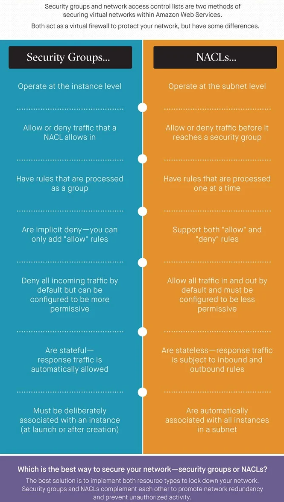
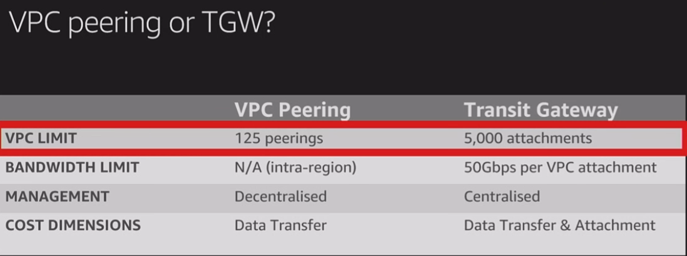

# AWS AND CLOUD COMPUTING
- TTI practice generator (command): docker run --rm csuvikg/generate-tti
`micro ~/.baschrc` -> what is in this file, gets loaded in every bash window you open (eg add an alias `alias n=mkdir`)
lance TUI? (diplay running processes in terminal)
`/mnt/c` -> this is where all files are in the WSL
## CLOUD COMPUTING
- Cloud computing is on-demand access to services, via the Internet:
    - **Services** can be computing resources, servers (physical or virtual ones), data storage, development tools, networking capabilities, and more
    - These services are all hosted at a remote data center managed by a **cloud services provider** (or **CSP**)
    - The **CSP** makes these resources available for a monthly subscription fee or bills them according to usage.
- Cloud computing benefits: *( https://www.youtube.com/watch?v=M988_fsOSWo&ab_channel=Simplilearn )*
    - **Lower IT costs:**
        - Cloud lets you offload some or most of the costs and effort of purchasing, installing, configuring, and managing your own on-premises infrastructure.
    - **Improve agility and time-to-value:** 
        - With cloud, your organization can start using enterprise applications in minutes, instead of waiting weeks or months for IT to respond to a request, purchase and configure supporting hardware, and install software.
        - Cloud also lets you empower certain users—specifically developers and data scientists—to help themselves to software and support infrastructure.
    - **Scale more easily and cost-effectively:**
        - Cloud provides elasticity — instead of purchasing excess capacity that sits unused during slow periods, you can scale capacity up and down in response to spikes and dips in traffic.
        - You can also take advantage of your cloud provider's global network to spread your applications closer to users around the world.
- **2 types of cloud computing:**
    - **Deployment model:**
        - Public Cloud: like a bus, available to the crowd over the internet (owned by CSPs like AWS, Azure or Google Cloud)
        - Private Cloud: like a car, exclusively owned and managed by an organization
        - Hybrid Cloud: like a taxi, combination of the 2
    - **Service model:**
        - On-premises service include - all managed by your organization (this is not cloud!):
            - Applications
            - Data
            - Runtime
            - Middleware
            - o/s
            - Virtualization
            - Servers
            - Storage
            - Networking
        - **IAAS:** Infrastrucutre as a service
            - You manage:
                - Applications, Data, Runtime, Middleware, o/s
            - The provider manages:
                - Virtualization, Servers, Storage, Networking
        - **PAAS:** Platform as a service
            - You manage:
                - Applications, Data
            - The provider manages:
                - Runtime, Middleware, o/s, Virtualization, Servers, Storage, Networking
        - **SAAS:** Software as a service
            - Everything is managed by the provider!
        - [comparison chart](assets/iaas-paas-saas.jpg)

## AWS
- AWS is one of the most popular cloud computing platforms that offers services in a metered pay-as-you-go basis
- The services include:
    - Amazon Elastic Compute Cloud (EC2) (see more below)
    - **AWS Security Groups:**
        - provides security for EC2 instances
    - **Amazon Elastic Block Store:**
        - a block-storage (*disk-like* storage as opposed to *object storage*) service designed for EC2

- **Regions and Zones:** *( https://docs.aws.amazon.com/AWSEC2/latest/UserGuide/using-regions-availability-zones.html )*
    - An AWS Region is a geographical location with a collection of **availability zones** mapped to **physical data centers** in that region (The code for Availability Zone is its Region code followed by a letter identifier, eg. `us-east-1a`)
    - Every region is physically isolated from and independent of every other region in terms of location, power, water supply, etc.
    - Inside each region, you will find two or more availability zones with each zone hosted in separate data centers from another zone
    - When you launch an **instance**, you select a Region and a **virtual private cloud** (**VPC**), and then you can either select a subnet from one of the Availability Zones or let AWS choose one for you.

- **Shared Responsibility model:**
    - A security framework thar separates responsibilities of AWS and users to ensure a secure environment in the cloud
    - In essence, AWS is responsible for the security "of" the Cloud, while the customer is responsible for security "in" the Cloud:
        - AWS: involves the infrastructure that runs all the services offered in the AWS Cloud (e.g., hardware, software, networking, and facilities)
        - User: involves managing the security of the data they store and process, the applications they deploy, and the configuration of the AWS services they use (e.g., securing access to AWS resources, managing encryption, and ensuring appropriate access controls)

- **SERVICES IN DETAIL:**
    - **Elastic Cloud Compute platform EC2** *( Summary video: https://www.youtube.com/watch?v=TsRBftzZsQo&ab_channel=AmazonWebServices )*
        - allows users to rent a **virtual cluster of computers** on which to run their own applications
            - AWS's version of **virtual computers** emulates most of the attributes of a real computer:
                - hardware central processing units (CPUs) and graphics processing units (GPUs) for processing
                - local/RAM memory
                - hard-disk/SSD storage
                - a choice of operating systems (Linux, Windows or even a custom one)
                - networking
                - pre-loaded application software such as web servers, databases, and customer relationship management (CRM)
        - an EC2 **instance**:
            - is a **virtual machine** that represents a physical server for you to deploy your applications
            - have a unique feature that is fundamental to cloud computing called **auto-scaling**:
                - allows EC2 instances to dynamically add additional computing power as thresholds like CPU utilization are broken due to high demand
        - This is a sample command to log into an instance using Bash:
            - `ssh -i "/c/Users/gakal/.ssh/AWS-GK-London.pem" ec2-user@ec2-13-40-83-6.eu-west-2.compute.amazonaws.com`
   
    - **Security Groups:**
        - acts as a virtual firewall for your EC2 instances to control incoming and outgoing traffic
        - Both inbound and outbound rules control the flow of traffic to and traffic from your instance (it's just like a turbo version `iptables`)
        - when no rules are defined in a security group it blocks all inbound and outbound traffic! (By default when you launch an EC2 instance via the AWS Management Console will generate a security group for you which will allow inbound SSH connections and allow all outbound connections.)
        - each security group can be applied to one or more instances, even across subnets
        - each instance is required to be associated with one or more security groups (to be precise: a security group is associated with a network interface that is attached to an instance)
        - Different setups need different security group setups (eg port 3306 for MySQL)
            - Different rules can be set for:
                - **webserver**
                    - allow HTTP and HTTPS access from any IP address
                    - Example table:
                        
                            Protocol type	Protocol number	Port	    Source IP	Notes
                            TCP	            6	            80 (HTTP)	0.0.0.0/0	Allows inbound HTTP access from any IPv4 address
                            TCP	            6	            443 (HTTPS)	0.0.0.0/0	Allows inbound HTTPS access from any IPv4 address
                            TCP	            6	            80 (HTTP)	::/0	    Allows inbound HTTP access from any IPv6 address
                            TCP	            6	            443 (HTTPS)	::/0	    Allows inbound HTTPS access from any IPv6 address
                
                - **database server**
                    - rules you might add for database access, depending on what type of database you're running on your instance
                    - For the source IP, specify one of the following:
                        - A specific IP address or range of IP addresses (in CIDR block notation) in your local network
                        - A security group ID for a group of instances that access the database
                    - Example table:

                            Protocol type	Protocol number	Port	            Notes
                            TCP	            6	            1433 (MS SQL)	    The default port to access a Microsoft SQL Server database, for example, on an Amazon RDS instance
                            TCP	            6	            3306 (MYSQL/Aurora)	The default port to access a MySQL or Aurora database, for example, on an Amazon RDS instance
                            TCP	            6	            5439 (Redshift)	    The default port to access an Amazon Redshift cluster database.
                            TCP	            6	            5432 (PostgreSQL)	The default port to access a PostgreSQL database, for example, on an Amazon RDS instance
                            TCP	            6	            1521 (Oracle)	    The default port to access an Oracle database, for example, on an Amazon RDS instance
                    
                    - You can optionally restrict outbound traffic from your database servers. For example, you might want to allow access to the internet for software updates, but restrict all other kinds of traffic. You must first remove the default outbound rule that allows all outbound traffic:

                            Protocol type	Protocol number	Port	    Destination IP	Notes
                            TCP	            6	            80 (HTTP)	0.0.0.0/0	    Allows outbound HTTP access to any IPv4 address
                            TCP	            6	            443 (HTTPS)	0.0.0.0/0	    Allows outbound HTTPS access to any IPv4 address
                            TCP	            6	            80 (HTTP)	::/0	        (IPv6-enabled VPC only) Allows outbound HTTP access to any IPv6 address
                            TCP	            6	            443 (HTTPS)	::/0	        (IPv6-enabled VPC only) Allows outbound HTTPS access to any IPv6 address

                - **ping/ICMP rules**
                    - The ping command is a type of ICMP traffic. To ping your instance, you must add one of the following inbound ICMP rules.
                        - Example table:

                                Type	            Protocol	    Source
                                Custom ICMP - IPv4	Echo request	The public IPv4 address of your computer, a specific IPv4 address, or an IPv4 or IPv6 address from anywhere.
                                All ICMP - IPv4	    IPv4 ICMP (1)	The public IPv4 address of your computer, a specific IPv4 address, or an IPv4 or IPv6 address from anywhere.

                    - To use the ping6 command to ping the IPv6 address for your instance, you must add the following inbound ICMPv6 rule.
                        - Example table:

                                Type	        Protocol	    Source
                                All ICMP - IPv6	IPv6 ICMP (58)	The IPv6 address of your computer, a specific IPv4 address, or an IPv4 or IPv6 address from anywhere.

    - **Network Access Control Lists NACL:**
        - Similarities:
            - acts as a virtual firewall to protect your network, just like `Security Groups`
            - uses sets of inbound and outbound rules to control traffic to and from resources in a VPC
        - Differences:
            - `security groups` and `NACLs` operate at separate layers in the VPC (`NACL` -> Network level-security; `SG` -> Instance level-security)
            - have slightly different default rules
            - don't handle response traffic the same way
        - Features:
            - `NACL` sets rules for your **network/subnet**, based on the protocol type such as HTTP, TCP, UDP, etc., and the port numbers
            - Used in combination with **SG**s to create a multi-layer protection
            - each `NACL` can be applied to one or more `subnets`, but each subnet is required to be associated with one — and only one! — `NACL`
            - When you create a VPC, AWS automatically creates a default `NACL` for it (You can add and remove rules from a default `NACL`, but you can't delete the `NACL` itself)
        - **How to use it together with SGs:**
            - Taking advantage of the order of operations:
                - When traffic enters your network, it is filtered by `NACLs` **before** it is filtered by `security groups` (so traffic allowed by a `NACL` can then be allowed or denied by a `security group`, and traffic stopped by a `NACL` never makes it any further)
                - We can take advantage of this order of operations in 2 ways:
                    1. **Use fine-grained rules with NACLs and let security groups handle inter-VPC connectivity:**
                        - configure `NACLs` with granular rules for controlling inbound and outbound traffic
                        - configure a `NACL` to allow inbound `HTTP` and `HTTPS` traffic from any `IP` address, deny all other inbound traffic, and allow all outbound traffic
                        - OR you can allow inbound `SSH` access (port 22) from one `IP` address—yours—and allow outbound access on any port to the same `IP` address
                        - Meanwhile, you can configure a `security group` to allow inbound traffic from itself, enabling *communication between resources*
                        - OR you can configure the `security group` to allow traffic into and out of a **different** `security group`, which enables instances within different `subnets` to talk to each other
                    2. **Eliminate whole classes of traffic with NACLs and use fine-grained rules with security groups:**
                        - you can configure a NACL to deny all traffic from a wide range of IP addresses to a certain protocol and port and allow the rest to continue to the `security group`
                        - the `security group` can be configured to evaluate incoming and outgoing traffic on a more granular level (the `NACL` does rough filtering, then the `SG` does the refined filtering)
            - Application to AWS EC2 instances
                - `Security groups` are a **required** form of defense for `instances`, because an `instance` must be associated with at least one `security group`
                - A `NACL` on the other hand, automatically applies to **all instances** in the `subnet` it is associated with
                - by default, a `NACL` is configured to allow all traffic in and out
        - **Inbound and Outbound rules:**
            - when evaluationg an instance's rules, it checks all the `security groups` it is associated with, and then the most permissive rule is applied—so remember that **your instance is only as secure as your weakest rule!**
            - In contrast `NACL` rules are processed one at a time (each `NACL` has a number, and are executed from lowest to highest) -> If traffic matches a rule, the rule is applied and no further rules are evaluated, otherwise moves on to evaluate the next consecutive rule
            - `Allow` vs. `Deny` rules:
                - `Security group` rules are implicit `deny`, which means all traffic is denied unless an inbound or outbound rule explicitly allows it
                - `NACLs`, on the other hand, let you add or remove `allow` and `deny` rules
        - **Default rules:**
            - When you create a `VPC`, AWS automatically creates a `default security group` and `default NACL` for you
            - The default rules are different for default or custom `SG` or `NACL`!
            - Default rules:
                - **Default security groups:** 
                    - A `default security group` has one default inbound rule, allowing traffic from other instances associated with the same security group. The rule enables the instances to communicate with each other without needing to go out to the internet.
                - **Custom security groups:**
                    - When you create a `custom security group`, it has no inbound rules by default.
                - **Default NACLs:** 
                    - `Default NACLs` allow all inbound and outbound traffic by default (one "allow-all" and one "deny-all" rule for both inbound and outbound traffic - so 4 rules in total).
                    - The allow-all rules are processed first. The deny-all rules have an asterisk instead of a number, so they are not processed unless no other rule matches.
                - **Custom NACLs:** 
                    - When you create a `custom NACL`, it has one deny-all rule for both inbound and outbound traffic, like default NACLs do. The deny-all rules have an asterisk instead of a number. However, unlike default NACLs, a custom NACL has no allow-all rules, so the deny-all rule matches traffic instead.
                    - As a result, custom NACLs deny all inbound and outbound traffic by default
        - **Statefulness:**
            - apply rules based on connection state
            - `Security groups` are **stateful**; they automatically allow return traffic, no matter what rules are specified:
                - If your instance sends out a request, the connection is tracked and the response is accepted regardless of explicit inbound rules. If traffic is allowed into an instance, the response is allowed out regardless of explicit outbound rules
                - Security groups don't need rules to evaluate response traffic
            - `NACLs`, on the other hand, are **stateless**:
                -  If an instance in your subnet sends out a request, the connection is not tracked and the response is subject to the NACL's inbound rules. Likewise, if traffic is allowed into a subnet, the response is evaluated according to outbound rules.
                - this means that NACL rules typically **come in pairs**. For every inbound rule for a NACL, there must be a corresponding outbound rule
            - The main difference with regard to statefulness is that with security groups, you can't allow traffic in one direction but disallow the response
        - **SG vs NACL comparison:**
            - Similarities:
                - Use inbound and outbound rules to control traffic
                - Can be applied to more than one instance (security group) or subnet (NACL)
                - Can be locked down to deny all traffic in either direction
                - Are valid methods of securing resources in a VPC
                - Work together to promote network redundancy and prevent unauthorized activity
            - Differences: 
            

    - **Data Storage (EBS, S3)**
        - **Elastic Block Storage EBS**
            - a durable, block-level storage device that you can attach to your `instances` (After you attach a volume to an instance, you can use it as you would use a physical hard drive)
            - basically a virtual hard drive in the cloud
        - **Simple Storage Service S3:**
            - an object storage service that offers scalable storage for data backup, collection, and analytics
            - S3 `stores data as objects` within buckets, and each object is identified by a unique key
        - **Block (EBS) vs. Object/File storage (S3):**
            - types of cloud storages
            - `EBS` belongs to **block storage**
            - `S3` belongs to **object/file storage**
            - **Comparison:**
                - **Block (EBS):**
                    - Connection to data is through Storage Area Network (SAN)
                    - Provides the lowest possible latency for apps
                    - Use it where high performance is needed
                    - Highly redundant - data can be easily recovered
                - **File/Object (S3):**
                    - File share is on the same level as the network, so it can be accessed from any other machine from the network
                    - Highly scalable
                    - Accessible to multiple runtimes
                    - You can have multiple simultaneous reads/writes without the data being overwritten
            - **When to use which?**
                - **Block (EBS):**
                    - When you need boot volumes
                    - When you need low latency and high performance (transactional or relational databases)
                - **Object/File (S3):**
                    - Mix of structured and unstructured data (web-hosting server)
                    - collaborative space with multiple users
    
    - **Virtual Private Cloud VPC:**
        - **What is it?**
            - a custom-defined network within the AWS Cloud
            - allows you to create a virtual private network in AWS Cloud and associate it with your account
            - once the development of an app is finished, we need to put that app somewhere on the internet so it is publicly accessible (this is an operation task to deploy it) -> this is what we need the VPC for
        
        - **The difference from EC2:**
            - In essence, **EC2** provides the **virtual machines**, while **VPC** offers the **network infrastructure** to securely host and manage these machines and other AWS resources
        
        - **Benefits:**
            - much of the complexity of setting up an on-premises network has been abstracted without sacrificing control, security, and usability
            - gives you complete control of the network configuration (eg. IP address spaces, subnets, and routing tables) -> control what you expose to the internet and what you isolate within the Amazon VPC
            - You can deploy your Amazon VPC in a way to layer security controls in the network (includes isolating subnets, defining access control lists, and customizing routing rules)
            - EC2 instances, Relational Database Services, RDS database instances deploy into VPC
        
        - **Features:**
            - You can create many subnets in a VPC (but it's recommended not to make it too complex!)
            - Configure route tables for your subnets to control the traffic between subnets and the internet (By default, all subnets within a VPC can communicate with each other)
            - To make a subnet have direct access to the internet, we need to attach a gateway to the VPC and update the route table of the public subnet to send non-local traffic to the internet gateway (also need a public IP address to route to an internet gateway)
        
        - **Subnets:**
            - a subnet is a range of IP addresses in your VPC
            - allows you to partition your VPC's IP address range into smaller segments, each acting as a separate network within the VPC
                - enables you to group and isolate resources based on security or operational needs
                - allows you to place resources into different availability zones
            - Any asset, Webserver UI, in the public subnet that will have direct communication with the outside internet, and anything that is not supposed to be touched directly (eg. Database), will live inside a private subnet
            - You can have multiple private and public subnets
        
        - **Internet Gateway:**
            - Traffic in and out of the subnet happens through the gateways
            - **IGW:**
                - the Internet Gateway
                - this is what allows communication from the outside internet to pass into your VPC and into whichever subnets are authorised
                - the first step in routing
                - not a physical server, it is a network construct
        
        - **Route Tables:**
            - A `Route Table` tells network packets which way they need to go to get to their destination
            - Lets any asset inside your VPC know how to send `packets` between itself and anyone else, or any other component of the VPC
            - `Route tables` are managed by `routers`, which act as “intersections” within the network
            - Each AWS VPC has a VPC router:
                - The primary function of this VPC router is to take all of the route tables defined within that VPC, and then direct the traffic flow within that VPC, as well as to subnets outside of the VPC, based on the rules defined within those tables
            - Route tables consist of a list of destination subnets, as well as where the “next hop” is to get to the final destination, and are assigned to individual subnets
            - When creating a VPC, a `default route table object` is automatically created:
                - It has only one line with th CIDR block of the VPC itself - `10.10.0.0/16` and the target is `Local` (this means we the assets can send packets - the packet access is a different topic)
                - The scope of the “local” route is only within the subnet defined for the entire VPC
            - We need to give the path out through the IGW, if we want to access anything outside our subnet or VPC:
                - we have to add the route line that gives the path out through the IGW:
                    - We create the `public route table` object for this (this will copy everything from the default first!)
                        - We are targeting the entire IPv4 spectrum with `0.0.0.0/0` - meaning every address goes out the IGW
                    - Then we have to associate the public route table with the public subnets
                    - Eg, if your VPC was set up to have the address space of `172.16.0.0/16`, your “local” route would be defined as `172.16.0.0/16`
            - **Route table configuration options:**
                - A single route table for the entire VPC:
                    - used for simple environments where there are only public subnets which are all pointing to the single VPC internet gateway
                    - there is only 1 route table which sits in the VPC and connects to each subnet
                - 1 route table per subnet:
                    - each subnet has 1 route table assigned (there is a 1 to 1 relationship between route tables and subnets within the VPC)
                - 2-tier routing tables (1 for public subnets, and 1 for private subnets)
                    - For environments that are broken apart into public and private subnets
                    - you will need to further separate your route tables into availability zones, because:
                        - you will want systems in AZ A to use a NAT gateway and any other systems which are also within that AZ; same for systems in AZ B.
                        - This ensures that if one availability zone becomes unavailable, the systems in the other availability zone are not relying on a system that is now non-functional
                - Routing between multiple VPCs (VPC Peering):
                    - larger AWS deployments -> to add an additional level of separation between environments, rather than just using different subnets
                    - eg:
                        - 1 VPC for production environments
                        - 1 VPC for testing and staging environments
                        - 1 VPC for development environments
                        - 1 VPC for management services
                    - there will be a need to have a way to connect and route to the management VPC where services are be housed (eg. Chef, Git, Active Directory, etc.)
                        - Amazon offers **VPC Peering** to resolve this:
                            - VPC Peering allows you to request a peering connection with another VPC and then route between those VPCs by simply adding routes to the route tables (the subnets in each VPC must not overlap!)
                        - to enable connectivity between VPCs, you must initiate the peering connection from one VPC, and then accept the request on the other VPC (decentralized method) -> then the new route needs to be added to each route table, in each VPC, for the peering connection:
                            - done by adding a route with the other VPC’s `CIDR range` as the `Destination`, and then `thepcx ID` of the peering connection as the `Target`
                - Routing to the public internet (`0.0.0.0/0`):
                    -  for the resources within your VPC to reach the public internet, the “gateway of last resort” (`0.0.0.0/0`) needs to be defined and pointed to either a `NAT Gateway` or an `Internet Gateway`:
                        - When to use an Internet Gateway:
                            - `IGW` is what allows the VPC to reach the public internet
                            - allows devices which already have a public address, and are placed in a public subnet, to connect directly to the internet
                            - only 1 internet gateway per VPC
                        - When to use a NAT Gateway:
                            - allows a device to transmit traffic from the `private` subnets to the internet
                            - a private subnet contains only resources with private IP addresses, so these devices have no way to reach the internet by themselves
                            - The NAT gateway (NGW) is placed in a `public` subnet within the VPC and given a `public` IP address
                            -  to allow this type of connectivity, the route table associated with each subnet much have a route defined with the `Destination CIDR` as: `0.0.0.0/0`, and a `Target` of: `ngw-########`
                            - it is best practice to create 1 NAT gateway within the public subnet of each availability zone, and then point the route tables in AZ A to the NGW created in AZ A
                - Routing via a VPN connection to an on-premise network:
                    - In the case of enterprise deployments on AWS, where connectivity is required back to an on-premise datacenter, a VPN connection can be configured
                    - 3 primary components need to be set up in AWS:
                        - Customer Gateway: the customer gateway is where you configure the address of the on-premise VPN device. This should be a public facing address on the VPN device within your on-premise datacenter.
                        - Virtual Private Gateway (VPG): the virtual private gateway is the component that sits on the edge of the VPC, allowing VPN connectivity to come in and out of the VPC. The VPG sits at the same level as the internet gateway.
                        - VPN Connection: the VPN connection puts it all together by connecting the customer gateway to the rest of the VPC network through the virtual private gateway. Within the VPN connection, you see the status of the 2 Tunnels configured for connectivity back to the on-premise network. Within the VPN Connection is where the routes back to the on-premise network are configured to allow the rest of the route tables within the VPC to be able to find the resources within the datacenter.
                    - Ensure that route propagation is turned on in each of your route tables, so that the routes configured on the VPN Connection will be available to all of the route tables within the VPC

        - **NAT servers:**
            - Assets (e.g a database) in private subnets are not allowed to communicate with the internet via the IGW directly, so we need to use a **Network Address Translation Server (NAT)** (this is not AWS sepcific, but an old-school trick)
            - It works by pretending it's the whole internet (a Database then can transfer data to it, so theb the NAT can redirect that packet)
            - we need to create a NAT server in the public subnet and we need a new routing table - the `private route table`
                - add a new line `0.0.0.0/0` (every address) goes out the NAT-ID
                - we then associate the private route table with that private subnet
                - you also have to turn off source destination checking for NAT instances (it's in by default to prevent main-in-the-middle, or MIDM, style attacks)
                - Once the internet gateway is configured and attached to your VPC, you must have a route within each public subnet defined with the `Destination CIDR` as: `0.0.0.0/0`, and a `Target` of: `igw-########`, which is the ID of the internet gateway
        
        - **Peering service:**
            - Concept:
                - it is a network connection between two VPCs that enable you to route traffic between them using private IP addresses
                - Instances in either VPC can communicate with each other as if they are within the same network using private IPv4 addresses or IPv6 addresses (it can also communicate with a resource in another VPC, or even another region)
                - AWS uses the existing infrastructure of a VPC to create a VPC peering connection:
                    - it is neither a gateway nor a VPN connection
                    - does not rely on a separate piece of physical hardware
                - There is no single point of failure for communication or a bandwidth bottleneck (?)
                - There is no need for a gateway, a VPN connection, or a network appliance to establish connection
                - Traffic always stays on the global AWS backbone, and never traverses the public internet, which reduces threats, (eg. such as common exploits, and DDoS attacks)
            - Features:
                - VPC Peering is a one-to-one relationship, meaning traffic cannot traverse a VPC to get to another VPC
                - Full private IP connectivity between two VPCs
                - Can Peer VPCs across different AWS regions
                - VPCs can be in different accounts
                - VPCs CIDR ranges must not overlap
            - Troubleshooting if the connection can't be established:
                - First, you want to verify that the VPC peering connection is “Active”.
                - Check the route tables to verify that the correct routes exist for the peering connection to the IP address range of the peered VPC via the appropriate peering gateway.
                - Verify that the ‘allow rule’ exists for the required traffic in each peered VPC network access control list, Network ACL.
                - Verify that the security groups allow network traffic between the peered VPCs.
                - Ensure that no firewall rules, e.g. iptables or windows firewalls are blocking network traffic between the peered VPCs.
        
        - **Transit Gateway:**
            - another option for connecting VPCs together
            - It is a distributed, managed, routing service that you deploy into your region:
                - Allows for centralized private IP connectivity between multiple VPCs
                - VPCs must be in the same region as Transit Gateway
                - VPCs can be in different accounts

        - **Choose between peering or Transit Gateway:**
             

        - **Shared VPC:**
            - Means changing the model of how you organize your VPCs
            - There is an owner account, but the boundary of doing everyhting in 1 account is now gone (differenc accounts can put their resources into a centrally managed AWS account)
            - The AWS account that creates and owns the VPC can choose to share particular subnets with other AWS accounts within the same AWS Organization
            - Once a particular subnet is shared with an account, it can then create, view and modify resources it owns within those particular subnets
    
    - **Identity and Access Management IAM:**
        - a web service that helps you securely control access to AWS resources
        - use IAM to control who is authenticated (signed in) and authorized (has permissions) to use resources
        - when creating an AWS account, you sign in as a `root user` -> this is recommended to be used as an admin only user
        - **Features:**
            - Shared access to your AWS account:
                - grant other people permission to administer and use resources in your AWS account without having to share your password or access key
            - Granular permissions:
                - You can grant different permissions to different people for different resources
                - Means you can add different users different permissions
            - Secure access to AWS resources for applications that run on Amazon EC2:
                - use IAM features to securely provide credentials for applications that run on EC2 instances
                - credentials provide permissions for your application to access other AWS resources
            - Multi-factor authentication (MFA)
            - Identity federation
                - allow users who already have passwords elsewhere to get temporary access to your AWS account
            - Integrated with many AWS services
        - What we can create:
            - `User`:
                - to create a new user, with new login credentials
            - `User group`:
                - users can be added
                - policies can be set
            - `Role`
                - a role is intended to be used by anyone who needs it (not just 1 specific person, like `user`)
                - it's similar to a `user` as it is an `IAM` identity with permissions of what can and cannot do
                - policies can be assigned to an IAM role too (eg. `AmazonS3FullAccess`) - it's a "collection of policies" (?)
                - If a `user` is assigned to a `role`, access keys are created dynamically and provided to the user temporarily:
                    - a role does not have standard long-term credentials such as a password or access keys associated with it. Instead, when you assume a role, it provides you with temporary security credentials for your role session

## AWS DATA SECURITY
- **Data encryption (in AWS):**
    - AWS is using AES-256 algorithm for encryption
    - there is an `engine` that creates an individual cryptographic key, the `data key`:
        - contains all of the cipher information that is then applied to the data object (image, video, individual document, that you want protected)
        - The cipher data is applied against the individual object and then you end up with the encrypted data
        - That encrypted data is then put into storage (S3 or EBS)
        - without the original encryption key there is no way to read that data
    - The engine makes a unique key for every object that goes into your system (for better security), so these need to be managed:
        - `individual data key` is only used by that data object
        - `master key` is applied against the original `data key` to get an **encrypted version** of that `data key`
        - the object is attached to the encrypted object, and that is what gets stored
        - you only will need the `master key` to decrypt the encrypted key, that you will then use to get the data
        - AWS offers solution out-of-the-box you can use to manage the master key storage:
            - Hardware solution - Cloud HSM
            - Hardware Security Module
            - Services such as KMS - The key management system

- **S3 access settings:**
    - AWS resources are `private` by default
        - To allow `public` access to buckets and objects you can configure security features:
            - Access Control Lists (ACLs)
            - Bucket Policies
    - When data is accidentally made `private`, it can be because of 2 things:
        - someone used a `public` bucket to store objects that shouldn’t be `public`
        - someone changed `permissions` on a bucket that should have remained `private`
    - In general:
        - **DON'T**:
            - Don't allow public access unless you have an explicit reason that something must be public, such as static website hosting in Amazon S3
            - Don't allow public access as a way to troubleshoot.
        - **DO**:
            - Do use Amazon S3 Block Public Access at the account level to prevent public access to your buckets
            - Do audit your existing bucket ACLs and bucket policies
            - Do configure the appropriate roles and permissions to limit the ability to change block public access settings.
    - S3 **Block Public Access** feature:
        - Created to prevent accidental data exposure
        - you can manage public access of your `S3` resources at both the AWS **account level** and the **bucket level**
        - this helps you ensure that your data is not made publicly available and any new bucket created now has `block all public access` enabled by default:
            - If you want to grant public access on any resources managed by Block Public Access, you will have to adjust your configuration
        - S3 Block Public Access settings:
            - options can be enabled at either the account level or the bucket level (account level settings overwrite individual bucket settings)
            - `Block all public access`:
                - To ensure the bucket will never allow public access
                - overrides any configured `ACL`s and `bucket polices` that would normally grant public access
                - this option equates to enabling all of the other options available
                - Any new bucket you create will have this option enabled by default, so it needs to be disabled if you want to allow public access to your bucket or objects
            - `Block public access granted through new ACLs`:
                - prevents you from creating any new ACL (bucket or object), that grants public access permissions
                - only affects the creation of new public ACLs; it does not alter any existing ACLs or policies
                - if you have any bucket policies or existing ACLs granting public access to buckets and objects, those resources will remain publicly accessible
            - `Block public access granted through any ACLs`
                - only affects how ACL public permissions are evaluated
                - any existing ACLs that grant public permission on buckets and objects will be ignored
                - does not alter the existing ACLs themselves, but any resources configured with existing public ACLs will no longer be publicly accessible
                - Any existing public ACLs will no longer be ignored if the block public access granted through any ACLs option is later disabled
            - `Block public access granted through new public bucket policies`
                - prevents the creation of new bucket policies that grant public access (existing bucket policies are not affected)
                - To use this setting effectively, you should apply it at the AWS **account level**
            - `Block public and cross-account access granted through any bucket policies`
                - only affects how bucket policy permissions are evaluated
                - any buckets or objects that have public permissions granted through bucket policies will be ignored
                - when enabled, restricts access to a bucket with a public policy to only AWS services and authorized users within the bucket owner's account
                - blocks all cross-account access to the bucket with a public policy (except by AWS services), while still allowing users within the account to manage the bucket
    
    - **AWS Key Management Service KMS:**
        - I'ts a service, that makes it easier for you to create and manage cryptographic keys used to encrypt your data
        - It is integrated with other AWS services to ensure that your data is protected by **encryption at rest** (data at rest - encrypting data that is stored on a disk), making it easier to secure your data stored in services like Amazon `S3`, `EBS` and others
        - provides a centralized architecture for key management
        - works within an AWS region
        - **What it's used for:**
            - to encrypt data in your applications or when storing data in AWS services (supports both symmetric and asymmetric keys for encryption):
                - eg you can use them to access data from an `S3`
            - supports automatic key rotation (for long-term use of keys)
            - set access control defining policies and roles: integrates `Identity and Access Management` (`IAM`) to define permissions for who can manage or use keys
            - monitor the usage of your encryption keys to ensure compliance and detect unauthorized access (integrates `CloudTrail `)

## USING THE CLI
- `s3api` commands: https://awscli.amazonaws.com/v2/documentation/api/latest/reference/s3api/index.html#cli-aws-s3api

## GUIDES:
- **Create an IAM admin user:**
    1. Enable `IAM Identity Center`
    2. Create new user: https://docs.aws.amazon.com/singlesignon/latest/userguide/quick-start-default-idc.html

- **Attaching and preparing a Volume for use:**
    1. Create and attach the Volume to the EC2 through AWS console first.
    2. SSH into the instance
    3. Check if the volume was mounted: `lsblk` or `sudo lsblk -f`
    4. Check if it has a FS: `sudo file -s /dev/xvdb` (replace with the volume name!) // `data` means it has no FS yet
    5. Create an FS: `sudo mkfs -t xfs /dev/xvdb` (check with `sudo file -s /dev/xvdb` to check if it now has a FS) // now it shouldn't output `data`
        - If `xfs` is not available, you can install it with this: `sudo yum install xfsprogs`
    6. Create a mount point directory for the volume: `sudo mkdir /data`
    7. Mount to the created mount point: `sudo mount /dev/xvdb /data`
        - Here is where we should create a partition first, then mount the partition instead: `sudo mount /dev/xvdb1 /data`
    8. Set permissions to the newly created volume: `sudo chmod 775 /data` (this is supposedly set by default)
    9. To make sure it is auto-mounted after each reboot, follow the 2nd part of this link: https://docs.aws.amazon.com/ebs/latest/userguide/ebs-using-volumes.html

- **Unmounting:**
    1. `sudo umount -d /dev/xvdb` (replace with the volume name!)
    2. after logging out, you can detach it in the AWS console
    3. delete the volume or create a snapshot to store the data

- **Copying files accross:** *( https://devimalplanet.com/how-to-upload-download-files-via-ssh-using-an-identity-file-and-scp )*
    - Copy files from Windowa to Linux VM:
        1. In the VM, set ownership and permissions first:  
            - `sudo chown -R ec2-user:ec2-user /data` (eg if you wan to copy into /data, you need to make it the user's you are logging in with)
            - `sudo chmod 755 /data` (this is just for making sure we can copy into it)
        2. In the Windows bash terminal (exit from VM or open a new one):
            - `scp -i ~/.ssh/AWS-GK-London.pem /c/Users/gakal/test.txt ec2-user@ec2-13-42-11-218.eu-west-2.compute.amazonaws.com:/data/test.txt`
            - In case of copying a folder, you need to add `-r`:
                - `scp -r -i ~/.ssh/AWS-GK-London.pem /c/Users/gakal/local_folder ec2-user@ec2-13-42-11-218.eu-west-2.compute.amazonaws.com:/data/`
    - Copy files from Linux VM to Windows:
        1. In the bash terminal (Windows):
            - makes sure the destination folder exists:
                - `mkdir -p /c/Users/gakal/copied/`
            - copy with this command:
                - `scp -i ~/.ssh/AWS-GK-London.pem ec2-user@ec2-13-42-11-218.eu-west-2.compute.amazonaws.com:/data/test.txt /c/Users/gakal/copied/test.txt`
            - In case of copying a folder, you need to add `-r`:
                - `scp -r -i ~/.ssh/AWS-GK-London.pem ec2-user@ec2-13-42-11-218.eu-west-2.compute.amazonaws.com:/data/some_folder /c/Users/gakal/copied/`

- **Creating a VPC - Long Solution - 1:**
    - Create the **VPX** itself:
        - IPv4 CIDR block:
            - abbreviation for Classless Inter-Domain Routing
            - it's to specify a range of IPs `<ip notation>/<number>` (eg. `10.0.0.0/16`) // Number 16 is the available range in binary format
    - Create an **IgW** (internet Gateway):
        - in order for your VPC to have access to the Internet, you have to attach an Internet gateway to it
    - Create a **subnet** with the selection of VPCs that we created
        - a logical group of a networks within the VPC
        - An example of a subnet is a range from `192.168.1.1` to `192.168.1.255`
        - You must also specify the CIDR block for each subnet
        - In the example, we create 3 subnets (`public1` `public2` and `private1`)
            - `public`: has access to the internet
            - `private`: no access to the internet
        - IPv4 subnet CIDR block:
            - For the subnets we specify a mask of 24: `10.0.0.0/24`
    - Create a **NACL** (Network Access Control List):
        - lets you specify the rules for inbound and outbound traffic of your network
        - Create a rule (more on this later!)
        - In the “subnet associations tab”, click “edit subnet associations” and add the subnets that you created before
    - Route Table:
        - For example: if the IP destination is `10.0.0.14`, then route it to `service-a` (this is what it does)
        - create two route tables and named them `RT1` and `RT2`
        - `RT1`: (public means all its elements can access the internet)
            - open the “routes tab” and click “edit routes”.
            - Add the route with the destination of `0.0.0.0/0` with the `target` being the internet gateway we created (means direct all traffic to the Internet gateway so it can access the internet)
            - Click "save routes"
        - Switch to `subnet association tabs`:
            - Click “edit subnet associations” and add the two subnets named `public1` and `public2` that you created before (this will make the subnet really public)
            - associate it with a route table that has its destination to an internet gateway
        - `RT2`: (can only access the internal network with the route table)
            - edit it so it is associated with the subnet `private1` (this will make it really private).
        - public` means 
    - Launch an EC2 instance:
        - to test that the network is working properly, launch an EC2 instance — use the “t2.micro” instance type
        - in `configure instance` tab, to configure the network the instance uses:
            - Select the VPC and one of the public subnets we just created
        - then in `Configure security group` tab:
            - enable the auto-assign public IP
    - Security group:
        - configure the inbound and outbound traffic at instance level (NACL does this for network level!)
        - allow for SSH connections with port 22 from all sources of incoming IPs
        - Click “Review and Launch” and launch your instance
    - Later steps:
        - you can install your application and make it accessible through the browser, by adding more rules to the security group to open HTTP port 80

- **Creating a VPC - Short Solution - 2:**
    - Create VPC with with CIDR `10.10.0.0/16`
    - Create Subnets:
        - `my-public-subnet` in my-vpc VPC with CIDR `10.10.1.0/24`
        - `my-private-subnet` in my-vpc VPC with CIDR `10.10.0.0/24`
    - Create Internet Gateway called `my-internet-gateway` (this is for the public subnet)
    - Create NAT Gateway called `my-nat-gateway` (this is for the private subnet)
    - Create Route Tables:
        - `my-public-rt` with destination `0.0.0.0/0` and target the `Internet Gateway`
            - Add explicit association to `my-public-subnet`
        - `my-private-rt` with destination `0.0.0.0/0` and target the `NAT Gateway`
            - Add explicit association to `my-private-subnet`
    - To also enable `ping`, we have to add rule to security group:
        - `All ICMP - IPv4` from anywhere (test with `ping -t <IP>` to run continuously)

- **Connecting VPCs with Transit Gateway:**
    - Create new VPCs:
        - Create a new VPC called `europe-east` with CIDR `10.10.0.0/24`
        - Create a new VPC called `europe-west` with CIDR `10.10.1.0/24`
    - Create a new Peering connection inside VPC called `my-peering-connection`:
        - Requester: `europe-east` VPC
        - Accepter: `europe-west` VPC
    - After it's created, you need to manually select `Actions` and `Accept Request` -> status will now be active
    - Create subnets:
        - Create a subnet called `europe-east-01` in `europe-east` VPC with CIDR `10.10.0.0/24`
        - Create a subnet called `europe-west-01` in `europe-west` VPC with CIDR `10.10.1.0/24`
    - Create a Transit Gateway:
        - call it `myTGW`, the other settings should be fine
        - wait for status to be `Active`
    - Create two new Transit Gateway Attachments as part of `myTGW`:
        - Select `myTGW` in "Transit Gaterway ID"
        - for "Attachment type" select `VPC`
        - select each VPC in the "VPC ID" section

- **Creating a Single Encryption Key and a Public and Private Key Pair:**
    - Part 1: Create a Single Encryption Key (Symmetric Key):
        - Symmetric keys are used for encrypting and decrypting data. The same key is used for both encryption and decryption.
        1. Log in to the AWS Management Console and navigate to the KMS service.
        2. Create a Key:
            - Choose “Create key”.
            - Select “Symmetric” for the key type.
            - Follow the prompts to define the key configuration, such as an alias (a friendly name for the key), and a description.
        3. Define Key Administrative Permissions:
            - Decide who can administer the key, typically assigning these permissions to roles that will manage key lifecycle or AWS services that require key access.
        4. Define Key Usage Permissions:
            - Specify which users or roles can use the key to encrypt and decrypt data.
        5. Finish and Review:
            - Review the key policy and complete the key creation.
    
    - Part 2: Create a Public and Private Key Pair (Asymmetric Key)
        - Asymmetric keys are used for tasks that require a public key for encryption or signature verification and a private key for decryption or signing.
        1. Log in to the AWS Management Console and navigate to the KMS service.
        2. Create a Key:
            - Choose “Create key”.
            - Select “Asymmetric” for the key type.
            - Choose the key usage, either “Encrypt and decrypt” or “Sign and verify”, depending on your needs.
            - Select the key spec, for example, RSA 2048-bit or ECC_NIST_P256.
            - Provide an alias and a description for the key.
        3. Define Key Administrative Permissions:
            - Set who can manage the key.
        4. Define Key Usage Permissions:
            - Determine who can use the key to encrypt, decrypt, sign, or verify.
        5. Finish and Review:
            - Finalize the key creation by reviewing the policy and confirming the details.
    
    - How to use these? (An S3 bucket and an EC2 were made)

- **Verify that an EC2 instance is capable of accessing S3 bucket objects:**
    - Step 1: Create an IAM Role:
        1. `Roles` -> `Create Role`
        2. Select `AWS service`, and for the use case `EC2`
        3. `Next` - go to permissions
        4. find `AmazonS3FullAccess` policy and click `next` (alternatively you can also create a custom policy)
        5. Done (add a name!)
    - Step 2: Create an Instance Profile:
        - `instance profile`: a container for an IAM role that you can use to pass role information to an EC2 instance when the instance starts
        1. This is supposedly already generated
    - Step 3: Attach the Instance Profile to an EC2 Instance:
        1. In `EC2` dashboard select your instance you want to configure
        2. `Actions` -> `Security` -> `Modify IAM Role` (wait for it to be initialized!)
        3. Select `Role` you created and save/update
    - Summary:
        - Once the instance profile is attached, the EC2 instance and any applications running on it will inherit the permissions defined in the IAM role

- **"Wear a different hat" method:**
    - What is it?
        - It makes your user have additional access, by using **assume roles**
            - So in essence: *"wear a different role" = "Assume a different role"*
        - A `Role` is like an anonymous user, that has a trust policy and you can set access priviliges
        - The benefits of using a `Role` is that it expires after a cerain amount of time, so it's safer than a user
        - It's used to expand your basic priviliges
    - Step 1: Create an Administrative Policy:
        - `IAM` -> `Policies` -> `Create Policy`
        - `Select a Service` - this should be (`*`) meaning All, but it can't be selected, so select 1 from the list (eg `EC2`)
        - Select `All actions` and `All resources` -> `Next`
        - `Name policy` and `create`
    - Step 2: Create a New IAM Role for Users to Assume
        - Create a new `Role`:
            - `AWS account` / `This account` -> `Next`
            - Add permission created -> `Next`
            - Name it eg `TemporaryAdminAccess`
    - Step 3: Modify the Trust Relationship:
        - Select the created role (click on it)
        - `Trust relationships`: update it so it lloks like this:

                {
                    "Version": "2012-10-17",
                    "Statement": [
                        {
                            "Effect": "Allow",
                            "Principal": {
                                "AWS": "arn:aws:iam::account-id:user/username"
                            },
                            "Action": "sts:AssumeRole"
                        }
                    ]
                }

                # account-id should be your AWS account number
                # username should be the IAM user's name

        - The client should now be able to log in with this:
            - `aws sts assume-role --role-arn arn:aws:iam::account-id:role/TemporaryAdminAccess --role-session-name "AdminSession"`

- **Connect with AWS Systems Manager:**
    1. Create new role:
        - `AWS service` -> `EC2` -> Next
        - Add permission: add `AmazonSSMManagedInstanceCore` policy
        - name it eg. `ec2_role` -> Create
    2. Create new EC2 instance:
        - existing security group -> default
        - proceed without a key pair
        - Ensure your instance has no IAM roles or key pairs
        - Expand `Advanced` section and add this to the `User data` section:

                #!/bin/bash
                cd /tmp
                sudo yum install -y https://s3.amazonaws.com/ec2-downloads-windows/SSMAgent/latest/linux_amd64/amazon-ssm-agent.rpm
                sudo systemctl enable amazon-ssm-agent
                sudo systemctl start amazon-ssm-agent

    3. Attach your IAM role to it:
        - `RClick` on the instance once loaded -> `Security` -> `Modify IAM role`
    
    4. Launch in Session Manager:
        - Go to `AWS Systems Managet` -> `Node MAnagement` -> `Session Manager` -> Click on `Start Session`
        - Select your target instance

- **Create an S3 bucket from CLI and add a file to it:**
    1. Create a new `IAM` user with admin priviliges:
        - tick `Provide user access to the AWS Management Console` -> Next
        - Attach policies directly -> `AdministratorAccess` OR assign user to Admininistrator group if exists
        - Attach `AmazonS3FullAccess` also, if you will be using `S3`
        - save csv file with `Access key ID` and `Secret access key` information
        - Log in wiht new username (and change password if necessary)
    2. Open a new terminal (eg `WSL` or `GitBash`)
        - `aws configure`:
            - add `Access key ID` information
            - add `Secret access key` information
            - add region code, eg `eu-west-2`
        - Now we can use `aws` with the user we created:
            - `aws s3 mb s3://<bucket-name>` # Creates a new bucket
            - `aws s3 cp <local-file-path> s3://<bucket-name>/` # Upload a file
            - Turn off all Block public access bucket settings (in the console!)
            - Add a custom bucket policy to allow access to object:
                    
                    {
                        "Version": "2012-10-17",
                        "Statement": [
                            {
                                "Effect": "Allow",
                                "Principal": {
                                    "AWS": "*"
                                },
                                "Action": "s3:GetObject",
                                "Resource": "arn:aws:s3:::my-bucket-gk/*"
                            }
                        ]
                    }

- **Create a bucket with a script:**
    1. Create a `create_bucket.sh` file: `nano create_bucket.sh`
    2. Add to the script file & save:
            
            #!/bin/bash

            # Check if the correct number of arguments were passed
            if [ "$#" -ne 2 ]; then
                echo "Usage: $0 <bucket-name> <region>"
                exit 1
            fi

            # Assign arguments to variables
            BUCKET_NAME=$1
            REGION=$2

            # Create the S3 bucket
            aws s3api create-bucket --bucket $BUCKET_NAME --region $REGION --create-bucket-configuration LocationConstraint=$REGION

            # Check if the bucket was created successfully
            if [ $? -eq 0 ]; then
                echo "Bucket created successfully."
            else
                echo "Failed to create bucket."
            fi
    
    3. Make the script executable: `chmod +x create_bucket.sh`
    4. Run the script: `./create_bucket.sh bucket-name-gk-unique eu-west-2`

- **Create a bastion host:**
    - **Bastion host:** 
        - it's a special-purpose computer on a network specifically designed and configured to withstand attacks
        - generally hosts a single application or process, for example, a `proxy server` or `load balancer`, and all other services are removed or limited to reduce the threat to the computer
        - usually involves access from untrusted networks or computers
        - usually equipped with special networking interfaces to withstand high-bandwidth attacks through the internet
    - Steps:
        1. Create a new `VPC`:
            - Create VPC with with CIDR `10.10.0.0/16`
        2. Create a `public` and a `private subnet`:
            - `my-public-subnet` in my-vpc VPC with CIDR `10.10.0.0/24`
            - `my-private-subnet` in my-vpc VPC with CIDR `10.10.1.0/24`
        3. Create an `Internet GW` and a `NAT GW`:
            - Create Internet Gateway called `my-internet-gateway` (this is for the public subnet)
                - and attach it instantly to the `VPC`
            - Create NAT Gateway called `my-nat-gateway` (this is for the private subnet, but created inside PUBLIC!!!)
                - no need to set connectivity to `private`, it can stay `public`!
                - set elastic IP (`Allocate Elastic IP`)
        4. Create Route Tables:
            - `my-public-rt` with destination `0.0.0.0/0` and target the `Internet Gateway`
                - Add explicit association to `my-public-subnet`
            - `my-private-rt` with destination `0.0.0.0/0` and target the `NAT Gateway`
                - Add explicit association to `my-private-subnet`
            - To also enable `ping`, we have to add rule to security group:
                - `All ICMP - IPv4` from anywhere (test with `ping -t <IP>` to run continuously)
        5. Create 2 `EC2s`, one in the `private` and 1 in the `public` subnet:
            - `my-public-ec2` - this will be the **BASTION** server:
                - select keypair
                - Network settings -> Edit:
                    - select the `VPC` and `subnet` you want to create it in
                    - set `Enable` to Auto-assign public IP
                    - create new SG (`sgpublic`):
                        - ssh allowed as default
                        - add `All ICMP - IPv4` with `0.0.0.0/0` also, if you want to use `ping` on it
            - `my-private-ec2`:
                - Do the same, but don't assign a `public IP` to it
                - don't add `All ICMP` either, but create a new WG for it with SSH only

- **Connect to private EC2 from public, using SSH Agent for key forwarding:**
    1. Elinditod az SSH agentet a terminalodban (de elvileg mar megy, ha jol emlekszem):
        - `eval $(ssh-agent -s)`
    2. Hozzaadod a private key-edet:
        - `ssh-add ~/.ssh/id_rsa` -> ezt meg tudod valtoztatni, ha mas a kulcsod neve
        - `ssh-add -l` to check if it was added and what others are there
    3. Csatlakozol a pulbic EC2-re:
        - `ssh -A ec2_user@public_ec2_ip`
        - vagy ha nem default a kulcsod locationje:
        - `ssh -A -i KEYLOCATION ec2_user@public_ec2_ip`
    4. Ha bent vagy, onnan megint tovabbcsatlakozol a private-ra:
        - `ssh private_ec2_user@private_ec2_ip`
    5. Use `logout` to go back to the prev EC2

    - Note:
        - If you are using WSL, you should copy the private key to a local Linux dir (eg. `cp /mnt/c/Users/gakal/.ssh/AWS-GK-London.pem ~/.ssh/AWS-GK-London.pem`)
            - Create `~/.ssh` directory first, and set it's access to `sudo chmod 700 ~/.ssh`
        - Also update access rights of the key: `sudo chmod 600 ~/.ssh/AWS-GK-London.pem`

- **Create a Client-to-site VPN connection:**
    - **VPN - Virtual Private Network:**
        - It's a technology, that allows you to to create a secure connection over the internet to another network:
            - **site-to-site:** connect 2 networks (eg AWS network with office network)
            - **Client-to-site:** connect you (the Client) to a distant server (eg. office network)
        - It achieves this using a VPN server, to which you connect, then the connection is forwarded from this server
        - It uses end-to-end encrytion for sending data, so it's secure
        - Hides you from the internet, by connecting throught the VPN server (but not completely!)
        - You can set connection rules (eg. you can only connect to the AWS network from the office network, so you need to connect to it first)

    1. Generate the **client** certificates and keys (in WSL):
        - Get `easyRSA`: 
            - `git clone https://github.com/OpenVPN/easy-rsa.git`
            - `cd easy-rsa/easyrsa3`
        - Create a PKI environment:
            - `./easyrsa init-pki`
        - Build a new certificate authority:
            - for `common name` use `clientvpndemo.com`
    2. Generate the **server** certificate and key:
        - **Mutual authentication:** Client VPN uses certificates to perform authentication between the client and the server
        - Create the environments and the certificate authority and the keys:
            - `./easyrsa build-server-full clientvpndemo.com nopass`
            - type `yes` when prompted
        - Generate the client certificate and key:
            - `./easyrsa build-client-full demo.clientvpndemo.com nopass`
            - type `yes` when prompted
    3. Certificate and key summary:
        - Files created so far:
            - Server certificate: `pki/issued/clientvpndemo.com.crt`
            - Server key: `pki/private/clientvpndemo.com.key`
            - Client certificate: `pki/issued/demo.clientvpndemo.com.crt`
            - Client key: `pki/private/demo.clientvpndemo.com.key`
        - Copy these file into one folder:
            - `mkdir .VPNDemo`
            - `cp pki/ca.crt ./VPNDemo/ca.crt`
            - `cp pki/issued/clientvpndemo.com.crt ./VPNDemo/clientvpndemo.com.crt`
            - `cp pki/private/clientvpndemo.com.key ./VPNDemo/clientvpndemo.com.key`
            - `cp pki/issued/demo.clientvpndemo.com.crt ./VPNDemo/demo.clientvpndemo.com.crt`
            - `cp pki/private/demo.clientvpndemo.com.key ./VPNDemo/demo.clientvpndemo.com.key`
        - Upload these to the AWS Certificate Manager (ACM):
            - Use the CLI:
                - Navigate to the `VPNDemo` folder you just created
                - Server files: (change region if you have something else!)
                    - `aws acm import-certificate --certificate fileb://clientvpndemo.com.crt --private-key fileb://clientvpndemo.com.key --certificate-chain fileb://ca.crt --region eu-west-2` 
                - Client files: (change region if you have something else!)
                    - `aws acm import-certificate --certificate fileb://demo.clientvpndemo.com.crt --private-key fileb://demo.clientvpndemo.com.key --certificate-chain fileb://ca.crt --region eu-west-2`                    
            - OR Using the console (this is manually adding, using the CLI is better!):
                - Navigate to AWS Certificate Manager
                - select Provision certificates
                - click on Import a certificate at the top of the page
                - paste the content of the respective files
    4. Generate the VPN endpoint:
        - Create a `VPC` in the console with CIDR range of `10.10.0.0/16`
        - In the `VPC` tab scroll down to `Client VPN endpoint` under `VPN` -> Create new:
            - Name it eg `VPNDemo EP`
            - Choose a non-overlapping CIDR range, eg: `10.9.0.0/16`
            - Authentication Information tab:
                - Add the server's ARN (`demo.clientvpndemo` is the client's, `clientvpndemo` is the server's)
                - Tick `Use mutual connection`
                - Add the clinent's ARN
            - Other params:
                - VPC ID: Select the `VPC` you created earlier
                - Add default `security group` (this can be modified later!)
                - VPN default `port 443` can stay as it is
            - `Create VPN endpoint`
    5. Enable access to users and connectivity to VPN
        - Associate a target network within the Client VPN endpoint:
            - A target network is a `subnet` inside a VPC, so create a `subment` first!
                - Use CIDR range `10.10.0.0/16` for example (To be confirmed!)
            - Select the `VPN Endpoint`, then go to the `Target Network Associations` tab -> `Associate Target Network` -> Add the `VPNDemo` VPN and the newly created `subnet`
        - Create an authorisation rule to authorize the clients to access the VPC:
            - grant access to everyone (all IPs) with the correct cerificates:
                - Select the `Authorization rules` in the `VPN endpoint` -> `Add authorization rule`
                - Add `0.0.0.0/0` to authorize all IPs
        - Download Client VPN config file:
            - This is the file the client needs to upload into their VPN client application to establish a connection
            - Click on the endpoint, then `Download Client Configuration`
            - Add the client files contents to the downloaded file, after the `</ca>` tag:
                - `<key>`ADD THE KEY HERE`</key>`
                - `<cert>`ADD ONLY THE END OF THE FILE, WHERE THE CERT IS`</cert>`
    6. Connect to VPN endpoint (with cofig file)
        - Use AWS Clinet VPN ( https://aws.amazon.com/vpn/client-vpn-download/ ) - Install if not installed yet
        - Add a new user with the config file created

- **Create a Site-to-site VPN connection (with Openswan running on EC2):**
    - Prepare the EC2 instance for connection: ( https://www.red1ns.com/using-openswan-for-site-to-site-vpn-on-aws )
        - Create a public `subnet` within a new `VPC` (optional, we can also create this in our default VPC)
        - Create a new `EC2`:
            - Use a Linux OS
            - Make it at least `m4.large` for the use of Openswan
            - Create new `SG`:
                - Allow allow SSH from the Public IP in a new or existing `SG`
                - Add 2 more inbound rules:
                    - `Custom UDP` / `Port Range` 500 & 4500 (in 2 separate rules!) / `Source` - Any `0.0.0.0/0` 
        - After creating it, RClick -> `Networking` -> `Change Source / Destination Check` -> tick `Stop` and Save
        - Assing an Elastic IP:
            - Select `Elastic IPs` from the LH menu -> Allocate
            - Select the new address and click Actions -> Associate Address (find the EC2 you created and select the IP address)
        - Open UPD ports 4500 and UDP port 500:
            - UDP Port 500 is used for the initial key exchange between IPsec peers and for the negotiation of the security associations
            - UDP Port 4500 is used if NAT (Network Address Translation) is detected between your VPN peers. It encapsulates IPsec traffic in UDP packets to ensure it can traverse NAT devices
    - SSH into the EC2 and install Openswan:
        - `ssh -i ~/.ssh/AWS-GK-London.pem ec2-user@18.169.234.255`
        - `sudo yum install openswan`
        - !!! INCOMPLETE - package manager wasn't recognized on the Linux distro I used, couldn't install openswan !!!

## ALL AWS LINKS:
- AWS doucumentation: https://docs.aws.amazon.com/

- Initial setup: https://docs.aws.amazon.com/AWSEC2/latest/UserGuide/get-set-up-for-amazon-ec2.html
- (NEXT) Getting started: https://docs.aws.amazon.com/AWSEC2/latest/UserGuide/EC2_GetStarted.html

- EC2 guide to Linux instances: https://docs.aws.amazon.com/AWSEC2/latest/UserGuide/index.html
- EC2 tutorial: https://docs.aws.amazon.com/AWSEC2/latest/UserGuide/ec2-tutorials.html
- EC2 instance types: https://docs.aws.amazon.com/AWSEC2/latest/UserGuide/instance-types.html

- SG overview video 1: https://www.youtube.com/watch?v=nA3yN76cNxo&ab_channel=StephaneMaarek 
- SG overview video 2: https://www.youtube.com/watch?v=-9j7BvAyb2w&ab_channel=LinuxAcademy
- Working with security groups: https://docs.aws.amazon.com/AWSEC2/latest/UserGuide/working-with-security-groups.html
- Security Group Use-cases: https://docs.aws.amazon.com/AWSEC2/latest/UserGuide/security-group-rules-reference.html
- Security group rules: https://docs.aws.amazon.com/AWSEC2/latest/UserGuide/security-group-rules.html

- EBS intro video: https://www.youtube.com/watch?v=77qLAl-lRpo
- Block vs Object storage comparison: https://www.youtube.com/watch?v=5EqAXnNm0FE&ab_channel=IBMTechnology
- EBS longer video: https://www.youtube.com/watch?v=S0gzrxsVQHo&ab_channel=LinuxAcademy
- Creating an EBS volume: https://docs.aws.amazon.com/ebs/latest/userguide/ebs-creating-volume.html
- Attaching a volume: https://docs.aws.amazon.com/ebs/latest/userguide/ebs-attaching-volume.html
- Format and mount volume: https://docs.aws.amazon.com/ebs/latest/userguide/ebs-using-volumes.html

- Shared Responsibility Model: https://aws.amazon.com/compliance/shared-responsibility-model/
- Shared Responsibility Model explained: https://cloudsecurityalliance.org/blog/2020/08/26/shared-responsibility-model-explained

- Upload files to your instance: https://devimalplanet.com/how-to-upload-download-files-via-ssh-using-an-identity-file-and-scp

- VPC route tables: https://docs.aws.amazon.com/vpc/latest/userguide/VPC_Route_Tables.html
- A Day in the Life of a Billin Packets (video): https://www.youtube.com/watch?v=Zd5hsL-JNY4 (not wathced yet!)
- AWS Networking Fundamentals: https://www.youtube.com/watch?v=hiKPPy584Mg&ab_channel=AmazonWebServices
- Getting Started With AWS VPC: https://betterprogramming.pub/getting-started-with-aws-vpc-ae23ecf75743
- AWS Routing 101: https://medium.com/@mda590/aws-routing-101-67879d23014d

- Using AWS KMS https://www.youtube.com/watch?v=hxWvbNvj2lg&ab_channel=AWSEvents (not wathced yet!)
- How Encryption Works in AWS https://www.youtube.com/watch?v=plv7PQZICCM&ab_channel=AmazonWebServices (not wathced yet!)
- Best Practices for Amazon S3 Security with S3 Access Management Tools and S3 Block Public Access: https://www.youtube.com/watch?v=7M3s_ix9ljE&ab_channel=AWSDevelopers (not wathced yet!)

- IAM short video: https://www.youtube.com/watch?v=y8cbKJAo3B4&ab_channel=BeABetterDev
- IAM intro video: https://www.youtube.com/watch?v=Zvz-qYYhvMk&ab_channel=AWSEvents (not wathced yet!)

- SG vs NACL: https://www.fugue.co/blog/cloud-network-security-101-aws-security-groups-vs-nacls
- SG vs NACL video: https://www.youtube.com/watch?v=ttc0b2NZTV0&ab_channel=AnthonySequeira
- NACL summary video: https://www.youtube.com/watch?v=vJzHn24TNQE&ab_channel=LinuxAcademy

- Install SSM Agent on a Linux instance: https://repost.aws/knowledge-center/install-ssm-agent-ec2-linux