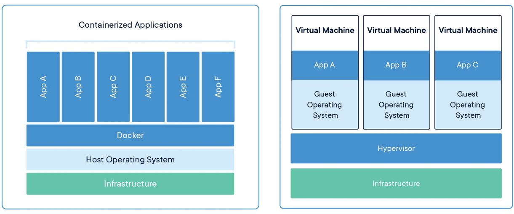

# DOCKER

## TUTORIALS
- CHEATSHEET: https://devhints.io/docker

- https://training.play-with-docker.com/beginner-linux/
- https://training.play-with-docker.com/docker-volumes/
- https://training.play-with-docker.com/
- https://training.play-with-docker.com/alacart/
- https://training.play-with-docker.com/ops-s1-images/

## DOCKER BASICS
- **Basics:**
    - Docker is a tool that allows developers to easily deploy their applications in "sandbox" like environments (called containers) to run on the host operating system i.e. Linux.
    - The main advantage of Docker is that it allows to package an application with all of its dependencies into a standardized unit for software development

- **How it works:**
    - The `Dockerfile` is a short file on your machine, that is used to build a `docker image` on the virtual machine
    - The `docker image` then runs one or more `containers` also on the VM
    - The `docker image` becomes the project code -> You can push it to `Docker Hub` or `Quay.io` (similar to github)
    - The pushed `docker image` can then be used to run a container on other machines, without installing any of the projects dependencies

- **Docker image:** *=this is the blueprint*
    - a collection of instructions used to create a `container`
    - readymade templates of services like PostgreSQL, Nginx, etc.
    - You can create your own images with `Dockerfiles` or use existing ones available at **Docker Hub**
    - the image is the actual package, that contains the `app`, the `config` and the `start script`
    - this is the easy-to-move-around part, that we can easily pass between development and operations teams

- **Container:** *=this is the running environment*
    - a standard unit of software that bundles code and all its dependencies so that applications could be run fast and reliably between different computing environments
    - this bundle package is portable and easily shared
    - allows applications to run in complete isolation from each other while allowing them to use the same system resources and the same operating system
    - this is the *installed* and *initialized* working version of the `docker image` (we can create multiple containers from one single image)
    - has a `port` binded to it, so we can access the container through it

    - In more detail:
        - A `container` contains layers of images (mostly Linux based):
            - Linux base image: `alpine:3.10`
            - Application image: eg. `postgres:10.10`
            - +intermediate layers
            - +configuration

- **Container PORT vs Host PORT:**
    - Containers run on the `host` machine (eg. your PC), which only has some specific ports available
    - You need to bind the `host` to the `container` using ports:
        - eg. the container is listening on `port :5000`, and you bind it to your machine's `port :5000` or `:5001` (whatever is free, but this is independent from the container's port!)
            - the `host` and the `guest` (=container) ports can be the same, but we can't serve 2 containers on the same port from the `host` -> so when we run multiple containers from the same image, those need to be assigned to different `host` ports:
                - the first is the `open port` to connect the container on the PC, can't be the same;
                - the second number is the `App's own port` that it's listening on: this is the same for the same app:
                    - Host `:5000` -> Container (App1) `:5000` 
                    - Host `:3000` -> Container (App2) `:3000`
                    - Host `:3001` -> Container (App2) `:3000`
        - To specify the binding, we need to tell it during the `run` command:
            - `docker run -p 5000:5000 app1Name`
            - `docker run -p 3000:3000 app2Name`
            - `docker run -p 3001:3000 app2Name` (we need to specify a new port for the second instance of the same app, eg a different version)

- **Docker Network (networking):**
    - `Container networking` refers to the ability for containers to connect to and communicate with each other, or to non-Docker workloads
    - Docker creates its own network, eg when we want to connect 2 separate running containers (eg `mongo` and `mongo express`)
        - If they are in the same network, they don't need ports, just their names
    - We connect from the `host`, by specifying a port number, that the `Docker network` gets attached to
    - Then from the browser we can connect using the port number (?)
        - (Details in this video https://www.youtube.com/watch?v=3c-iBn73dDE&ab_channel=TechWorldwithNana at 1:16:00)
    - **Commands:**
        - `docker network ls` lists all the networks that are generated by default
        - `docker network create mongo-network` -> Creates a new user-defined network
        - Example of creating a network using `bridge` driver, and running a container inside:
            - `docker network create -d bridge my-net`
            - `docker run --network=my-net -itd --name=container3 busybox` (we can also `create` + `start` in 1 command, using `run`)
            - Since by default no ports are exposed to the outside world, we also need to ensure this using `-p` flag (Stands for `publish`): 
                - **Note:**
                    - when you publish a container's ports it becomes available not only to the Docker host, but to the outside world as well
                    - If you include the localhost IP address (`127.0.0.1`) with the publish flag, only the Docker host can access the published container port:
                        - `docker run -p 127.0.0.1:8080:80 nginx`
        - Example of binding a container to `localhost`, running `redis-cli`
            - `docker run -d --name redis example/redis --bind 127.0.0.1`
            - `docker run --rm -it --network container:redis example/redis-cli -h 127.0.0.1`
        - You can connect a running container to multiple networks:
            - passing the `--network` flag multiple times when creating the container
            - or using the `docker network connect` command for already running containers
            - you can use the `--ip` or `--ip6` flags to specify the container's IP address
    - Network drivers:
        - `bridge`
            - The default network driver
            - It is the Docker default networking mode which will enable the connectivity to the other interfaces of the host machine as well as among containers
        - `host`:
            - Remove network isolation between the container and the Docker host
            - In this mode container will share the host’s network stack and all interfaces from the host will be available to the container. The container’s host name will match the host name on the host system
        - `none`:
            - Completely isolate a container from the host and other containers
            - This mode will not configure any IP for the container and doesn’t have any access to the external network as well as for other containers. It does have the loopback address and can be used for running batch jobs.
        - `overlay`	Overlay networks connect multiple Docker daemons together.
        - `ipvlan`	IPvlan networks provide full control over both IPv4 and IPv6 addressing.
        - `macvlan`	Assign a MAC address to a container.

- **Containerization (Docker container) vs Virtualization (VM):**
    - **Virtualization:**
        - Virtualization is the technology which can simulate your hardware (such as CPU , disk, memory) and represent it as seperate machine
        - a full guest OS gets created, and everything that comes with it  (kernel images, device drivers, etc.). It's called `hardware-level or paravirtualization`
        - uses a hypervisor
    - **Containerization:** 
        - OS-level virtualization (the guest OS layer is removed)
        - It is a kernel feature of a host operating system (a "kernel" being the core part of an OS)
        - generally you need to run a container that uses the same OS as your own machine
        - makes a process/app think it runs in a completely virtualized environment
        - programs running inside of a container can only see what was allocated for the container when it started
        - uses a docker engine instead of a hypervisor 
    - **Comparison image:** 
        

- **Container repository:**
    - we can store our containers in container repositories (eg. `DockerHub`)
    - Images on the other hand, can be omved to `AWS ECR`

- **Data storage in Docker:**
    - On a Linux system, Docker stores data like images, containers, volumes, etc under `/var/lib/docker`
    - Data in a container is only available while the container exists
    - Containers are meant to be disposable (specially if you run it with the `--rm` flag, which auto-disposes it)
    
    - We attach/mount a physical host file system into the virtual file system in Docker to achieve data persistance
    - There are 2 options for keeping the files after removing a container:
        - **Volumes:**
            - stored in a part of the host filesystem which is managed by Docker (`/var/lib/docker/volumes/` on Linux). 
            - Non-Docker processes should not modify this part of the filesystem. Volumes are the best way to persist data in Docker
            - Use cases:
                - Sharing data among multiple running containers
                - store your container's data on a remote host or a cloud provider, rather than locally
                - back up, restore, or migrate data from one Docker host to another
                - When your application requires high-performance I/O on Docker Desktop
                - When your application requires fully native file system behavior on Docker Desktop
            - 3 volume types:
                - Host volumes:
                    - Adding during `docker run` command wiht `-v` flag
                    - You decide where on the host file system the reference is made (you specify both the mounted directory and the location where to be mounted)
                - Anonymous volumes:
                    - We also use `run` command to add this
                    - We only specify the physical directory that is to be mounted -> the default folder will have it: `/var/lib/docker/volumes/random-hash/data
                - **Named volumes (this is to be used!):**
                    - example: `docker run -v name:/var/lib/mysql/data`
                    - an improvement of the anonymous, we also specify a name for the volume
                    - you can then reference the volume by name
            - We specify this also in the `yaml` Dockerfile, under `volumes`, eg:

                    version: '3'
                    services:
                        mongodb:
                            image: 
                                mongo
                            ports:
                                27017:27017
                            volumes:
                                db-data:/var/lib/mysql/data
                    volumes:
                        db-data     # we also need to list all the volumes' names at the end (there can be more for other images)   
                                    # we can mount the same volume to different containers, so the data can be shared!
            - `Docker volume` locations on host:
                - WIN: `c:\ProgramData\docker\volumes`
                - Linux/MAC: `/var/lib/docker/volumes`
                - Within these, each container will have its own `/unique-hash/_data` folder

        - **Bind mounts:**
            - can be stored anywhere on the host OS
            - Non-Docker processes on the Docker host or a Docker container can modify them at any time.
            - Use cases:
                - Sharing configuration files from the host machine to containers
                - Sharing source code or build artifacts between a development environment on the Docker host and a container

- **Docker build:**
    - Build is the process of creating a `docker image` using a `Dockerfile`
    - 2 ways of creating a a `docker image`:
        - `docker commit` an existing container's state to an image
        - write a `Dockerfile` and use `docker build` to create an image (we will be using this!)
    - `Dockerfile`:
        - a text file that contains all the commands that'll be used by `Docker` to assemble an `image`
        - we always base it on another, existing image (`FROM image`)
    - Docker images are immutable, so when there is a change needed, we build a new build a new image
        - When we update the app and create a new image, the previous one becomes untagged `<none>` (you can still use it with it's ID)
    - Typical build-up:
        - `FROM`:
            - `FROM <image>[:<tag>]`
        - `RUN`, eg:
                RUN apt-get update
                RUN apt-get install -y nginx
                RUN chmod +x /some/path/to/script.sh
        - `ENV`: use this to bake environment variables into the environment Docker creates within a container, eg:
            - `ENV <key>=<value>`
        - `ADD` and `COPY`:
            -  use these commands to add arbitrary files to your images, they are basically the same the main difference being is that with `ADD` you can specify a URL (that points to some file) as the source (`COPY` doesn't support this - it's generally better use `COPY` whenever you can)
        - `WORKDIR`, eg:
            - `WORKDIR /path/to/workdir`

- **Docker Compose:**
    - Typically we run 1 app per container. If we want to run more apps, we can use `docker compose` (a tool for defining and running multi-container Docker applications)
    - **How it works:** use a `YAML` file to configure your application's services. Then, with a single command, you create and start all the services from your configuration
    - we can also use it to run multiple containers with very long codes, to avoid typing the code
    - `docker-compose` command-line tool is not included by default in Docker, so needs to be installed:
        - Basic way: (this won't necessarily install the latest version!)
            - `sudo apt-get update`
            - `sudo apt-get install docker-compose`
        - Advanced way: (safer!)
            - `sudo curl -L "https://github.com/docker/compose/releases/latest/download/docker-compose-$(uname -s)-$(uname -m)" -o /usr/local/bin/docker-compose`
            - `sudo chmod +x /usr/local/bin/docker-compose`
    - A typical `yaml` file looks like this:

            version: '3.3'
            services:
                db:             
                    image: mysql:5.7
                    volumes:
                        - db_data:/var/lib/mysql
                    restart: always
                    environment:
                        MYSQL_ROOT_PASSWORD: somewordpress
                        MYSQL_DATABASE: wordpress
                        MYSQL_USER: wordpress
                        MYSQL_PASSWORD: wordpress
                wordpress:
                    depends_on:
                        - db
                    image: wordpress:latest
                    ports:
                        - "8000:80"
                    restart: always
                    environment:
                        WORDPRESS_DB_HOST: db:3306
                        WORDPRESS_DB_USER: wordpress
                        WORDPRESS_DB_PASSWORD: wordpress
                        WORDPRESS_DB_NAME: wordpress
            volumes:
                db_data:
        
        - `version`: docker compose version - defines what kind of other elements can appear in the compose file (more info here: https://docs.docker.com/compose/compose-file/#compose-and-docker-compatibility-matrix )
        - `services`: a list of container specifications:
            - `db`: the name of the container (you use this in Compose commands like `docker-compose logs db`)
                - `image`: the docker image used to create the container from (can contain an image tag/version, e.g `mysql:5.7`)
                - `volumes`: persistent storage between host and container, there are several types of this, but we're only interested in **volume** and **bind mount**
                - `restart: always`: makes the Compose automatically restart a container when it stops due to an error (this can lead to an infinite loop of restarts!)
                - `enviroment`: under this section you can set enviroment variables which will be set for processes running inside the container
                    - `WORDPRESS_DB_HOST: db:3306`: here `db:3306` is used to link the WordPress node with the MySQL database node
                    - a container can use the name of other containers (such as `db`) to act as a **private domain name** used to connect services together (mor info here: https://docs.docker.com/compose/networking/#links )
                - `network`: 
                    - setup networks and add containers to a specific network
                    - Docker automatically sets up a single network for all containers specified in the `docker-compose.yaml` file
                    - more details if you need more networks: https://docs.docker.com/compose/networking/
        - `volumes`: 
            - list of volumes (of type **volume** instead of **bind**) managed by Docker
            - note that these named top-level volumes (e.g. `db_data:`) should be referenced in the volumes section of individual container specicifications under services (e.g. `db_data:/var/lib/mysql`)

## DOCKER COMMANDS
- Basics:
    - `docker build -t 1.0 .`: build an image from a `Dockerfile` and tag it with a version number (`.` refers to the `Dockerfile` location)
    - `docker run <image>`: creates a new container from an image, and then start that container 
    - `docker start <name|id>`: starts an existing container that is not running
    - `docker stop <name|id>`:
    - `docker exec -it <ID> /bin/bash` / `/bin/sh`: execute commands within a container without stepping into it (get to its terminal)
    - `docker ps [-a include stopped containers]`: returns a list of all running containers
    - `docker rm [-f] <name|id>`: remove a container by id (use `-f` force flag if it's still running)
    - `docker login`
    - `docker images`: list available docker images
    - `docker rmi <ID/name>`: remove the image also 
    - `exit`: exit and stop from a container's environment
    - `docker system prune -af`: clear Docker cache
    - `docker logs -t <ID>`
    - `docker exec -it <ID> /bin/bash`: step into a running container with a terminal

    - Upload an image to AWS ECR: ( https://docs.aws.amazon.com/AmazonECR/latest/userguide/docker-push-ecr-image.html )
        - `aws ecr get-login-password --region <REGION> | docker login --username AWS --password-stdin <ECR_URL>`

- Pull & run images:
    - `docker pull ubuntu:18.04` (not necessary, as Docker will download it before running it, if you use `run`)
    - `docker run`:
        - the `--rm` flag tells Docker to delete the container after it stops
        - the `-d` flag starts the container in the background and makes Docker display the container's ID
        - the `-i` flag tells Docker to keep open stdin open, combined with `-t` you can interact with containers interactively (e.g. starting a Bash shell inside a container)
        - eg. you can type `sudo docker run -i -t ubuntu:18.04` (type `exit` to exit from the container, this will also stop it!)
        - we can also bind a `host port` to it using `-p` flag: `docker run -p 3001:3000 -d postgres`
    - `docker exec -it <ID> ls -la /`
        - Run exec to execute arbitrary commands inside a running container, without opening it (from outside, in another terminal!)
        - `i` for interactive
        - `t` for terminal (eg `docker exec -it <ID> bash`)
        - `<ID>` can be just the first few letters, if it will already uniquely identify the container (use `docker ps` to see the running processes)
    - `docker ps -a` shows all stopped containers, which you can delete with `docker rm <ID>`

## GUIDES:
- **Install Docker on ubuntu:**
    - `curl -fsSL https://get.docker.com | sudo sh` 
    - if this doesn't work, follow this guide: https://docs.docker.com/engine/install/ubuntu/#install-using-the-repository

- **Build an image:**
    1. Create a `Dockerfile`
    2. `docker build -t welcome-to-docker .` (in the project folder!)
        - `t` means add a name (`welcome-to-docker`)
        - `.` means the location of the `Dockerfile` that you're building from
    3. Once the build is done, an image will appear in Docker Desktop
        - Click on it, then `Run`
        - Specify port, eg `8089`
        - Open it in the browser with `http://localhost:8089/` (or click on the `8089:3000` link below)

- **Delete an image:**
    1. Stop the container if it's running: `docker stop <ID>`
    2. Remove the container: `docker rm <ID>`
    3. Remove the image: `docker tm <ID>` / `docker rmi <ID>`

- **Create and manage volumes:**
    - https://docs.docker.com/storage/volumes/#create-and-manage-volumes

- **Starting a container with a volume:**
    - https://docs.docker.com/storage/volumes/#start-a-container-with-a-volume

- **Starting a container with a bind mount:**
    - https://docs.docker.com/storage/bind-mounts/#start-a-container-with-a-bind-mount

- **Run a MongoDB server and CLI using docker:**
    1. Pull th MongoDB image:
        - `docker pull mongo:latest`   // ALTERNATIVELY `docker pull mongo:4.4`
    2. Start a MongoDB Container:
        - `docker run --name my-mongo -d -p 27017:27017 mongo`: // ALTERNATIVELY `docker run --name my-mongo -d -p 27017:27017 mongo:4.4`
            - `--name my-mongo`: Assigns the container a name "my-mongo"
            - `-d`: Runs the container in detached mode (in the background)
            - `-p 27017:27017`: Maps port 27017 of the container to port 27017 on your host, allowing you to connect to the MongoDB server from your local machine
    3. Unpause the container (not needed generally!):
        - `docker unpause my-mongo`
    4. Access the MongoDB Server using the Mongo CLI:
        - `docker exec -it my-mongo mongo`: // ALTERNATIVELY `docker exec -it my-mongo bash` then `mongo`
            - `docker exec`: Executes a command in a running container
            - `-it`: Connects the terminal input/output with the container, enabling interaction
            - `my-mongo`: Specifies the container where the command should be run
            - `mongo`: The command to run inside the container, which starts the MongoDB shell
    5. Then you can:
        - `show dbs`
        - `use myDatabase`
        - `db.myCollection.insert({name: "John", age: 30})`
        - `db.myCollection.find({})`

- **Using docker build to create an image:**
    1. `git clone https://github.com/docker/getting-started.git` in your WSL
        - The repo's files make up an application we'll be running inside a Docker container by the end of this
    2. Create a file named `Dockerfile` in the same folder (`./gettin-started/app/`) as the file `package.json`: 
        - `nano Dockerfile`
        - with the following contents:

                FROM node:18-alpine
                WORKDIR /app
                COPY . .
                RUN yarn install --production
                CMD ["node", "src/index.js"]

                # EXPLANATION:
                    # Use a more recent version of Node.js that is still in Long Term Support (LTS)
                        FROM node:18-alpine
                    # Set the working directory inside the container
                        WORKDIR /app
                    # Copy package.json and package-lock.json (or yarn.lock) first to leverage Docker cache
                        COPY package.json yarn.lock ./
                    # Install dependencies
                        RUN yarn install --frozen-lockfile --production
                    # Copy the rest of your application code
                        COPY . .
                    # Set the command to run your app
                        CMD ["node", "src/index.js"]

    3. Build the image using this command:
        - `docker build -t getting-started .`
            - `-t` flag tags our image "getting-started"
            - `.` at the end tells that Docker should look for the `Dockerfile` in the current directory
    
    4. Run the app:
        - `docker run -dp 3000:3000 getting-started`
            - `-d` and `-p` flags we tell Docker to run the new container in "detached" mode (in the background) and create a mapping between the **host's** port `3000` to the **container's** port `3000`.
            - Without the port mapping, we wouldn't be able to access the application

- **Using docker compose to launch 2 containers:**
    1. Scaffolding:
        - Create a dir and step into it:
            - `mkdir compose-demo`
            - `cd compose-demo`
        - Create a file called `docker-compose.yml` with the following contents:

                version: '3.3'
                services:
                    db:
                        image: mysql:5.7
                        volumes:
                            - db_data:/var/lib/mysql
                        restart: always
                        environment:
                            MYSQL_ROOT_PASSWORD: somewordpress
                            MYSQL_DATABASE: wordpress
                            MYSQL_USER: wordpress
                            MYSQL_PASSWORD: wordpress
                    wordpress:
                        depends_on:
                            - db
                        image: wordpress:latest
                        ports:
                            - "8000:80"
                        restart: always
                        environment:
                            WORDPRESS_DB_HOST: db:3306
                            WORDPRESS_DB_USER: wordpress
                            WORDPRESS_DB_PASSWORD: wordpress
                            WORDPRESS_DB_NAME: wordpress
                volumes:
                    db_data:

    2. Start the containers:
        - `docker-compose up -d` (run in detached mode! = in the BG)
            - This will take the instructions above and start `wordpress` and `mysql`

    3. Debugging:
        - we can use similar command as with `docker`, but using `docker-compose` instead, eg:
            - `docker-compose ps -a`
        - Check raw html content:
            - `curl -L localhost:8000`
        - Check actual frontend:
            - `localhost:8000` (this is from `yml` file, where it's set)
        - If one container depends on the other, but it's loading more slowly, you can manually restart that container:
            - `docker restart <cont_name/ID>`
        - To check logs, type:
            - `docker-compose logs`
            - OR `docker-compose logs <cont_name/ID>`
    
    4. Teardown:
        - Stop all containers with: `docker-compose down`

- **Docker networking - `flask`/`nginx` task (PART I - Creating the image with docker compose):**
    0. Create new folder for your project:
        - `mkdir -p myproject/{app,nginx}` # This also creates subdirectories
        - `cd myproject`
        - NOTE: In the revised version I'm doing this all in 1 folder

    1. Create a flask app in the `app` directory:
        - `app.py`:

                from flask import Flask

                app = Flask(__name__)

                @app.route("/")
                def hello_world():
                    return "
Hello World!
"

                if __name__ == '__main__':
                    app.run(host='0.0.0.0')

        - `requirements.txt` file:

                Flask==3.0.0
    
    3. Create the `Dockerfile` for flask in the `app` directory:
        - `Dockerfile`:

                FROM python:3.9-alpine3.17

                WORKDIR /app

                COPY app.py requirements.txt ./

                RUN pip3 install -r requirements.txt

                CMD python3 app.py

                EXPOSE 5000

    4. Create the `nginx.conf` file in the `nginx` directory:
        - `nginx.conf`:

                http {
                    server {
                        listen 80;

                        location / {
                            proxy_pass http://app:5000; # no IP is specified, just "app"! (what we call it in the docker-compose file)
                        }
                    }
                }
                events {}

    5. Create the `docker-compose.yml` file:

            version: "3.9"
            services:
                app:
                    build: .
                nginx:
                    image: "nginx:latest"
                    ports:
                        - "80:80"
                    volumes:
                        - "./nginx.conf:/etc/nginx/nginx.conf:ro"

    6. Build and run containers:
        - `docker build -t 1.0 .` # `.` refers to the current folder's Dockerfile (is this needed? Or is it done in docker-compose?) (?)
        - `docker-compose up`

- **Docker networking - `flask`/`nginx` task (PART II - Add to AWS ECR and use that as new image):**
    1. Add the created image to `AWS ECR`
        - Create a private repo on AWS (=docker registry):
            - look for ECR service on AWS -> Get Started
            - add name -> create repository
            - on AWS you create a Docker repo PER IMAGE! But different versions can go in the same repo!

        - Click on the repo -> `View push commands` (follow the commands listed!):
            - (assuming it was built already locally)
            - you have to log in into the private repo:
                - `aws ecr get-login-password --region eu-west-2 | docker login --username AWS --password-stdin 891376988072.dkr.ecr.eu-west-2.amazonaws.com`
                    - this needs `aws CLI` installed
                    - AWS credentials configured
                - this command uses `docker login` in the background
            - create a copy of the image in the AWS format (modify the AWS code with version and name!):
                - `docker tag nginxflask_app:1.0 891376988072.dkr.ecr.eu-west-2.amazonaws.com/test-flask-nginx:1.0`
                    - the first name is the name of the image as you called it
                    - modify `:latest` to the tag you want, eg. `1.0`
            - you can check with `docker images` if it was really created
            - now you can push to AWS:
                - `docker push 891376988072.dkr.ecr.eu-west-2.amazonaws.com/test-flask-nginx:1.0`
    

    2. Create a new image that directly uses the previously created image:
        - **OPTION A: Using `docker build`:**
            - Create a new `nginx.conf` file:

                    http {
                        server {
                            listen 80;

                            location / {
                                proxy_pass http://app:5000; # no IP is specified, just "app"! (what we call it in the docker-compose file)
                            }
                        }
                    }
                    events {}

            - Create a new folder and add a `Dockerfile`:

                    FROM 891376988072.dkr.ecr.eu-west-2.amazonaws.com/test-flask-nginx:1.0
                    COPY . /app
                    WORKDIR /app
                    CMD ["python", "app.py"]
            
            - Now you can run the new image like this:
                - `docker run -d -p 5000:5000 --name myapp-container myapp`

        - **OPTION B: USing `docker-compose`:**
            - Create a `docker-compose.yml` file:
                
                    version: '3.8'
                    services:
                        mynewapp:
                            image: 891376988072.dkr.ecr.eu-west-2.amazonaws.com/test-flask-nginx:1.0
                            container_name: myapp-new-container
                            ports:
                                - "5000:5000"
                            volumes:
                                - .:/app
                            working_dir: /app
                            command: ["python", "app.py"]
            
            - Run `docker-compose up -d`

- **Use `secret` to build an image:**
    1. Create a new file named `Dockerfile.secret` (in a new folder, but this is optional):

            FROM alpine:latest
            RUN echo "This is from the secret" > /secret.txt
            CMD tail -f /dev/null

    2. Build the image:
        - `docker build -t secret-image -f Dockerfile.secret .`
    
    3. Add the image to `docker-compose` file in the original app folder:
        - Add these lines to `services`:

                secret-service:
                    image: secret-image
                    container_name: secret-container
                    network_mode: none
    
    4. Start services:
        - `docker-compose up -d`
    
    5. Check if `secret.txt` file is accessible:
        - `docker exec secret-container cat /secret.txt`

- **Add more client containers to the existing docker-compose:**
    
    1. Add to `docker-compose` 2 public client containers:

            client1:
                image: alpine:latest
                container_name: client1-container
                networks:
                    - app-network
                command: ["tail", "-f", "/dev/null"]  

            client2:
                image: alpine:latest
                container_name: client2-container
                networks:
                    - app-network
                command: ["tail", "-f", "/dev/null"]

            networks:
                app-network:
                    driver: bridge
    
    2. Then add 2 private ones also:

            vip-client1:
                image: alpine:latest
                container_name: vip-client1-container
                networks:
                    - vip-clients
                command: ["tail", "-f", "/dev/null"]

            vip-client2:
                image: alpine:latest
                container_name: vip-client2-container
                networks:
                    - vip-clients
                command: ["tail", "-f", "/dev/null"]
                        
            networks:
                app-network:
                    driver: bridge
                vip-clients:
                    driver: bridge
    
    3. Add new networks to the `my-app` section as well:

            networks:
                - app-network
                - vip-clients

    4. Test connectivity:
        - `docker-compose up`
        - `docker exec -it vip-client1-container ping -c 4 mynewapp`
        - `docker exec -it client1-container ping -c 4 mynewapp`

- **Process of deploying an App using Docker - Nana simplified workflow:**
    1. Create a `App` that uses `MongoDB` (which is a container from `DockerHub`)
    2. Push the `App` to `GitHub`
    3. Triggers a CI (continuous integration), eg a `Jenkins build`:
        - this produces artifacts from your application:
            - build a `App`
            - create a `Docker image` from that app
    4. The `Docker image` gets pushed to a private `Docker repository`
    5. The `Docker image` gets deployed from the repo into a `Development server`:
        - pulls the `docker image` that `Jenkins` built
        - also pulls the dependencies, like the `MongoDB` container that the `App` uses
    
    - **Now in detail (not the same numbering!):**
        0. Create new folder for your project:
            - `mkdir compose-demo`
            - `cd compose-demo`

        1. `docker network create mongo-network` -> Creates a new network
            - Now that we have a separate network for this, we have to run the containers within this network:
                - Run `mongo`:
                    - `docker run -p 27017:27017 -d -e MONGO_INITDB_ROOT_USERNAME=admin -e MONGO_INITDB_ROOT_PASSWORD=secret --name mongodb --net mongo-network mongo` (you can make it multi-line with `\`)
                        - specify environmental variables with `-e` (always look into the image's documentation for specifics!)
                - Run `mongo-express`:
                    - `docker run  -p 8081:8081 -e ME_CONFIG_MONGODB_ADMINUSERNAME=admin -e ME_CONFIG_MONGODB_ADMINPASSWORD=password --net mongo-network --name mongo-express -e ME_CONFIG_MONGODB_SERVER=mongodb mongo-express`
                - use `docker logs <ID>` to check if it was set up correctly
            - typing `localhost:8081` we can now see `mongo-express` in the browser:
                - we can create a new `DB` here called `user-account`

        2. Now that we have `mongo` and `mongo-express` containers running, we need to connect `node.js` to the DB:
            - we connect to the `localhost:27017` port
            - details at 1:25 in the long Nana video

        3. Now we use `docker compose` to avoid repeating commands (the 2 very long `run` commands we had earlier):
            - Create a single `mongo.yaml` file and include the info from both `run` commands (see basic structure in **docker compose** section)
            - `--net mongo-network` part will not be needed, because that's what `docker compose` will take care of
            - type `docker-compose -f mongo.yaml up`
                - we can do the testing now
            - type `docker-compose -f mongo.yaml down` - to dispose all containers and the network in 1 step

        4. Build the `App` (this is what `Jenkins` will do):
            - "deploying an app" means "packaging it into a docker container"
                - this technically means that we create a `Dockerfile` and create a `docker image` from it
                - then the image gets pushed to the Docker repository
            - We simulate what `Jenkins` would do:
                - create a `Dockerfile`:

                        FROM node:13-alpine             # we always use an existing image -> this will make node be already installed
                        ENV MONGO_DB_USERNAME=admin     # add env. variable inside the image environment (here it's better!)
                        RUN mkdir -p /home/app          # this dir will live only inside the container!
                        COPY . /home.app                # executes on the HOST! (so copy "all" (`.`) from HOST to container's folder)
                        CMD ["node", "server.js"]       # specify how to run the container (the entrypoint)

                        # RUN vs CMD:
                        # RUN can have multiple items
                        # CMD is a single entry point

                - Build the image of the app:
                    - `docker build -t my-app:1.0 .`
                - Deploy it to a repository (eg. `DockerHub`)

        5. Create a private repo for `docker images` on `AWS ECR` and upload the created image there:
            - Create a private repo on AWS (=docker registry):
                - look for ECR service on AWS -> Get Started
                - add name -> create repository
                - on AWS you create a Docker repo PER IMAGE! But different versions can go in the same repo!
            - Click on the repo -> `View push commands`:
                - you have to log in into the private repo:
                    - `$(aws ecr get-login --no-include-email --region eu-central-1)`
                        - this needs `aws CLI` installed
                        - AWS credentials configured
                    - this command uses `docker login` in the background
                - you also need to tag your image:
                    - Image naming in Docker registries:
                        - This is what an image name should look like: `registryDomain/imageName:tag`
                        - we usually leave the first part, because we use `DockerHub`, which is the default:
                            - `docker pull mongo:4.2` is the same as:
                            - `docker pull docker.io/library/mongo:4.2`
                            - with `AWS ECR` we need the full registry domain
                    - So we can tag it like this:
                        - `docker tag my-app:1.0 <AWS REGISTRY DOMAIN>my-app:1.0`
                        - this will make a copy with a new, longer name that AWS can now recognize
                - now we can push it:
                    - `docker push <AWS REGISTRY DOMAIN>my-app:1.0`

        6. Deploy the app:
            - We deploy to a development or integration server for example (or other envirinment)
            - `my-app` will be pulled from the private `AWS ECR` repo, the 2 images in it will be pulled from `Dockerhub`
            - modify the `mongo.yaml` file by adding `my-app` as well, with the image from `AWS ECR`:
                - add `image` -> the private image in `AWS ECR`
                - add `ports` -> `3000` is where the app is listening on, an we assign it to the host's `3000` also: `3000:3000`
            - Go on the dev server (this can now just be simulated by any new environment): 
                - in order to pull this image from a private repo, we also need to make sure the environment can log in to it:  
                    - we need to use the previous login command, that runs `docker login` in the background, before pulling the image
                - now we copy the `.yaml` file's content to the server (eg. `nano app.yaml`) -> add the updated contents to it
                - the source code needs to be changed in the app:
                    - the connection links to mongodb should refer to `mongodb` instead of `localhost`
                    - `mongodb` name is what we call it in the `.yaml` file
                    - we could also drop now the port number from the connection string
                - Start all 3 containers together:
                    - `docker-compose -f mongo.yaml up`

        7. Use volumes to persist data:
            - data will not be stored permanently, because containers are temporary, so we need to attach a volume
            - this is also done in the `yaml` `Dockerfile`, eg:

                    version: '3'
                    services:
                        mongodb:
                            image: 
                                mongo
                            ports:
                                27017:27017
                            volumes:
                                db-data:/data/db  # here we should add the path inside the container (check default for other images!)
                    volumes:
                        db-data:
                            driver: local

                    # we also need to list all the volumes' names at the end (there can be more for other images)   
                    # we can mount the same volume to different containers, so the data can be shared!

<!-- - **nginx + flask task:** (TO BE SUPERSEDED!)
    - Create folder for your project, eg `mkdir Test`
    - Create a Dockerfile:

            FROM nginx:latest
            RUN apt update && apt install python3 python3-pip -y && pip3 install flask
            WORKDIR /app
            COPY app.py .
            RUN python3 app.py &
            EXPOSE 80 #(This is for flask)

            CMD ["nginx", "-g", "daemon off;"]
    
    - Create an `app.sh` script file:

            #!/bin/bash

            nginx -g 'daemon off;' &

            # Start the Flask app (in BG)
            python3 app.py &

            # Wait for any process to exit:
            wait -n
    
    - An `nginx.conf` file is also needed:

            http {
                server {
                    listen 80;

                    location/ {
                        proxy_pass http://0.0.0.0:5000;
                    }
                }
            }
            events {}

    - createa an `app.py` file with this content:

            #!/usr/bin/python

            import time
            from flask import Flask
            app = Flask(__name__)

            START = time.time()

            def elapsed():
                running = time.time() - START
                minutes, seconds = divmod(running, 60)
                hours, minutes = divmod(minutes, 60)
                return "%d:%02d:%02d" % (hours, minutes, seconds)

            @app.route('/')
            def root():
                return "Hello World (Python)! (up %s)\n" % elapsed()

            if __name__ == "__main__":
                app.run(debug=True, host="0.0.0.0", port=8080)

    - build the image file: `docker build . -t test`
    - run it in the background: `docker run -d -p 8080:80 -p 5001:5000 test`  -->

## LINKS
- Full documentation: https://docs.docker.com/reference/

- Docker with NANA (video, 3hrs!): https://www.youtube.com/watch?v=3c-iBn73dDE&ab_channel=TechWorldwithNana
- Another long Docker basics video: https://www.youtube.com/watch?v=p28piYY_wv8&ab_channel=Amigoscode

- Docker how it works: https://www.youtube.com/watch?v=pGYAg7TMmp0&ab_channel=LearnCode.academy
- Docker intro + Containers https://www.youtube.com/watch?v=xnuXKYsZv2Y&t=262s&ab_channel=Simplilearn

- Volumes: https://docs.docker.com/storage/volumes/
- Bind mounts: https://docs.docker.com/storage/bind-mounts/

- Dockerfile examples: https://docs.docker.com/reference/dockerfile/#dockerfile-examples
- Complete Dockerfile reference (docs): https://docs.docker.com/reference/dockerfile/

- Docker compose: https://docs.docker.com/compose/intro/features-uses/

## CONSULTATION NOTES TO IMPLEMENT:
- `docker network connect <tiNetwork> <whichNetwork>` # also with `disconnect`
- `docker network ls` # list all networks
- `docker network inspect <network>` # list containers that use this network
- `docker inspect <containerName/IS>` # get details of container, including IP to connect

- ping with domain/IP:
    - on networks created by User, we can ping by name
    - on default networks, we can't ping by name, just with the container's IP
