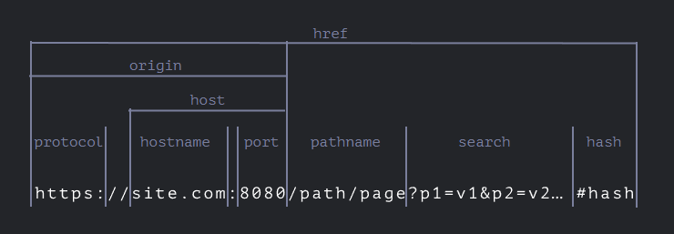
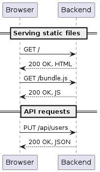
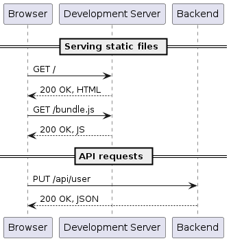
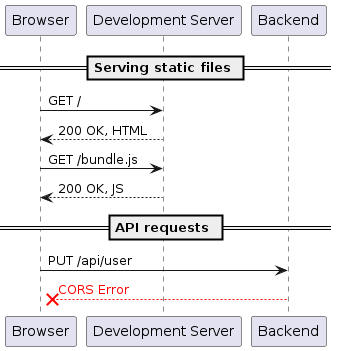
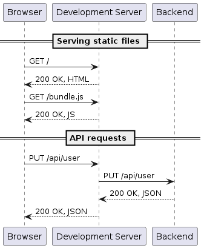

# Web Module Questions

## Modern JS
( https://www.javascripttutorial.net/es6/ )

1. What is ECMAScript? What is the difference between Javascript & ECMAScript?
    - **ECMAScript:** 
        - Short for **ES**, is a **specification** or **standard** (set of syntax, rules, core features and behaviours) for scripting languages used on the **client-side**.
        - It's intended to ensure the interoperability of web pages across different web browsers.
        - Standardized by ECMA International in document ECMA-262:
            - Specifies lanugage syntax
            - Specifies the semantics of the core **API** (=*application programming interface*)
        - Currently we are using ES6 (released in 2015)
    - **JavaScript:** A specific implementation of the ECMA specification -> a **programming language** that follows ECMA standards

2. Explain the concept of "block scoping" introduced in ES6. How does it differ from function scoping?
    - **Variable scopes:**
        - They refer to the area of the code/program, where they can be accessed.
        - 3 types:
            - **Global:**
                - declared outside of functions or blocks
                - can be accessed anywhere in the code
            - **Function:**
                - declared inside functions
                - can't be accessed if we move "outside" of the functions, but we can access them in any **enbedded** function
            - **Block:**
                - declared inside a loop or an if statement
                - can't be accessed if we move "outside" of the functions, but we can access them in any **enbedded** block
                - `var` variables declared in a block can still be accessed outside the block, this is what caused the issues in the past (but not with function scope!!!)

3. What are template literals in ES6 and how do they improve string manipulation in JavaScript?

    - A new way of strings introduced in ES6
    - Declared with `` backticks
    - Differences:
        - allows **multinline strings** without additional keywords
        - allows for **embedded expressions** inside the string using ${} syntax
        - special constructs called **tagged templates** (functions used on the template)

4. Explain the concept of "destructuring assignment" in ES6. How does it simplify variable assignment and object/array manipulation?

    - Allows you to extract values from objects and arrays and assign them to variables using a more concise syntax:

            const person = { name: "David", age: 19 };
            const { name, age } = person;       -> Here we create a name and an age variable, with the values of person object's values with the same key name
            const { name, age = 0 } = person;   -> Here we are also assigning a default value to the age variable

            // Same as this:
            const name = person.name;
            const age = person.age;

            // Use it as function parameters for example:
            function funcName ({ name, age }){ FUNC BODY}
            
            Then call it like this:
            funcName(person);                   // Since person is an object with the keys "name" and "age", it will create those 2 variables, and we can use them like that inside the function

    - With **Objects** we have to name them the same way as the object's original keys!
    - For **Arrays** it's a bit different, the important here is to maintain the original order:

            const numbers = [1, 2, 3];
            const [a, b, c] = numbers;          -> Here we create a, b, and c variables by adding them the values in the same order
            const [a] = numbers;                -> Here we only create a
            const [a, ...rest] = numbers;       -> Here we used the spread operator with `rest` parameter, to add all other elements as well

            // Same as this:
            const a = numbers[0];
            const b = numbers[1];
            const c = numbers[2];

5. What is the "spread operator" in ES6 and how can it be used to manipulate arrays and objects more effectively?

    1. `...` syntax is called the **spread operator**
    - we use it to make a list of parameters/items from an array (for example Math.min() and Math.max() don't take arrays as an argument, but a list of items)
    - it works on iterables only (strings, arrrays), but for objects we need to use Array.from(myOBj) instead and then `...` to do the same
    
    2. **Rest parameter:**
        - Used in function creation for unknown number of parameters (must be used as the last parameter!)
        - Means gather the rest of parameters into an array:

                function sumAll(...args) {              // args is the name for the array
                    let sum = 0;
                    for (let arg of args) sum += arg;
                    return sum;
                }
        - This way we can create functions that take any number of parameters (eg. we create it with (par1, ...pars) -> it means there is par1 as a fixed parameter, and the rest is depending on the function call (so as many as we add))
    
    - Here are the main differences:

        - The spread operator (...) unpacks the elements of an iterable object.
        - The rest parameter (...) packs the elements into an array.

6. How does ES6 introduce the concept of "default function parameters"? Provide an example of using default parameters in a function?

    - When creating a function, we can add default values to parameters:

            function funcName (par1, par2 = "no second par was given"){};   // If we don't specify par2, it's value will be "no second par was given"
    
    - The default value if a parameter is not provided is `undefined`. If we add a default value to the parameter, but when calling it we call it with "undefined", it will still take the default value defined by us.

7. Explain the concept of "modules" introduced in ES6. How do they improve code organization and reusability in JavaScript?

    - A **module** is a self-contained piece of code that encapsulates functionality
    - Modules are separate `.js` files we can import to our code, using `import` and `export` keywords, used on the **SERVER** side
    - The old way of doing this is using the `require` keyword
    - In **ES6** we use import & export:

            //// FILE: math.js
            export const add = (a, b) => a + b;
            
            // And import it like this:
            //// FILE: app.js
            import { add } from './math.js';
            console.log(add(2, 3));  // prints: 5

            // You can also have default exports:
            //// FILE: math.js
            const add = (a, b) => a + b;
            export default add;
            
            // And import it like this:
            //// FILE: app.js
            import add from './math.js';
            console.log(add(2, 3));  // prints: 5

    - *Key differences in next question!*

8. Compare the CommonJS and ES6 "modules". What are the differences?
    - Key differences:
        - **sync** vs **async:**
            - `require` is synchronous - blocks execution until the reqired module is loaded.
            - not an issue on server side (**Node.js**), but can be with some browsers
            - `import` is asynchronous and non-blocking
        - **static** vs **dynamic:**
            - **ES6** is *static*, needs specification of what you want to import/export (*tree shaking* means getting rid of unused stuff).
            - **CommonJS** is dynamic, you can require modules based on runtime conditions. (eg only load something if something else happens)
        - **Top-level** vs. **nested:** 
            - `import/export` needs to be on top level of the module (can't nest them).
            - **CommonJS** has no restricitons
        - **Native support:**
            - **ES6** is not always natively supported (eg. you have to set `"type": "module"` in `package.json` file).
            - **CommonJS** has no restricitons
        - **Live binding:**
            - **ES6** is a read-only live import (updates in export module will be reflected when imported)
            - **CommonJS** copies the values when importing
    - (*Babel* and *Webpack* are some examples of module convertors) 

9. What are higher-order functions in JavaScript?

    - By **Higher order functions** we mean fundtions that take other functions as paramters
    - These are:
        - `arr.forEach()`, `arr.map()`, `arr.filter()`, `arr.find()`, `arr.reduce()
        
10. Explain the purpose and functionality of the map function in JavaScript. How does it differ from the filter and reduce functions?

    - `map()`:
        - Takes 3 parameters:
            - **item** - current item being processed in the array
            - **index** - index of the current item being processed in the array
            - **array** - the array map() is called upon

        - Takes an array and applies a given function to each element of the array, creating and returning a new array with the results:

                const numbers = [1, 2, 3, 4, 5];

                const doubledNumbers = numbers.map(function(num) {
                    return num * 2;
                });

                // Same with an arrow function (note the omission of return keyword!):
                const doubledNumbers = numbers.map(num => num * 2);

    - `filter()`:
        - Takes 3 parameters:
            - **item** - current item being processed in the array
            - **index** - index of the current item being processed in the array
            - **array** - the array map() is called upon
        - Takes an array and applies a given function to each element of the array, creating a new array with only the elements that pass a certain test:

                const numbers = [1, 2, 3, 4, 5];

                const evenNumbers = numbers.filter(function(num) {
                    return num % 2 === 0;          // Should return TRUE or FALSE!
                });

                // Same with arrow function:
                const evenNumbers = numbers.filter(num => num % 2 === 0);
        - Note: while `map()` returns an array with **new** items, filter returns a new array **with the original items**.

    - `reduce()`:
        - Takes 2 parameters:
            - a **callback function** as its first argument:
                - This also gets 2 parameters + 2 optional as before:
                    - the first parameter is an **accumulator**, which is similar to a **total** value of the items processed (=*previous value* or *accumulation of the value returned from the previous execution of the callback function*).
                        - the initial value of the accumulator is `0` or the optional **initial value** passed as the second argument.
                    - the second parameter is the **current item**, being processed
                    - **index** - index of the current item being processed in the array
                    - **array** - the array map() is called upon
            - an (optional) **initial value** as its second argument.
        - Takes an array and applies a given function to each element of the array, reducing the array to a single value. 
        - That single value can be basically any data type or structure (primitive, object, array):

                const numbers = [1, 2, 3, 4, 5];

                const sum = numbers.reduce(function(total, num) {
                    return total + num;
                }, 0);

                // Same with an arrow function:
                const sum = numbers.reduce((total, num) => total + num, 0);

11. How can the filter function be used to selectively extract elements from an array based on a given condition? Provide an example where the filter function is used to create a new array with only the elements that meet the specified criteria.

    - `filter()`:
        - Takes 3 parameters:
            - **item** - current item being processed in the array
            - **index** - index of the current item being processed in the array
            - **array** - the array map() is called upon
        - Takes an array and applies a given function to each element of the array, creating a new array with only the elements that pass a certain test:

                const numbers = [1, 2, 3, 4, 5];

                const evenNumbers = numbers.filter(function(num) {
                    return num % 2 === 0;          // Should return TRUE or FALSE!
                });

                // Same with arrow function:
                const evenNumbers = numbers.filter(num => num % 2 === 0);
        - Note: while `map()` returns an array with **new** items, filter returns a new array **with the original items**.

12. What is the role of the reduce function in JavaScript? How can it be used to aggregate or combine the elements of an array into a single value? Provide an example where the reduce function is used to calculate a cumulative sum or find the maximum value in an array.

    - `reduce()`:
        - Takes 2 parameters:
            - a **callback function** as its first argument:
                - This also gets 2 parameters + 2 optional as before:
                    - the first parameter is an **accumulator**, which is similar to a **total** value of the items processed (=*previous value* or *accumulation of the value returned from the previous execution of the callback function*).
                        - the initial value of the accumulator is `0` or the optional **initial value** passed as the second argument.
                    - the second parameter is the **current item**, being processed
                    - **index** - index of the current item being processed in the array
                    - **array** - the array map() is called upon
            - an (optional) **initial value** as its second argument.
        - Takes an array and applies a given function to each element of the array, reducing the array to a single value. 
        - That single value can be basically any data type or structure (primitive, object, array):

                const numbers = [1, 2, 3, 4, 5];

                const sum = numbers.reduce(function(total, num) {
                    return total + num;
                }, 0);

                // Same with an arrow function:
                const sum = numbers.reduce((total, num) => total + num, 0);

                // 2nd example to find maximum:

                const numbers = [11, 42, 12, 3, 7];

                const max = numbers.reduce( (max, current) => {
                    current > max ? current : max;        // In this case the accumulator will be a value, always the one that is bigger
                })

## Fetch

13. How does a query string parameter in a URL contribute to web application functionality? Explain how query string parameters are typically used to pass data between web pages or APIs.

    - **Components:** (details later in Q19)
        1. Scheme protocol (eg. `http:`)
        2. Domain name (eg. `www.example.com`)
        3. Path (eg. `/contact`)
        4. Query string (eg. `?q=example`) -> **THIS PART**
        5. Fragment identifier (eg. `#team`)

    - **Query string:**
        - optional part of a URL
        - allows parameters to be passed to the server with the request
        - separated from the path by a `?` question mark: 
            - eg. `https://www.example.com/search?q=example&sort=asc` passes two parameters to the server: 
                - *q* with a value of *example*
                - *sort* with a value of *asc*

14. What is the purpose and functionality of the fetch function in JavaScript?

    - Purpose:
        - Old way of HTML creation:
            - web pages were actual HTML pages with minimal JS
            - the HTML was downloaded, then the communication with the server ended
        - Nowadays:
            - HTML has a smaller role
            - JS downloads data from time to time and renders it into HTML
            - **New Web Server type** appeared *optimized for serving data only*, mostly in **JSON** format

15. Explain the syntax of the fetch function and how it handles asynchronous operations? 
    Compare and contrast the syntax of making HTTP requests using fetch with async/await versus the syntax using .then() and .catch(). 
    What are the key differences and benefits of using the async/await syntax in terms of code structure and readability?

    - **Fetch API** is a newer tool built into modern web browsers that allow developers to **make HTTP requests** and **handle responses**:
    - Making a simple `GET` request to retrieve some *JSON data* using `.then()` and `.catch()`:
        - **indentation hell** refers to the code breaks and indentations made, making it less readable

                function fetchData(url){
                    fetch(url)
                        .then(response => response.json())          //response is the parameter of the callback!
                        .then(data => {
                            console.log(data);
                        })
                        .catch(error => {                           //error is the parameter of the callback!
                            console.error(error)};
                        );                      
                }

                fetchData('https://jsonplaceholder.typicode.com/todos/1');

    - Using **async/await** syntax with **Fetch API**:
        - provides a cleaner and more intuitive way to handle **asynchronous** code
        - can use `try - catch` block instead of doing it after with `.catch()`.
        - declare our function as **async** and use the `await` keyword to wait for the response to be returned:

                async function fetchData(url) {
                    try {
                        const response = await fetch(url);          //Await only waits for the assignment, but the rest of the code will continue running!
                        const data = await response.json();
                        console.log(data);
                    } catch (error) {
                        console.error(error);
                    }
                }

                fetchData('https://jsonplaceholder.typicode.com/todos/1');

                // Code breakdown:
                1. define an async function called fetchData() that uses the await keyword to wait for the response to be returned from the server
                2. try/catch block added to handle any errors that may occur during the request

16. What is asynchronicity in JavaScript? Name some typical use cases when asynchronicity is needed.

    - It refers to the behaviour of JS when executing code in a non-blocking way, allowing to different tasks to run independently.
    - An async operation means that JS doesn't wait for tasks to complete before moving on to the next one, instead it continues executing the code and **handles the result, when ready**
    - Examples:
        - Working with APIs -> the fetched data doesn't get returned instantly, we need to wait for it (any operations depending on this need to be queued for execution after it's returned)
        - `setTimeaout` and `setInterval` also operate in an async way
        - event handling -> create tasks while others are also running

17. How can you handle the response received from a fetch request?
    - When we use `fetch()`, we get a **Promise Object** first -> to wait for it to become the actual result we wanted, we need to `await` for it:
    - Using **async/await** syntax with **Fetch API**:
        - provides a cleaner and more intuitive way to handle **asynchronous** code
        - can use `try - catch` block instead of doing it after with `.catch()`.
        - declare our function as **async** and use the `await` keyword to wait for the response to be returned:

                async function fetchData(url) {
                    try {
                        const response = await fetch(url);              //Await only waits for the assignment, but the rest of the code will continue running!
                        const data = await response.json();
                        console.log(data);
                    } catch (error) {
                        console.error(error);
                    }
                }

                fetchData('https://jsonplaceholder.typicode.com/todos/1');

                // Code breakdown:
                1. define an async function called fetchData() that uses the await keyword to wait for the response to be returned from the server
                2. try/catch block added to handle any errors that may occur during the request

18. How does the fetch function handle errors and handle HTTP status codes? Provide an example of using fetch to handle different types of responses, including successful and error responses.

    - With `async-await` we can use a `try-catch` block to handle any errors received
    - With `.then()` we use `.cathc()` block
    - The response is a **Promise Object**, which will be either an error or a resolved fetch:
        - `.then` and `await` are methods that wait for the response before continuing the execution of the code (Await only waits for the assignment, but the rest of the code will continue running!)
        - **Promises:**
            - handle **async** operations (eg. fetching data from an API or reading a file)
            - provide a mechanism to represent *eventual* completion (or failure) of an async operation
            - allows developers to write code, that can wait for the completion of the operation *without blocking the main thread*
            - Consist of 3 parts:
                - **Executor function:**
                    - the function that is passed to the **Promise constructor** when it's created
                    - Takes 2 parameters (`resolve` and `reject`) -> functions that signal thecompletion of the operation
                    - the async operation takes place in the executor function, and then on completion either `resolve` or `reject` is called (with the **result** or **error**)
                - **The state:**
                    - The **Promise** can have 3 different states:
                        - **Pending** - when created
                        - **Fulfilled** - when operation is completed *successfully*. (can't change status after)
                        - **Rejected** - when an *error* occurs. (can't change status after)
                - **The result:**
                    - When a *Promise* is **fulfilled**, it returns a `value` -> this is called the **result**.
                        - Can be any value (object, array, string)
                    - When a *Promise* is **rejected**, it returns an `error` -> returns an Error object or any other type of value.
            - **NB:**
                - Higher order functions are not async functions, so if you want to wait for the promises, you need to use Promise object, or do it with a traditional for loop:
                
                        let newArr = myArr.map(item => {
                            return funcName(item);
                        });

                        newArr = await Promise.all(newArr);

19. Explain the parts of an URL:

    0. **Components:**
     

    1. **Scheme/Protocol:**
        - The first part of the URL, that specifies the protocol used:
            - **HTTP** / **HTTPS** (*=HyperText Transfer Protocol Secure*) are the most common
            - used for accessing web pages iver the internet (`http://` or `https://`)
            - other common schemes are:
                - **FTP** (File Transfer Protocol)
                - **SMTP** (Simple Mail Transfer Protocol)
                - **SSH** (Secure Shell)

        - URL object in JS:

                new URL(url, [base])

                // These 2 are the same, constructed without/with base parameter:
                let url1 = new URL('https://javascript.info/profile/admin');
                let url2 = new URL('/profile/admin', 'https://javascript.info');

                console.log(url1);                  // https://javascript.info/profile/admin
                console.log(url2);                  // https://javascript.info/profile/admin

                // Examples:
                let url = new URL('https://javascript.info/url');

                alert(url.protocol);                // https:
                alert(url.host);                    // javascript.info
                alert(url.pathname);                // /url

    2. **Domain Name:**
        - The second part of a URL, that specifies the domain name of the website or web server hosting the resource
        - The domain name is often preceded by `www.` and followed by a **top-level domain (TLD)** like `.com`.
        - In simple terms, the domain names are **covers** for an IP address. (eg. `http://www.example.com`)
        - **IP address and Ports:**
            - IP address is eg. `http://127.0.0.1:9000`:
                - this is also a URL!
                - consist of:
                    - protocol (`http://`)
                    - IP address (`127.0.0.1`)
                    - **port number** (`9000`)
                        - `:80` for *HTTP* and `:443` for *HTTPS* are default preserved ports for HTTP communication
                        - when a request arrives at a server, it automatically uses these ports to process requests (that's why we don't have to specify them)
                        - when we run a **web server** on **our comupter** we use another port (eg. `9000`), and that's why we specify it then

    3. **Path:**
        - The third part of a URL, that specifies the path to the specific resource on the web server.
        - Contains one ore more directory names separated with `/` (eg. `https://www.example.com/blog/post.html`)

    4. **Query string:**
        - optional part of a URL
        - allows parameters to be passed to the server with the request
        - separated from the path by a `?` question mark: 
            - eg. `https://www.example.com/search?q=example&sort=asc` passes two parameters to the server: 
                - *q* with a value of *example*
                - *sort* with a value of *asc*

    5. **Fragment identifier:**
        - optional part of a URL
        - allows specific sections of a web page to be linked to directly
        - separated from the path by a `#` hash symbol, referring to an HTML element with a matching ID
            - eg. `https://www.example.com/about#team`:
                - scroll the user's browser to the section of the "about" page with an element with the **ID** `team`

## Serve

20. Explain the concept of client-server communication in the context of web development. How does information flow between the client and the server in a typical client-server architecture?
    
    - Client-server communication:
        - **Client** is the user, who is **using the web page**.
        - When the Client is trying to interact with the webpage, **requests** are send to the server, to serve the requested onformation back.
        - The server evaluates theses requests, and send back a **response**, which can include different pieces of information based on what the endpoint is (eg. send back an object, or just a message (eg. "DONE", "Error", etc.)).
            - The response object has other attributes as well, like **headers** (the rules of how to read the information), **status codes** and **URL** information and other details.
        - Based on the received information, the front end code can now proceed with the code.
    
    - More specifically:
        - Communiation between:
            - **Client** (eg. **web browser**)
            - **Server** (eg. computer hosting a website or web application = **web server**)
        - **Server:**
            - **VPS** (*=Virtual Private Server*) - computer connected to the internet
            - **Web server** - programs that run on any computer (but mostly on a VPS)
        - Steps in communication:
            1. Browser sends a request to the server using a protocol called **HTTP** (*=Hypertext Transfer Protocol*):
                - information such as the URL of the file or any additional parameters are included
            2. Server receives the request and processes it, to check if it's valid and if the file exists
            3. If all checks are done and in order:
                - Server sends the file back in chunks, using protocol **TCP** (*=Transmition Control Protocol*)
            4. Browser receives the file in small chuncks and assembles them into the file, then saves it to the computer

21. What is the role of HTTP requests and responses in web development? Explain the structure of an HTTP request and an HTTP response.

    - HTTP requests and responses are the **messages** between the client and the server, and are essential for sending and receiving information between the **web browser** and the **web server**:
        - **HTTP** (*=Hypertext Transfer Protocol*) - set of rules used to send the information
    - HTTP Request:
        **Method:** It tells the server what you want to do. Common methods are "GET" to ask for information, "POST" to send data, and more.
        **URL** (Uniform Resource Locator): This is the web address or the location where your request is going.
        **Headers:** "A set of rules on how to read the data". These are like labels on your letter, explaining more details about the request, such as the type of data your computer can handle.
        **Body:** Sometimes, you can attach extra information in the body, like when you submit a form on a website.

    - HTTP Response:
        **Status Code:** This is like a quick summary at the beginning of the letter, telling you if the request was successful or if there was a problem. For example, "200 OK" means everything is good, and "404 Not Found" means the server couldn't find what you asked for.
        **Headers:** Just like in the request, headers provide more information about the response, such as the type of data you're getting.
        **Body:** This is where the main information you requested is found. It could be a web page, an image, or other data.

22. Explain the key differences between the CommonJS require syntax and the ECMAScript (ES) module syntax import. How do these two approaches handle module dependencies and exports in JavaScript?

    - **CommonJS:** (before ES6 in older JS environments like Node.js)
        - When we use CommonJS, the file's extension is simply **.js**
        - Export:

                const myValue = 42;
                module.exports = myValue;
        
        - Import:

                const myValue = require('./myModule.js');
    
    - **ES6 Syntax:**
        - We either specify in the `package.json` file that we are working with modules (`"type": "module",`), or the file extension should be **.mjs**
        - Export:

                const myValue = 42;
                export default myValue;     //used when you want to export a single default value from a module

                OR:

                const value1 = 10;
                const value2 = 20;

                export { value1, value2 };

        - Import:

                import myValue from './myModule.js';

                OR:

                import { value1, value2 } from './myModule.js';

23. What are the advantages of using the ES module syntax import over the CommonJS require syntax?
    
    - The difference between the **common** and **ES6** syntax:
    - **sync** vs **async:**
        - `require` is synchronous - blocks execution until the reqired module is loaded.
        - not an issue on server side (**Node.js**), but can be with some browsers
        - `import` is asynchronous and non-blocking
    - **static** vs **dynamic:**
        - **ES6** is *static*, needs specification of what you want to import/export (*tree shaking* means getting rid of unused stuff).
        - **CommonJS** is dynamic, you can require modules based on runtime conditions. (?)
    - **Top-level** vs. **nested:** 
        - `import/export` needs to be on top level of the module (can't nest them).
        - **CommonJS** has no restricitons
    - **Native support:**
        - **ES6** is not always natively supported (eg. you have to set `"type": "module"` in `package.json` file).
        - **CommonJS** has no restricitons
    - **Live binding:**
        - **ES6** is a read-only live import (updates in export module will be reflected when imported)
        - **CommonJS** copies the values when importing

24. What is Express.js and how does it simplify web application development in Node.js? Explain the core features and benefits of using Express.js as a web framework.

    - What does express do?
        - Express is a popular and minimalist web application framework for Node.js (We install it as an NPM tool).
        - It provides a set of features and tools for building web and mobile applications, APIs, and other server-side applications.
    
    - Benefits and features:
        - **Simplified Server Creation:**
            - Express.js makes it easy to create an HTTP server in just a few lines of code. You can start a server and have it up and running quickly.
            - Lightweight -> designed for speed, efficient, great performance

        - **Middleware:**
            - Express.js is known for its robust middleware system.
            - Middleware functions can be inserted into the request/response cycle to perform various tasks, such as authentication, logging, data parsing.
            - For example:
                    
                    app.use(express.json());                                // express won't parse body, so we need an express middleware
                    app.use('/', express.static('public'));                 // the use method creates an endpoint for the static file serving
                    app.use(express.urlencoded({ extended: false }));       // parse incoming requests with URL-encoding (sets the "req.body" property to an object containing the key-value pairs)
        - **Route handling:**
            - define and handle routes for your application
            - create RESTful APIs with ease, specifying routes and the associated functions to execute when those routes are accessed
        
        - **Template Engines:**
            - Express.js supports various template engines like EJS, Handlebars, and Pug (formerly known as Jade).
            - These engines allow you to dynamically generate HTML pages with embedded data, making it easier to create dynamic web content.

        - **HTTP Utility Methods:**
            - Express.js provides a set of HTTP utility methods that make handling HTTP requests and responses more convenient.
            - You can send responses, redirect, and set headers with simple function calls.
            - Support of HTTP verbs (`GET`, `POST`, `PUT`, `PATCH`, `DELETE`)

        - **Error Handling:**
            - You can define error-handling middleware to manage errors and exceptions to improve the reliability of your application.
        
25. Explain the process of handling static files (e.g., CSS, images) in Express.js. How can you configure Express.js to serve static assets from a specific directory in your application?

    - Import express in backened file (eg. server.js):

            import express from "express"
            const app = express();

    - Add middleware to server.js file:

            app.use('/', express.static('public'));

    - Set up API endpoint:

            app.get("/", (res, req) => {
                res.sendFile('./index.html');       //We can send back anything (style.css / image1.png)
            })
    
    - Specify port to listen for requests:

            app.listen(3000, () => {
                console.log(`Open this link in your browser: http://127.0.0.1:3000`);
            })
    
    - Set up request on Frontend:
            
            const url = "http://127.0.0.1:3000/"    //Whatever the endpoint is
            const url = "http://localhost:3000/"    //Whatever the endpoint is

            const fetchData = async (url) => {
                try {
                    const response = await fetch(url);      //request happens with a fetch function (default 'GET' only needs an URL)
                    return await response.json();
                } catch (error) {
                    console.error(error);
                }
            }

26. How does Express.js handle HTTP request/response cycles? Explain the process of receiving and responding to requests using Express.js middleware and route handlers.

    - Simple answer:
        - User interaction triggers the cycle:
            - REQUEST is made by CLIENT
            - SERVER processes the request
            - SERVER generates RESPONSE
            - SERVER sends the RESPONSE
            - CLIENT receives and processes the response
            - The user now sees the new processed information

    1. Initialization:
        - express is imported into server.js file and an 'app' constant is created from it.

    2. Middlewares:
        - add any that you need eg. for working with requests other than 'GET':

                app.use(express.json());                                // express won't parse body, so we need an express middleware
        
        - or to serve static files:

                app.use('/', express.static('public'));                 // the use method creates an endpoint for the static file serving
        
        - `next`: this is the third parameter after (req, res, next), which is used to move to the next middleware
    
    3. Set route handlers:
        - Endpoints to give access to specific routes specified in the URL (usually serving static HTML files):

                app.get("/", (res, req) => {
                    res.sendFile('./index.html');       //We can send back anything (style.css / image1.png)
                })
    
    4. A request object is created when the request is received
        - Includes URL, method, headers, parameters and request body

                //access any parameters in the URL for example:
                req.params.if //id is specfied in the endpoints URL with ":id" after the route
    
    5. A response object is created, and we can add information to it:

            res.status(201).json({ message: 'Product created successfully' });      // Added a message key to the response object and added a status code
    
    6. Error handling
        - Proper error handling should be accounted for in each case, for example by adding a `try-catch` block to the fetch.
        - We can set status codes for failed requests on the response object like this:

                res.status(500).send('Internal Server Error');
    
    7. Set up port to listen to incoming requests:

            app.listen(3000, () => {
                console.log(`Open this link in your browser: http://127.0.0.1:3000`);
            })

    8. The response is received by the Frontend and the function that was called can now progress

27. How does routing work in Express.js? Explain how to define routes and handle different HTTP methods (GET, POST, etc.) in an Express.js application.

    - Import express in backened file (eg. server.js):

                import express from "express"
                const app = express();

        - Add middleware to server.js file:

                app.use(express.json());  // Needed to parse the body in requests other than 'GET'

        - Set up API endpoint:

                app.get("/path:param", (res, req) => {                  // An enpoint is created for URL "http://localhost:3000/path"
                    const incomingParameter = req.params.param1;        // Get any parameters from the url
                    const bodyParameter = req.body.param2;              // Get any parameters from the body (added in the frontend)
                    res.status(200).send({'Task completed!'});          // We can send back anything and add status codes (200 is default for a successful fetch)
                //  res.status(500)send({'Task failed!'});              // We can send back anything and add status codes (500 means internal server error)
                })
        
        - Add custom middlewares:

                // Global middleware
                app.use((req, res, next) => {
                    // Common middleware logic for all routes
                    console.log('This middleware runs for all requests');
                    next(); // Move to the next middleware or route handler
                });

                // Route-specific middleware
                    app.get('/special', (req, res, next) => {
                    // Middleware for a specific route
                    console.log('This middleware runs only for the /special route');
                    next();
                });

        - Specify port to listen for requests:

                app.listen(3000, () => {
                    console.log(`Open this link in your browser: http://127.0.0.1:3000`);
                })
        
        - Set up request on Frontend:
                
                const url = "http://127.0.0.1:3000/path/param1"    //Whatever the endpoint is
            //  const url = "http://localhost:3000/path/param1"    //Whatever the endpoint is

                const fetchData = async (url) => {
                    try {
                        const response = await fetch(url, {
                            method: "PUT",                                      // These parameters are needed only for requests other that 'GET'
                            headers: { 'Content-Type': 'application/json' },
                            body: JSON.stringify( {param2: "value"} );          // 'GET' and 'DELETE' don't have a body!
                        });
                        return await response.json();
                    } catch (error) {
                        console.error(error);
                    }
                }

28. What are the various methods available in Express.js for sending responses to clients? Explain the differences between res.send() and res.json() in Express.js.

    - `res.send()`: used to send anything without specifying the content:

            app.get('/json', (req, res) => {
                const data = { message: 'Hello, JSON' };
                res.send(data); // Sending a JSON response
            });

    - `res.json()`: used to send specifically in json format:

            app.get('/json', (req, res) => {
                const data = { message: 'Hello, JSON' };
                res.json(data); // Sending a JSON response
            });

    - **Differences:**
        - **Content-Type Header:** 
            - `res.send()` allows you to send responses of various data types, and you need to explicitly set the Content-Type header if you want to send JSON. 
            - `res.json()` automatically sets the Content-Type header to "application/json" for JSON responses.
        - The type of data send (send is more general, json is specifically a JSON format)

29. Explain what the express.json() middleware does?

    - Middlewares are fundtions that are executed before executing the code for the specific endpoints (preparation).
    - For example, the following is used to parse the body of the request object, that is used for requests like `PUT`, `PATCH` and `POST`:

            app.use(express.json());

30. What is the purpose of the next() function in Express.js middleware? How can you use it to pass control to the next middleware function in the chain or to terminate the middleware processing?

    - When creating an endpoint or a middleware

    - `next`: this is the third parameter after (req, res, next) in the app request handler function, which is used to move to the next middleware in the chain of middlewares:

                // Global middleware
                app.use((req, res, next) => {
                    // Common middleware logic for all routes
                    console.log('This middleware runs for all requests');
                    next(); // Move to the next middleware or route handler
                });

                // Route-specific middleware
                    app.get('/special', (req, res, next) => {
                    // Middleware for a specific route
                    console.log('This middleware runs only for the /special route');
                    next();
                });

31. Explain the concept of route parameters in Express.js. How can you extract dynamic values from the URL path using route parameters, and how are these values accessed within route handlers?

    - When creating a route endpoint (eg. API endpoint to serve data), we can add parameters to the URL when creating the request:

            app.get('/users/:id', (res, req) => {
                const userId = req.params.id                //we get the parameter :id from the url
                res.json(`The user ID is: ${userId}`);
            })

    - We can make a request like this:

            const data = await fetch('http://localhost:3000/4);
            const response = await data;      //we will get back `The user ID is: 4`

32. Can you name some typical HTTP response codes and their meaning?

    - By default we get back status(200) after a succesful fetch (200 OK)
    - Other common status codes are:
        - 201 Created (The request was successful and a new item was created eg with a POST)
        - 204 No Content (The request was understood, but there is nothing to fill the response body with)
        - 400 Bad Request (The request wasn't understood because of missing parameters, wrong syntax or missing endpoint)
        - 401 Unauthorized (The request has invalid authentication)
        - 403 Forbidden (The request is understood, but the server refuses to fulfill it)
        - 404 Not found (The requested resource wasn't found on the server) - this isn't considered an error message!
        - 500 Internal Server Error (Unexpected error happened)
        - 503 Service unavailable (The server is currently not available)

33. Can you name some typical HTTP request/response headers and their meaning?

    - **HTTP Request Headers:** "A set of rules on how to read the data". These are like labels on your letter, explaining more details about the request, such as the type of data your computer can handle.

        - **Host:** Indicates the domain name of the server (e.g., "Host: www.example.com").
        - **User-Agent:** Identifies the user agent (e.g., browser or application) making the request.
        - **Authorization:** Contains credentials for authenticating the client with the server.
        - **Content-Type:** Describes the type of data sent in the request body (e.g., "application/json").
        - **Accept:** Specifies the types of media (content types) the client can process, helping the server determine the response format.
        - **Cookie:** Sends previously stored cookies to the server, allowing the server to maintain session information.
        - **If-Modified-Since:** In a conditional GET request, this header tells the server to provide the resource only if it has been modified since a specific date.
    
    - **HTTP Response Headers:** Just like in the request, headers provide more information about the response, such as the type of data you're getting.
        - **Content-Type:** Specifies the type of data in the response body, helping the client understand how to process it.
        - **Location:** Used in redirection responses (e.g., 302 or 301 status codes) to specify the new location to which the client should redirect.
        - **Set-Cookie:** Informs the client about cookies to be stored or updated on the client side.
        - **Cache-Control:** Provides directives for caching mechanisms in both the client and intermediary caches.
        - **ETag:** A unique identifier for a specific version of a resource, which allows clients to perform conditional requests.
        - **Server:** Identifies the software used by the origin server (e.g., "Server: Apache/2.4.7").
        - **Access-Control-Allow-Origin:** Indicates which origins are permitted to access the resource using Cross-Origin Resource Sharing (CORS).
        - **Content-Disposition:** Suggests the filename for a downloaded file, allowing the client to name the saved file appropriately.
        - **WWW-Authenticate:** Informs the client which authentication method is required for access and provides a challenge to the client to authenticate itself.
        - **Expires:** Specifies the date and time at which the response is no longer considered fresh, influencing caching behavior.

    - We can specify these in the fetch parameters after the URL:
            
            fetch(url, {
                headers: { 'Content-Type': 'application/json' }
            });

34. What are the common HTTP methods used in web development, and what are their respective purposes?

    - `GET` 
        - No body!
        - This method is used to retrieve data from a specified resource. GET requests are read-only and should not modify any data on the server.

    - `PATCH` //modify users.json file's inner data
        - This method is used to apply partial modifications to a resource.

    - `PUT` //change a user object with another one
        - This method is used to replace the entity at the specified resource with a new one. If the resource does not exist, it may be created.

    - `DELETE` 
        - No body!
        - This method is used to delete the specified resource.

    - `POST`
        - This method is used to submit an entity to the specified resource, often causing a change in state or side effects on the server.

35. How does the GET method differ from the POST method? Explain when it is appropriate to use each method. Which one uses request body to send data? What the other method uses to send data?

    - `GET` 
        - No body!
        - This method is used to retrieve data from a specified resource. GET requests are read-only and should not modify any data on the server.
    
    - `POST`
        - This method is used to submit an entity to the specified resource, often causing a change in state or side effects on the server.
    
    - When creating a request with `fetch()`, the second **options** or **init** parameter should be specified and some additional information added:

            // Frontend:
            fetch(url, {
                method: "POST",
                headers: {'Content-Type': 'application/json'},
                body: JSON.stringify( {object to be sent} )
            })
    
    - When we use 'GET' or 'DELETE', we can't send a body, so any parameters should be passed through the URL:

        - When creating a route endpoint (eg. API endpoint to serve data), we can add parameters to the URL when creating the request:

                app.get('/users/:id', (res, req) => {
                    const userId = req.params.id                //we get the parameter :id from the url
                    res.json(`The user ID is: ${userId}`);
                })

        - We can make a request like this:

                const data = await fetch('http://localhost:3000/4);
                const response = await data;      //we will get back `The user ID is: 4`

36. Explain the use of the PATCH method in HTTP. How does it differ from the PUT method, and when should it be used to update a resource?

    - `PATCH` //modify users.json file's inner data
        - This method is used to apply partial modifications to a resource.

    - `PUT` //change a user object with another one
        - This method is used to replace the entity at the specified resource with a new one. If the resource does not exist, it may be created.

    - They are essetially doing the same and there is no difference in their use, but it's more appropriate to use:
        - `PATCH` when we are just modifying something (eg. an address key in an employee's user object)
        - `PUT` when we change something completely (eg. a user object).

37. How can the DELETE method be used to remove a resource from a server? Explain how the DELETE method works and any considerations for handling resource deletion.

    - `DELETE` 
        - No body!
        - This method is used to delete the specified resource.
    
    - Example:
        - Backend (creating endpoint):

                app.delete('/users/:userId', async (req, res) => {              // Id is passed through the URL, because there is no body!
                    
                    // We find the user in the database:
                    const data = await fs.readFile('./users.json', 'utf8');
                    const { users } = JSON.parse(data);                         
                    const userId = parseInt(req.params.userId);
                    const user = users.find(user => user.id === userId);

                    // If we found the user, we create a new array from the rest of the users and update the file
                    if (user) {
                        const newUsers = users.filter((x) => x !== user);       
                        await fs.writeFile('./users.json', JSON.stringify({ users: newUsers }), 'utf8'); 
                        return res.send({ state: "DONE" });                     // We only add a state to our return object, indicating that the task has been completed successfully in the background
                    } else {
                        return res.status(404).send({ state: 'User not found' });
                    }
                });
        
        - Backend (creating request):

                fetch(url, {
                    method: "DELETE",
                    headers: {'Authorization': 'Bearer token'},     // This is optional
                })

## Forms really start here:

38. How do you handle form submissions using JavaScript? Explain the process of capturing form data and preventing the default form submission behavior.

    - **Form:** 
        - Web forms contain at least a `form` element that includes `input` or `textarea`, and `button` elements. -> user fills this then sends data to server:

                <form id="form">
                    <label for="username">Username:</label>                                         // optional
                    <input id="userName" placeholder="Write name here" value="">                    // self closing!
                    <textarea id="comments" name="comments" rows="4" cols="50"></textarea>          // multiline input box
                    <button type="submit">Edit</button>                                             // buttons inside forms are by default set to "submit" type
                </form>
    
    - Event handling:
        - Instead of adding a click event listener on the button, we add a `submit` event listener to the window object:

                window.addEventListener("submit", (event) => {
                    event.preventDefault();                         // By default submit would refresh the page, so we need to avoid doing this with preventDefault()

                    const userNameElement = document.getElementsById("userName");
                    const value = userNameElement.value;

                    // We can now use the value to do something with it
                })

39. Explain the required elements necessary to define a form in HTML.

    - **Form requirements:** 
            - Web forms contain at least a `form` element that includes `input` or `textarea`, and `button` elements. -> user fills this then sends data to server:

                    <form id="form">
                        <label for="username">Username:</label>                                         // optional
                        <input id="userName" placeholder="Write name here" value="">                    // self closing!
                        <textarea id="comments" name="comments" rows="4" cols="50"></textarea>          // multiline input box
                        <button type="submit">Edit</button>                                             // buttons inside forms are by default set to "submit" type
                    </form>

40. What is the purpose of the required attribute in HTML form elements? How does it enforce mandatory input fields and prevent form submission without the required information?

    - Purpose of `required` attribute:
        - Indicate that the associated field must be filled out or selected by the user before the form can be submitted. This is especially useful for fields where missing information could lead to incomplete or incorrect form submissions. 

    - **Form requirements:** 
            - Web forms contain at least a `form` element that includes `input` or `textarea`, and `button` elements. -> user fills this then sends data to server:

                    <form id="form">
                        <input id="userName" placeholder="Write name here" value="" required>           // We added required to this line
                        <button type="submit">Edit</button>                                             // buttons inside forms are by default set to "submit" type
                    </form>

41. Explain the different types of form input fields available in HTML. How do input types like text, number, email, checkbox, and radio buttons differ, and how are they used in forms?

    - Regular text input (we can also add require to any of these):

            <input type="text" name="username" placeholder="Enter your username">
    
    - Specific to numbers, with optional up/down arrows for increments (and min/max):

            <input type="number" name="quantity" min="0" max="100" step="1" value="0">
    
    - Email input (valid if @ is present?)

            <input type="email" name="email" placeholder="Enter your email">

    - Checkbox to select from one or multiple options (by checking it)

            <input type="checkbox" name="interest" value="sports"> Sports
            <input type="checkbox" name="interest" value="music"> Music

    - Checkbox with single option possibility is a radio button:

            <input type="radio" name="gender" value="male"> Male
            <input type="radio" name="gender" value="female"> Female

    - Password input hides the input fields, but keeps the value:

            <input type="password" name="password" placeholder="Enter your password">

    - Calendar widget is added to select a certain date:

            <input type="date" name="birthdate">

    - Possibility to upload files with file type input:

            <input type="file" name="fileupload">

42. Can you explain the purpose of the name attribute in a context of form submission?

    - The purpose of the **name** attribute for the `input` elements within a `form` is identification, when we submit the form to the server:

            // Sample form:
            <form id="myForm" action="/submit" method="post">
                <label for="username">Username:</label>
                <input type="text" id="username" name="username">
                <label for="email">Email:</label>
                <input type="email" id="email" name="email">
                <button type="submit" id="submitButton">Submit</button>
            </form>

            // First we get access to our form:
            const form = document.getElementById('myForm');

            // Then we attach a submit handler to it:
            form.addEventListener('submit', function(event) {
                event.preventDefault();

                // Access form data using the name attribute
                const username = form.elements.username.value;      // This is how we access elements (username and email were declared when we created the form)
                const email = form.elements.email.value;

                // You can now use the data:
                console.log('Username: ' + username);
                console.log('Email: ' + email);
            });

43. Can you explain how we can connect a label tag to a form element?

    - Label tags are the non-modifiable elements of the form, providing additional information regarding the input fields requirements:

            <form id="myForm" action="/submit" method="post">
                <label for="username">Username:</label>             // We added a label here for the username, with "for" attribute
                <input type="text" id="username" name="username">
                <label for="email">Email:</label>                   // We added a label here for the email, with "for" attribute
                <input type="email" id="email" name="email">
                <button type="submit" id="submitButton">Submit</button>
            </form>

44. How can you dynamically manipulate or modify form elements using JavaScript? Explain how to add or remove form fields dynamically based on user interaction or specific conditions.

    - Example to add:

            // Start by creating a form with an add button inside:
            <form id="myForm">
                <label for="username">Username:</label>
                <input type="text" id="username" name="username">
                
                <button type="button" id="addField">Add Field</button>      // Set type to button, otherwise it will submint by default!
                <button type="submit" id="submitButton>Submit</button>
            </form>

            // Store the required elements:
            const form = document.getElementById('myForm');
            const addButton = document.getElementById('addField');

            // Event listener to add a button:
            addButton.addEventListener("click", (event) => {
                addButton.insertAdjacentHTML("beforebegin", `<input type="text" name="dynamicField">`)
            })
    
    - Example to remove:

            // Start by creating a form with an remove button inside:
            <form id="myForm">
                <label for="username">Username:</label>
                <input type="text" id="username" name="username">
                <input type="text" name="dynamicField">
                <input type="text" name="dynamicField">              
                
                <button type="button" id="addField">Add Field</button>
                <button type="button" id="removeField">Remove Field</button>        // This was added
                <button type="submit" id="submitButton>Submit</button>
            </form>

            // Store the required elements:
            const form = document.getElementById('myForm');
            const removeButton = document.getElementById('removeField');

            // Event listener to remove a button:
            removeButton.addEventListener("click", (event) => {
                const dynamicFields = querySelectorAll(`[name="dynamicField"]`);

                if (dynamicFields.length > 0){
                    form.removeChild(dynamicFields[dynamicFields.length - 1]);      // Remove last child using index
                }
            })

    - Nice solution in SI2 week movie-editor task!

45. How can you convert form data into a format that can be easily transmitted or processed by the server?

    - We can create a **request body**, then use `JSON.stringify()` on it when sending:

            const body = {
                id: 1,
                username: form.elements.username.value
            }

            const response = await fetch(url, {
                method: "PUT",
                headers: { 'Content-Type': 'application/json' },
                body: JSON.stringify(body)
            });

## React

46. What is React.js and what are its key features?

    - React.js is an **open-source JavaScript library** used for **building user interfaces (UIs)** and **single-page applications** (typically when user interactions are dynamic and frequent).
    - Allows developers to build **reusable UI components** that can be easily managed and manipulated, providing a faster and more efficient way to build interactive UIs
    - React uses a **virtual DOM (Document Object Model)** (compares the DOM with the virtual one, and only updates the differences) and a **declarative syntax** (describe how the UI should look like), to allow developers to describe how the UI should look at any given time
        - Updates the actual DOM *only with the necessary changes*, improving performance and reducing load times.
        - Offers a range of powerful features:
            - state management (useState hook)
            - event handling (eg. `onClick`, `onChange`, `onMouseOver`, `onBlur`)
            - server-side rendering (SPA based - initial relatively larger info is downloaded, then only small updates are being done)
        - Other typical behaviours:
            - One-Way Data binding: unidirectional data flow (parent to child only). Child components use callback functions to communicate with the parents
            - JSX (JavaScript XML): syntax extension, that allows developers to add HTML code into a JS file to create components
            - React Router: standard library, that helps navigation between components/pages/views
            - React Hooks: functions that store data in states (as if they were global variables), that can be later reused. (eg. `useState`, `useEffect`, `useNavigation`, `useLocation`)

47. Explain the concept of virtual DOM and how it contributes to React's performance.

    - React uses a **virtual DOM (Document Object Model)**, that compares the **actual DOM** with the **virtual** one, and only updates the differences.
    - This makes the process faster and more efficient to build interactive UIs, because only the difference gets updated instead of the whole DOM.

48. Explain the component-based architecture in React.js.
    How do components work, and how can they be composed to build complex user interfaces?
    
    - `component`:
        - a **reusable piece of UI code** that encapsulates the functionality and presentation of a portion of the user interface (eg. button or form -> creates content for HTML)
        - they are created using either `classes` or `functions` (looks like a function in JS, but with a capital initial letter)
        - can include other components, and each can have their own `state` (can be updated and passed to it's children)
        - they can **accept** input data called `props` and can **return** visual elements in the form of HTML, JSX, or other components

    - **lifecycle:** 
        - we use this word to describe various stages of a component's existence, from its creation to its destruction:
        - Components can be **mounted**, **updated**, and **unmounted**, and various methods can be called at different stages of their lifecycle to perform tasks such as initialization, updating, or cleanup.

    - They can have `props`, which is very similar to a function's parameter. We can pass these props from theire parents (see examples below).

    - Example of a React component:

            import React from 'react';

            function Greeting(props) {
            return (
                

                    <h1>Hello, {props.name}!</h1>
                    
Welcome to React.

                

            );
            }

            export default Greeting;

            // Code breakdown:
            We have defined a functional component named "Greeting" that takes a "single prop name"
            It renders a simple greeting message that includes the "name prop"
            In the body of the component, we are returning a JSX expression that describes the structure of the output:
                This includes a "div" element that contains an "h1" and a "p" element
                The "h1" element includes an interpolated reference to the "name prop", which is enclosed in curly braces.
            The component is then exported using the "export default" syntax, to use in other parts of our application.

    - To use this `component` in another component or file, we simply import it like any other module (we use it twice with 2 different name props):

            import Greeting from './Greeting';

            function App() {
            return (
                

                    <Greeting name="Alice" />
                    <Greeting name="Bob" />
                

            );
            }

            export default App;

49. What is the significance of JSX in React.js?
    Explain how JSX combines HTML-like syntax with JavaScript code and how it is transpiled into regular JavaScript during the build process.

    - **JSX** (JavaScript XML) is a syntax extension for JavaScript that allows developers to add HTML code into the JS files directly, to create HTML components to be used be React 
        - it's not HTML, but when transpiled, JS code is generated, which creates React elements (lightweight representations of the UI componenents).
        - For a browser to interpret it correcly, it needs to be transpiled first into JS (eg. using Babel -> `React.createElement()` is added in the background)
    
    - How it works:
        - We create a file with the **.jsx** extension
        - We add <html> code as a return value of a component or as the value of a variable:

                const item = 
Hello from the jsx file

        - When we are using HTML syntax, we can still add JS code by writing it inside curly brackets {}:

                const name = 'John';
                const element = <h1>Hello, {name}!</h1>;

    - Conditional rendering is used for dynamic content:

            const isAdmin = true;
            const greeting = <h1>{isAdmin ? 'Welcome, Admin!' : 'Hello, User!'}</h1>;

50. What are props in React and how are they used to pass data between components?
    Explain the concept of props and how they facilitate parent-child component communication.

- `prop` (short for "property") is a way to pass data from a parent component to a child component
    - they are **read-only**, which means that a child component cannot modify the props it receives from its parent (new props should be passed if updates are needed!)
    - **Note:** 
        - `props` are passed down in a **unidirectional data flow** from **parent to child**, and **cannot be modified by the child component** (tree-like structure)
        - If the child component needs to update its data based on user input or other events, it can do so by using `state`, which is a separate concept in React
        - Anything can be passed down to it's child as a prop, eg states, state setter fucntions or event handler functions
    - they are similar to function arguments:
        - They allow a component to be customized and configured for specific use cases
        - The difference is that they are immutable, so can't be modified after receiving them (read-only).

    - Example of how props can be used in a React component:

            // We create the component:
            function Greeting(props) {
            return <h1>Hello, {props.name}!</h1>;
            }

            // We add values to it from the parent element:
            function App() {
            return (
                

                    <Greeting name="Alice" />
                    <Greeting name="Bob" />
                    <Greeting name="Charlie" />
                

            );
            }

            // Code breakdown:
            "Greetings" component takes a "props" object as an argument, which contains a "name" property
            In the "App" component, we render three Greeting components with different name props

51. How can you access and utilize props within a functional component in React?
    Explain how to extract and use props using the destructuring syntax.

    - In addition to the previous example, we can also use object destructuring to create props:

            // We create the component:
            function Greeting({ name }) {           // Object destructuring
            return <h1>Hello, {name}!</h1>;         // Prop can now be refered to as "name" instead of "props.name"
            }

            // We add values to it from the parent element:
            function App() {
                return (
                    

                        <Greeting name="Alice" />
                        <Greeting name="Bob" />
                        <Greeting name="Charlie" />
                    

                );
            }

52. How can you pass callback functions as props in React?
    Provide an example of how to pass a function from a parent component to a child component, enabling the child to communicate with the parent.

    - Similarly like passing any other data, we can also pass functions as props:

        - First we create a component (the child):

                // ChildComponent.js
                import React from 'react';

                const ChildComponent = ({ onButtonClick }) => {                     // We will pass the function here, called "onButtonClick"
                    return (
                        

                            <button onClick={onButtonClick}>Click me!</button>      // We call it here inside the child component (not the difference between onClick event and onButtonClick prop in parent!)
                        

                    );
                };

                export default ChildComponent;

        - We create first the function we want to pass in the parent element:

                // ParentComponent.js
                import React from 'react';
                import ChildComponent from './ChildComponent';                      // We import the ChildComponent

                const ParentComponent = () => {                                     // The parent component is created here
                    const handleButtonClick = () => {                               // The function is created inside the parent component
                        console.log('Button clicked in parent component!');
                    };

                    return (
                        

                            <h1>Parent Component</h1>
                            <ChildComponent onButtonClick={handleButtonClick} />    // We call the child component here, and we pass the function as a prop (not an actual event! the event is created inside the child!)
                        

                    );
                };

                export default ParentComponent;

53. Explain the concept of spreading props in React. 
    How can the spread operator be used to pass multiple props from a parent component to a child component in a concise manner?

    - **Spreading props:** used to pass multiple props from a parent component to a child component:
        - First we create a props object as a constant inside our Parent component, and pass it to the child component:
                
                // ParentComponent.js
                import React from 'react';
                import ChildComponent from './ChildComponent';

                const ParentComponent = () => {
                    const commonProps = {                   // The props are created here as an object, with the keys as the prop names
                        prop1: 'value1',
                        prop2: 'value2',
                    };

                    return (
                        

                            <h1>Parent Component</h1>
                            <ChildComponent {...commonProps} specificProp="specialValue" />     // We pass the props here using the spread operator
                        

                    );
                };

                export default ParentComponent;
        
        - Then in the child element we can get them like this:

                // ChildComponent.js
                import React from 'react';

                const ChildComponent = ({ prop1, prop2, specificProp }) => {        // We call each prop name from the object by it's key, with object destructuring
                    return (
                        

                            
Prop 1: {prop1}

                            
Prop 2: {prop2}

                            
Specific Prop: {specificProp}

                        

                    );
                };

                export default ChildComponent;

54. Explain the concept of default props (with ES6 JS syntax) in React. 
    How can you define default values for props in a component to handle cases where the prop value is not explicitly passed?

    - **Default props:** used to set default values for props in a component, for when the parent component doesn't provide a value for the prop.
        - With functional components, we can set default prop value with the `defaultProps` property:
                
                import React from 'react';

                const MyComponent = ({ myProp }) => (
                    

                        
{myProp}

                    

                );

                MyComponent.defaultProps = {        // We can set the default props inside this object
                    myProp: 'Default Value',
                };

                export default MyComponent;

55. Explain the immutability principle when working with props and states in React. 
    Why is it important to avoid directly modifying prop values within a component, and what are some best practices for maintaining immutability?

    - **Immutability:** when in context of props, immutability refers to the props not being modifyable after receiveing them from the parent element.
        - It's purpose is to ensure predictable rendering:
            - React **uses states to re-render content**, and if we modify a prop, React won't necessarily know it was updated
            - It also uses **shallow referencing**, so it doesn't see if an element inside an array or object was changed, because it checks the reference only.
    
    - To update content correctly when something was changed, we use `states`, and their `setter functions`:

            import React, { useState } from 'react';

            function Counter() {
                const [count, setCount] = useState(0);      // We create our state here for counting

                function increment() {
                    setCount(count + 1);                    // We re-set it's value here, inside a function
                }

                return (
                    

                        
Count: {count}

                        <button onClick={increment}>Increment</button>      // We attach the function to the button's onClick event
                    

                );
            }

56. How does React.js handle state management? Explain the concept of state and how it differs from props.

    - **Props** 
        - are used to pass data from a parent element to a child element
        - Props are declared when a component is used
        - They are immutable and can't be changed.
    - **States** 
        - are used to handle change (=State is used to manage data that can change during the component's lifecycle.)
        - declared with `useState` hook
        - React re-renders the changes after a state was reset (Updating state triggers a re-render of the component).

57. What are React hooks? Explain the purpose and benefits of hooks like useState, useEffect in React.js.

    - React **hooks** are **functions** that enable *functional components* to use state and lifecycle features (previously only available in class components)

    - `useState`:
        - Commonly used to store data, that is change over the lifecycle of a component
        - Each time the state is updated, React rerenders the content where it was affected

                import React, { useState } from 'react';

                function ExampleComponent() {
                    const [count, setCount] = useState(0);      // We declare the state here

                    const handleIncrement = () => {
                        setCount(count + 1);                    // We reset it's value in this line, inside a function
                    };

                    return (
                        

                            
Count: {count}

                            <button onClick={handleIncrement}>Increment</button>        // We call the function from the onClick event handler
                        

                    );
                }

    - `useEffect`:
        - Performs side effects in functional component
        - It renders only on the mount and unmount of the compnent, unless a dependency array is specified (the values inside are watched for any changes)
        - It's most commonly used for fundtions that we typically want to run only once on load (eg a fetch):
                import React, { useState, useEffect } from 'react';

                function ExampleComponent() {
                    const [data, setData] = useState(null);

                    useEffect(() => {
                        // Effect to fetch data when component mounts
                        const fetchData = async () => {
                            const response = await fetch('https://api.example.com/data');
                            const result = await response.json();
                            setData(result);
                        };

                        fetchData();

                        // Clean-up function for unmounting or when dependencies change
                        return () => {
                            // Cleanup logic
                        };
                    }, []); // Empty dependency array means the effect runs only on mount and unmount

                    return (
                        

                        
Data: {data}

                        

                    );
                }

    - More frequently used hooks are for example:
        - `useNavigate` - used to navigate to other "pages" (jsx componentns that simulate separate pages)
        - `useLocation` - used to get query parameters from the URL
        - `useParams` - used to get URL and URL parameters
        - `useContext` - Allows functional components to subscribe to a context:

                import React, { useContext } from 'react';
                const MyContext = React.createContext();

                function ExampleComponent() {
                    const contextValue = useContext(MyContext);
                    // ...
                }

58. Explain the concept of virtual DOM reconciliation in React.js. 
    How does React efficiently update and render components by performing minimal DOM manipulations?

    - **Virtual DOM reconciliation** is the process of efficiently rerendering the DOM:
        - React uses a virtual DOM (which is a JS object), that mirrors the real DOM
        - Every time a component's state is changed, React creates a new virtual DOM, and starts looking for the differences (*=diffing*)
        - After the differences are determined, the **reconciliation** phase starts -> determines the minimal set of changes required to update the real DOM
            - New elements get created for new components and elements
            - Unused elements get removed
            - Update of exisitng elements with only the changes
        - Benefits:
            - Efficiency by minimizing required updates
    
    - **Key** prop:
        - The `key` prop is crucial for optimization in lists. It helps React identify which items have changed, been added, or been removed. It needs to be specific to that item, so a unique name is better than an index number.

59. Explain how to manage complex state objects with useState. 
    Explain techniques like object spreading or merging to update specific properties within an object state.

    - When adding an object to a state, we can update specific values of that object by destructuring it, then only updating the keys' value that we want to change:
        - The distinction is more about the context in which the operation is performed:
            - **Object Spreading:** Generally refers to the practice of creating a **shallow copy** of an object and optionally adding or overwriting properties in the first level of the object.
            - **Object Merging:** Often used when dealing with **nested objects**, where the operation involves creating a new object by merging properties from the existing object and optionally modifying or adding properties at deeper levels.

        - Using **object spreading:**

                import React, { useState } from 'react';

                const ExampleComponent = () => {

                    const [user, setUser] = useState({          // The initial object is added here to the state
                        id: 1,
                        name: 'John Doe',
                        age: 25,
                        address: {
                            city: 'Example City',
                            country: 'Example Country'
                        }
                    });

                    const handleAgeUpdate = () => {
                        setUser(prevUser => ({ ...prevUser, age: prevUser.age + 1 }));      // We use the spread operator to copy the existing object, and overwrite the values of specific keys (age in our case)
                    };

                    return (
                        

                            <h2>{user.name}</h2>
                            
Age: {user.age}

                            <button onClick={handleAgeUpdate}>Increase Age</button>
                        

                    );
                };

                export default ExampleComponent;
        
        - **Object merging** is very similar, but with a nested object:

                import React, { useState } from 'react';

                const ExampleComponent = () => {
                    
                    const [user, setUser] = useState({
                        id: 1,
                        name: 'John Doe',
                        age: 25,
                        address: {
                            city: 'Example City',
                            country: 'Example Country'
                        }
                    });

                    // Update only the 'address' property using object merging
                    const handleAddressUpdate = () => {
                        setUser(prevUser => ({
                            ...prevUser,                                            // The spread operator is used to copy the original object's keys
                            address: { ...prevUser.address, city: 'New City' }      // We are updating the nested object's key, so the spreading happens twice to also copy the nested object's keys
                        }));
                    };

                    return (
                        

                            <h2>{user.name}</h2>
                            
City: {user.address.city}

                            <button onClick={handleAddressUpdate}>Update Address</button>
                        

                    );
                };

                export default ExampleComponent;

60. Why is it important to provide a new array as an argument to the useState hook when adding an item to an existing array?

    - Because states **store information by reference**, so if the reference doesn't change, React might not see the difference as it points to the same reference as before (the original array). So the rerender wouldn't happen probably.
    - The correct way of updating the array with an element is by using the spread syntax to make a copy, then adding the new element:
            
            setMyArray([...myArray, newItem]);

61. How does conditional rendering work in React?
    Explain the different techniques and approaches available to conditionally render components or content based on certain conditions or state values.
    How can it be used to control the visibility or behavior of components based on user interactions or other dynamic conditions?

    - **Conditional rendering** is basically an if-else statement, that renders different content based on a certain criteria.
        - We use the **ternary operator** for this:

                return (
                    

                        {isUserLoggedIn ? <WelcomeUser /> : <LoginPrompt />}
                    

                );
        
        - Another way is by using the logical && operator:

                return (
                    

                        {isLoggedIn && <WelcomeUser />}     // If the first part is true, the second part will be rendered
                    

                );

        - Using switch statements for more conditions:

                switch (status) {
                    case 'loading':
                        return <LoadingSpinner />;
                    case 'success':
                        return <SuccessMessage />;
                    case 'error':
                        return <ErrorMessage />;
                    default:
                        return null;
                }

62. How can you create a select input element in React? How does it differ from the html's select tag?
    Can you show an example of a controlled and an uncontrolled select element with default value setting?
    
    - In React, creating a select input element involves using the `<select>`, `<option>`, and handling the state of the select value
    - The difference between HTML's select tag and React's controlled select is that in React, the **select element is tied to the component's state**, and its **value is controlled by React**.

    - **Controlled select:**
        - the value of the select element is **controlled** by the `selectedOption` state

                import React, { useState } from 'react';

                const ControlledSelect = () => {
                    const [selectedOption, setSelectedOption] = useState('option1');                            // We store the selected option, and we set "option1" as the default in the beginning

                    const handleChange = (event) => {
                        setSelectedOption(event.target.value);                                                  // The value is updated through the event handler function
                    };

                    return (
                        

                            <label>Select an option: </label>
                            <select value={selectedOption} onChange={handleChange} defaultValue="option1">      // We can also specify the default value here
                                <option value="option1">Option 1</option>                                       // We add a value property to each option element
                                <option value="option2">Option 2</option>
                                <option value="option3">Option 3</option>
                            </select>
                            
Selected option: {selectedOption}

                        

                    );
                };

                export default ControlledSelect;
    
    - **Uncontrolled select:**
        - In the uncontrolled example, the ref is used to reference the select element. The selected option can be retrieved using `selectRef.current.value` at a later point, for example, when a button is clicked:

                import React, { useRef } from 'react';

                const UncontrolledSelect = () => {
                    const selectRef = useRef(null);

                    const handleButtonClick = () => {
                        alert(`Selected option: ${selectRef.current.value}`);
                    };

                    return (
                        

                            <label>Select an option: </label>
                            <select ref={selectRef} defaultValue="option1">         // Default value added with defaultValue attribute
                                <option value="option1">Option 1</option>
                                <option value="option2">Option 2</option>
                                <option value="option3">Option 3</option>
                            </select>
                            <button onClick={handleButtonClick}>Show selected option</button>
                        

                    );
                };

                export default UncontrolledSelect;
    
    - Set a **default** selected value by setting the initial state in the controlled example or by setting the defaultValue attribute in the uncontrolled example.

## Database

63. What is MongoDB, and how does it differ from traditional relational databases? Explain the key features and advantages of MongoDB as a NoSQL database solution.

    - **MongoDB** is a popular **NoSQL database** that uses a **document-oriented data model** to store and manage data.
    
    - **SQL:**
        - NoSQL is a type of database that does not use the traditional table-based relational model used in SQL databases. Instead, it uses a variety of data models, such as document, key-value, graph, and column-based, to store and retrieve data.
        - NoSQL databases are designed to handle large amounts of unstructured and semi-structured data, and they are often used in modern web applications, real-time big data analytics, and mobile applications.
        - The main alternative to NoSQL is SQL (Structured Query Language) databases which follows a relational model.

    - **Database types:**
        - **SQL / Relational databases** use rows and tables, also storing the relation between separate pieces of data
        - **MongoDB** uses **collections and documents**:
            - **Collections:** (similar to JS Arrays)
                - Collections in MongoDB are similar to tables in relational databases.
                - Each collection is a group of related documents.
                - For example, you might have a "Friends" collection where each document represents information about a friend.
            - **Documents:** (similar to JS Objects)
                - Instead of rows, MongoDB uses documents.
                - A document is a set of key-value pairs, similar to a JSON object.
                - Each document in a collection holds data specific to that entry.
                - In the "Friends" collection, each document could represent details about an individual friend, such as their name, age, and address.
        
        - **MongoDB** features and benefits:
            - **Schema-less:** 
                - Each document in a collection doesn't have to follow a predefined structure (MongoDB allows flexibility in the fields each document can have). 
                - In relational databases the table schema defines the data structure, in MongoDB there is more flexibility on the schema
                - You can add or remove fields in a document without altering the entire collection.
            - **Relationships:**
                - MongoDB stores relationships between entities with references
            - **Scalability:** MongoDB is designed to scale horizontally (adding more and more users basically), making it well-suited for handling large amounts of data and traffic across distributed systems.

64. Explain the concept of collections and documents in MongoDB? How does MongoDB store data, and how is it organized within collections and documents.
    
    - **Structure:**
        - We can create a **CLUSTER** in MongoDB. This is the highest level of our storage.
        - Inside a Cluster, we have **DATABASES**, which are called **COLLECTIONS** in MongoDB. This is like a JS Array, storing the different pieces of data we add to them.
        - Inside a Collection, we can store **DOCUMENTS**, which are similar to JS objects (The information is stored as key-value pairs, and it can inclued nested values as well (eg another object or array, within one of the keys))
    - **Data creation:**
        - We create a Cluster using MongoDB's Atlas, which is a cloud-based database service
        - We can then create a **COLLECTION** by creating a **Model** from a **Schema**. The model's name is usually capitalized and in singular format, the DB will have lowercase letters and will be plural by default.
        - Once the first **DOCUMENT** was uploaded, the collection was created, and now we can add more item to it with our model.

65. What is Mongoose.js, and how does it simplify working with MongoDB in a Node.js environment? Explain the key features and benefits of using Mongoose.js.

    - **MongooseJS** is an Object-Document Mapping (ODM) library for MongoDB and Node.js. 
        - Provides a schema-based solution to model application data and interact with MongoDB databases
        - more abstract interface for working with MongoDB (easier to use and more flexible)
        - with **Mongoose** we can:
            - **define schemas** for our data using JS syntax
            - **create models** that encapsulate the logic for working with data
            - perform **CRUD** (Create, Read, Update, Delete) operations on MongoDB collections
            - also provides features like **validation**, **middleware**, and **query building**

    - **MongoDB Atlas** is a fully-managed **cloud database service** that provides all the features of MongoDB, designed to simlpify the use and management of MongoDB databases in the cloud.

66. How do you define and create schemas in Mongoose.js? Explain how schemas define the structure and validation rules for documents in MongoDB collections.
    - **Schema and Model:**
        - **Schema:** Developers define a schema for each data model, specifying the fields, types, and validation rules for the data. This helps ensure that documents conform to a consistent structure.
        - **Model:** Mongoose uses the defined schema to create a model for interacting with a MongoDB collection. Models provide an abstraction layer for CRUD (Create, Read, Update, Delete) operations.

    - In MongoDB and Mongoose.js, the terms **schema** and **model** refer to the concepts used to *define and manipulate data structures* in a MongoDB database:
    - **Schema:**
        - a **blueprint** for defining the structure and data types of a document **within a collection**
        - allows you to enforce specific rules on the data being stored, such as:
            - required fields
            - default values
            - custom validation
        - A **schema** is created using the **Mongoose.js** library, which provides an easy-to-use API for defining the schema
            - **define a schema** by creating an instance of the `mongoose.Schema` class and specifying the fields and their properties:

                    // Import the required modules using ECMAScript Modules syntax
                    import mongoose from 'mongoose';        // You also need to "npm install mongoose"
                    const { Schema } = mongoose;

                    // Define the schema
                    const userSchema = new Schema({
                        username: { type: String, required: true, unique: true },
                        email: { type: String, required: true, unique: true },
                        password: { type: String, required: true },
                        createdAt: { type: Date, default: Date.now },
                    });

                    // Create the model and export it
                    const User = mongoose.model('User', userSchema, 'collectionName');      // collectionName or Database name will be by default 'User' -> 'users'
                    export default User;
    - **Model:**
        - a JavaScript object that represents a **collection** in a MongoDB database
        - created from the schema
        - provides an interface for querying, updating, and managing documents within the collection
        - allow you to:
            - enforce the schema rules
            - perform validation
            - apply any additional logic or behavior associated with the collection
        - To **create a model** in Mongoose.js, you use the `mongoose.model()` function, passing the **name** of the collection and the **schema**:

                const User = mongoose.model('User', userSchema);
        
        - Once you have a model, you can:
            - perform various CRUD (Create, Read, Update, Delete) operations on the documents in the collection
            - apply instance and static methods that you define on the schema

67. Explain the different types of Mongoose.js data modeling techniques. How can you define relationships between MongoDB collections using Mongoose.js, such as one-to-one, one-to-many, and many-to-many relationships?

    - **One-to-One Relationship:**
        - A **document** in one collection is **associated with exactly one document** in another collection.
        - You can use the `ref` property in the schema to establish a one-to-one relationship (note that you connect the SCHEMA to the MODEL!):

                // First schema:
                const userSchema = new mongoose.Schema({
                    username: String,
                    profile: {
                        type: mongoose.Schema.Types.ObjectId,   // This means that the type will be a mongoDB ID value
                        ref: 'Profile'                          // Reference to the Profile model
                    }
                });

                // Second schema:
                const profileSchema = new mongoose.Schema({
                    name: String,
                    dob: Date
                });

                // Create models:
                const User = mongoose.model('User', userSchema);
                const Profile = mongoose.model('Profile', profileSchema);

    - **One-to-Many Relationship:**
        - A **document** in one collection can be **associated with multiple documents** in another collection.
        - You can use the `ref` property along with an array to establish a one-to-many relationship.

                const authorSchema = new mongoose.Schema({
                    name: String,
                    books: [{                                           // books key's type is an array, containing mongoDB IDs
                        type: mongoose.Schema.Types.ObjectId,           // This means that the type will be a mongoDB ID value
                        ref: 'Book'                                     // Reference to the Book model
                    }]
                });

                const bookSchema = new mongoose.Schema({
                    title: String
                });

                const Author = mongoose.model('Author', authorSchema);
                const Book = mongoose.model('Book', bookSchema);
    
    - **Many-to-Many Relationship:**
        - **Multiple documents** in one collection can be **associated with multiple documents** in another collection.
        - Additional logic will be required to update both simultaneously!
        - This is typically achieved using an array of references in both models:

                const studentSchema = new mongoose.Schema({
                    name: String,
                    courses: [{
                        type: mongoose.Schema.Types.ObjectId,
                        ref: 'Course'                                   // Reference to the Course model
                    }]
                });

                const courseSchema = new mongoose.Schema({
                    title: String,
                    students: [{
                        type: mongoose.Schema.Types.ObjectId,
                        ref: 'Student'                                  // Reference to the Student model
                    }]
                });

                const Student = mongoose.model('Student', studentSchema);
                const Course = mongoose.model('Course', courseSchema);

68. What are the available options for querying and manipulating data using Mongoose.js? Explain how to perform CRUD operations (create, read, update, delete) using Mongoose.js methods and queries.
- **CRUD** operations refer to **Create, Read, Update, and Delete** operations on the data stored in a database
    - In our case, we will be using **Mongoose.js** to perform these operations on a **MongoDB database**
    - The **Mongoose.js** library simplifies these operations by providing a high-level API for interacting with the database, while also ensuring the **schema validation** and **custom behavior defined by the schema** are enforced

    0. Pre-requisities:

            // Create a model from a Schema in a model.js file, eg.:
            import mongoose from "mongoose";
            const { Schema, model } = mongoose;

            const bookSchema = new Schema({
                title: String,
                author: String,
                genre: String,
                createdAt: Date,
                updatedAt: Date
            });

            export default model('Book', bookSchema );

            // In server.js file
            import mongoose from "mongoose"
            import Book from './model/Book.js'

            mongoose.connect(`CONNECTION_STRING`)

            (express setup as well...)

            ENDPOINTS: We will be adding operations inside these            

    1. **CREATE**
        - Insert a new document using `new Model()` and `model.save()`:

                // Create a new User instance:
                const newUser = new User({
                    username: 'req.body.name',
                    email: 'req.body.email',
                    password: 'req.body.password'
                });
                
                // Save the new user document to the database
                await newUser.save((err, user) => {
                    if (err) {
                        console.error(err);
                    } else {
                        console.log('User created successfully:', user);
                    }
                });
            
            - Or in 1 step with `model.create()`: // No need for save as it's included in the create method

                async function createUser() {
                    const user = await User.create({
                        username: 'req.body.name',
                        email: 'req.body.email',
                        password: 'req.body.password'
                    })   
                }

    2. **READ**
        - Find All items `model.find()`:

                app.get("/api/todo", async (req, res) => {
                    try {
                        const todos = await Todo.find();
                        res.json(todos);
                    } catch (error) {
                        console.error(error);
                        res.status(500).send({ message: "Failed to get todos!"})
                    }
                })
        
        - Or find a single document based on a value `model.findOne()`:
                
                // within an async operation:
                const user = await User.findOne({ username: 'JohnDoe' }, (err, user) => {
                    if (err) {
                        console.error(err);
                    } else {
                        console.log('Found user:', user);
                    }
                })

        - Another way of doing this is `model.findById()`:

                // Modern JS syntax
                async function findBook(id) {
                    try {
                        const book = await Book.findById(id)
                        console.log(book);
                    } catch (err) {
                        console.eroor(err);
                    }
                }

                // Traditional JS syntax:
                Book.findById("655cdc894ce749f386209890")
                    .then(book => {
                        console.log(book)
                    })
                    .catch(err => {
                        console.error(error);
                    });

    3. **UPDATE** (FIND -> MODIFY -> SAVE)
        - Modify an existing document unsing `model.findOneAndUpdate` and `model.updateMany`:

                // Modify a single document by a specific field
                User.findOneAndUpdate(
                    { username: 'JohnDoe' },
                    { email: 'john.newemail@example.com' },
                    { new: true, runValidators: true },
                    (err, updatedUser) => {
                        if (err) {
                            console.error(err);
                        } else {
                            console.log('User updated successfully:', updatedUser)
                        }
                    }
                );

                // Update multiple documents matching a specific condition
                User.updateMany(
                    { username: {$in: ['JohnDoe', 'JaneDoe'] }},
                    { updatedAt: new Date() },
                    (err, updateResult) => {
                        if (err) {
                            console.error(err);
                        } else {
                            console.log('Users updated successfully:' updateResult);
                        }
                    }
                );
        
        - Update by ID:

                // Modern JS syntax:
                async function findBookAndUpdateTitle(id, newTitle) {
                    try {
                        const book = await Book.findById(id);
                        book.title = newTitle;
                        return book.save();
                    } catch (err) {
                        console.error(err);
                    }
                }

                // Traditional way:
                Book.findById("655cdc894ce749f386209890")
                    .then(book => {
                        book.title = 'New Fancy Title';
                        return book.save();
                    })
                    .then(book => {
                        console.log(book);
                    })
                    .catch(error => {
                        console.error(error);
                    });

    4. **DELETE**
        - Remove documents using `model.findOneAndDelete` and `model.deleteMany`:

                // Delete a single document by a specific field:
                User.findOneAndDelete({username: 'JohnDoe' }, (err, deletedUser) => {
                    if (err) {
                        console.error(err);
                    } else {
                        console.log('User deleted successfully:', deletedUser)
                    }
                });

                // Delete multiple documents matching a specific condition:
                User.deleteMany({ username: { $in: ['JohnDoe, 'JaneDoe'] }}, (err, deleteResult) => {
                    if (err) {
                        console.error(err);
                    } else {
                        console.log('Users deleted successfully:', deleteResult);
                    }
                });
        
        - Delete with `model.deleteOne()`:
            - The difference:
                - `deleteOne()` returns an object with the property deletedCount indicating how many documents were deleted
                - `deleteMany()` returns an object with the property deletedCount containing the number of documents deleted
                - `findOneAndDelete()` returns the deleted document

69. Explain the process of connecting to a MongoDB database using Mongoose.js. How can you configure and establish a connection to a MongoDB server using Mongoose.js in a Node.js application?

    - Create MongoDB/Atlas account -> A cluster is created to store COLLECTIONS
    - Inside your project:
        - Install dependencies on backend:
            - `npm i mongoose`
            - `npm i dotenv`

        - Create a `.env` file for handling sensible data, like passwords or connection strings:

                CONNECTION_STRING = "...";

        - Inside the `server.js` file:

                import mongoose from "mongoose";
                import Model from "./models/Model.js"
                import dotenv from 'dotenv';

                const __filename = fileURLToPath(import.meta.url); 
                const __dirname = path.dirname(__filename);

                dotenv.config({
                    path: path.join(__dirname, '../../config/.env'),
                    override: true,
                    });
                const dbUrl = process.env.CONNECTION_STRING;

                mongoose.connect(dbUrl);

## MERN

70. Explain the concept of React Router. How does it enable client-side routing in React.js applications and facilitate the creation of multi-page-like experiences?
    - **React Router** is a library for managing navigation and handling routing in SPAs:
        - No need for full page reloads
        - handles the rendering of components based on the URL and browser history
    
    - Use:
        - install: `npm i react-router-dom`
        - now we can import components:
            - In `main.jsx`file only load the `App` component (view), where the routing is done:

                    import React from 'react'
                    import ReactDOM from 'react-dom/client'
                    import App from './pages/App/App.jsx'
                    import './main.css'

                    ReactDOM.createRoot(document.getElementById('root')).render(
                    <React.StrictMode>
                        <App />
                    </React.StrictMode>,
                    )

            - In the `App.jsx` file create the route handling:
                    
                    import React from 'react'
                    import { BrowserRouter, Routes, Route } from 'react-router-dom'
                    import './App.css'

                    import Layout from '../../components/Layout/Layout'
                    import Home from '../Home/Home'
                    import About from '../About/About'
                    import Contacts from '../Contacts/Contacts'
                    import Login from '../Login/Login'
                    import Users from '../Users/Users'
                    import Edit from '../Edit/Edit'
                    import ErrorPage from '../ErrorPage/ErrorPage'

                    export default function App() {

                        return (
                            <BrowserRouter>
                                <Routes>
                                    <Route path="/" element={<Layout />}>
                                        <Route index element={<Home />} />
                                        <Route path="about" element={<About />} />
                                        <Route path="contacts" element={<contacts />} />
                                        <Route path="login" element={<Login />} />
                                        <Route path="users/:id" element={<Users />} />      // get these params with useParams() on component page
                                        <Route path="edit" element={<Edit />} />
                                    </Route>
                                    <Route path="*" element={<ErrorPage />} />
                                </Routes>
                            </BrowserRouter>
                        )
                    }
            
            - Create a separate Layout page, to add any items you always want to have (eg. `<Navbar>` component), then the `<Outlet>`:

                    import React from 'react';
                    import { Outlet } from 'react-router-dom';
                    import Navbar from '../Navbar/Navbar';

                    export default function Layout() {
                        return (
                            <main id='main'>
                            <Navbar />
                            <Outlet />
                            </main>
                        )
                    }
            
71. Explain the concept of server-side routing in Express.js. How does Express handle incoming requests and route them to the appropriate API endpoints or route handlers?
    - Some best practices for creating routes and endpoints in Express.js:
        - **API vs UI:** Separate your RestAPI endpoints from the UI server routes. It's the best if you start your API endpoints' route with `/api`.
        - **Express Router:** (not the same as React Router!)
            - Used to modularize routes (keeping the grouped in separate files)
            - How to use:

                - `server.js` file:
                        import express from 'express';
                        import userRoutes from './routes/user.js';

                        const app = express();

                        // Use the router middleware for a specific base URL
                        app.use('/api/users', userRoutes);      //USE is used to create middleware!

                        // Your other app configurations and middleware

                        const PORT = 3000;
                        app.listen(PORT, () => {
                            console.log(`Server is running on port ${PORT}`);
                        });

                - `routes/user.js` file:

                        import express from 'express';
                        const router = express.Router();

                        // Define routes on this router
                        router.get('/', (req, res) => {
                            // This will be under the path '/api/users/' (the base URL set in server.js file's middleware)
                            res.send('User API endpoint');
                        });

                        router.get('/profile', (req, res) => {
                            // This will be under the path '/api/users/profile'
                            res.send('User Profile API endpoint');
                        });

                        // Export the router to use in other files
                        export default router;

        - **Middlewares:**
            - They allow you to run code before processing the request or sending the response
            - Use middleware for tasks like validation, authentication, logging
            - Keep your middleware functions modular, reusable, and focused on a single task
            - Yon need to use `next()` to jump to the next one to work (req, req, next) -> 3rd parameter
        
        - **Error handling:**
            - Use also middleware for error handling
            - Always return a proper error response with appropriate HTTP status codes and clear error messages:
                    
                    // errorHandlingMiddleware.js
                    function errorHandler(err, req, res, next) {
                        // Log the error details, e.g., using a logging library like Winston
                        console.error(err);

                        const statusCode = err.statusCode || 500;
                        const message = err.message || "Internal Server Error";
                        res.status(statusCode).json({ error: message });
                    }

                    module.exports = errorHandler;

                    // app.js
                    import errorHandler from "./errorHandlingMiddleware";
                    // ...
                    app.use(errorHandler);

        - **Authentication and Authorization:**
            - Secure your routes by implementing authentication and authorization. 
            - Use middleware functions to authenticate users, e.g., with JWT or Passport.js, and authorize access to specific resources based on roles and permissions.

72. What is the MERN stack? Explain the individual components of the MERN stack and their role in building web applications.
    - **MERN** stands for `MongoDB`, `Express.js`, `React`, and `Node.js`.
    - It's a stack of technologies used for building web applications
    
    - Stack components:
        - **MongoDB:**
            - **Role:** MongoDB is a NoSQL database that stores data in a flexible, JSON-like format called BSON (Binary JSON). It is designed to handle large amounts of data and is particularly well-suited for applications with dynamic and evolving schemas.
            - **Key Features:**
                - *Schema-less:* MongoDB doesn't require a predefined schema, allowing for flexibility in data models.
                - *Scalability:* It supports horizontal scaling through sharding, making it suitable for large-scale applications.

        - **Express.js:**
            - **Role:** Express.js is a web application framework for Node.js that simplifies the process of building robust and scalable server-side applications. It provides a set of features and tools for building web and mobile applications.
            - **Key Features:**
                - *Middleware:* Express.js uses middleware to handle requests and responses, allowing developers to define custom functions to execute during the request-response cycle.
                - *Routing:* It provides a simple and expressive way to define routes and handle HTTP methods like GET, POST, PUT, PATCH and DELETE.

        - **React:**
            - **Role:** React is a JavaScript library for building user interfaces. It allows developers to build modular, reusable components that can be composed to create complex UIs. React enables the development of single-page applications (SPAs) by efficiently updating and rendering components based on changes in data.
            - **Key Features:**
                - *Component-based architecture:* UIs are built using modular components, making it easier to manage and maintain code.
                - *Virtual DOM:* React uses a virtual DOM to optimize rendering by updating only the parts of the actual DOM that have changed.

        - **Node.js:**
            - **Role:** 
                - Node.js is a JavaScript runtime built on Chrome's V8 JavaScript engine. 
                - It enables server-side JavaScript execution, allowing developers to use JavaScript for both client-side and server-side development.
                - In the context of the MERN stack, Node.js serves as the server runtime.
            - **Key Features:**
                - *Non-blocking I/O:* Node.js is designed to handle asynchronous operations efficiently, making it well-suited for handling a large number of concurrent connections.
                - *Event-driven architecture:* It uses an event-driven, non-blocking model that allows developers to build scalable and high-performance applications.

73. Explain how does a proxy work during React development.
    How can you tell the webpack dev server to proxy the requests to your backend?
    What kind of URLs you have to use in the fetch in your JS code, if you want to use the proxy.

    - **Short summary:**
        - Running your app in production vs. running it in development:
            - **production:** Communication happens between BROWSER (Frontend) and SERVER (Backend) only. 
                
            - **development:** We also use a **development server**, which is responsible for serving static files 
                
        - **Same Origin Policy:**
            - JS files can initiate HTTP requests (e.g. with a fetch) to the same origin (scheme + domain + port) where they are originated from, but not to another source (eg when we are running our server and frontend on a different port).
            - This **security mechanism** is called **Same Origin Policy** 
            
        - Solution: 
            - Introducing a **PROXY**, that tricks the browser into thinking the requests are sent to the same place. 
            - The development server gets all the requests, but **the proxy forwards it to the BACKEND** for what we specify (eg. APIs) 
            
            - You can now use URLs for fetching in a short way:

                    // ❌ instead of this (localhost:5000 is the backend server's URL)
                    fetch("http://localhost:5000/api/users")
                    
                    // ✅ use this (this request will be sent to your dev server, because it starts with "api", which is specified in the proxy)
                    fetch("/api/users")

        - Errors using proxies:
            - you get a **connection refused** or **empty response error** messages
            - these errors are caught by the proxy, and you will see a `500 Proxy Error` in the browser -> Check the **backend server's logs** in this case
        
        - **CORS:**
            - CORS stands for **Cross-Origin Resource Sharing**: The backend server should tell which other origins can have access to its data using complex HEADERS
            - Public APIs (Poke API, Weather API) are working like this
            - CORS is useful in special cases too, e.g. when browser-based email application needs an access to its chat function, and this chat function is running on a different domain.
            - While proxy is a simple and suitable solution to our simple app development, CORS requires a lot of workaround and extra config for our simple use case. It is also really easy to misconfigure it, causing data leaking in production.
            - Use Proxy settings for our use cases, and avoid setting a CORS middleware in the backend server, desipte some websites recommends it to solve the CORS Error.

    - In **vite**:
        - We need to configure our proxy in the `vite.config.js` file:
                
                import { defineConfig } from 'vite'
                import react from '@vitejs/plugin-react'

                export default defineConfig({
                    plugins: [react()],
                    server: {
                        proxy: {
                        '/api': 'http://localhost:3000'     // This line redirects all requests that start with /api to to server
                        }
                    }
                })

74. Explain the advantages and benefits of using the MERN stack for web development. How does each component of the MERN stack contribute to the development process and overall efficiency of building modern web applications?

    - **MERN** stands for `MongoDB`, `Express.js`, `React`, and `Node.js`.
    - It's a stack of technologies used for building web applications
    
    - Stack components:
        - **MongoDB:**
            - **Role:** MongoDB is a NoSQL database that stores data in a flexible, JSON-like format called BSON (Binary JSON). It is designed to handle large amounts of data and is particularly well-suited for applications with dynamic and evolving schemas.
            - **Key Features/advantages:**
                - *Schema-less:* MongoDB doesn't require a predefined schema, allowing for flexibility in data models.
                - *Scalability:* It supports horizontal scaling through sharding, making it suitable for large-scale applications.

        - **Express.js:**
            - **Role:** Express.js is a web application framework for Node.js that simplifies the process of building robust and scalable server-side applications. It provides a set of features and tools for building web and mobile applications.
            - **Key Features/advantages:**
                - *Middleware:* Express.js uses middleware to handle requests and responses, allowing developers to define custom functions to execute during the request-response cycle.
                - *Routing:* It provides a simple and expressive way to define routes and handle HTTP methods like GET, POST, PUT, PATCH and DELETE.

        - **React:**
            - **Role:** React is a JavaScript library for building user interfaces. It allows developers to build modular, reusable components that can be composed to create complex UIs. React enables the development of single-page applications (SPAs) by efficiently updating and rendering components based on changes in data.
            - **Key Features/advantages:**
                - *Component-based architecture:* UIs are built using modular components, making it easier to manage and maintain code.
                - *Virtual DOM:* React uses a virtual DOM to optimize rendering by updating only the parts of the actual DOM that have changed.

        - **Node.js:**
            - **Role:** 
                - Node.js is a JavaScript runtime built on Chrome's V8 JavaScript engine. 
                - It enables server-side JavaScript execution, allowing developers to use JavaScript for both client-side and server-side development.
                - In the context of the MERN stack, Node.js serves as the server runtime.
            - **Key Features/advantages:**
                - *Non-blocking I/O:* Node.js is designed to handle asynchronous operations efficiently, making it well-suited for handling a large number of concurrent connections.
                - *Event-driven architecture:* It uses an event-driven, non-blocking model that allows developers to build scalable and high-performance applications.

75. How does data flow in the MERN stack architecture?
    Explain how the frontend, built with React.js, communicates with the backend, developed with Node.js and Express.js, to handle client requests and serve data from the MongoDB database.

    - **Summary:**
        1. the data flow in the MERN stack starts with user interactions in the React.js frontend, leading to HTTP requests sent to the Express.js server.
        2. The server processes these requests, executes business logic, communicates with the MongoDB database, and sends a response back to the React.js frontend.
        3. This flow allows for the dynamic and efficient handling of data between the client and server, providing a seamless user experience in MERN stack applications.

    - **Client-Side (React.js):**
        - **Components and UI:** The frontend is built using React.js, which is responsible for creating a dynamic and interactive user interface. React organizes the UI into modular components, each representing a part of the application.
        - **HTTP Requests:** When a user interacts with the UI, such as submitting a form or clicking a button, React components initiate HTTP requests to the backend server. Commonly used HTTP methods include GET, POST, PUT, and DELETE.
        - **State Management:** React components may manage local state to handle dynamic user input and maintain the application's state. State changes trigger re-renders of components, updating the UI accordingly.
        - **Axios/Fetch:** To make HTTP requests, React components commonly use libraries like Axios or the built-in Fetch API to communicate with the server. These libraries provide a convenient way to send asynchronous requests and handle responses.

    - **Server-Side (Node.js and Express.js):**
        - **Express.js Routes:** The backend, powered by Node.js and Express.js, defines routes to handle incoming HTTP requests. These routes are responsible for processing the requests and generating appropriate responses.
        - **Middleware:** Express.js uses middleware functions to execute tasks before or after the request reaches the route handler. Middleware can perform tasks like authentication, logging, and data parsing.
        - **Business Logic:** Inside the route handlers, the server executes the business logic required for the specific request. This may involve interacting with the MongoDB database, performing CRUD (Create, Read, Update, Delete) operations, and manipulating data.
        - **MongoDB Integration:** The backend communicates with the MongoDB database to retrieve or update data. MongoDB queries are used to interact with collections and documents, fetching relevant information based on the client's request.
        - **Response:** After processing the request and interacting with the database, the server sends a response back to the client. The response typically includes data formatted in JSON or another agreed-upon format.

    - **Database (MongoDB):**
        - **Data Storage:** MongoDB stores data in collections (analogous to tables in relational databases) and documents (individual records). Each document is a JSON-like object containing key-value pairs.
        - **CRUD Operations:** The server communicates with MongoDB to perform CRUD operations. For example, when handling a GET request, the server may query the database to retrieve data. For a POST request, the server may insert new data into the database.
        - **Connection:** The Node.js server uses a MongoDB driver (e.g., Mongoose) to establish a connection to the MongoDB database. This driver provides an interface for interacting with the database, including defining schemas and executing queries.