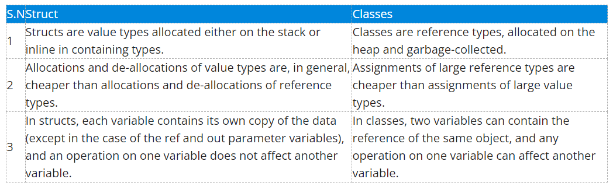

# OOP Basics with C# questions

## .NET Framework

1. What is .NET?
    - a framework (=a set of tools and libraries) developed & maintained by Microsoft
    - Besides the libraries that support these use cases, the platform also includes:
        - **.NET compilers (Roslyn)**
        - **Base Class Library (BCL)**
        - **Common Language Runtime (CLR)**
            - a virtual machine that handles the execution of applications
            - provides services like thread management, garbage collection, type-safety, exception handling
            - *common* refers to the support of multiple languages (C#, Visual Basic, F# -> these all run on the CLR)
                - an **IL** (Intermediate Language) is created from the code, which is a compressed format
                - Then the CLR translates it into machine code during execution, using **JIT** (Just-in-Time compilation)
    - The main **strength of .NET** versus other ecosystems comes from the fact that languages and the framework are **being developed by the same entity**
    - **.NET** vs **.NET Framework**:
        - **.NET** is multi-platform, while **.NET Framework** is the original Windows only version

2. Can you describe the difference between .NET Framework and .NET Core?
    - Framework was the original, now the goal is to slowly unify the 2 (Framework now in maintenance mode only, Only Core is getting updates)
    - **.NET Framework:**
        - Designed to run mainly on Windows
        - Non-open source (developed by Microsoft only)
        
    - **.NET Core:**
        - Cross-platform (Win, Linux, MacOS)
        - Open-source
        - Optimized for **performance** and **scalability**
        - Better suited for microservices architecture (lightweight + cross-platform)
        - Supports side-by-side versioning (different versions can be run on the same machine)

3. What project types do you know in Visual Studio/Rider?
    - **JetBrains Rider:**
        - **Console Application:**
            - A basic application type that runs in a console window. It's great for simple, command-line programs in both .NET Framework and .NET Core.
        - **Class Library:**
            - Used to create reusable code that can be referenced by other applications. This is common for creating a collection of utility functions or business logic.
        - **Desktop Application:**
            - Used to create graphical desktop applications for Windows, typically utilizing Windows Presentation Foundation (WPF) or Windows Forms (WinForms) for the user interface.
        - **Unit Test Project:**
            - A project dedicated to writing and running unit tests for your code, using testing frameworks like NUnit, xUnit, or MSTest. It's essential for ensuring code quality and reliability.
        - **ASP.NET Core Web Application:**
            - For developing modern web applications and services. ASP.NET Core is a cross-platform, high-performance framework for building cloud-based, internet-connected applications such as web apps, IoT apps, and mobile backends.
    - **Visual Studio:**
        - Essentially it has the same project types, but it's for Windows apps mostly, while Rider supports multi-platform environments.

    - **VS Code:** (prev module)
        - We created projects using the MERN stack:
            - Backend using Node.js and Express.js
            - Frontend with React
            - Database integration with MongoDB
            - The whole app developed using JS to make it "full-stack"

4. What is a solution?
    - a container used to organize one or more related projects (*= a structural element in software development that helps organize and manage multiple related projects as a single unit*):
        - **Collection of Projects:** A solution can contain multiple projects (class libraries, web applications, desktop applications, etc.), that are developed and managed together.
        - **Solution File:** It is represented by a `.sln` file, which contains information about the projects included in the solution, their dependencies, and the configuration for building them.
        - **Build and Deployment:** Solutions *allow you to build and deploy all projects within it collectively*, ensuring that all dependencies between projects are correctly resolved.
        - **Shared Context:** It provides a shared context for the projects it contains, making it easier to manage settings, dependencies, and versioning across these projects.

5. What is an assembly?
    - In .NET an assembly is a **compiled code library** used for deployment, versioning, and security (*= a compiled, versionable, and secure unit that contains executable code and resources, serving as the building blocks for .NET applications and libraries*):
        - **Compiled code:**
            - compiled from source code written in .NET languages
            - saved in files with the extensions `.dll` (Dynamic Link Library) for libraries, or `.exe` (Executable) for applications
        - **Self-Describing:**
            - contains metadata called the **Assembly Manifest**, which includes details like the assembly's version, culture, and publicly exposed types and resources
        - **Versioning:**
            - Assemblies support versioning, allowing multiple versions of the same assembly to coexist and be used in different applications
        - **Deployment Unit:**
            - Assemblies are the fundamental units of deployment, version control, reuse, activation scoping, and security permissions in a .NET application.
        - **Types and Resources:**
            - An assembly can contain types (classes, structures, interfaces, enumerations, delegates), resources (images, strings, files, etc.), and executable code.

6. What is LINQ in .NET? How does it work?
    - Basics:
        - LINQ is a set of language and framework features for writing queries on collection types
        - useful for selecting, accessing, and transforming data in a dataset
        - import it with `using System.Linq;`
    - Values are stored in `var`, because the type of an executed LINQ query is not always known:
            
            var custQuery = from cust in customers
                            where cust.City == "Phoenix"
                            select new { cust.Name, cust.Phone };

    - Method & Syntax:
        - **Method syntax:** resembles most other C# method calls:

                var custQuery2 = customers.Where(cust => cust.City == "London");

        - **Query syntax:** resembles SQL syntax:

                var custQuery =  
                    from cust in customers  
                    where cust.City == "London"  
                    select cust;

7. What are some commonly used LINQ methods that you know?
    - `From` operator (only used in query syntax):
        - declares a range variable that is used to traverse the sequence

                string[] names = { "Hansel", "Gretel", "Helga", "Gus" };

                var query =
                    from n in names
                    where n.Contains("a")
                    select n;

                // Result: Hansel, Helga

    - `Where` operator:
        - used to select certain elements from a sequence:
            - It expects an expression that evaluates to a boolean value.
            - Every element satisfying the condition will be included in the resulting query.
            - It can be used in both method syntax and query syntax.

                    List<Customer> customers = new List<Customer>
                    {
                    new Customer("Bartleby", "London"),
                    new Customer("Benjamin", "Philadelphia"),
                    new Customer("Michelle", "Busan" )
                    };

                    // Query syntax
                    var custQuery =  
                        from cust in customers  
                        where cust.City == "London"  
                        select cust;

                    // Method syntax
                    var custQuery2 = customers.Where(cust => cust.City == "London");

                    // Result: Customer("Bartleby", "London")       

    - `Select` operator:
        - determines what is returned for each element in the resulting query

                string[] trees = { "Elm", "Banyon", "Rubber" };

                // Query syntax
                var treeQuery =
                    from t in trees
                    select t.ToUpper();

                // Method syntax
                var treeQuery2 = names.Select(t => t.ToUpper());

                // Result: ELM, BANYON, RUBBER
    
    - `OrderBy` & `OrderByDescending`:
        - used to sort elements in a collection based on a specified key (ascending order by default)
        - Example (sort the list of Person objects by their names):

                // Person class (see at `GroupBy`)
                // Create a List<Person> people
                
                // Now we can use `OrderBy`:
                var sortedPeople = people.OrderBy(p => p.Name);     // sorts the people list by the Name property of each Person object
                                                                    // sortedPeople returns an IEnumerable<Person>, sorted in ascending order by name
    
    - `GroupBy`
        - group elements in a collection based on a specified key
        - result of the `GroupBy` operation is a collection of groups, where each group is represented by an `IGrouping<TKey, TElement>` object
        - Example (group the persons by their department):

                // Person class:
                public class Person
                {
                    public string Name { get; set; }
                    public string Department { get; set; }

                    public Person(string name, string department)
                    {
                        Name = name;
                        Department = department;
                    }
                }

                // Now we create a list of Person instnaces (objects):
                List<Person> people = new List<Person>
                {
                    new Person("Alice", "HR"),
                    new Person("Bob", "HR"),
                    new Person("Charlie", "IT"),
                    new Person("David", "IT"),
                    new Person("Eve", "Marketing")
                };

                // Now we can group them by "Department":
                var groupedByDepartment = people.GroupBy(p => p.Department);        // will be an IEnumerable<IGrouping<string, Person>>

                // Now we can iterate over each group and its items:
                foreach (var group in groupedByDepartment)
                {
                    Console.WriteLine($"Department: {group.Key}");
                    foreach (var person in group)
                    {
                        Console.WriteLine($" - {person.Name}");
                    }
                }
        
        - `GroupBy` into personalized categories:

                List<Product> products = // ... your list of products ...

                var categorizedProducts = products.GroupBy(product =>
                {
                    if (product.Price < 20) return "Cheap";
                    if (product.Price >= 20 && product.Price < 100) return "Average";
                    return "Expensive";
                });
    
    - `Any`
        - Without any input parameters (predicate) - Check if the sequence is empty:

                List<int> numbers = new List<int> { 1, 2, 3 };
                bool hasAnyNumbers = numbers.Any(); // True, because the list is not empty
        
        - Checks if any of the elements satisfy the condition (returns true if at least 1 element satisfies the condition):

                bool hasEvenNumbers = numbers.Any(n => n % 2 == 0); // True, because there are even numbers in the list
    
    - `.ToList` & `.ToArray`
        - If the query returns with a bool value, but we still want to store the values in a variable, we need to use `.ToList` to be able to do this (eg with `Select` method):

                List<int> numbers = new List<int> { 1, 2, 3, 4 };
                var squaredNumbers = numbers.Select(number => number * number).ToList();            // squaredNumbers will be { 1, 4, 9, 16 }
    
    - We can also use `List` operations, if we create a `var` for the return query:

                var query = names.Where(n => n.Contains("a"));      // This will be a List or Array, so we can use list operations, like "Count()";

                query.Count();
                foreach(var item in query){};

8. Which .NET class would you use if you need to generate random numbers? Explain its usage briefly.
    - `System.Random` class
    - Process:
        1. Create an instance:

                Random rnd = new Random();
        
        2. Use the `Next()` method to generate a random integer:

                rnd.Next()                          // generates a non-negative random integer
                rnd.Next(maxValue)                  // generates a non-negative random integer less than maxValue
                rnd.Next(minValue, maxValue)        // generates a random integer within a specified range

                // To create random doubles:
                rnd.NextDouble()                    // generate a random double number between 0.0 and 1.0.
        
    - Reproducibility:
        - If you initialize `Random` with a specific seed value (e.g., `new Random(123)`), it will produce the same sequence of random numbers on each run, which can be **useful for reproducibility in tests or simulations**.
    
    - Example:

            Random rnd = new Random();
            int randomInt = rnd.Next(1, 100);           // generates a random integer between 1 and 99
            double randomDouble = rnd.NextDouble();     // generates a random double between 0.0 and 1.0
    
    - **Thread Safety:**
        - The Random class is not thread-safe. If used in a multithreaded environment, it's essential to ensure thread safety, typically using thread-local storage.

9. Which .NET classes are used to read and write files in C#?
    - `System.IO.File`: 
        - provides static methods to create, delete, copy and move files
        - open a file for reading or writing
        - perform a single action on a file without keeping it open
    - `System.IO.StreamReader` and `System.IO.StreamWriter`
        - Used for reading/writing text from/to a file
        - Used for larger files, because they read/write data in a buffered manner (line-by-line)
    - +3:
        - `System.IO.FileStream`: write to any location in a file
        - `System.IO.BinaryReader/Writer`: read/write data as binary values (eg. image files)
        - `System.IO.MemoryStream`: used to store data temporarily as bytes

    - Example:

            // Write:
            using (StreamWriter writer = new StreamWriter("example.txt"))
            {
                writer.WriteLine("Hello, world!");
            }

            // Read:
            using (StreamReader reader = new StreamReader("example.txt"))
            {
                string line = reader.ReadLine();
                Console.WriteLine(line);
            }

            // Example logger:

                    private void LogMessage(string message, string type)
                    {
                        var entry = $"[{DateTime.Now}] {type}: {message}";
                        using var streamWriter = File.AppendText(_logFile);     // we add "using" within the method here!
                        streamWriter.WriteLine(entry);
                    }

10. Which .NET type is used for working with dates? Describe some of the functions related to this type.
    - `System.DateTime` in .NET
    - Creating instances:

            DateTime now = DateTime.Now;                                            // Current date and time
            DateTime today = DateTime.Today;                                        // Current date with time set to midnight
            DateTime specificDate = new DateTime(2024, 1, 18);                      // Specific date (year, month, day)
            DateTime specificDateTime = new DateTime(2024, 1, 18, 14, 30, 0);       // Specific date and time (year, month, day, hour, minute, second)

    - Properties  
        - Year, Month, Day, Hour, Minute, Second - Get individual components. (eg. today.Year -> 2024)
        - DayOfWeek - Day of the week (e.g., DayOfWeek.Monday).
        - DayOfYear - Day of the year (1-366).

    - Methods:
        - Adding/Subtracting Time:
            - `AddDays`, `AddMonths`, `AddYears`, `AddHours`, `AddMinutes`, `AddSeconds` - Add time to a DateTime instance:

                    date.AddDays(5);        // Adds 5 days

            - Subtracting is done by adding a negative amount:
                    
                    date.AddDays(-5)        // Subtracts 5 days
        
        - Comparison:
            - Compare two DateTime objects using `DateTime.Compare()`:
                        
                    DateTime date1 = new DateTime(2024, 1, 18);
                    DateTime date2 = new DateTime(2024, 1, 20);

                    int result = DateTime.Compare(date1, date2);    // Returns an integer(-1, 0, 1), so we can determine if it's the same/earlier/after

                    if (result < 0)
                        Console.WriteLine("date1 is earlier than date2");
                    else if (result == 0)
                        Console.WriteLine("date1 is the same as date2");
                    else
                        Console.WriteLine("date1 is later than date2");

            - `Equals` & `CompareTo`                                // Instance methods for comparison

                    // Equals:
                    date1.Equals(date2)                             // Returns bool value
                    
                    // CompareTo (same as Compare, but diff. syntax)
                    date1.CompareTo(date2)                          // Returns an integer(-1, 0, 1)
        
        - Formatting:

                date.ToString()                                     // Convert to a string with default format
                date.ToString("yyyy-MM-dd")                         // Custom format (e.g., "2024-01-18")
        
        - Parsing and Converting

                DateTime.Parse(string)                              // Converts a string to a DateTime
                DateTime.TryParse(string, out DateTime result)      // Tries to parse a string, returns true if successful
        
        - Using `Timespan`:
            - Represents the duration between 2 dates:

                    TimeSpan duration = endDate - startDate;
            
            - Properties/Components of TimeSpan:
                - `Days`, `Hours`, `Minutes`, `Seconds`:

                        DateTime start = new DateTime(2024, 1, 1);
                        DateTime end = new DateTime(2024, 1, 18);
                        TimeSpan duration = end - start;

                        Console.WriteLine($"Duration is {duration.Days} days");     // use properties to specify the time unit
            
            - Create a TimeSpan:
                    
                    new TimeSpan(1, 0, 0)       // it represents 1 hour (2nd par is min, 3rd is sec)
                    TimeSpan.FromDays(1)        // represents 1 day
                    TimeSpan.FromSeconds(30)    // represents 30 seconds

                    interval.TotalHours         // gives you the TOTAL number of hours represented by the TimeSpan (eg. 1.5 h)
                    interval.Hours              // gives you the WHOLE number of hours represented by the TimeSpan (eg. 1 h)

            - Example:

                    DateTime now = DateTime.Now;
                    DateTime inOneWeek = now.AddDays(7);
                    DateTime startOfMonth = new DateTime(now.Year, now.Month, 1);
                    TimeSpan duration = inOneWeek - startOfMonth;

11. Which .NET class can be used for measuring time?
    - **Timespan:** Represents the duration between 2 dates (see previous point)
    - `System.Diagnostics.Stopwatch`: Used to measure time:
        - Process:
            1. Create an instance:
            
                    Stopwatch stopwatch = new Stopwatch();
            
            2. Start/Stop the stopwatch:

                    stopwatch.Start();
                    stopwatch.Stop();

                    // Then you can continue measuring, if you start again:
                    stopwatch.Start();

            3. Get elapsed time:
                - `Elapsed` returns a `TimeSpan` object:
                    - `ElapsedMilliseconds`: returns milliseconds as `long`
                    - `ElapsedTicks`: returns the total number of ticks (1 tick = 100 nanoseconds = )
                    - Example:

                            Console.WriteLine($"Time elapsed: {stopwatch.ElapsedMilliseconds} ms.");
                            
            4. Reset stopwatch:

                    // Reset to 0:
                    stopwatch.Reset();

                    // Reset to 0 and start immediately:
                    stopwatch.Restart();

12. What is NuGet?
    - **NuGet** is a package manager for .NET (similar to npm in VSCode)
    - What it does:
        - NuGet manages libraries and tools in your .NET projects
        - connects to an online repository of packages (nuget.org) where developers can publish their libraries or tools
        - handles dependencies and their versions: when you add a package, it automatically downloads and references it in your project, along with any dependencies that the package requires
        - manage packages through a user interface or a command line interface
        - can restore packages automatically when you build a project (ensures that all necessary packages are downloaded, when you work on a team project)

13. What is the `IEnumerable` interface?
    - `IEnumerable` interface (within `System.Collections` namespace):
        - provides a single unified access to any built-in collection in C# (so you can use it with any type of collection)
        - defines a standard way to iterate over a collection of items
        - perform operations such as filtering, sorting, and mapping
        
        - It has 2 versions:
            - **Non-generic IEnumerable:** represents a sequence of objects (no specific type)
            - **Generic IEnumerable:** represents a sequence of objects of a specific type (allows you to work with the `Type` rather than an `object`, which is much more flexible).

        - How it works (eg. when we use LINQ or a foreach loop, we implicitly use `IEnumerable` and `IEnumerator` interfaces):
            - `IEnumerable` interface -> has a single method `GetEnumerator()` -> returns an `IEnumerator` object -> uses it to iterate through the collection
            - `IEnumerator` object (instance) -> has 2 members:
                - `MoveNext()`: moves the iterator to the next item in the collection and returns a bool value indicating whether there are more items to be traversed.
                - `Current`: returns the current item in the collection 

                        List<int> numbers = new List<int> {1,2,3,4,5}; // List<T> implements `IEnumerable`

                        foreach (int number in numbers) // The compiler calls the `GetEnumerator` method 
                        {
                            Console.WriteLine(number);
                        }

        - **Best practices:**
            - `IEnumerable` in method parameters:
                - generally a good idea to have the input parameter as `IEnumerable` (unless you need more specific properties)
                - this method supports polymorphism (you can pass an Array or List or anything else that implements `IEnumerable` -> broad usage)

                        public void PrintNumbers(IEnumerable<int> numbers)
                        {
                            foreach (int number in numbers)
                            {
                                Console.WriteLine(number);
                            }
                        }
                
            - Return type:
                - Generally you want to be more specific
                - But for example if the return value is for an API, you are better off with `IEnumerable`, as you don't know the exact usage
                - `yield return`:
                    - used in context of an iterator (return a sequence of values, one at a time):

                            public IEnumerable<int> GenerateEvenNumbers(int count)
                            {
                                int i = 0;
                                while (i < count)
                                {
                                    yield return i * 2;     // This MUST be an IEnumerable type!
                                    i++;
                                }
                            }

14. What does the term _deferred execution_ mean? How does it relate to `IEnumerable` and LINQ?
- It means that the actual execution of an operation gets delayed until it's actually needed.
- `IEnumerable` interface works like this:
    - the execution of the code happens when it's itarating, withing the foreach loop.
    - instead of loading all the items from the collection, it gets the items 1 by 1, using `IEnumerator`'s `MoveNext()` method
- Connection to LINQ:
    - most operators in LINQ also use "deferred execution", eg:
        - `Select`
        - `Where`
        - `OrderBy`
    - some others are forcing immediate execution:
        - `ToList()`
        - `ToArray()`
        - `Count()`
        - `Max()`

15. Describe some collection types you know.
- In general, Collections belong to the `System.Collections` or `System.Collections.Generic` namespace, and can be of different types
- There's **generic** and **non-generic** collections, meaning they specify the type they contain or not
- **Lists:** 
    - `List<T>`
    - Create a **list**:

            var names = new List<string> { "Juan", "Ana", "Felipe" };       // A "List" of "<string>"s
- **Dictionaries:**
    - `Dictionary<TKey, TValue>`: A collection of key-value pairs.
- **HashSet:**
    - `HashSet<T>`: A set of unique elements.
- **Queue & Stack:**
    - `Queue<T>`:
        - follows the First-In-First-Out (FIFO) principle
            - The **first item added** to the queue is the **first one to be removed**
        - Examples:

                Queue<string> queue = new Queue<string>();
                queue.Enqueue("Apple");
                queue.Enqueue("Banana");
                queue.Enqueue("Cherry");

                string first = queue.Dequeue();  // Removes and returns "Apple"
                string next = queue.Peek();      // Returns "Banana" without removing it

    - `Stack<T>`:  
        - follows the Last-In-First-Out (LIFO) principle:
            - The **last item added** to the stack is the **first one to be removed**
        - Examples:

                Stack<string> stack = new Stack<string>();
                stack.Push("Apple");
                stack.Push("Banana");
                stack.Push("Cherry");

                string top = stack.Pop();  // Removes and returns "Cherry"
                string next = stack.Peek(); // Returns "Banana" without removing it

16. Why does the `System.String` type implement the `IEnumerable` interface? What are the advantages of this?
- It's implemented, so it can be treated as an iterable. We can:
    - use `foreach` to iterate through the `char` items in it
    - use indexing on the string 
    - **LINQ** methods/queries can be used with them 
    - use extension methods defined for `IEnumerable<T>` on strings as well

## Language features

17. What control statements are available in C#?
- Selection statements:
    - `if-else` statenents
    - `switch` statements
- Iteration statements / loops:
    - `for` loop
    - `foreach` loop
    - `while` loop
    - `do-while` loop
- Jump statements:
    - `break` - to break out early from loops
    - `continue` - skip the rest of the code in the current loop, but continue with the iteration
    - `return` - exit from a method/function and optionally return a value
    - `throw` - used with exception handling

18. What is the difference between a `for` loop and a `foreach` loop?
- `for` loop:
    - more control over the iterable:
        - specify iteration range/step (`i = 5`; `i += 2`)
        - refer to items relative to the current item (eg `[i+1]`)
    - Syntax:

            for (int i = 0; i < max; i++)
            {
                Collection[i]... // refer to the item in the current iteration 
            }
        
- `foreach` loop:
    - iterate through all items of an iterable (simpler, but easier to read in the code)
    - Syntax:

            foreach (var item in Collection)
            {
                item... // refer to the item in the current iteration 
            }
        
19. What is a `while` loop?
- Used to run at an unspecified number of times (while a condition is true)
- Syntax:

        int counter = 0;
        while (condition)       // eg. counter < 10
        {
            // Do something
            counter++;          // this is only needed if the condition is counter based
        }

- `do-while` - used to execute first, then check condition (so the code runs at least 1 time)

20. What does the `yield` keyword do?
- Used in the context of an `IEnumerable`:
    - return a sequence of values, one at a time:

            public IEnumerable<int> GenerateEvenNumbers(int count)
            {
                int i = 0;
                while (i < count)
                {
                    yield return i * 2;     // This MUST be an IEnumerable type!
                    i++;
                }
            }

            // The equivalent without the yield:
            public IEnumerable<int> GenerateEvenNumbers(int count)
            {
                List<int> evenNumbers = new List<int>();
                int i = 0;
                while (i < count)
                {
                    evenNumbers.Add(i * 2);
                    i++;
                }
                return evenNumbers;         // Returns a List item!
            }

21. How do you manually break out of a loop?
- Using jump statements:
    - `break` - to break out early from loops
    - `continue` - skip the rest of the code in the current loop, but continue with the iteration
    - `return` - exit from a method/function and optionally return a value
    - `throw` - used with exception handling

22. What does the `var` keyword mean?
- Used as a container of a value without specifying its type:
    - the compiler determines and assigns the most appropriate type to the variable based on the value it is initialized with
    - it must be initialized! (to be able to determine its type)
- It's specially useful when we don't know the return type we will get (eg. from an API)

23. What is the _primary constructor syntax_?
- Refers to the method that use use to instantiate your Class:

        public class MyClass
        {
            // This is the primary constructor for MyClass
            public MyClass(Type1 parameter1, Type2 parameter2, ...)
            {
                // Constructor logic here
            }
        }

- Default constructor
    - It refers to the constructor, that constructs the instance without any parameters (you don't even need to specify it, it gets generated by the compiler)

24. What is the meaning of the `params` keyword? Where would you use it?
- Used to add an array of parameters to a method or class, with a varied length:

        public void PrintNumbers(params int[] numbers)      // The numbers array can be different each time
        {
            foreach (int number in numbers)
            {
                Console.WriteLine(number);
            }
        }

        // Call it in different ways:
        PrintNumbers(1, 2, 3);                  // Pass individual arguments
        PrintNumbers(new int[] { 1, 2, 3 });    // Pass an array
        PrintNumbers();                         // Pass no arguments

- Key points:
    - `params` treats the passed arguments as an array
    - it must be the last argument

25. What are _lambda expressions_? How are they used in C# development?
- **Lambda expression:** same as an anonymous function written directly as a parameter of a method, using an `arrow operator`:

        // Traditional way:
        bool makesContact = Array.Exists(spaceRocks, HitGround);

        static bool HitGround(string s)     // We create this function to pass it as a callback
        {
            return s == "meteorite";
        }

        // Same with Lambda expression:
        bool makesContact = Array.Exists(spaceRocks, (string s) => s == "meteorite");       // The callback is created directly using the lambda expression

        // We can make it even shorter:
        bool hasEvenNumbers = Array.Exists(numbers, num => num % 2 == 0 );      // since % returns a number, the type can be omitted. Also if we only have 1 argument, we can also omit ()
- Used with:
    - higher order functions for example:

            var sortedList = myList.OrderBy(item => item.Length);

            IEnumerable<int> evenNumbers = numbers.Where(n => n % 2 == 0);      // This is how filtering is done in LINQ

    - LINQ queries:

            var evenNumbers = numbers.Where(n => n % 2 == 0);

26. What is the difference between a jagged array and a multidimensional array?
- **Multidimensional Arrays:**
    - like a grid with rows and columns, typically represented as a matrix
        - 2 types:
            - **Rectangular arrays:** These have the same number of columns in each row. They are defined with a single set of square brackets and multiple lengths separated by commas:

                    int[,] matrix = new int[3, 4];          // 3 rows and 4 columns

            - **Multidimensional arrays:** These are extensions of rectangular arrays with more than two dimensions:

                    int[,,] threeD = new int[3, 4, 5];      // 3-Dimensional array
    
    - **Charasteristics:**
        - **Structure:** A single block of memory, structured in rows, columns
        - **Memory Allocation:** Memory is allocated as a single contiguous block. This can be more efficient for large, regularly shaped arrays.
        - **Performance:** Accessing elements can be slightly slower due to the calculation needed to map the indices to the linear memory block.
        - **Flexibility:** Less flexible in terms of row sizes – all rows and columns must be the same length.
        - **Usage Scenarios:** Preferred for data that naturally forms a matrix or grid, like a chessboard.

- **Jagged Arrays:**
    - an "array of arrays" - each element is an array itself, and can be of different lengths:

            int[][] jaggedArray = new int[3][];
            jaggedArray[0] = new int[4];            // First row has 4 columns
            jaggedArray[1] = new int[5];            // Second row has 5 columns
            jaggedArray[2] = new int[3];            // Third row has 3 columns

    - **Charasteristics:**
        - **Structure:** An array where each element is a reference to another array
        - **Memory Allocation:** Memory is allocated for each row separately. This can be more efficient for unevenly sized data.
        - **Performance:** Access can be faster, especially for large arrays, as it's essentially a lookup of a reference and then an index into the second array.
        - **Flexibility:** More flexible, as each "row" can be a different length.
        - **Usage Scenarios:** Preferred when working with data of varying dimensions, like rows of data where each row has a different number of elements.

27. What is the difference between `const` and `readonly` fields in C#?
- Both used to make fields immutable, but:
    - **Initialization Timing:** const fields are initialized at compile time, while readonly fields can be initialized at runtime.
    - **Scope and Usage:** const fields are static and used for values that are true constants, like mathematical constants. readonly fields are instance-specific and can hold runtime-computed values and object references.
    - **Flexibility:** readonly is more flexible in terms of initialization and the types of values it can hold.

- `const`:
    - **Compile-time Constants:** 
        - The value of a const field is set at compile time and cannot be changed afterwards. It must be initialized with a value when it is declared.
    - **Literal Values:** 
        - const fields can only be initialized with a value that is known at compile time. This includes literals and other const fields.
    - **Static by Nature:** 
        - const fields are implicitly static, meaning they belong to the type itself, not to instances of the type.
    - **No Object Reference:** 
        - const fields cannot be used to store references to objects. They are typically used with primitive types (like int, double, string).
    
    - Example:

            public class MyClass
            {
                public const int ConstantValue = 10;
            }

- `readonly`:
    - **Run-time Constants:** 
        - The value of a readonly field is set at runtime and, once assigned, cannot be changed. It can be assigned either at the declaration or within the constructor of the class.
    - **Object References Allowed:** 
        - readonly fields can hold references to objects, and the reference cannot be changed once set. However, the object itself is not immutable.
    - **Instance-Specific:** 
        - Unlike const, readonly fields are not static unless explicitly marked as such. They are specific to an instance of the class.
    - **Flexible Initialization:** 
        - readonly fields can be initialized with values that are computed at runtime, which is not possible with const.

    - Example:

            public class MyClass
            {
                public readonly int ReadonlyValue;

                public MyClass(int value)
                {
                    ReadonlyValue = value;
                }
            }

## Type system

28. What are primitive types in C#? Give some examples.
- **Built-in types (*=primitives*):**
        - Numbers:
            - `int` - range from -2,147,483,648 to 2,147,483,648 (because it's stored on 32bits, so 2^31-1, or 4,294,967,295)
            - `short` - a 16-bit signed number, so it's range is -32,768 to 32,767
            - `long` - a 64-bit number, so the range is -9,223,372,036,854,775,808 to 9,223,372,036,854,775,807
            - `float` - A single precision floating point number
            - `double` - A double-precision floating point number (Double-precision is a relative term that describes the numbers of binary digits used to store the value)
            - `decimal` number type has a larger range as `int`, but not as big as `double`. In return, they store a lot more precision. There is also a letter `m` at the end of the number
        - Text: (implemented with an iterator, so it is possible to iterate a string like you would do with a collection)
            - `char`
            - `string` 
        - `bool`
        - `byte`

29. What is the difference between value types and reference types?
- **REFERENCE vs VALUE TYPES:** 
    - The **reason** we can store types differently is that it helps to reduce the occurrance of runtime exceptions:
        - a **value type** can never be `null` -> the will never throw a `NullReferenceException` (one of the most common exceptions in OOP languages)

    - **REFERENCE types:**
        - These **don't hold data directly**, but hold a *reference* or *pointer* to a **memory location** on the **heap**, where the actual object is stored
        - All **class types** are reference types (eg the `string` and `object` class is a reference type, but also `Arrays` and `Strings`, although the last one is special as it's immutable)
        - Declaring multiple variables that point to the same object makes it possible to modify that object through multiple variables, if it's **mutable**. 
          (if it's set to **immutable**, like strings, we can't modify them, all modifications will create a new object):

                int[] numbers1 = {1,2,3};       // "Array" is a mutable reference type, so it is possible to change its elements after it's been created
                int[] numbers2 = numbers1;      // numbers1 is a variable that contains a reference to an int[] object, which is what will be copied to numbers2 as well! (so they reference the same memory location)

                numbers2[0] = 0;
                numbers1[1] = 0;

                Console.WriteLine(String.Join(",", numbers1)); //Prints 0,0,3
                Console.WriteLine(String.Join(",", numbers2)); //Prints 0,0,3

        - Object reference:
            - we also refer to reference to a class's `superclass`:

                    // Woman inherits from Human, which inherits from Animal, and it implements IPerson:
                    class Human : Animal
                    class Woman : Human, IPerson

                    // All of these references are valid:
                    Woman eve = new Woman();
                    Human h = eve;
                    Animal a = eve;
                    IPerson p = eve;

    - **VALUE types:**
        - These **hold their data directly** and are **stored on the stack**
        - All built-in numeric types (`int`, `double`, `decimal`) and `bool`, `char`, `byte`, `enum` and even `DateTime` are value types.
        - To create a new `value` type, we need to use the `struct` keyword istead of `class` (the object reference will behave as a value type)
        - If you assign a value type variable to another, the value itself will be copied, and they both live on separately:

                int number1 = 0;
                int number2 = number1;          // number1's value gets copied as the value of number2, but they will live independently

                number1++;

                Console.WriteLine(number1); //Prints 1
                Console.WriteLine(number2); //Prints 0

    - **Using them as method parameters:**
        - When passing parameters into methods, the default behaviour is **pass by value**:
            - For **reference types** -> the reference is passed (because the reference type's value is the reference itself) -> we can make modifications to them inside the method:

                    int[] numbers = { 1, 2 };

                    PrintNumbers(numbers);      // Prints 1, 2

                    ChangeToZero(numbers);
                    PrintNumbers(numbers);      // Prints 0, 0 -> the modification was successful!

                    private void ChangeToZero(int[] arr)
                    {
                        arr[0] = 0;
                        arr[1] = 0;
                    }

                    private void PrintNumbers(int[] arr)
                    {
                        Console.WriteLine(String.Join(", ", arr));
                    }

            - For **value types** -> the actual value is passed -> we can't use it the same way:

                    int counter = 0;
            
                    Increment(counter);
                    
                    Console.WriteLine(counter);     // Prints 0, so the modification was unsuccessful (because we were trying to modify the original value)
                    
                    private static void Increment(int num)
                    {
                        num += 1;
                    }

                    // So we can modify the code with the "ref" keyword:

                    int counter = 0;
                    
                    Increment(ref counter);         // ref also needs to be specified by the caller
                    
                    Console.WriteLine(counter);     // Prints 1

                    private static void Increment(ref int num)
                    {
                        num += 1;
                    }

                    // But a more realistic scenario is to just return a value from the local method (which will be a new integer):

                    int counter = 0;

                    counter = Increment(counter);   // We assign it a new value, not try to modify the original
                    
                    Console.WriteLine(counter);     // Prints 1

                    private static int Increment(int num)
                    {
                        return num + 1;             // The returned value will be a new integer
                    }

30. What is a class in C#?
- **Definition:** 
    - A class in C# is a **blueprint** from which objects/instances are created.
    - It defines a type by **encapsulating data and behavior** (methods) that operate on the data. (**bundles data** (fields, properties) and methods (functions) together.)

31. What is a constructor?
- **Definition:**
    - A constructor is a special method in a class that is called when a new instance of the class (an object) is created.
    - Its primary purpose is to initialize the newly created object, typically by assigning values to its fields or performing any setup steps necessary for the object's initial state.
- **How they work:** (has the same name as the class and assigns the initial values to a new object created from eg. the *BankAccount* type, using `new` keyword)
    - We can by default create a class without a constructor, by assigning values to it's properties later:
            
            // Book.cs class file:
            class Book
            {
                public string title;
                public string author;
                public int releasDate;
            }

    - Create book with constructor:
            
            // Add a method to the class with it's own name as the method's name:
            class Book
            {
                public string title;
                public string author;
                public int releasDate;

                public Book(string title, string author, int releaseDate)
                {
                    this.title = title;                 // "this." can be omitted as it works without it as well
                    this.author = author;
                    this.releaseDate = releaseDate;
                }
            }

    - derived class constructor: If you want to create a derived class, you need to add a default constructor (a sub-class' constructor refers to it):

            public class BaseClass
            {
                public BaseClass(int number)
                {
                    // Initialization code for BaseClass
                }
            }

            public class DerivedClass : BaseClass
            {
                public DerivedClass(int number) : base(number)
                {
                    // Initialization code for DerivedClass
                }
            }

32. Is it possible to have multiple constructors in a class?
- Yes, with **constructor overloading:**
    - it means creating multiple constructors with the same name, which only differ in the numbers of parameters
    - the return type **MUST** be the same for all constructors!
    - the type and number of the argument(s) will determine which constructor/method will be invoked
    - This is beneficial, because we can create simple or more complex functions, based on the requirements (so we don't need to call the difficult one in all cases):
            
            public class Person
            {
                public string Name { get; set; }
                public int Age { get; set; }

                // First constructor: No parameters
                public Person()
                {
                    Name = "Unknown";
                    Age = 0;
                }

                // Second constructor: Two parameters
                public Person(string name, int age)
                {
                    Name = name;
                    Age = age;
                }
            }

33. What are properties in C#?
- **Properties** (eg `Name`, `AccountNumber` or `Owner`)
    - a property is a member of an object that controls how one field may be accessed and/or modified
    - a way to define what values are valid and disallow those that are not
    - good practice to make **fields** `private` and **properties** `public` (part of the encapsulation process)
    - A property defines two methods: 
        - a `get()` method that describes how a field can be accessed
        - a `set()` method that describes how a field can be modified

35. What is the difference between an auto-property and a property with a backing field?
    - **Properties with backing fields:**
        - We name it the same as the `field` we want to access/set value, but with a Capital letter:
                
                public class Freshman
                {
                    private string firstName;           // note lowercase naming!

                    public string FirstName             // note Capitalized naming!
                    {
                        get { return firstName; }       // No ";" after setters/getters or method definitions!
                        set { firstName = value; }
                    }
                }

    - **Auto-Implemented properties:**
        - Reads and writes to a private field, like other properties, but it does not require explicit definitions for the accessor methods nor the field
        - Used with the `{ get; set; }` syntax:

                public class HotSauce
                {
                    public string Title { get; set; }       // We could even set `set` to private like this: { get; private set; }
                    public string Origin { get; set; }
                }

34. Describe the different types of properties: read-only, init-only, and computed properties.
- **Read-only:**
    - A property that can only be read, not set (except in the constructor or initialization context).
    - It ensures that the property can't be modified with external code:

            public class Person
            {
                public readonly string Name;        // We could achieve similar effect without "readonly" keyword, only adding it a { get; }, but in this case the property would still be modifiable from within the class (eg using a method)

                public Person(string name)
                {
                    Name = name;
                }
            }

- **Init-only:**
    - allow properties to be settable at the time of object creation but immutable thereafter with the `init` accessor
    - more flexible way of read-only, because we can set the initial value at each object initialization:

            public class Person
            {
                public string Name { get; init; }
            }

            // Usage:
            var person1 = new Person { Name = "Alice" };
            var person2 = new Person { Name = "Goeorge" };

            // This won't work:
            person1.Name = "Bob"; // This line would cause a compile-time error

- **Computed properties:**
    - They don't store a value directly, but a calculation, that returns a value (based on other fields' or propery values):

            public class Rectangle
            {
                public double Width { get; set; }
                public double Height { get; set; }

                // Computed property
                public double Area
                {
                    get { return Width * Height; }
                }
            }

36. What is an enum in C#?
- **Enum:**
    - "Enumeration":
        - It's a **value type** that helps you define a group of named constants (*represent a fixed set of distinct values*)
        - Each constant in the enum representsan integral value (eg. `int`, `byte`, `long`) -> for readability these are raplaced with descriptive names
        - We use them when there is a fixed set of options we can pick from, but these are not expandable (eg. card suits, days of the week, etc.)
        - By default, the underlying type of each element in the enum is `int`, and the first enumerator has the value `0`
    - Example:
            
            // Declare an enum:
            enum DayOfWeek
            {
                Sunday,     // value = 0
                Monday,     // value = 1
                Tuesday,
                Wednesday,
                Thursday,
                Friday,
                Saturday    // value = 6
            }

            // Call its values:
            DayOfWeek today = DayOfWeek.Wednesday;  // note the type here is the name of the enum!

            if (today == DayOfWeek.Wednesday)       // we use dot notation to express a value
            {
                Console.WriteLine("It's Wednesday!");
            }

            // More operations:

            // If we have this enum:
            public enum Season
            {
                Spring,     // 0
                Summer,     // 1
                Autumn,     // 2
                Winter      // 3
            }

            // Save a specific Enum into a variable of it's own type:
            Season a = Season.Autumn;
            or
            var a = (Season)2;
            Console.WriteLine(${a})             // will print "Autumn"
            Console.WriteLine(${(int)a})        // will print "2"

            var b = (Season)1;
            Console.WriteLine(b);               // output: Summer

            var c = (Season)4;
            Console.WriteLine(c);               // output: 4 (there's no 4th item in "Season" enum)

            // Determine the length of an enum:
            int numberOfSeasons = Enum.GetNames(typeof(Season)).Length      // Get the length of "Season" enum

37. Explain the difference between a class and a struct.
- **STRUCTS:**
    - They are "light-versioned" classes:
        - They are value types and can be used to create objects that behave like built-in types (primitives like `bool` and numbers like `int` `double` etc.)
    - **Comparison / Features:**
        - Structs are value types allocated either on the stack or inline in containing types (more efficient memory use in certain scenarios), while classes are reference types
        - In structs the variables contain their own copy of the data, so changes in them won't affect the original (=built-in type behaviour)
        - A struct cannot inherit from another struct or class, and it cannot be the base of a class. (so abstract and virtual keywords can't be used)
        - Struct cannot have a default constructor (a constructor without parameters) or a destructor. They are always initialized with parameters.
        - Structs can be instantiated without using a new operator:

                public struct Point
                {
                    public int X;
                    public int Y;
                }

                // Instantiate with `new` keyword:
                Point p1 = new Point(); // X and Y are initialized to 0

                // Or without:
                Point p2;
                p2.X = 10;
                p2.Y = 20;      // pw is only fully initialized at this point

    - Comparison chart:  
    

    - Example code:
            
            struct Location
            {
                public int x, y;

                public Location(int x, int y)
                {
                    this.x = x;
                    this.y = y;
                }
            }

            class Program
            {
                static void Main(string[] args)
                {
                    Location a = new Location(20, 20);
                    Location b = a;
                    a.x = 100;      // as they are value types, this change only affects a

                    // Print the value of b.x
                    Console.WriteLine(b.x);

                    // Output: 20
                }
            }

38. Explain the difference between a class and a record.
- **RECORDS:
    - **Definition:**
        - an immutable data type with value-based equality (=a class that you don't want to change later)
        - it's a reference type by default, just like a class 
    - **Comparison / Features:**
        - Concise syntax for creating a reference type with **immutable** properties.
        - **Value-based equality:** 
            - Two variables of a record type are equal if they have the **same type**, and if, **for every field, the values in both records are equal**. 
            - Classes use **reference equality:** two variables of a class type are equal if they refer to the same object.
        - You can add methods, properties and other members to a records just as you would to a class. You can even add mutable properties
        - You can also add the `record` modifier to a `class` or a `struct` (`record class` or `record struct`)
            - `record class` support inheritance (reference type) -> this is the default, when not specifying
            - `record struct` doesn't support inheritance (value type)

39. What are interfaces? Why should we use them?
- **Overview:**
    - **Definition:** An interface is a contract that defines how different parts of a program communicate with each other (it defines the main public controls of a class, without specifying them - this is later done when a class implements them)
    - It is an **abstract type** in C# that defines a **contract**:
        - Any class or struct that implements an interface must provide an implementation of the members defined in the interface. (that's why ISP is important, to only use the interfaces we need)
    - The interface is then used to facilitate communication between objects.
    - Instead of using a reference of a concrete type, the objects talk to each other via this interface.
    - This will lead `Components` to depend on **abstractions** rather than **implementations*
        - They can have default implementations, but the usual case for them is to only define the method signatures, and leave the actual implementation to classes that implement the interface.
        - They don't have any constructors, as interfaces are abstract types - they cannot be instantiated.
    - We should rather have many smaller, more specific interfaces, as opposed to one huge interface with many operations. (very similar to SRP!)
        - But it doesn't mean that each interface should only have 1 method, but that the methods should be related to the same functionality
    
    - contains definitions for a group of related functionalities that a class can implement:
        - The Interface defines all the members that the class that implements it has (similar to a virtual method in a baseclass)
        - The implementing class defines how these members should behave (similar to an override of a virtual method) 
        - An interface can contain methods and properties, but they can not declare instance data such as fields, auto-implemented properties, or property-like events. 
    - Create one by using `interface` keyword, and naming should be something like `ICardGenerator`:

            public interface ICardGenerator
            {
                List<Card> Generate(int[] numbers, string[] symbols, string[] suits);
            }

- **Benefits:**
    - they guarantee how a class behaves and helps organize and modularize components of software
    - You can inherit multiple intefaces (but only one class!)
    - extra security

- **Example:**

        // The ICar interface has three properties. Any class that implements this interface must have these three properties:
        interface ICar
        {
            string LicensePlate { get; }
            double Speed { get; }
            int Wheels { get; }
        }

        // The IAccount interface has three methods to implement:
        public interface IAccount
        {
            void PayInFunds ( decimal amount );
            bool WithdrawFunds ( decimal amount );
            decimal GetBalance ();
        }

        // Implementation:
        public class CustomerAccount : IAccount, IAutomobile
        {
            public void PayInFunds ( decimal amount )       // These will also become public!
            {
                // Implementation happens inside the Class
            }
            public bool WithdrawFunds ( decimal amount );
            {
                // Implementation happens inside the Class
            }
            public decimal GetBalance ();
            {
                // Implementation happens inside the Class
            }

            // If multiple interfaces are implemented, you should also implements all the members from that one!
        }

40. What is inheritance?
- It's a concept/behaviour used to organize your classes and create class hierarchies:
    - We use it when we have a class with some functionality, and we need another class which is very similar but has some additional or slightly different behaviour (eg car -> electric car)
    - Classes (but not structs!) can "inherit"
    - Classes can inherit attributes (**properties**) and behaviour (**methods**) from other classes:
        - A class derived from a **Base class** will automatically get all the `public`, `protected` and `internal` members of the base class, **except its constructors and finalizers** (so `private` members are excluded!)
    - The class which inherits is called a *subclass*, *derived class*, or *child class* and the class from which we are inheriting is called the *superclass*, *base class* or *parent class* (in C# there can be only one base class!)
    - Abstract class: one or more of their methods have no implementation -> the derived class will provide the missing implementation
    - Sealed class: A class that doesn't allow inheriting
        
    - The **Object** base class:
        - It's a special built-in class located in `System` namespace
        - It's the base class of any new class created, so these 2 are equivalent:
                
                public class Card 
                {
                    //...
                }

                public class Card : Object      // The ":" means the class in inheriting from "Object" class (but it's unnecessary, as this is the default)
                {
                    //...
                }

57. What is casting?
- In general:
    - Upcasting and downcasting are part of the polymorphism behaviour in OOP. 
    - **Upcasting** is straightforward and safe, allowing a derived class to be treated as its base class.
    - **Downcasting** is more risky, as it involves treating a general type as a more specific type

- **upcasting:** creating an inherited superclass/baseclass or implemented interface reference from a subclass reference (safe):

        Dog dog = new Dog();
        IAnimal animal = dog;       // We create "animal" from another Class's instance (a dog can be an IAnimal type, but an animal can't be a Dog type!)

- **downcasting:** creating a subclass reference from a superclass or interface reference (unsafe, as the object needs to be an instance of the base class we are casting into)
        
        Dog dog = new Dog();
        Animal animal = dog;
        Dog puppy = (Dog)animal;       // "Dog" type correctly

        // can lead to runtime errors if the superclass cannot be cast to the specified subclass:
        
        // Dog inherits from Pet. An implicit downcast throws a compile-time error:
        Animal animal = new Animal();
        Dog dog = animal;

        // Every downcast must be explicit, using the cast operator, like (TYPE). This fixes the compile-time error but raises a new runtime error.
        Animal animal = new Animal();
        Dog dog = (Animal)animal;         // "Animal" type instead of "Dog", so it won't work

58. What is difference between `is` and `as` operators in C#?"
- They are used for safe downcasting:
    - Using `is` operator: Checks if the object can be downcast to a specified type:

            if (animal is Dog)
            {
                Dog dog = (Dog)animal;
                // Use dog
            }

    - Using `as` operator: Tries to downcast and returns null if the downcasting is not possible.

            Dog dog = animal as Dog;
            if (dog != null)
            {
                // Use dog
            }

41. Is multiple inheritance allowed in C#?
- A class can only inherit from 1 other class, but from multiple interfaces (a way to achieve polymorphism and reuse code from different sources):

        // Create interfaces:
        public interface IFlyable
        {
            void Fly();
        }

        public interface ISwimmable
        {
            void Swim();
        }

        // Implement multiple interfaces:
        public class Duck : IFlyable, ISwimmable
        {
            public void Fly()
            {
                Console.WriteLine("The duck is flying.");
            }

            public void Swim()
            {
                Console.WriteLine("The duck is swimming.");
            }
        }

- The reason why inheriting from only 1 class is allowed is the so called "diamond problem" where a class inherits from two classes that have a common base class, which could lead to conflicts in the code.
- **Multi-level inheritance** is fully supported on the other hand (baseclass -> another baseclass -> subclass, eg: `Animal` -> `Bird` -> `Duck`)

42. What is a `static` class?
- A static class is a special type of class that cannot be instantiated (=you cannot create objects of a static class)
    - can't have constructors (because they can#t be instantiated)
    - all its members should also be static
        - it is used to hold static members, which belong to the class itself rather than to any specific object
    - most commonly used as utility functions ot to define extension methods. Example of a utility function:

            public static class MathUtilities
            {
                public static double Add(double a, double b)
                {
                    return a + b;
                }

                public static double Subtract(double a, double b)
                {
                    return a - b;
                }

                // Other mathematical utility methods
            }

            // Use:
            double result = MathUtilities.Add(10, 5); // Calling a static method

43. What are the dangers of using static classes? How can we avoid them?
- Static classes hold state that is **global** and shared across the entire application, which can lead to unintended side effects
- **Unit testing:**
    - Static classes can make unit testing difficult, since they cannot be instantiated and do not implement interfaces (you cannot easily mock their behavior)
    - This can lead to tests that are hard to write and maintain, and that might not accurately represent the application's real-world behavior
- Static classes create **tight coupling** in your code:
    - Since static methods are called directly on the class itself, it's hard to substitute them with alternative implementations 
- **Large memory usage:**
    - The data in static classes remains for the lifetime of the application, which can lead to increased memory usage

- When to use:
    - Use static classes primarily for stateless **utility functions** that don't store data or have side effects
    - Use them for extension methods

- How to avoid:
    - Use **dependency injection** (provade instance of classes)
    - Use **interfaces** as another alternative
    - If there is only 1 instance of a class needed, we could apply the `Singleton` pattern

44. What are _extension methods_?
- **Extension method:**
    - An **extension method** is a language feature in C#, that lets you add functionality to a class, struct, enum, interface, or a record without modifying its original source code. We use a static class for this.
    - Example:
        - A Method created to determine if a Date is between 2 other dates:

                public bool IsBetween(DateTime input, DateTime start, DateTime end)
                {
                    return (input > start && input < end);
                }

        - if you need this method to be widely available in different parts of the application, you could make it `static` to keep it in the `static class` (*=utility class*):

                public static class DateTimeUtils                                                       // the method is added to a static class
                {
                    public static bool IsBetween(this DateTime input, DateTime start, DateTime end)     // static keyword was added to the method definition as well
                    {                                                                                   // we add "this" keyword to the first parameter, so now we can call it from the inctance as well
                        return (input > start && input < end);
                    }
                }
        
        - Now we can invoke it using the instance of the class:
                
                var input = DateTime.Now;
                var start = DateTime.Now.AddYears(-1);
                var end = DateTime.Now.AddYears(1);

                var isBetween = input.IsBetween(start, end);        // We are calling it now on "input", not on "DateTimeUtils"

45. What does the `virtual` keyword mean in C#?
- Used with **dynamic polymorphism**
- `virtual` keyword indicates a method in the *base class*, that the *derived class* can overwrite (you can only change the content, not the signature or the return type!):
    - If a *base class* has a `virtual` method, it means it will check first if the *derived class* we are pointing to or referencing has that method, and implement that instead. If it doesn't, it will use the definition in the *base class*
    
    - These are the methods in `Object` class, that we can consider overwriting, when creating a derived class:
        - `Equals`: By default, equlaity is checked by reference, but we can override this to check for its attributes
        - `GetHashCode`: used when the object is placed in a hash map like collection, for example the `Dictionary`
        - `ToString`
        - (`Finalize`)

    - How to use it:
        - Parent class:

                public virtual void Method()
                {
                    // CODE
                }

        - Derived class:

                public override void Method()
                {
                    // NEW CODE
                }

46. What is _overloading_ in C#?
- Used with **static polymorphism**
- **Overloading:**
    - it means creating multiple elements with the same name, which only differ in the numbers and type of parameters provided as the input
    - the return type **MUST** be the same for all members/methods!
    - This is beneficial, because we can create simple or more complex functions, based on the requirements (so we don't need to call the difficult one in all cases):
            
            // For example, we can add a single string parameter, or an array of strings as a parameter:
            private static void PrintMessage(string message)
            {
                Console.WriteLine(message); 
            }

            private static void PrintMessage(string[] messages)
            {
                foreach (string message in messages)
                {
                    Console.WriteLine(message);
                }
            }

            // In this case, the type of the argument will determine which method will be invoked
    
    - Constructor overloading was discussed earlier!

55. What does the `abstract` keyword mean in C#? (see below)
56. What is an `abstract` class?	
- Used with **dynamic polymorphism** & OCP (Open-Closed principle)
- `abstract` keyword (modifier) describes an incomple Class/method, that the subclass needs to complete it on implementation:
    - Use the `abstract` modifier in a class declaration to indicate that *a class is intended only to be a base class* of other classes, not instantiated on its own.
    - The complete implementation of an `abstract` member must be marked with `override`:

            abstract class Shape
            {
                public abstract int GetArea();
            }

            class Square : Shape
            {
                int side;
                public Square(int n) => side = n;

                // GetArea method is required to avoid a compile-time error.
                public override int GetArea() => side * side;
            }
    
    - **Class** -> can't be instantiated
    - **Method** -> a function without a body (`abstract` MUST be overwritten in subclass! // vs. // `virtual` -> CAN be overwritten)

47. What are nullable value types?
- **nullable value types** are an extension of the basic value types that allow the value types to represent the **normal range of values for their type**, plus an additional `null` value
- This is needed, because **value types** such as `int`, `double`, `bool`, etc., cannot be `null` (they always have a `default` value)
- Thet are represented with a `?` mark at the end of their type:
    - **Regular Value Type:**       int i = 0;      // Cannot be `null`
    - **Nullable Value Type:**      int? i = null;  // Can be `null`
- How to use them:
    - You can check if it has a value using `HasValue` and access the value using `Value`:

            int? nullableInt = null;

            if (nullableInt.HasValue)
            {
                Console.WriteLine("Has Value: " + nullableInt.Value);
            }
            else
            {
                Console.WriteLine("Does not have a value."); // This will be executed.
            }
- **Null-Coalescing Operator** `??`
    - used with nullable types, in order to specify a `default value` to be used when a **nullable type** is `null`:

            int? nullableInt = null;
            int nonNullableInt = nullableInt ?? 0; // nonNullableInt will be 0

48. What is the `IDisposable` interface used for?
- The `IDisposable` interface in C# is used for implementing the `Dispose` pattern:
    - This pattern is all about providing a mechanism for **releasing unmanaged resources** held by an object, such as **file streams**, **database connections**, or resources allocated directly from the operating system:
        - Classes in the `Microsoft.Data.Sqlite` namespaces, such as `SqliteConnection` or `SqliteCommand` implement the `IDisposable` interface
- The primary purpose of `IDisposable` is to free unmanaged resources that are not handled by the garbage collector in .NET (prevent resource leaks in applications)
- **How it works:**
    - The `IDisposable` interface declares a single method: void `Dispose()`
    - You can put them in a `using` block or statement, and the `Dispose` method is automatically called on them when they go out of scope:

            using (var resourceHolder = new ResourceHolder())
            {
                // Use the resource
            }
            // Dispose is automatically called when exiting the using block

    - When an object implements `IDisposable`, it is indicating that it **holds resources that need explicit cleanup**
        - The `Dispose` method contains calls that free up used resources, for example in the case of `SqliteConnection` it calls the `Close` method to close the connection properly.
    - If a class implements `IDisposable`, always make sure to call `Dispose` or use them through a `using` block.

49. What does the `using` keyword do? When would you use it? (see below)
50. What is the difference between a using block and a using statement?
- `using` as a Directive:
    - used at the beginning of a C# file to import namespaces, eg.: `using System;`
        - lets youuse these namespaces directly, without typing the whole "route" before calling a resource
- `using` as a Statement:
    - The `using` statement is used to **define a scope at the end of which an object will be disposed automatically**
    - a key practice in resource management and avoiding resource leaks in .NET applications

            using (var streamReader = new StreamReader("file.txt"))     // StreamReader implements `IDisposable`
            {
                // Use streamReader here
            }
            // streamReader is automatically disposed here, even if an exception is thrown. (= streamReader.Dispose() method is called)
    - **When to use it?**
        - Particularly useful for **managing the lifecycle** of objects that implement the `IDisposable` interface, such as **file streams**, **database connections**, etc.
        - When working with resources that need explicit cleanup (files, network connections, or database connections).
        - To ensure resources are disposed of properly, even in the case of an error or exception.

51. How is it possible to use functions as objects in C#? (see below)
52. What is a `delegate`? (see below)
53. Describe the `Func<TResult>` delegate. (see below)
54. Describe the `Action` delegate. 
- **Functions as objects:**
    - functions can be treated as objects by using `delegates`, `lambda expressions`, and the `Func<>` and `Action<>` delegate types (in support of functional programming)
        - `delegate`: 
            - a type that represents references to methods
            -  delegate instance can refer to any method that **matches its signature**:

                    public delegate void DisplayMessage(string message);        // We create a delegate

                    public class Program
                    {
                        public static void ShowMessage(string message)          // This is the method/function we will be using as an object
                        {
                            Console.WriteLine(message);
                        }

                        static void Main(string[] args)
                        {
                            DisplayMessage messageDelegate = ShowMessage;       // We create an instance of the delegate we defined previously by adding "ShowMessage" as its reference
                            messageDelegate("Hello, World!");                   // Calls ShowMessage
                        }
                    }
        - `Func<TResult>`:
            - a built-in generic `delgate` type, used for methods that **return a value**:

                    Func<int, int, int> add = (x, y) => x + y;      // param1 & param2 are the parameter types, the last is the return type (we are also using a lambda expression!)
                    int result = add(5, 10);
            
            - We can use it to pass functions as parameters to other functions, or to return functions from other functions:

                    // Pass Func<> as a param: (higher order functions)
                    public void ExecuteOperation(Func<int, int, int> operation, int a, int b)
                    {
                        var result = operation(a, b);
                        Console.WriteLine(result);
                    }

                    ExecuteOperation((x, y) => x + y, 5, 10); // Passes a lambda function

                    // Return a Func<>:
                    public Func<int, int> GetMultiplier(int factor)
                    {
                        return x => x * factor;
                    }

                    var multiplier = GetMultiplier(5);
                    Console.WriteLine(multiplier(3)); // Outputs 15

        - `Action`:
            - a built-in generic `delgate` type, used for methods that **return void**

                    Action<string> greet = name => Console.WriteLine("Hello, " + name);     // Here we only use 1 param for the input, because there is no return type
                    greet("Alice");

## Architecture

59. Explain the Single Responsibility Principle.
- **The Single Responsibility Principle (SRP)**
        - **Summary:**  
            - Every class and method inside should only do 1 thing
            - Organize your code by functionality (Model, Service, UI, Utils)
            - *Inheritance* vs. *Composition* principles
        - **Definition:**
            - A class or method should have only one reason to change, meaning it should have only one job or responsibility.
        - **Example:** 
            - A `User` class handles user `properties` but delegates logging user `activities` to a separate *UserActivityLogger* class.

60. Explain the Interface Segregation Principle.
- **The Interface Segregation Principle (ISP):**
        - **Summary:**
            - use interfaces for classes whenever possible, but only implement what is really used by the class (avoid forcing the implementation of unused methods!)
            - Subdivide interfaces by functionality if you implement them into multiple different classes
        - **Definition:** 
            - Clients (eg. a class) should not be forced to depend on methods it does not use (means shouldn't implement methods, that are not used by the class)
        - **Example:** 
            - Instead of one large `IWorker` interface with methods like `Work`, `Eat`, and `Rest`, have separate interfaces like `IWork`, `IEat`, and `IRest`, and implement them as needed in *different worker classes*.

61. What is _composition over inheritance_?
- **Composition vs Inheritance:**
    - When deciding between **composition** and **inheritance**, you can use the following paradigm:
        - If the relationship between the classes/objects can be described with the term **'is a(n)'**, it's probably an **inheritance**. 
            - Eg. a car **is a** vehicle: **Base class** is `Car` and **Sub-class** is `ElectricCar`
        - If the relationship between the classes/objects can be described with the term **'has a(n)'**, it's a **composition**.
            - Eg. a car **has an** engine: `Car` class will have a **Property** called `Engine`

62. What is a model class? (see below)
63. What is a service class?
- **Organize data in a layered Architecture**
    - **Model/Data Layer:** 
        - Includes classes that represent **data** (like `Product`, `Order`) and **data access logic** (like `ProductRepository`).
    - **Service/Business Layer:**
        - Includes classes that process data, perform calculations, and create rules for the application's functionality (like `OrderService`).
    - **Presentation/UI Layer:**
        - Includes classes that handle **user interaction** and **display data**. It could be a web UI, desktop application, or even a console application in C#.

64. Explain the Open/Closed principle.
- **The Open/Closed Principle (OCP)**
        - **Summary:**
            - We create `base-classes` for the classes we would need to update later, so instead of modifying a class, we leave the `base-class` untouched and we only create a new `sub-class` that uses it
        - **Definition:** 
            - Software entities (classes, modules, functions, etc.) should be open for extension, but closed for modification.
        - **Example:** 
            - We have a class, that can calculates the area of a rectangle. If we later introduce other shapes as well, the AreaCalculator should still be able to work (so we create a `Shape` base `abstract`(!) class with `abstract` Calculation method, and each shape will have their own sub-class, with the Calculation method being `overwritten` for each shape)

65. Explain the Liskov Substitution Principle.
- **The Liskov Substitution Principle (LSP)**
        - **Summary:**
            - Whenever we create a model of something, we should see what else will we groping it with and create a baseclass for it first (eg. `Shape` -> `Circle`, `Rectangle`; `Animal` -> `Cow`, `Dog`, `Cat`) 
            - You learn how to drive a `Car`, not how to drive a `Ford`. This is the principle's main purpose
        - **Definition:** 
            - objects of a superclass/baseclass should be replaceable with objects of its subclasses without affecting the flow of the program (eg. when we make a `List<IAnimal>`, we should be able to add any class that was based upon this (eg. `ICow`, `IDog`, `ICat`))
        - **Example:**  
            - If `Bird` is a base class and `Duck` is a subclass, then you should be able to replace `Bird` with `Duck` without altering the program's behavior, assuming they share behaviors like `fly()`.
            - You learn how to drive a `Car`, not how to drive a `Ford` - this is the principle you should remember
    
66. Explain the Dependency Inversion Principle.
- **The Dependency Inversion Principle (DIP)**
        - **Summary:**
            - Dependencies of a class should be instances of interfaces, and should be created in the Program class. (this means passing the control to the Program class or later an external IoC container or framework)
            - The dependencies should be added to their constuctors (constructor injection)        
        - **Definition:**
            - the principle of having high-level modules, low-level modules and details depend on abstractions rather than on concrete implementations (through the use of interfaces)
            - Consists of 2 sub elements:
                - **Inversion of Control (IOC)**: transfering the control of an object/instance to the program/container
                - **Dependency Injection (DI)**: a technique that helps to achieve IoC, by adding dependencies to a class's constuctor (when we instantiate, we pass an instnace of the dependency as well!)
        - **Example:** 
            - A `PaymentProcessor` class depends on an `IPaymentGateway` interface rather than a concrete `CreditCardPaymentGateway` class, allowing for different payment methods to be introduced without changing the `PaymentProcessor`'s code.
            - A `NotificationManager` class depends on an `INotificationService` interface rather than a concrete `EmailNotificationService` class, allowing for different message types to be introduced without changing the `NotificationManager`'s code. (see example in details)

67. What do we mean by the Gang of Four (GoF) Design Patterns? Can you name some of these patterns?
- **The Gang of Four:**
    - refers to the four **authors** of the influential book *"Design Patterns: Elements of Reusable Object-Oriented Software"*, published in 1994
        - Erich Gamma, Richard Helm, Ralph Johnson, and John Vlissides
    - The book collects and organizes design patterns into sub-categories:
        - **Cretional Patterns:**
            - Deal with object creation mechanisms, by controlling object creation
            - The patterns:
                - **The Singleton**
                - **The Factory** and **Abstract Factory**
                - **The Builder**
                - **The Prototype**
        - **Structural Patterns:**
            - These patterns are about class and object **composition**, by using interfaces and focusing on composiong objects to form larger structures
            - The patterns:
                - **The Adapter**
                - **The Composite**
                - **The Proxy**
                - **The Flyweight**
                - **The Facade**
                - **The Bridge**
                - **The Decorator**
        - **Behavioural Patterns:**
            - These are about the algorithms and the assignment of responsibilities between objects (describe patterns of objects AND the communication between them)
            - The patterns:
                - **The Observer**
                - **The Strategy**
                - **The Command**
                - **The Iterator**
                - **The State**
                - **The Visitor**
                - **The Mediator**
                - **The Memento**
                - **The Interpreter**
                - **The Template Method**
                - **The Chain of Responsibility**

68. What are the risks associated with using the GoF design patterns?
- **Risks:**
    - The risk is about the **misuse or overuse** of the patterns, as they are designed to be used in very specific conditions
    - The developer needs to **balance** between **simplicity/readibility** with the **use of these patterns** (the latter makes it more complex and difficult to read)
    - The use of these patterns makes the code more complex, reducing performance
    - Scalability issues can happen wiht patterns that are very strict on the structure of the code and what components they use
    - In some instances, we have to decide between the use SOLID or a Pattern (eg. Adapter -> 2 responsibilities (use const. inj. instead when possible)) 

69. What do we mean by YAGNI?
- **YAGNI:**
    - Stands for "You aren't going to need it!"
    - Advices against adding functionality until it's really needed
    - It's part of the agile development practices
70. What do we mean by SLAP?
- **SLAP:**
    - It is short for "Single Level of Abstraction Principle"
    - **Concept:**
        - the idea is that each piece of code should operate a "single level of abstraction"
    - **Purpose:**
        - Improves **readibility** of the code
        - Improves **maintainability** (changes in the code are less likely to affect other parts of the code)
    - **How to apply:**
        - Break down complex functions into smaller pieces (each handling a specific task, like in SRP):
            - A complex method should be calling methods, that don't hold any more enbedded methods (see example below)
        - Example:

                // Before applying SLAP:
                public void ProcessOrder(string orderId)
                {
                    var order = database.FindOrder(orderId);
                    if (order == null) 
                    {
                        // handle error
                    }
                    if (order.IsPaid) 
                    {
                        // process order
                    }
                    // more code handling different scenarios
                }

                // After applying SLAP:
                public void ProcessOrder(string orderId)
                {
                    var order = GetOrderFromDatabase(orderId);
                    ValidateOrder(order);
                    ExecuteOrderProcessing(order);
                }

                private Order GetOrderFromDatabase(string orderId) { /* ... */ }
                private void ValidateOrder(Order order) { /* ... */ }
                private void ExecuteOrderProcessing(Order order) { /* ... */ }

71. What do we mean by KISS?
- **KISS:**
    - stands for "Keep It Simple, Stupid!"
    - Emphasizes the importance of simplicity in design and implementation (avoid unnecessary complexity in software development)
    - **Benefits:**
        - code is easier to understand and maintain
        - faster to develop
        - there is a smaller chance of creating errors
        - better performance and reliability because of the reduced complexity

72. What is the Repository Pattern?
- **THE REPOSITORY PATTERN:**
    - Used to simulate a repository, that we can use to perform our SQL queries:
        - The **primary goal** of the Repository Pattern is to create an abstraction layer between the data access layer and the business logic layer of an application
        - Abstraction of data layer:  the business logic doesn't need to know whether the data is coming from a database, a web service, or another source
        - Helps **layered architecture**, by separationg this functionality into a separate class (it also helps SRP - each class is responsible for one thing!)
    - Constists of:
        - Methods to perform operations (CRUD operations)
        - Methods that prepare the operations (Get single user (returns `User` type) / Get all users ( returns `IEnumerable` type))

                public interface IUserRepository
                {   
                    // CRUD operations:
                    void Create(string userName, string password);
                    void DeleteAll();
                    void Update(int id, string userName, string password)

                    // Preparations:
                    User Get(int id);
                    IEnumerable<User> GetAll();
                }

73. What is a CRUD interface?
- CRUD stands for **Create**, **Read**, **Update**, and **Delete**
- A CRUD `interface` is an interface that lets user perform these operations
- It is mostly used when working with databases:
    - **Create:** (eg. `INSERT` in SQL languages used with `POST` HTTP method)
    - **Read:** (eg. `SELECT` in SQL languages used with `GET` HTTP method)
    - **Update:** (eg. `UPDATE` in SQL languages used with `PUT` or `PATCH` HTTP methods)
    - **Delete:** (eg. `DELETE` in SQL languages used with `DELETE` HTTP method)

## Unit testing
74. Why is unit testing a good practice?
- **The purpose of unit testing:**
    -   **Unit testing In general:**
        - we use unit testing to validate the functional correctness of individual **units** of code:
            - **unit:** the smallest testable part of an application, usually a `function` or a `method`.
        - **the purpose:** catch errors early in the development process, when they are cheaper and easier to fix
        - in OOP we usually write test for a whole class
        - We test a unit in **isolation**, before they cause errors on a larger scale
        - A unit test also serves as a form of documentation (by clearly specifying the expected behaviour)
        - **C# testing frameworks:** `NUnit`, `xUnit`, or `MSTest`

    - **Importance of Unit Testing:**
        - **Quality assurance:**
            - Ensure that the software *functions correctly*
            - it is *maintainable*
            - performs *efficiently*
        - **Standards compliance:**
            - Follows CMM standards *(=Capability Maturity Model, levels 1-5)*
        - **Validation and Verification:**
            - **Product Quality:** Assess if the product is good and well-designed.
            - **Issue Severity:** Understand the impact of issues, ranging from minor typos to critical functional errors.

    - **Advantages:**
        - **Improved code quality:** 
            - ensure that code is of high quality, by identifying and fixing errors early on
            - it can also encourage developers to write more modular and reusable code.
        - **Reduced debugging time:** 
            - By catching bugs early, unit testing can reduce the amount of time spent debugging and troubleshooting.
        - **Easier refactoring:** 
            - When code is well-tested, it is easier to make changes or refactor it without introducing new bugs or breaking existing functionality.
        - **Faster development:** 
            - By catching issues early and reducing debugging time, unit testing can lead to faster development and deployment.
        - **Improved collaboration:** 
            - Unit tests provide a common language and understanding of how a system works, which can improve collaboration and communication among team members.
    
    - **Drawbacks:**
        - **Time-consuming**
        - **False sense of security:**
            - Passing unit tests does not necessarily mean that a system is bug-free or meets all requirements
            - It is still important to perform other forms of testing, such as integration testing and acceptance testing
            - it is possible that we fail to cover some cases
    
    - **TDD** (*=Test driven development*)
        - **Definition:** 
            - A software development method in which the requirements are converted into *test cases* and these **tests get written before the actual implementation**. 
            - It basically reverses the classic way of developing a class then writing test for it, into *developing the tests cases for a class* **then** *writing the implementation of the class*.
    
    - **FIRST guidelines:**
        - **F: Fast**
            - Tests should run quickly
        - **I: Isolated**
            - Each class should be testable independently, using techniqyes like mocking
        - **R: Repeatable & Stable:**
            - Tests must consistently yield the same results under the same conditions
        - **S: Self-checking**
            - Test should automatically detect whether the pass or fail
        - **T: Thorough**
            - Cover all edge cases, including a variety of input types like positive numbers, zero and negative numbers

75. What is NUnit?
- **NUnit:** *(cheatsheet: https://www.automatetheplanet.com/nunit-cheat-sheet/)*
    - a **unit testing framework** for the .NET ecosystem
    - How it works:
        - you write tests, that make calls to the original source code's public methods
        - then it checks the results using **assertions**:

                class MyCalculatorTests {

                    private readonly Calculator _calculator = new Calculator();

                    [Test]                         
                    public void AdditionTest()
                    {
                        int number1 = 2;                                    // Arrange
                        int number2 = 3;

                        int result = _calculator.Sum(number1, number2)      // Act

                        Assert.That(result, Is.EqualTo(5))                  // Assert
                    }

                }

            - `[Test]` tells the framework, that the method is a unit test method, that needs to be executed by the `NUnit Test Runner`
            - This is called the `AAA` structure *(Arrange, Act, Assert)*:
                - **Arrange:** intital setup (eg. create a new instance, create variables, etc.).
                - **Act:** we execute some kind of state change or calculation. (A good unit test only has 1 calculation/action)
                - **Assert:**  *(ALL ASSERTIONS: https://docs.nunit.org/articles/nunit/writing-tests/constraints/Constraints.html )*
                    - *Pass* if result is what is specified as *expected*
                    - *Fail* if result is *not what was expected*
                    - A good unit test only has one assertion and only tests a single state of change!
                    - Old (*classic*) vs. new way (*constraint model*) of assert syntax:

                            ClassicAssert.AreEqual(4, 2 + 2);       // old
                            Assert.That(2 + 2, Is.EqualTo(4));      // new

76. What is a parameterized test? (see below)
77. What options do you have in NUnit to create parameterized tests?
- **Parameterized unit test:**
    - Create tests that work with parameters: Benefit of avoiding having to write multiple tests for each input type
    - In `NUnit` we have `TestCase` and `TestCaseSource` attributes for this:
        - Using `TestCase`:
            - add `[TestFixture]` attribute before the class (not the methods, but the whole testing class!)
            - instead of creating the parameters separately, we create the inputs with `[Testcase( params )]`, inline, also adding the `ExpectedResult` (otside the test methods!):

                    [TestCase(new[] { 2, 3, 4 }, new[] { "J", "Q", "K" }, new[] { "Hearts", "Diamonds" }, ExpectedResult = 12)]
                    [TestCase(new[] { 1, 2 }, new[] { "A", "B" }, new[] { "Clubs", "Spades" }, ExpectedResult = 8)]

            - add the required params now to the methods signature:
                    public int GenerateCardsReturnsExpectedNumberOfCards(int[] numbers, string[] symbols, string[] suits)       // We also changed the return value (void -> int)
                    {
                        // Arrange
                        // Act
                        // Assert
                    }
            
            - This is also valid:

                    [TestCase(0, 50)]
                    [TestCase(20, 21)]
                    [TestCase(10, 50)]
                    [TestCase(100, 500)]
                    public void FunctionTest(int par1, int par2){};

        - Using `TestCaseSource`:
            - we us this instead of each individual `[TestCase( params )]` line (written in the testing class, but before the unit test methods):

                    private static readonly object[] TestCases =
                    {
                        new object[] { new[] { 2, 3, 4 }, new[] { "J", "Q", "K" }, new[] { "Hearts", "Diamonds" }, 12 },
                        new object[] { new[] { 1, 2 }, new[] { "A", "B" }, new[] { "Clubs", "Spades" }, 8 }
                    };

                    [TestCaseSource(nameof(TestCases))]

            - then the signature of the test method also changes, since we include the `expected` result also as a param at the end:

                    public void GenerateCardsReturnsExpectedNumberOfCards(int[] numbers, string[] symbols, string[] suits, int expectedCardCount)       // 3 original params + expected

78. What is _mocking_?
- **Mocks / mocking:**
        - **What are they?**
            - They are objects that have predefined behavior
            - These objects register calls they receive, allowing us to assert how we use them in the code
            - They don’t have working implementations, but they have pre-programmed expectations about how they will be used in the code.
        - **Purpose:**
            - `Mock` objects are used to test interactions between a class and its dependencies. `Mocks` focus on behavior rather than state.
        - **How it works:** 
            - `Mocks` simulate the behavior of real objects and are typically used to verify that certain methods have been called with specific parameters.
            - They are especially useful in verifying the interaction with an external system or object.
        - **Key Point:**
            - `Mocks` can be programmed with expectations, meaning they are expected to be used in a certain way during testing.
            - If the expectations are not met (for instance, a method isn't called as expected), the test will fail.
        - **Example:**
            - A `mock` object might be programmed to return a specific value when it is called with certain arguments.
            - `Mocks` are generally used to test the behavior of our code rather than its output.
            - We can use `mocks` to verify that our code is calling the dependencies in an expected way.

79. What is the difference between _mocking_, _stubbing_ and _faking_?
- **Test Doubles: Mocking vs Stubbing vs Faking:**
    - Test Doubles in general:   
        - They are all used to simulate the behaviour of objects/systems
        - The **purpose** of them is to be able to **test in isolation**
        - They differ mainly in their purpose and the level of functionality they provide
    
    - **Which one to use?**
        - Depends on **what** we want to test and **how** we want to test it:
            - `Fakes` are generally used to improve performance by avoiding external calls. 
            - `Mocks` are used to verify the behavior of our code.
            - `Stubs` are used to provide data that our code needs to run.
    
    - **Mocks / mocking:**
        - **What are they?**
            - They are objects that have predefined behavior
            - These objects register calls they receive, allowing us to assert how we use them in the code
            - They don’t have working implementations, but they have pre-programmed expectations about how they will be used in the code.
        - **Purpose:**
            - `Mock` objects are used to test interactions between a class and its dependencies. `Mocks` focus on behavior rather than state.
        - **How it works:** 
            - `Mocks` simulate the behavior of real objects and are typically used to verify that certain methods have been called with specific parameters.
            - They are especially useful in verifying the interaction with an external system or object.
        - **Key Point:**
            - `Mocks` can be programmed with expectations, meaning they are expected to be used in a certain way during testing.
            - If the expectations are not met (for instance, a method isn't called as expected), the test will fail.
        - **Example:**
            - A `mock` object might be programmed to return a specific value when it is called with certain arguments.
            - `Mocks` are generally used to test the behavior of our code rather than its output.
            - We can use `mocks` to verify that our code is calling the dependencies in an expected way.
    
    - **Stubbs / stubbing:**
        - **What are they?**
            - `Stubs` are objects that return predefined values.
            - They don’t have working implementations and they are not programmed to expect specific calls either.
            - They simply return values when they are called.
        - **Purpose:**
            - `Stubs` provide canned answers to calls made during the test.
            - They are typically used when you need to test a component that depends on another component (a dependency) which is not easy to instantiate or use in a test environment (e.g., a database).
        - **How it works:** 
            - `Stubs` replace these dependencies with a simplified version that returns fixed data relevant to the test.
            - They don’t have any expectations about how many times or in what order their methods are called.
        - **Key Point:**
            - `Stubs` are primarily used for providing the test with 'indirect inputs' and are less about verifying interactions and more about ensuring the test can run in a controlled environment.
        - **Example:**
            - A `stub` might be programmed to always return the same value when called with any arguments.
            - `Stubs` are generally used to provide data that our code needs to run. This data can be hard-coded or generated dynamically.
    
    - **Fakes / faking:**
        - **What are they?**
            - They are objects that have working implementations
            - A `fake` object implements the same interface as a real object but takes shortcuts to improve performance.
            - Generally used when we need to test something that depends on an external service or API, and we don’t want to make actual calls to that service.
        - **Purpose:**
            - `Fakes` are a form of `stubbing`, but with a bit more functionality.
            - They are used when a real implementation of an object or process is impractical for testing.
        - **How it works:** 
            - `Fakes` have working implementations, but usually take some shortcut which makes them not suitable for production (e.g., an in-memory database).
        - **Key Point:**
            - `Fakes` are particularly useful when a test needs to interact with a closer approximation of the real implementation of a dependency, but where using the real dependency is impractical or impossible.
        - **Example:**
            - An in-memory database is a fake because it implements the same interface as a real database but doesn’t use disk storage.
            - It makes it much faster than a real database, but it also means that the data is only persisted in memory and will be lost when the application restarts.

## Databases

80. What are relational databases? What are their advantages and disadvantages?
- **Relational database:**
    - represents a **collection**(!) of related **tables** (2D), that is similar to an Excel table (fixed number of named **columns/attributes** and **rows/data**)
    - a collection is like a `type` in C#, and each row represents an `object/instance`, and the columns are the common properties

    - **Advantages:**
        - They use SQL language, which is widely used (complex queries can be written)
        - They use `primary` and `foreign keys`, relational databases ensure data integrity (which means that the accuracy and consistency of data are maintained across different tables).
        - The use of database normalization (storing data accross multiple orthogonal tables):
            - minimize duplicate data
            - allow for data growth independently of each other
    - **Disadvantages:**
        - Complex design process (multi-table design, definition of relationships)
        - Performance is slower (multi-talbe storage, complex queries)
        - Rigid schema (eg addint a new column would require altering the whole database)
        - Performance can also be an issue for very high volumes of data (noSQL is better in this case)

81. How do you associate entities to each other in a relational database model?
- **Relationship types:**
    - **1-to-1**
        - when a single record in one table is related to only one record in another table (marriage example)
        - **Implementation:**
            - It is typically implemented by adding a `primary key` from one table as a `unique foreign key` in the other table.
            - For example, if you have a `Users` table and a `UserProfiles` table, each user record in `Users` corresponds to exactly one profile in `UserProfiles`.
    - **1-to-Many:**
        - a record in one table can relate to multiple records in another table (customer and their orders example)
        - **Implementation:**
            - It is implemented by adding a `foreign key` in the 'many' table that references the `primary key` of the 'one' table. 
            - For example, in a `Customers` and `Orders` scenario, each customer in the `Customers` table can have multiple orders in the `Orders` table, but each order is associated with only one customer.
    - **Many-to-Many:**
        - multiple records in one table can relate to multiple records in another table (students-courses example)
        - **Implementation:**
            -  It is implemented using a `junction table` (also called a linking or associative table = `JOIN`).
            - The `junction table` contains `foreign keys` referencing the `primary keys` of the two tables it is linking.
            - For example, in a `Students` and `Courses` scenario, a student can enroll in many courses, and each course can have many students. The `junction table`, say `Enrollments`, would have `foreign keys` referencing the `Students` and `Courses` tables.

82. What are tables in a relational database?
- A `Database` is a collection of **related Tables**:
    - A `Table` is a collection of **data**:
        - Data is represented in a 2D array, with the following:
            - **Column (also called field or attribute):**
                - represents a particular type of data field
                - has a specific **data type**, such as `integer`, `decimal`, `date`, or `text`, which defines the nature of the data that can be stored in that column
                - in SQLite, which uses **type affinity**, types are only recommendations
            - **Row (also called a record, or tuple):**
                - represents a single record or instance of the entity (for example in the customers table a row is the data  of 1 specific customer)
                - each row in a table is unique, typically enforced by a primary key
    - **Characteristics:**
        - **Structured Data:** 
            - Tables are a way of structurally organizing data into a format that is easy to understand and manipulate.
        - **Schema:**
            - The schema of a table defines its structure by specifying the columns and data types.
        - **Normalization:**
            - Tables in a relational database are often normalized, which means the data is organized in a way that reduces redundancy and improves data integrity, by storing it accross multiple tables.
        - **Relationships:**
            - Tables can be related to one another. These relationships are a key feature of relational databases, allowing for complex queries and data analysis.

83. What is a _primary key_?
- **Primary Key (PK):**
    - A Constraint, that uniquely identifies each row/record in a database table
    - A `primary key` is a column or group of columns used to identify the uniqueness of rows in a table
    - When multiple fields are used as a `primary key`, they are called a `composite key`
    - Each table has one and only one primary key
    - How to define:

            // If PRIMARY KEY has only one column:
            CREATE TABLE table_name(
                column_1 INTEGER NOT NULL PRIMARY KEY,  // PK must also be NOT NULL (SQL standard)
                ...
            );

            // In case primary key consists of two or more columns
            CREATE TABLE table_name(
                column_1 INTEGER NOT NULL,
                column_2 INTEGER NOT NULL,
                ...
                PRIMARY KEY(column_1,column_2,...)
            );
    
    - When you create a table without specifying the `WITHOUT ROWID` option, SQLite adds an implicit column called `rowid` that stores 64-bit signed integer:
        - The `rowid` column is a key that uniquely identifies the rows in the table
        - Tables that have rowid columns are called **rowid tables**.
        - If a table has the `primary key` that consists of **one column**, and that column is defined as `INTEGER` then this **primary key column becomes an alias for the rowid column**
    
    - Example:

            // Define the primary key that consists of one column
            CREATE TABLE countries (
                country_id INTEGER PRIMARY KEY,
                name TEXT NOT NULL
            );

            // For tables that the primary keys consist of more than one column
            CREATE TABLE country_languages (
                country_id INTEGER NOT NULL,
                language_id INTEGER NOT NULL,
                PRIMARY KEY (country_id, language_id),
                FOREIGN KEY (country_id) REFERENCES countries (country_id) 
                    ON DELETE CASCADE ON UPDATE NO ACTION,
                FOREIGN KEY (language_id) REFERENCES languages (language_id) 
                    ON DELETE CASCADE ON UPDATE NO ACTION
            );

84. What is a _foreign key_?
- **Foreign Key (FK):**
    - A table is associated with another table using `foreign keys`:
        - A `foreign key` is a column (or set of columns) in one table that references the `primary key` of another table.
        - A `foreign key` is what the table checks for to combine data (so if the value of it is the same in Table A & B, it will be added the **JOINED TABLE**)

85. What does the SQL abbreviation stand for? (see below)
86. What are some of the SQL database providers that you’ve heard of?
- **SQL:**
    - *Structured Language Query* is a language that is used to work with **relational databases**
    - Supported by many databases (SQLite, MySQL, Postgres, Oracle, Microsoft SQL Server)

87. What are SQL data types? Are there any differences in data types between different SQL databases?
- **DATA TYPES:**
    - SQL databases use **static typing** in general (declare a column with a type!), but in SQLite we use **dynamic typing** (the data stored determines the type)
    - **Storage classes:**
        - They describe the format the data is stored in
        - a **storage class** is more general than a **data type** (eg. INTEGER class consists of 6 different types of integers)
        - **The 5 storage classes:**
            - `NULL`	
                - NULL values mean **missing information** or **unknown**.
            - `INTEGER` 
                - Integer values are **whole numbers** (either positive or negative). An integer can have variable sizes such as 1, 2, 3, 4, or 8 bytes.
            - `REAL`
                - Real values are real **numbers with decimal values** that use 8-byte floats.
            - `TEXT`
                - TEXT is used to store **character data**. The maximum length of TEXT is unlimited. SQLite supports various character encodings.
            - `BLOB`
                - BLOB stands for a **binary large object** that can **store any kind of data**. The maximum size of BLOB is, theoretically, unlimited.
        
        - How the data type is determined in **dynamic typing**:
            - If a literal has **no enclosing quotes and decimal point or exponent**, SQLite assigns the `INTEGER` storage class.
            - If a literal is **enclosed by single or double quotes**, SQLite assigns the `TEXT` storage class.
            - If a literal **does not have quote nor decimal point nor exponent**, SQLite assigns `REAL` storage class.
            - If a literal is `NULL` **without quotes**, it assigned `NULL` storage class.
            - If a literal has the `X ’ABCD’` or `x ‘abcd’`, SQLite assigned `BLOB` storage class.
        
        - `typeof()`:

                SELECT
                    typeof(100),        // INTEGER
                    typeof(10.0),       // REAL
                    typeof('100'),      // TEXT
                    typeof(x'1000'),    // BLOB
                    typeof(NULL);       // NULL
    - Differences:
        - In **PostgreSQL** there are many more:
            - `BOOLEAN` - boolean type (`Bool` values are stored in SQLite as 0 or 1 numbers)
            - `REAL` - floating-point integer
            - `CHAR` - fixed length character sets
            - `VARCHAR` - variable length character sets
            - **Time:** `DATE`, `TIME`, `TIMESTAMP`, `INTERVAL`

88. What are _constraints_ in SQL?
- **CONSTRAINTS:**
    - Constraints are the different properties a column can have (the rules enforced on the data in a column of a table)
        - These are used to limit the type of data that can go into a table
        - Ensures the accuracy and reliability of the data in the database

    - These are the available constraints in SQLite:
        - `PRIMARY KEY`: *( https://www.sqlitetutorial.net/sqlite-primary-key/ )*
            - Uniquely identifies each row/record in a database table
            - A `primary key` is a column or group of columns used to identify the uniqueness of rows in a table
            - When multiple fields are used as a `primary key`, they are called a `composite key`
            - Each table has one and only one primary key

            (see more separately in question 83!)

        - `UNIQUE`
            - Ensures that all values in a column are different
        - `NOT NULL`
            - Ensures that a column cannot have NULL value
        - `CHECK`
            - Ensures that all values in a column satisfies certain conditions:

                    CREATE TABLE COMPANY1(
                        ID INT PRIMARY KEY     NOT NULL,
                        NAME           TEXT    NOT NULL,
                        AGE            INT     NOT NULL,
                        ADDRESS        CHAR(50),
                        SALARY         REAL    CHECK(SALARY > 0)
                    );

        - `DEFAULT`
            - Provides a default value for a column when none is specified:

                    CREATE TABLE COMPANY2(
                        ID INT PRIMARY KEY     NOT NULL,
                        NAME           TEXT    NOT NULL,
                        AGE            INT     NOT NULL,
                        ADDRESS        CHAR(50),
                        SALARY         REAL    DEFAULT 50000.00
                    );

89. How can we program different SQL databases in C#?
- We can use the `ADO.NET` specification (a set of libraries, that unifies access to relational databases)
    - We add eg `SQLite` `NuGet` package or `Npgsql` for PostgreSQL
- We can use the `Repository pattern` to make a reference in the project, which will be responsible for:
    - reference the necessary databases
    - establish a connection
    - execute SQL commands
    - write parameterized queries
    - handle results
    - exception handling
    - dispose of resources

90. Which SQL statement is used to create tables? Describe the syntax briefly.
- **Create Table:**
        - Used to create a new table in a database
        - This is the main scheme:
                
                // SCHEME:
                CREATE TABLE [IF NOT EXISTS] [schema_name].table_name (
                    column_1 data_type PRIMARY KEY,         // Each column has a name, data type, and the column constraint
                    column_2 data_type NOT NULL,
                    column_3 data_type DEFAULT 0,
                    table_constraints
                ) [WITHOUT ROWID];

                // [] are optional
                // [IF NOT EXISTS]: create a new table if it does not exist
                // [schema_name]: specify the schema_name to which the new table belongs
                // Constraints can be: PRIMARY KEY, UNIQUE, NOT NULL, and CHECK
                // [WITHOUT ROWID]: if you don't want a row Id to be created

        - Example:
            
                CREATE TABLE contacts (
                    contact_id INTEGER PRIMARY KEY,
                    first_name TEXT NOT NULL,
                    last_name TEXT NOT NULL,
                    email TEXT NOT NULL UNIQUE,
                    phone TEXT NOT NULL UNIQUE
                );

91. Which SQL statement can be used to insert values? Describe the syntax briefly.
- **Insert:**
        - Used to insert new rows into a table
        - Insert a single row into a table:

                INSERT INTO table (column1,column2 ,..)
                VALUES( value1,	value2 ,...);

                // The length of the lists must be the same
        
        - Insert multiple rows into a table:

                INSERT INTO table1 (column1,column2 ,..)
                VALUES 
                    (value1,value2 ,...),       // Each list is a row that will be inserted into the table
                    (value1,value2 ,...),
                        ...
                    (value1,value2 ,...);
        
        - Insert default values or `Null` if there's no default:

                INSERT INTO artists DEFAULT VALUES;
        
        - Copying/creating a backup (insert values after a Select query):

                // Create new table for the backup:
                CREATE TABLE artists_backup(
                    ArtistId INTEGER PRIMARY KEY AUTOINCREMENT,
                    Name NVARCHAR
                );

                // Insert the queried data:
                INSERT INTO artists_backup 
                SELECT ArtistId, Name
                FROM artists;

92. Which SQL statement can be used to update values? Describe the syntax briefly.
- We can use the `UPDATE` statement:

        public bool SetProductAsSold(Product product)
        {
            var query = $"UPDATE {_tableName} SET sold = 1 WHERE product_id = {product.Id};";   // Don't forget WHERE!
            try
            {
                return ExecuteNonQuery(query);
            }
            catch (Exception e)
            {
                Logger.LogError($"Error setting product as sold: {e.Message}");
                return false;
            }
        }

93. Which SQL statement can be used to delete rows?. Describe the syntax briefly.
- We can use the `DELETE` statement:
        
        public void DeleteAll()
        {
            var query = "DELETE FROM Users";
            ExecuteNonQuery(query);
        }

        public void DeleteUser(int id)
        {
            var query = $"DELETE FROM Users WHERE user_id = {id};";    // Don't forget WHERE!
            ExecuteNonQuery(query);
        }

- It might be better to avoid SQL injection issues, to use parameterized queries:

        public void DeleteUser(int id)
        {
            var query = "DELETE FROM Users WHERE user_id = @Id;"; // Use parameterized query with @

            using (var connection = new SqlConnection(connectionString)) // Use your connection string
            {
                using (var command = new SqlCommand(query, connection))
                {
                    // Define the parameter and its value
                    command.Parameters.AddWithValue("@Id", id);

                    connection.Open();
                    command.ExecuteNonQuery();
                }
            }
        }

94. Which SQL statement can be used to create queries?. Describe the syntax briefly.
- `SELECT` & `FROM`
    - Used to retieve data from a database (a `SELECT` statement is basically a query):

            // Select all the data in a table:
            SELECT *
            FROM mytable;

            // Select a range only:
            SELECT column, another_column       // these refer to the name of the column
            FROM mytable;

            // Result:
            2D set of rows and columns with the specified range (a copy of the original table)

            // Select and assign a new name for the return data:
            SELECT ship_country AS ship_country_97 FROM orders

            // Select unique items only: (also see this below, in more filtering section!)
            SELECT DISTINCT columname1, columname2
                FROM tableA
            LEFT JOIN tableB
                ON commonKeyA = commonKeyB  // Primary Key, that it uses to join the tables with

- Typical structure after adding more items:

        SELECT DISTINCT column_list
        FROM table_list
            JOIN table ON join_condition
        WHERE row_filter
        ORDER BY column
        LIMIT count OFFSET offset
        GROUP BY column
        HAVING group_filter;

95. How can you join tables together in SQL? When should you do it?
- **Creating JOINs:** *( https://sqlbolt.com/lesson/select_queries_with_joins / https://www.w3schools.com/sql/sql_join.asp )* 
    - **Database normalization:**
        - means storing data accross multiple orthogonal tables
        - **Benefits:**
            - minimize duplicate data
            - allow for data growth independently of each other
        - **Disadvantages:**    
            - more complex queries
            - slower performance because of different storage locations

    - **Requirements:**
        - If we want to use `JOIN`, we need to make sure there is a a **PRIMARY KEY**, that identifies that entity uniquely accross databases
        - Using this key, we can combine row data across two separate tables 

    - **Join types:**
        - `INNER JOIN` or simply `JOIN`:
            - Match rows from Table A and Table B if they have the same key (defined by the `ON` constraint)
            - The result is a combined table, on which the previously learned clauses will be applied on
            - **Structure:**

                    SELECT column, another_table_column, …      // we can be specific like this: tableA.name, tableB.id etc.
                    FROM mytable
                    INNER JOIN another_table 
                        ON mytable.id = another_table.id
                    WHERE condition(s)
                    ORDER BY column, … ASC/DESC
                    LIMIT num_limit OFFSET num_offset;

                    // EXAMPLE:
                    SELECT * FROM movies    // we can list here columns from either table
                    JOIN boxoffice          // name of Table B = boxoffice
                        ON id = movie_id
                    ORDER BY rating DESC;   // rating column is from Table B
        
        - `LEFT-`, `RIGHT-` and `FULL JOIN`:
            - All SQL `JOIN` types:
            - used when the tables have asymmetric data:
                - `(INNER) JOIN`: Returns records that have matching values in both tables
                - `LEFT JOIN`: Returns all records from the left table, and the matched records from the right table
                - `RIGHT JOIN`: Returns all records from the right table, and the matched records from the left table
                - `FULL JOIN`: Returns all records when there is a match in either left or right table

                - `NULL`: Additional logic is required to handle `NULL` values:

                        SELECT column, another_column, …
                        FROM mytable
                        WHERE column IS/IS NOT NULL
                        AND/OR another_condition
                        AND/OR …;
                
            - **Structure:**

                    ...
                    INNER/LEFT/RIGHT/FULL JOIN another_table 
                        ON mytable.id = another_table.matching_id
                    ...

