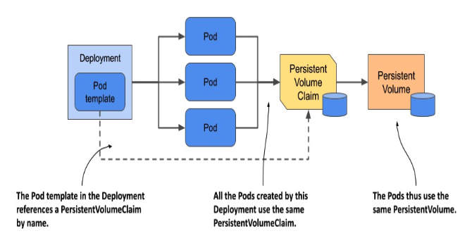
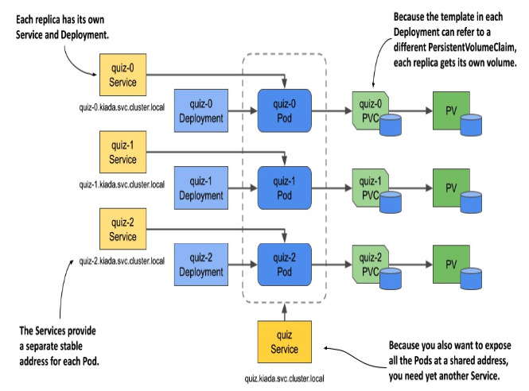

# Advanced Module - DevOps Workbook

## Linux
### What kind of virtualization technologies are you familiar with?
- A virtualizáció egy valós entitás helyett egy virtuális dolog létrehozását jelenti
    - A hypervisor (Virtual Machine Monitors (VMMs)) teszi ezt lehetővé (ez allokálja a host resource-ait a virtuális környezetben)
    - Ha a hypervisor installálva van, akkor tudunk létrehozni VM-eket, amik hordozhatóak
    - az az előnye ennek,
        - hogy csökkentjük a költségeket azáltal, hogy 1 fizikai gépen tudunk futtatni különböző környezeteket, 
        - csökken a "downtime", mivel könnyen újak hozhatóak létre
        - könnyen tudjuk őket ide-oda küldözgetni

- Technológiák:
    - Hardware / Platform virtualizáció
        - Type 1 Hypervisor - Bare Metal / Natív virtualizáció:
            - itt nincs host gép, a hypervisor közvetlenül áll kapcsolatban a hardverrel
            - pl `Microsoft Hyper-V`, `Xen`
            
    - Szoftver-virtualizáció:        
        - Type 2 - Hosted / Nested virtualizáció:
            - ennél host gépet használunk (saját OS), ezen fut a hypervisor
            - a host gép megosztja az erőforrásait a VM-ekkel (szabályozható)
            - pl `Oracle VirtualBox`, `VMware Workstation`
        
        - Konténerizáció:
            - Itt nem egy egész gépet virtualizálunk, mert OS-t nem hozunk létre, ehelyett ezt applikáció szintjén virtualizáljuk
            - Csak felhasználjuk a host gép OS-ének kernelét, hogy izolált egységeket hozzunk létre
            - pl `Docker`, `Kubernetes`

    - Ezeken kívül létezik még:
        - Network virtualizáció: itt a network-öt virtualizáljuk
        - Desktop virtualizáció: Hypervisor helyett szoftver segítségével hozunk létre VM-eket egy távoli szerveren, és ezek távolról irányíthatóak
        - Applikáció-virtualizáció: Applikációt virtualizálunk, melyek így önállóan képesek működni
        - Storage virtualizáció: itt csak az adattárolás van már csak virtualizálva
    
### What command line text manipulation tools are you familiar with?
- `sed` = "Stream editor"
    - szövegtranszformációkra használjuk, azon belül is elsősorban replace-re (de lehet search, insert, delete is)
    - stream-ekkel dolgozik - memóriahatékony nagy szöveges adatoknál
    - pl:
        - replace text: `sed 's/old/new/' file.txt`

- `awk`
    - adatok kinyerésére használjuk táblázat-szerűen
    - sorról sorra olvassa be az adatokat, majd azokat további field-ekre bontja (oszlopokat készít), és ezekkel dolgozik
    - pl:
        - text Filtering: `awk '/error/ {print $0}' logfile` (regexet használ!)
            - az "error"-t tartalmazó sorokat nyomtassa ki a logfile-ba
        - adja össze egy oszlop adatait: `awk '{sum += $1} END {print sum}' file.txt`
        - filter: `awk '$2 > 10' file.txt`

- `grep`
    - szövegkeresésre, filterezésre használjuk elsősorban
    - pl:
        - Basic Search: `grep "error" file.txt`
        - Case Insensitive Search: `grep -i "error" file.txt`
        - Recursive Search: `grep -r "error" .`
        - Counting Occurrences: `grep -c "error" file.txt`
        - Invert Match: `grep -v "error" file.txt`
        - Regex Search: `grep "^error.*" file.txt`

- `tail`:
    - a file végi sorokat nyomtatja csak ki (by default 10-et)
    - pl:
        - View the Last N Lines of a File: `tail -n 20 file.txt` (-n nélkül 10 a default)
        - Follow a File in Real Time: `tail -f /var/log/syslog`

- `jq`
    - query nyelvet használ kifejezetten JSON típusú file-okhoz
    - pl:
        - Pretty Print JSON (human-readable): 
            - `cat file.json | jq .`
        - Extract a Specific Field (eg name in this instance):
            - `echo '{"name": "John", "age": 30}' | jq '.name'`

- `source`
    - ezzel megadhatunk egy file-t, amit beolvas, és a benne található parancsokat végrehajtja
    - script-ekbe tudunk így betülteni adatokat (function, variable, config)
    - pl:
        - `source <Filename>`, vagy `. <Filename>`

### How would you schedule a command to run every Sunday at midnight?
- `cron` segítségével:
    - egy command-line utility, ami ütemezi a job-okat
    - leginkább rendszeresen végrehajtandó `cron job`-ok végrehajtására használjuk
    - az ütemezés beállítására `crontab`-ot használunk (minden user-nek van sajátja, de van egy a system-nek is):
        - Így néz ki:

                ┌───────────── minute (0–59)
                │ ┌───────────── hour (0–23)
                │ │ ┌───────────── day of the month (1–31)
                │ │ │ ┌───────────── month (1–12)
                │ │ │ │ ┌───────────── day of the week (0–6) (Sunday to Saturday;
                │ │ │ │ │                                   7 is also Sunday on some systems)
                │ │ │ │ │
                │ │ │ │ │
                * * * * * <command to execute>
        - pl:
            - `1 0 * * * echo "Hello, World!" > /tmp/temp.txt`
            - `45 23 * * 6 /home/user/scripts/myscript.sh`
- **Schedule a command to run every Sunday at midnight:**
1. check if you used it already:
    - `crontab -l` - if it wasn't, then:
    - `sudo crontab -e` - select to open it with nano
2. Add this line to the `crontab` file (each line that is a new task):
    - `0 0 * * 0 echo "Linux is Cool!" >> ~/crontab_log.txt` (`>>` appends to the file. `>` would overwrite)
    - We could also use a script to be executed instead, so we can include multiple or more complex commands:
        - `0 0 * * 0 /path/to/script.sh`:
            - you need to create the file first (`nano /path/to/script.sh`)
            - you need to make it executable first (`chmod +x /path/to/script.sh`)
3. Check if it was added with `crontab -l`

### How would you check the available resources (memory, disk space, CPU)?
- CPU (and memory): `htop` (interactive), `top`
- Memory (RAM) Usage: `free -h`
- Diks space: `df -h`, `du -h /path/to/directory`

### What are hard links and symbolic links?
- Amikor létrehozunk egy file-t, akkor egy referenciát hozunk létre, ami a disk-en lévő memória egy pontjára mutat, ahol a file adatai találhatóak
- Egy hard link egy újabb referenciát hoz létre (mintha egy új file lenne), ami ugyanarra a memóriapontra mutat, ahova az eredeti, így az eredeti file-t törölve a hard link és az adatok közti kapcsolat megmarad
- Egy hard link viszont az eredeti file-ra mutat (a referenciára), így ha az eredeti file-t töröljük, akkor a soft linkkel való kapcsolat is megszakad

### What are services in the context of Linux?
- Egy "service" Linux környezetben egy háttérben futó program vagy app
- Ezeket más néven `daemon`-nak is hívjuk
- a `Systemd` menedzseli ezeket, hogy start-upkor mi fusson le, de mi a `systemctl` segítségével tudunk velük dolgozni
- A leggyakrabban használtak: `systemd` -> `systemctl` command, `cron`, `sshd`, `networkd`

### Describe the permission model of Linux! How would you make a file only readable and writable by its owner?
- A "Permission"-ök azért léteznek a Linuxban, mert az egy multi-user OS, így korlátozni kell, hogy ki mihez fér hozzá
- 2 rétegből áll:
    - Ownership: User / Group / Other-World
    - Permission Read / Write / Execute
- Ezek egy 9biten tárolt rendszert alkotnak: `-rwxrwxrwx` (a 10-edik az elso, ami file/dir)
- 2 féle képpen tudunk változtatni:
    - Symbolic mode: `chmod g+x filename`
    - Absolute mode: `chmod 764 filename` =>  User: `rwx` (7) / Group: `rw-` (6) / Other (4) `r--`
- Special permission:
    - SUID -> ezzel a beállítással mindig az owner nevében futtatjuk a file-t, függetlenül attól, hogy kivel vagyunk bejelentkezve
        - `x` helyett `s` kerul a permission 9bites kódjába
    - SGID -> ugyanez, csak Group Ownerrel
    - Sticky bit -> ezzel be tudjuk állítani, hogy egy directory-ban ne legyen törlési jog, de írási megmarad (kivéve az ownernek és a rootnak)
        - így tudjuk beállítani: `chmod 2770 community_content/`
            - 4ik számjegy kerül a 3jegyű elé! (SUID: 4, SGID: 2, Sticky: 1)
- Ownership változtatás: `chown user:group filename` (lehet csak user is!)

### What is the difference between Gi, Gb and GB?
- **Gi or GiB (Gibibyte):** binárisan tárolt, 2^30 byte
- **Gb (Gigabit):** 10^9 bits (itt már 10-es van, nem 2-es!)
- **GB (Gigabyte):** 10^9 bytes (1 byte = 8 bit)

### What are some well-known configuration files on a Linux OS?
- `/etc/shadow`: encryptálva tárol passwordöket
- `/etc/passwd`: user account ifót tárol, hogy kik vannak a rendszerben
- `/etc/group`: group-okat tárol ugyanígy
- `/etc/fstab`: a diskekről és azok mountolásáról tárol információt
- `/etc/hosts`: itt tárolja a már ismert DNS-eke, hogy ne kelljen mindent lekérdezni
- `/etc/crontab`: cronjob ütemezésre szánt feladatokat tárol
- `/etc/services`: service-ket és a hozzájuk kapcsolódó portokat ls protocol-okat tárolja
- `/etc/skel`: blueprint directory for new users

### Explain the "set" builtin command and some of its most commonly used flags!
- `set`:
    - scriptekben használjuk, leginkább debugginghoz, vagy a progress check-hez
    - Leggyakoribb flagek:
        - `-e`: lépjen ki azonnal, ha bármely command non-zero-val tér vissza (tehát sikertelen)
        - `-x`: minden egyes commandot kiloggol, mielőtt teljesítené (debugging)
        - `-u`: a Linux alapból nem figyelmeztet, ha egy variable unset (pl typo esetén), de ezzel beállíthatjuk
        - `-v`: ez is hasonló az x-hez, de itt minden input line-t loggol ki, nem a parancsokat, amiket futtat
    - Pl: `set -eux`:

### How would you make a service auto-start and machine boot-up?
- a `systemd` daemonnal, ami az init system-ért felelős a Linuxban:
    - Create the script: `sudo nano /usr/local/bin/my_script.sh`
    - Add content, eg: `#!/bin/bash / echo "My script is running" > /var/log/my_script.log`   
    - Make the script executable: `sudo chmod +x /usr/local/bin/my_script.sh`
    - create a file for the new service: `sudo nano /etc/systemd/system/my_service.service`
    - fill up the file with the service configuration you need
    - Reload systemd to recognize the new service: `sudo systemctl daemon-reload`
    - Enable the service to start on boot: `sudo systemctl enable my_service`

## NETWORKING

### What is a MAC address?
- **MAC address:**
    - `Media Access Control`, ami egy egyedi azonosító a network interface-eknél, ami gyárilag kerül beléjük
    - 12 jegyű, hexadecimális kód (0-9 + A-F = 16 digit options)
    - Alternatív elnevezések: `physical address`, `hardware address`, `Layer 2 address`, `ethernet address`
    - Az OSI model L2 Data-Link layere használja ezt azonosításra
    - Az `ARP protocol` a felelős egy szerver vagy service MAC addressének a kiderítéséért 

### What is the difference between binding to 127.0.0.1 or 0.0.0.0?
- `127.0.0.1` (localhost): csak a sajátgépről bejövő connection-ökre hallgasson
- `0.0.0.0` (Minden IPv4 address a local machine-en): Bárhonnan figyelje a bejövő connectionöket
- Binding: szerver vagy app hozzárendelődik egy IP címhez és PORT-hoz, amiken fogadja a bejövő requesteket

### What are the Layers of the OSI model?
- **7-layer OSI model** 
    - Layers:
        - Layer 7: Application
        - Layer 6: Presentation
        - Layer 5: Session
        - Layer 4: Transport
        - Layer 3: Network
        - Layer 2: Data link
        - Layer 1: Physical
    
    - Az 1-3 layereket device-okhoz is tudjuk társítani:
        - L1 - Hub - hardveres adattovábbítás
        - L2 - Switch - két node közti kapcsolatért felel, MAC address-t használ
        - L3 - Router - IP protocol-t használ packet forwardinghoz
    
    - A 4-7 layerekhez inkább funkciókat tudunk társítani:
        - L4 - Gateway / Firewall / Load Balancer - Azt biztosítja, hogy az adatok hiányzalanul, megfelelő sorrendben és hibák nélkül eljussanak a címzetthez
        - L5 - Gateway / Firewall / Load Balancer - A lokális és távoli appok közti session-öket menedzseli
        - L6 - nincs kifejezett device - Data encryption és decryption itt történik, valamint biztosítja, hogy az adatok megfelelően használhatóak legyenek
        - L7 - A userhez legközelebbi layer, ez bonyolítja le a kommunikációt az appok között, valamint az end-user serviceket szolgáltatja

### What is the difference between a router and a switch?
- **Switch:**
    - L2 Data Link layeren működik
    - Azonos hálózaton belül küldözget data packeteket (LAN, VLAN)
    - Nincs közvetlen kapcsolatban a külső internettel, ha egy packet mégis külső hálózatra menne, akkor az a routernek küldi
    - MAC addresseket használ az adattovábbításhoz
- **Router:**
    - L3 Network Layeren működik
    - több networköt köt össze (a lokálisat az Internettel)
    - IP addresseket használ adattovábbításhoz
    - Headereket és Forwarding Table-eket használ az útvonal optimalizálására

### What is the difference between TCP and UDP?
- Mindkettő a L4 Transport Layer protokolja, de egyszerre csak 1-et használ
- `TCP` (`Transmission Control Protocol`): 
    - lassabb, de megbízhatóbb protokol, mivel a kézbesítés sikerét is figyeli / garantálja
    - automatikus újraküldés sikertelenség esetén
    - connection oriented: session-t (=connection-t) hoz létre a két fél között, portokat használ
- `UDP` (`User Datagram Protocol`): 
    - gyorsabb, de megbízhatatlan, mivel nem garantálja a kézbesítést, csak "megpróbálja"
    - connectionless: nem hoz létre kapcsolatot a küldő és a fogadó között
    - ez is portokat használ a kommunikációra

### What is a VPN?
- **VPN - Virtual Private Network:**
    - Egy olyan technológia, amely lehetővé teszi, hogy biztonságos kapcsolatot hozzunk létre egy másik hálózattal az interneten keresztül
        - VPN szerver segítségével tud létrejönni ez a biztonságos kapcsolat, ehhez kapcsolódunk, majd a VPN szerver kapcsolódik a távoli hálózathoz
        - A VPN szerver továbbá el is rejti a Client-et az internet elől, olyan, mintha a VPN szerver IP címét használná
        - End-to-end encryption-t használ, amivel biztonságosabb lesz az adatküldés

    - 2 fajátja van:
        - Client-to-site: a Client-et köti össze a távoli szerverrel
        - Site-to-site: 2 hálózatot köt össze (pl AWS és irodai hálózat) 
            - itt létrehozhatunk további szabályokat is, pl az AWS-re csak irodai hálózatról lehet használni, így előbb ahhoz kell csatlakozni

### What is DNS?
- A Domain Name System röviden az internet telefonkönyve, mivel ennek segítségével fordítjuk le a domain neveket IP címekké
- Az L7 Application Layeren létezik, és UDP protokolt használ
- Működése:
    - az internet namespace-ét egy .-al jelöljük az URL-ben, de ez nem látható
    - Amikor beírunk egy domain nevet, először megvizsgálja, hogy az már ismert-e
    - Ha nem, akkor végigmegy a DNS szervereken, és egyre jobban leszűkítve a keresést:
        - `resolving name server` -> `root name servers` (ez a `.`) -> `top level domain name servers` -> `authoratative name servers`
        - `registrar` -> ebben vannak regisztrálva a domainek a hozzájuk tartozó IP címekkel

### What is DHCP?
- Dynamic Host Configuration Protocol: 
    - Azért felel, hogy a user device-nak minden szükséges adat rendelkezésére álljon ahhoz, hogy megfelelően működjön
    - Arra használjuk, hogy automatikusan információt kapjunk egy hálózati configurációról

    - Amit meg kell határozni benne:
        - A szerver által kiosztható IP range-ek
        - Mask setup (8-24, hogy az IP melyik része a hálózat, és mi a device)
        - Egy Gateway-t, ami a networkön kívüli IP címeket kezeli
        - DNS server

    - Az alábbi DORA lépések szerint történik az IP cím lekérdezés: 
        - `Discover` - broadcast küldése, miszerint DHTP szervert keresünk
        - `Offer` - A DHTP szerver a válaszban felajánl egy IP címet, amit a host használhat
        - `Request` - újraküldés, már "elfogadás" válasszal
        - `Acknowledgement` - a szerver tudomásul veszi az "elfogadás"-t, és küldi a további szükséges adatokat

### What are some well-known ports?
- **Ports:**
    - A PORT egy kommunikációs végpont, amit a TCP és UDP protokolok is használnak
    - A well-known-portok előre lefoglalt portok, amiket egyes service-ek használnak, hogy egyszerűsítsék az adattovábbítást
    - Port number ranges:
        - System Ports range (0-1023) - csak admin
        - User Ports range (1024-49151)
        - Dynamic Ports range (49152-65535)
    - Well-known ports:
        - `21` - `FTP`
        - `22` - `SSH`
        - `25` - `SMTP`
        - `53` - `DNS`
        - `80` - `HTTP`
        - `194` - `IRC`
        - `389` - `LDAP`
        - `443` - `HTTPS`
        - `3306` - `MySQL`
        - `5432` - `PostgreSQL`
        - `6443` - `Kubernetes API Server`
        - `27017` - `MongoDB`

### What are the private IP address ranges?
- Ezek olyan tartományok, melyek előre meg lettek határozva, és ezek nem léteznek az interneten, csak privát hálózatokhoz lehet ezeket használni
- 3 range létezik:
    - **Class A:** `10.0.0.0` to `10.255.255.255`
        - `10.0.0.0/8`: 8 bites mask, sok subnet lehetőség
    - **Class B:** `172.16.0.0` to `172.31.255.255`
        - `172.16.0.0/12`: 12 bites mask, közepes subnet lehetőség
    - **Class C:** `192.168.0.0` to `192.168.255.255`
        - `192.168.0.0/16`: 16 bites mask, kevés subnet lehetőség (tipikus otthoni beállítás)

### How many usable addresses are in 192.168.1.0/24? (ez maradhat angolul)
- An `IPv4` address is stored on 8 x 4 2-bits (32 bits) (its value can be `1` or `0`): `00000000.00000000.00000000.00000000` to `11111111.11111111.11111111.11111111`
    - a set of numbers (8 digits) is called an `octet` = 8 bits
    - each octet's value can range from 0 to 255
    - for example:
        - `192.168.1.1` == `11000000.10101000.00000001.00000001`
    - the number after the IP address (eg. `/8` or `/16` or `/24`) refers to the digits used for the network's ip (eg. `/8` covers the first octet, so there are 3x8 digits left to be handed out within the network for the devices)

- The subnet `192.168.1.0/24` refers to an IPv4 network that includes all IP addresses from `192.168.1.0` to `192.168.1.255`. The `/24` denotes that the first 24 bits of the 32-bit IP address are dedicated to the network portion, leaving the last 8 bits for host addresses.

- Breakdown:
    - **Total Addresses:** The subnet includes `2^8 = 256` addresses, since there are 8 bits for the host part.
    - `Network Address`: The first address, `192.168.1.0`, is the network address and is reserved to identify the network itself.
    - `Broadcast Address`: The last address, `192.168.1.255`, is the broadcast address, used for sending messages to all devices on the network.

- So, the number of usable addresses 254
- These usable addresses range from `192.168.1.1` to `192.168.1.254`.

### What is the purpose of the ARP protocol?
- Arra hasznáéljuk, hogy kiderítsük a MAC addressét annak a servernek vagy servicenek, amihez kapcsolódni szeretnénk, IP cím segítségével
- Elsősorban L2 Link layeren működik, de mivel IP címeket is használ, így L3 Network Layer-ben is érintett
- Így működik:
    - A host (user gépe) kiküld egy ARP requestet, amiben benne van az IP cím, amihez tartozó MAC address kell neki
    - A request broadcast formában történik, tehát minden device-ra eljut, és a megfelelő device visszaküldi az L2-es MAC address-ét
    - A device-ok ARP táblákban tárolják az IP címekhez tartozó MAC címeket

### What are the basic networking components in AWS? (?)
1. Amazon VPC (Virtual Private Cloud)
    - `VPC`: A logically isolated section of the AWS cloud where you can launch AWS resources in a virtual network that you define. You have complete control over your virtual networking environment, including selection of your own IP address range, creation of subnets, and configuration of route tables and network gateways.
2. Subnets
    - `Subnet`: A range of IP addresses in your VPC. You can launch AWS resources into a specified subnet. Use a public subnet for resources that need to connect to the internet, and a private subnet for resources that won’t be connected to the internet.
3. Internet Gateway
    - `Internet Gateway` (`IGW`): A VPC component that allows communication between instances in your VPC and the internet. It provides a target in your VPC route tables for internet-routable traffic, and performs network address translation for instances that have been assigned public IPv4 addresses.
4. Route Tables
    - `Route Tables`: Contain a set of rules, called routes, that determine where network traffic from your subnet or gateways is directed.
5. NAT Gateways/Instances
    - `NAT Gateways`/`Instances`: Used to enable instances in a private subnet to connect to the internet or other AWS services, but prevent the internet from initiating a connection with those instances.
6. Security Groups and Network ACLs
    - `Security Groups`: Act as a virtual firewall for your instances to control inbound and outbound traffic.
Network ACLs (Access Control Lists): Act as a firewall for controlling traffic in and out of one or more subnets.
7. Elastic IP Addresses
    - `Elastic IP Addresses`: Static IPv4 addresses designed for dynamic cloud computing. You can quickly remap the address to another instance in your account, providing a failover solution.
8. Elastic Network Interfaces (`ENIs`)
    - `Elastic Network Interfaces` (`ENIs`): A virtual network interface that you can attach to an instance in a VPC. ENIs can include attributes such as a primary private IPv4 address, one or more secondary IPv4 addresses, an Elastic IP address, a MAC address, membership in specific security groups, and more.
9. VPC Endpoints
    - `VPC Endpoints`: Allow private connections between your VPC and supported AWS services and VPC endpoint services powered by PrivateLink without requiring an internet gateway, NAT device, VPN connection, or AWS Direct Connect connection.
10. AWS Direct Connect
    - `AWS Direct Connect`: Bypasses the internet to provide a secure, dedicated connection from your premises to AWS.
11. AWS Transit Gateway
    - `AWS Transit Gateway`: Connects VPCs and on-premises networks through a central hub. This simplifies your network and puts an end to complex peering relationships.
    
### What network diagnostic/debugging tools are you familiar with? (?)
- **4 key debugging points:**
    - correct IP address?
    - correct mask configuration?
    - default gateway is configured?
    - DNS server is configured and works correctly?
- **Debugging tools:**    
    - `Ping`: 
        - This is a fundamental tool that tests connectivity between two hosts on a network. 
        - It uses `ICMP` (`Internet Control Message Protocol`) to send echo requests to a target host and waits for a reply.
        - It helps determine if a host is reachable and measures the round-trip time for messages.
        - How it works video: https://www.youtube.com/watch?v=vJV-GBZ6PeM&ab_channel=PowerCertAnimatedVideos
    - `Traceroute` (`tracert` on Windows):
        - This tool is used to display the route (path) and measure transit delays of packets across an internet protocol (IP) network. 
        - It helps in identifying the path taken by packets across a network and pinpoints where delays or drops are occurring.
        - How it works video: https://www.youtube.com/watch?v=1bIpUup5Vp4&ab_channel=CBTNuggets
    - `Nslookup` / `Dig`: 
        - These are command-line tools used for querying the `Domain Name System` (`DNS`) to obtain domain name or IP address mapping, or other DNS records. 
        - `nslookup` is widely used on Windows and some Unix-based platforms, while `dig` is preferred on Linux systems for its robust features.
    - `Netstat`: 
        - This tool displays network connections (both incoming and outgoing), routing tables, and a number of network interface statistics. 
        - It is particularly useful for checking which ports are open and what connections are currently active on a machine.
    - `Wireshark`: 
        - An advanced network protocol analyzer, Wireshark allows users to capture and interactively browse the traffic running on a computer network. 
        - It provides detailed information about network traffic and can be used for network troubleshooting and analysis.
    - `Tcpdump`: 
        - This is a command-line packet analyzer tool that allows the user to capture and display the packets being transmitted or received over a network to which the computer is attached.
    - `IPerf` / `JPerf`: 
        - These tools are used to measure the bandwidth between two hosts on a network. 
        - They can test `TCP` or `UDP` throughput and provide details on the performance of the network.
    - `MTR` (My Traceroute): 
        - `MTR` combines the functionality of the `traceroute` and `ping` programs in a single network diagnostic tool. 
        - It provides a continuously updated list of routers, packet loss, and response times between the local host and each router along the path to a remote host.
    - `Telnet` / `SSH`: 
        - While primarily used for remote access to servers, these tools are also used for diagnosing certain types of network issues, such as testing the accessibility of services on specific ports.
    - `Nmap`: 
        - This is a network scanning tool that can discover devices and services on a computer network. 
        - It is extensively used for network inventory, managing service upgrade schedules, and monitoring host or service uptime.

## Security
### What is encryption at rest and encryption in transit, and how are these implemented in AWS?
- **Data encryption (in AWS):**
    - AWS is using AES-256 algorithm for encryption
    - there is an `engine` that creates an individual cryptographic key, the `data key`:
        - contains all of the cipher information that is then applied to the data object (image, video, individual document, that you want protected)
        - The cipher data is applied against the individual object and then you end up with the encrypted data
        - That encrypted data is then put into storage (S3 or EBS)
        - without the original encryption key there is no way to read that data
    - The engine makes a unique key for every object that goes into your system (for better security), so these need to be managed:
        - `individual data key` is only used by that data object
        - `master key` is applied against the original `data key` to get an **encrypted version** of that `data key`
        - the object is attached to the encrypted object, and that is what gets stored
        - you only will need the `master key` to decrypt the encrypted key, that you will then use to get the data
        - AWS offers solution out-of-the-box you can use to manage the master key storage:
            - Hardware solution - Cloud HSM
            - Hardware Security Module
            - Services such as KMS - The key management system

- **Encryption at Rest:**
    - It refers to the protection of data stored on disk. 
    - The goal is to prevent unauthorized access to the data when it is stored on physical media such as hard drives, SSDs, or backup tapes. 
    - This type of encryption ensures that even if the storage medium is accessed by an unauthorized party, the data remains unintelligible without the decryption key.
    - **Implementation in AWS:**
        - `Amazon S3`: AWS offers server-side encryption (SSE) for S3 objects with three options:
            - `SSE-S3`: AWS manages the encryption keys.
            - `SSE-KMS`: AWS Key Management Service (KMS) manages the keys, providing additional control and auditing capabilities.
            - `SSE-C`: Customer provides and manages the encryption keys.
        - `Amazon EBS` (Elastic Block Store): EBS volumes can be encrypted to protect data at rest. Encryption occurs on the server that hosts the EC2 instance, providing encryption for data at rest, data in transit between the instance and the volume, and snapshots created from the volume. Encryption is handled using AWS KMS.
        - `Amazon RDS` (Relational Database Service): RDS supports encryption at rest for DB instances using AWS KMS. This encryption applies to the underlying storage for the DB instance, automated backups, read replicas, and snapshots.
        - `AWS S3 Glacier`: Supports encryption at rest by default using AWS KMS.
        - `AWS CloudTrail Logs`: CloudTrail logs can be encrypted using SSE-KMS.

- **Encryption in Transit:**
    - Encryption in transit refers to the protection of data as it moves between different parts of a system, such as between clients and servers or between different services.
    - The goal is to protect the data from eavesdropping and tampering while it is being transmitted.
    - **Implementation in AWS:**
        - `TLS`/`SSL`: AWS services support encryption in transit using Transport Layer Security (TLS) and Secure Sockets Layer (SSL). For example:
            - `Amazon S3`: Supports HTTPS for secure data transfer.
            - `AWS API Gateway`: Supports HTTPS for secure communication between clients and APIs.
            - `Elastic Load Balancing` (`ELB`): Supports HTTPS/SSL termination at the load balancer.
        - `AWS VPN`: AWS provides VPN connections for securely connecting on-premises networks to AWS VPCs using IPsec.
        - `AWS Direct Connect`: Provides a dedicated network connection from your premises to AWS. AWS Direct Connect supports encryption at the application layer (e.g., TLS/SSL) or can be combined with AWS VPN to encrypt traffic.
        - `Amazon RDS`: Supports SSL/TLS connections to encrypt data in transit between the database instance and the application.
        - `Amazon Elastic File System` (`EFS`): Supports encryption of data in transit using TLS.
        - `AWS IoT`: Supports secure communication using TLS/SSL for IoT devices.

### Which service is responsible for monitoring and log collections in AWS? (?)
- **Amazon CloudWatch:**
    - Amazon `CloudWatch` is the primary service for **monitoring** AWS resources and applications. 
    - It collects and tracks metrics, collects and monitors log files, and sets alarms. 
    - Key features include:
        - **Metrics**: Collects and tracks metrics for AWS resources like EC2 instances, RDS databases, and more.
        - **Alarms**: Allows you to set alarms based on metrics and receive notifications.
        - **Dashboards**: Provides a visual interface to monitor and display metrics and alarms.
        - **Events**: Monitors AWS resources and routes event notifications to targets like Lambda functions, SNS topics, and SQS queues.
        - **Logs**: Collects and monitors log data from various AWS services and applications.
- **Amazon CloudWatch Logs:**
    - Amazon `CloudWatch Logs` lets you **monitor**, **store**, and **access log files** from various sources. 
    - It can be used to collect and monitor logs from:
        - **AWS Services**: Such as VPC Flow Logs, Lambda logs, and Route 53 query logs.
        - **Custom Sources**: From your applications and on-premises servers using the CloudWatch Logs Agent or the CloudWatch Logs API.
        - **Log Groups and Streams**: Organizes log data into log groups and log streams.
        - **Metric Filters**: Allows you to extract metric data from log events.

- **AWS Systems Manager (Integrated solution):**
    - `AWS Systems Manager` integrates with `CloudWatch` and other AWS services to provide a unified interface for operational data management. 
    - It includes features like:
        - **OpsCenter**: Centralized view of operational issues.
        - **Run Command**: Execute commands on AWS resources.
        - **Parameter Store**: Secure storage for configuration data and secrets.
        - **Session Manager**: Secure, auditable instance management.

### What is a bastion host, and how can it be implemented in AWS? (!) update with notes from workshop!
- **Bastion host:**
    - a special-purpose server designed to provide secure access to a `private network` from an `external network` (typically the internet)
    - The primary purpose of a `bastion host` is to enhance security by minimizing the attack surface and controlling access to critical resources.
    - acts as a `gateway` through which authorized users can access other instances or resources within a `private subnet` of a `Virtual Private Cloud` (`VPC`):
        - Only allows secure, authenticated connections (typically using `SSH` for Linux or `RDP` for Windows).
    
    - **Implementing a Bastion Host in AWS:**
        1. Create a VPC:
            - If you don't already have a VPC, create one using the VPC wizard or manually via the AWS Management Console.
        
        2. Set Up Subnets:
            - Create a public subnet for the bastion host.
            - Create private subnets for your application servers or other resources.
        
        3. Create a Security Group for the Bastion Host:
            - Define a security group that allows inbound SSH (port 22) or RDP (port 3389) from specific IP addresses or IP ranges (e.g., your office IP).
            - Allow outbound traffic on necessary ports (e.g., SSH or RDP) to the private subnet.
        
        4. Launch an EC2 Instance for the Bastion Host:
            - Choose an appropriate AMI (Amazon Machine Image) for your bastion host (e.g., Amazon Linux, Ubuntu for SSH access, or Windows Server for RDP access).
            - Launch the instance in the public subnet and associate it with the security group created earlier.
        
        5. Configure Key Pair or Password Authentication:
            - Use an SSH key pair for Linux instances or set up a strong password for Windows instances.
        
        6. Associate Elastic IP (Optional):
            - Assign an Elastic IP to the bastion host to have a static, reachable IP address.
        
        7. Configure Route Tables:
            - Ensure that the route table associated with the public subnet has a route to an internet gateway for internet access.
            - Private subnets should have route tables that do not allow direct internet access.
        
        8. Harden the Bastion Host:
            - Disable unnecessary services and ports.
            - Regularly update the operating system and software.
            - Configure logging and monitoring (e.g., using AWS CloudWatch).
        
        9. Access Private Resources via the Bastion Host:
            - Connect to the bastion host using SSH or RDP.
            - From the bastion host, establish connections to instances within the private subnet.
        
        - **Example of Security Group Configuration for SSH Access:**
            - Bastion Host Security Group:
                - Inbound Rules:
                    - Type: SSH
                    - Protocol: TCP
                    - Port Range: 22
                    - Source: Your specific IP range (e.g., 203.0.113.0/24)
            - Private Subnet Instances Security Group:
                - Inbound Rules:
                    - Type: SSH
                    - Protocol: TCP
                    - Port Range: 22
                    - Source: Security group ID of the bastion host

### What are the key differences between security groups and NACLs?
- **Security Groups:**
    - acts as a virtual firewall for your EC2 instances to control incoming and outgoing traffic
    - Both inbound and outbound rules control the flow of traffic to and traffic from your instance (it's just like a turbo version `iptables`)
    - when no rules are defined in a security group it blocks all inbound and outbound traffic! (By default when you launch an EC2 instance via the AWS Management Console will generate a security group for you which will allow inbound SSH connections and allow all outbound connections.)
    - each security group can be applied to one or more instances, even across subnets
    - each instance is required to be associated with one or more security groups (to be precise: a security group is associated with a network interface that is attached to an instance)
    - Different setups need different security group setups (eg port 3306 for MySQL)
    - Different rules can be set for the `webserver` or the `database server`, or we can set `ping/ICMP rules`

- **Network Access Control Lists NACL:**
    - Features:
        - `NACL` sets rules for your **network/subnet**, based on the protocol type such as HTTP, TCP, UDP, etc., and the port numbers
        - Used in combination with **SG**s to create a multi-layer protection
        - each `NACL` can be applied to one or more `subnets`, but each subnet is required to be associated with one — and only one! — `NACL`
        - When you create a VPC, AWS automatically creates a default `NACL` for it (You can add and remove rules from a default `NACL`, but you can't delete the `NACL` itself)
    
- **Comparison:**
    - Similarities:
        - both act as a virtual firewall to protect your network/instance
        - use sets of inbound and outbound rules to control traffic to and from resources in a VPC
        - Can be applied to more than one instance (security group) or subnet (NACL)
        - Can be locked down to deny all traffic in either direction
        - Are valid methods of securing resources in a VPC
        - Work together to promote network redundancy and prevent unauthorized activity
    
    - **Differences:** (this already implements the comparison chart image!)
        - `Security groups` and `NACLs` operate at separate layers in the VPC:
            - `SG` -> Instance level-security
            - `NACL` -> Network level-security
        - don't handle response traffic the same way:
            - `SG` allows or denies traffic that a NACL allows in
            - `NACL` allows or denies traffic **before** it reaches an `SG`
        - Rules processing:
            - `SG` rules are processed as a group
            - `NACL` rules are processed one a time (in ascending order, by number set)
        - Allow-deny:
            - `SGs` are implicit deny - you can only add `allow` rules!
            - `NACLs` support both `allow` and `deny` rules
        - Statefulness (=apply rules based on connection state):
            - `SG` is `stateful` = response traffic is automatically allowed
                - you don't need to set separate rules for responses, like with `NACLs`
            - `NACL` is `stateless` = response traffic is subject to inbound and outbound rules:
                - this means that NACL rules typically **come in pairs**. For every inbound rule for a NACL, there must be a corresponding outbound rule
        - Application to AWS EC2 instances:
            - `Security groups` are a **required** form of defense for `instances`, because an `instance` must be associated with at least one `security group`
            - A `NACL` on the other hand, automatically applies to **all instances** in the `subnet` it is associated with
        - Default rules:
            - `SG` deny all incoming traffic by default
            - `NACL` allow all traffic in and out by default (must be configured to be less permissive!)
    
- **How to use `NACL` together with `SGs`:**
    - By taking advantage of the order of operations:
        - When traffic enters your network, it is filtered by `NACLs` **before** it is filtered by `security groups` (so traffic allowed by a `NACL` can then be allowed or denied by a `security group`, and traffic stopped by a `NACL` never makes it any further)
    
### Which service is responsible for tracking activities on an AWS account? (?)
- **AWS CloudTrail:**
    - `AWS CloudTrail` is a service that enables governance, compliance, and operational and risk auditing of your AWS account. 
    - With `CloudTrail`, you can log, continuously monitor, and retain account activity related to actions across your AWS infrastructure. 
    - This provides a history of AWS API calls for your account, including API calls made through the AWS Management Console, AWS SDKs, command line tools, and other AWS services.
    
    - **Key Features:**
        - Event logging: 
            - operations such as the creation, modification, and deletion of AWS resources
        - Trails:
            - can be set to apply to all regions or to a single region
            - can be configured to log events in a specified S3 bucket for storage
            - A single trail can log events from multiple AWS accounts, simplifying centralized auditing and compliance
        - CloudTrail Insights:
            - Automatically detect unusual API activities in your AWS account
            -  help identify operational issues and potential security threats by analyzing normal activity patterns
        - Integration with Other Services (eg. `CloudWatch`)
        - Event history (90-day history)
        - Security and Compliance:
            - Helps meet compliance requirements by providing detailed logs of account activity, which can be used for audits and investigations
    
    - **Use cases:**
        - **Security Monitoring:**
            - Track user activity and API usage to detect unauthorized access or changes to your AWS resources.
            Investigate potential security incidents by reviewing API call history.
        - **Compliance Auditing:**
            - Maintain a record of AWS resource changes to demonstrate compliance with internal policies and regulatory standards.
            Use CloudTrail logs to generate audit reports for compliance frameworks like PCI DSS, HIPAA, and GDPR.
        - **Operational Troubleshooting:**
            - Identify the root cause of operational issues by reviewing the history of API calls and resource changes.
            Monitor the creation, modification, and deletion of resources to ensure proper resource management and optimization.
        - **Change Management:**
            - Ensure changes to infrastructure are authorized and documented, supporting effective change management processes.
            Use CloudTrail logs to verify that changes to critical resources are made according to organizational policies.

### Explain the difference between symmetric and asymmetric encryption!
- **Symmetric:**
    - Analogy:
        - Simple box with a lock analogy, where everyone with access has their own key (every key is identical)
    - How it works:
        - Uses 1 `single key`
        - This key is used both for encryption and decryption
        - The sender and the receiver both need the key (so they both have one), and this must be kept a secret
        - This method is much simpler, but risky because of using just 1 key
- **Assymetric:**
    - Analogy:
        - It works roughly like a mail box, where anyone can drop in their mail through a slot (this would be the public key), but only you can open and read the mail using your private key.
    - How it works:
        - Uses 2 keys: `private key` and `public key`
        - `public key` is meant to be shared, so others can send you messages using your public key (it is used for **encryption**)
        - `private key` is kept as a secret, so you can **decrypt** messages sent to you
        - Solves the problem of sharing keys, because the **decryptor** `private key` is not sent accross, just the **encrypting** `public key`
        - It is slower compared to symmetric method
        - Examples are `RSA` and `ECC`

### What is the Principle of Least Privilege (PoLP), and how can it be implemented in AWS?
- **Principle of Least Privilege (PoLP):**
    - a security concept that aims to give users, systems, or applications the minimum level of access necessary to perform their required tasks
    - helps reduce the risk of unauthorized access or damage by limiting the access and permissions to only what is necessary
    - **Implementing the Principle of Least Privilege in AWS:**
        - Use `IAM` Roles instead of `root user`:
            - Give users and services the specific permissions they need, using `IAM roles`
            - Organize `users` into `IAM groups`, based on their roles and responsibilities
            - Create `IAM policies` by specifying the exact actions, resources and conditions: attach these to `groups` instead of single `users`
            - Enable MFA

### How do AWS IAM roles differ from IAM users, and in what scenarios would you use each?
- `IAM roles` and `IAM users` are both mechanisms for controlling access to AWS resources, but they serve different purposes:
    
    - **User:**
        - Represent individual people or services that need access to AWS resources
        - Each user has a unique identity within your AWS account:
            - permanent credentials (long-term use)
            - they are assigned policies that define their permissions (similarly to `roles`)
            - suitable for long-term access
        - Typical use-cases:
            - Human users (employees)
            - Administrative tasks (admin)
            - Service accounts (for the management of a specific resource)
        - **When to use summary:** 
            - long-term access; human user; static access keys (no dynamic is available)
            - eg. employee access

    - **Role:**
        - Are intended for granting temporary access to AWS resources
        - They are not associated with a specific user or service but can be assumed by anyone who needs them:
            - temporary credentials (through `AWS STS` - security token service)
            - Roles can be **assumed** by AWS services, IAM users, applications, or external identities
                - `assume`: same as "wear a different hat", which basically means, get temporary permissions using a certain role, that is being `assumed`
            - they are assigned policies that define their permissions (similarly to `users`)
            - enables role-based access control to different tasks
        - Typical use-cases:
            - Cross-Account Access: Allowing access to resources in another AWS account without sharing long-term credentials.
            - AWS Services: Granting AWS services (eg EC2) the permissions they need to interact with other AWS resources.
            - Granting short-lived access to AWS resources for specific tasks or applications.
            - Providing temporary access to AWS resources for users authenticated via an external identity provider
        - **When to use summary:** 
            - temporary access; service permissions; cross-account actions; access through external identity providers
            - eg. `EC2` access to `S3` (the role is attached to the `EC2`)

### Explain the AWS Shared Responsibility Model in the context of security.
- **Shared Responsibility model:**
    - A security framework thar separates responsibilities of AWS and users to ensure a secure environment in the cloud
    - In essence, AWS is responsible for the security "of" the Cloud, while the customer is responsible for security "in" the Cloud:
        - `AWS`: involves the infrastructure that runs all the services offered in the AWS Cloud (e.g., hardware, software, networking, and facilities)
        - `User`: involves managing the security of the data they store and process, the applications they deploy, and the configuration of the AWS services they use (e.g., securing access to AWS resources, managing encryption, and ensuring appropriate access controls)
    - **Example Scenarios:**
        - `EC2` Instance:
            - AWS Responsibility: Ensures the physical servers and underlying infrastructure running the EC2 instances are secure and operational.
            - Customer Responsibility: Securing the guest operating system, applying security patches, configuring firewalls, managing IAM roles, and encrypting data on the instance.
        - `S3` Bucket:
            - AWS Responsibility: Secures the underlying storage infrastructure and provides tools to manage access.
            - Customer Responsibility: Managing bucket policies, access control lists (ACLs), and ensuring data stored in S3 is encrypted if needed.

### What is the difference between KMS and HSM?
- **AWS Key Management Service (KMS):**
    - KMS is a fully managed service, meaning AWS handles the underlying infrastructure and management tasks for you.
    - KMS is ideal for most standard encryption and key management tasks where ease of use, integration with AWS services, and cost-effectiveness are primary concerns.
- **AWS CloudHSM:**
    - Dedicated Hardware:CloudHSM provides dedicated, single-tenant HSMs that are physically isolated from other customers' HSMs.
    - CloudHSM is suited for scenarios requiring full control over keys, compliance with strict regulatory requirements, or the need for custom cryptographic operations (eg. banking)

## Containers and container orchestration
### What are the key differences between containers and virtual machines?
- **Containerization (Docker container) vs Virtualization (VM):**
    - **Virtualization:**
        - Virtualization is the technology which can simulate your hardware (such as CPU , disk, memory) and represent it as seperate machine
        - a full guest OS gets created, and everything that comes with it  (kernel images, device drivers, etc.). It's called `hardware-level or paravirtualization`
        - VMs run on a hypervisor (a software layer used to manage VMs)
        - VMs are fully isolated from each other and the Host
    - **Containerization:**
        - `iamge` -> the blueprint; `container` -> the running environment
        - Containers run on a container engine (eg. Docker), that uses the host OS (OS-level virtualization):
            - generally you need to run a container that uses the same OS as your own machine
        - Containers share the host OS kernel but have their own user space:
            - makes a process/app think it runs in a completely virtualized environment
        - programs running inside of a container can only see what was allocated for the container when it started (they are isolated at the process level)
        - they are light-weight, because of sharing the OS
            - they can be shared more easily
            - they can be scaled more easily
         
    - **Comparison image:** 
        

### What are the most important instructions in a Dockerfile?
- `Dockerfile`:
    - used with `docker build` command to create a `docker image`
    - contains all the commands that'll be used by `Docker` to assemble an `image`
    - we always base it on another, existing image (`FROM image`) -> the ultimate level is `scratch` (when it's so basic, that we don't base it any more levels)
    - Docker images are immutable, so when there is a change needed, we build a new build a new image
        - When we update the app and create a new `image`, the previous one becomes untagged `<none>` (you can still use it with it's ID)
    - **Typical build-up:**
        - `FROM`: 
            - Specifies the base image to use for the Docker image
            - eg.: `FROM <image>[:<tag>]`
        - `RUN`: 
            - Commands we would like to run
            - eg:
                - `RUN apt-get update`
                - `RUN apt-get install -y nginx`
                - `RUN chmod +x /some/path/to/script.sh`
        - `ENV`: 
            - use this to bake environment variables into the environment Docker creates within a container, eg:
            - `ENV <key>=<value>`
        - `ADD` and `COPY`:
            - use these commands to add arbitrary files to your images
            - they are basically the same the main difference being:    
                - with `ADD` you can specify a URL as the source (that points to some file)
                - `COPY` doesn't support this - it's generally better use `COPY` whenever you can
        - `WORKDIR`
            - Sets the working directory
            - eg: `WORKDIR /path/to/workdir`
        - `CMD`:
            - Sets the default command to be executed when the container starts (can be overwritten)
            - the `executable` is overridable at runtime, but will still use the params:
                - eg. if we set `CMD ["echo", "Hello, World!"]`, then `docker run <container>` -> runs with `echo "Hello, World!"`
                - but we can set it to something else, like this: `docker run <container> newCommand` -> runs `newCommand "Hello, World!"`
            - Syntax: `CMD ["executable", "param1", "param2"]`
            - Use it to set a default command with flexibility for the user to override
        - `ENTRYPOINT:`
            - Sets the command that will always be executed when the container starts (this is more secure, as it can't be overwritten)
            - can't be easily overwritten - but we can add additional params at runtime:
                - we set it to `ENTRYPOINT ["echo"]` -> then `docker run <container> "Hello, World!"` will execute `echo "Hello, World!"`
            - Syntax: `ENTRYPOINT ["executable", "param1", "param2"]`
            - Use it when you want to enforce a specific command to run and optionally allow parameters
        - `EXPOSE`:
            - Purpose: Informs Docker that the container listens on the specified network ports at runtime.
            - Usage: `EXPOSE <port>`
            - Example: `EXPOSE 8080`
            - Importance: Documents which ports are intended to be published.
        - `VOLUME`:
            - Purpose: Creates a mount point with the specified path and marks it as holding externally mounted volumes.
            - Usage: `VOLUME ["/data"]`
            - Example: `VOLUME ["/app/data"]`
            - Importance: Used to persist data and share it between containers or with the host system.

### What is the difference between the CMD and the ENTRYPOINT instructions?
- `CMD`:
    - Sets the default command to be executed when the container starts
    - the `executable` is overridable at runtime, but will still use the params:
        - eg. if we set `CMD ["echo", "Hello, World!"]`, then `docker run <container>` -> runs with `echo "Hello, World!"`
        - but we can set it to something else, like this: `docker run <container> newCommand` -> runs `newCommand "Hello, World!"`
    - Syntax: `CMD ["executable", "param1", "param2"]`
    - Use it to set a default command with flexibility for the user to override
- `ENTRYPOINT:`
    - Sets the command that will always be executed when the container starts
    - can't be easily overwritten - but we can add additional params at runtime:
        - we set it to `ENTRYPOINT ["echo"]` -> then `docker run <container> "Hello, World!"` will execute `echo "Hello, World!"`
    - Syntax: `ENTRYPOINT ["executable", "param1", "param2"]`
    - Use it when you want to enforce a specific command to run and optionally allow parameters
- We can use them combined, in that case `CMD` will provide the params, and `ENTRYPOINT` will provide the executable:
    - `ENTRYPOINT ["echo"]`
    - `CMD ["Hello, World!"]`

### How does caching work in docker build?
- Docker uses a layered architecture:
    - each instruction creates a new layer
    - layers are stacked on top of each other, and each layer depends on the layers below it
    - during the `build` process, Docker checks if any layers can be reused from existing layers (eg they were already created in a previous version):
        - an existing, mathching layer is called the `cached layer` -> this is reused insted of being recreated, saving time
- How to optimize:
    - put frequently changing keywords further down in the docker file, so they are read last (eg. `COPY`)
    - separate dependencies into separate files (eg. `requirements.txt` for a python app)

### What are some common practices for optimizing container image size?
- **Common practices for optimizing container image size:**
    - Use minimal base images:
        - Standard images like `alpine`:
            - `FROM alpine:3.19.1`
        - Or even better in some cases, `distroless images` by Google:
            - `FROM gcr.io/distroless/base`

    - Multi-stage builds:
        - Separate the build environment from the runtime environment, and only copy the necessary artifacts into the final image:

                FROM golang:alpine AS builder
                WORKDIR /app
                COPY . .
                RUN go build -o myapp

                FROM alpine:latest
                COPY --from=builder /app/myapp /myapp
                ENTRYPOINT ["/myapp"]

    - Reduce number of layers by combining commands into a single one:
            
            RUN apt-get update && apt-get install -y \
                curl \
                vim && \
                apt-get clean && \
                rm -rf /var/lib/apt/lists/*
    
    - Clean up after installation:
            
            RUN apt-get update && apt-get install -y \
                curl \
                vim && \
                apt-get clean && \
                rm -rf /var/lib/apt/lists/*
    
    - Use `.dockerignore` file to exclude files that are not necessary for the final image (eg. node_modules, temp)
    
    - Install only required dependencies (eg. using a `requirements.txt` file for a Python app)

### What problems can occur when the "latest" tag is used?
- The main issue is that there is no version control, as `latest` can change over time
- This leads to unpredictable behavior, when a new version comes out, that works differently with other parts of your app (it might become incompatible)
- Debugging becomes difficult, as the environment changes
- Potentially it can pull a non-stable latest version

### Explain the architecture of a Kubernetes cluster!
- Image from official website: https://kubernetes.io/docs/concepts/architecture/
- Nana video: https://www.youtube.com/watch?v=umXEmn3cMWY&list=PLy7NrYWoggjziYQIDorlXjTvvwweTYoNC&index=4&ab_channel=TechWorldwithNana
- **Basic architecture of a k8s cluster:** (this was called "master-slave-architecture" in the past!)
    - made of a `Master node` (=`Control Plane`) and some `worker nodes`
        - in production environments in order to have a backup of the `master node`, there's usually more that 1 `master node` used

        - Each `worker node` must contain:
            - each `node` needs a **container runtime** (in our case it's the `docker runtime`)
                - this is where the `pods` run
            - the scheduler process is **kubelet** (Kubernetes process that interacts with both the `container` and the `node`)
                - The `API server` on the `control plane`/`master node` communicates directly with the `kubelet` in each `node`
                - `kubelet` starts the `pod` with the container inside and assign resources from the `node` to the `container`
            - **kube proxy** is also installed on every `node`, this forwards the requests from `services` to `pods` (`services` is what connects the nodes instead of direct IP addresses)
            - Apart from this, the `nodes` contain the `docker containers` that are running on them
        - The `master node`/`control plane` runs k8s essential processes:
            - eg `API Server` (also a container): (this is what we communicate with, and this communicates with the nodes)
                - this is the cluster's gateway - the entrypoint to the k8s cluster, to which we can connect using the `UI` or the `CLI`, or through `API` (also authentication process is done by it)
            - `scheduler`:
                - ensures `Pod` placement based on the incoming requests to the `API server`
                - decides on which `worker node` the next `pod` should be started on
                - the actual execution of the request is done by the `kubelet`, the `scheduler` only makes the decision on where it should be done
            - `controller manager`:
                - keeps an overview of what is happening on the cluster
                - detects state changes in the cluster (eg when a pod dies/crashes and needs replacement)
            - `etcd` ("cluster brain"):
                - key-value storage that holds the current state of the cluster
                - backups are made using snapshots of this
                - the application data is not stored here!

    - `virtual network`:
        - this is what connects the `master node` to the `worker nodes`
        - creates a unified machine from all the nodes

### What is the difference between Deployment and StatefulSet kubernetes object? / What is the Deployment Kubernetes object responsible for?
- **Deployment:**
    - A `Deployment` provides declarative updates for `Pods` and `ReplicaSets`
    - We don't want to just rely on 1 node, we have to have backups, so there's no downtime -> we can specify how many replicas we want to make of our app node:
        - We create `deployments`, not `pods` directly, because here we can specify the replica numbers (we can also scale up or down replica numbers)
        - `deployments` are the blueprints for the app's `pods` (they are another abstraction layer, so now we have `container` -> `pod` -> `deployment`)
        - the issue is, we can't replicate a whole node, because we can't replicate databases (for this, we use `statefulSet`):
            - so if we have a stateless App (eg no DB) -> we can use `Deployment`
            - if we have a stateful App (eg we need a DB's state to be tracked for replicas) -> we can use `StatefulSet`

    - After you describe a desired state in a `Deployment`, the `Deployment Controller` changes the actual state to the desired state at a controlled rate. 
        - You can define `Deployments` to create new `ReplicaSets`, or to remove existing `Deployments` and adopt all their resources with new `Deployments`.
    
    - Highest in abstraction hierarchy:
        - `Deployment` (set number of running pods, and set replacement strategy (eg. rolling))
            - `ReplicaSet`
                - `Pod`
                    - `Container` (eg. Docker)

    - The following are typical use cases for `Deployments`:
        1. Create a `Deployment` to rollout a `ReplicaSet`. The `ReplicaSet` creates `Pods` in the background. Check the status of the rollout to see if it succeeds or not.
        2. Declare the new *state* of the `Pods` by updating the `PodTemplateSpec` of the `Deployment`. A new `ReplicaSet` is created and the `Deployment` manages moving the `Pods` from the old `ReplicaSet` to the new one at a controlled rate. Each new `ReplicaSet` updates the revision of the `Deployment`.
        3. Rollback to an earlier `Deployment` revision if the current state of the `Deployment` is not stable. Each rollback updates the revision of the `Deployment`.
        4. Scale up the `Deployment` to facilitate more load.
        5. Pause the `Deployment` to apply multiple fixes to its `PodTemplateSpec` and then resume it to start a new rollout.
        6. Use the status of the `Deployment` as an indicator that a rollout has stuck.
        7. Clean up older `ReplicaSets` that you don't need anymore.
    
    -  

- **StatefulSets:**
    - `StatefulSets` are a workload API object used for managing stateful applications. They manage the deployment and scaling of a set of Pods, and unlike `Deployments`, they provide guarantees about the ordering and uniqueness of these Pods
    - **What they do:**
        - `StatefulSets` are specifically designed for applications that require a stable, unique network identifier, stable persistent storage, and ordered deployment and scaling.
        - `StatefulSets` maintain a strict order with regards to how Pods are created, scaled, and deleted. They are created sequentially, and also deleted in reverse order during scaling down.
        - Each Pod in a `StatefulSet` derives its hostname from the name of the `StatefulSet` and a unique ordinal for each Pod (e.g., myapp-0, myapp-1). This naming convention remains consistent, even if the Pods are rescheduled to new IPs.
        - `StatefulSets` use `Persistent Volumes` that can be mounted to the Pods based on the same unique ordinal associated with each Pod. If a Pod is rescheduled, it can reattach to the same `Persistent Volume`, preserving its state.
    -  

- **Comparison:**
    - `StatefulSets` -> for apps that have a state (eg DBs)
        - the replaced pods name doesn't change
            - the volume under it is also retained (each pod gets its own PVC and PV)
        - the pod order will also be constant
        - sharding:
            - subdivide the db by a certain criteria in (eg price ranges of products)
            - the rows get subdivided
        - `StatefulSets` needs different blueprint (yaml file):
            - needs a headless service (where the `CLusterIP` is set to `None` in the yaml file)

            - needs a `volumeClaimTemplates` section

### What is a Service kubernetes object responsible for?
- **Service:**
    - A Networking component in k8s, that makes sure the `Pod` is always reachable (the `Pod`'s IP gets updated every time they are reset - a `Service` has a constant availability, and uses **selectors** to refer to `Pods` - `Pods` use **labels**, that the selectors can use)
        - If we update the tag of the `Pod`, it becomes **uncontrolled** (we can use this for testing), and a new one gets created instead
        - **Types:**
            - `ClusterIP:` Makes the connected `Pod` reachable only from inside the cluster. The Service IP remains static.
            - `NodePort:` Makes the `Pod` reachable from outside the cluster through a static port on each `Worker Node`.
            - `LoadBalancer:` Makes the `Pod` reachable from outside the cluster through an external IP address provided by the `CloudProvider`. (we can open `LoadBalancers` with `minikube tunnel`)
            - `Headless:` Sets `ClusterIP` to `none`, allowing clients to connect directly to the `Pods` without a stable IP.
            - `ExternalName:` Maps a service to an external `DNS name` (`URL`), allowing access to services outside the cluster by referring to the external `DNS name` (`URL`).

    - The Kubernetes `service object` (not to be mixed with service in context of microservices) is responsible for handling communication inside or outside the cluster (we mostly use it for internal communications, for external we have `ingress`)
    - The Kubernetes `service object` has a `type` argument which determines its functionality.
    - We use these as a docking bay for a `pod`, so that they can communicate with each other:
        - each `pod` has an IP address, but when that `pod` gets replaced (because it died and needs replacement), a new IP address gets assigned
        - In order for `pods` maintain communication, they are connected with `services`, that have their own `static IP address`
    - The most common service types include:

        - **ClusterIP:**
            - A `ClusterIP` service is the default Kubernetes service. It gives you a service inside your cluster that other apps inside your cluster can access. There is no external access.
            - There are a few scenarios where you would use the Kubernetes proxy to access your services:
                - Debugging your services, or connecting to them directly from your laptop for some reason
                - Allowing internal traffic, displaying internal dashboards, etc.
            - Because this method requires you to run `kubectl` as an authenticated user, you should NOT use this to expose your service to the internet or use it for production services.
        
        - **NodePort:**
            - A `NodePort` service is the most primitive way to get external traffic directly to your service:
                -  `NodePort`, as the name implies, opens a specific port on all the Nodes (the VMs), and any traffic that is sent to this port is forwarded to the service. 
                - Basically, a `NodePort` service has two differences from a normal `ClusterIP` service:
                    - First, the type is `NodePort`. 
                    - There is also an additional port called the `nodePort` that specifies which port to open on the nodes. If you don’t specify this port, it will pick a random port. Most of the time you should let Kubernetes choose the port.
            - There are many downsides to using `NodePorts`:
                - You can only have one service per port
                - You can only use ports `30000–32767`
                - If your `Node/VM` IP address change, you need to deal with that
                
                - For these reasons, we don’t recommend using this method in production to directly expose your service. If you are running a service that doesn’t have to be always available, or you are very cost sensitive, this method will work for you. A good example of such an application is a demo app or something temporary.

        - **LoadBalancer:**
            - A `LoadBalancer` service is the standard way to expose a service to the internet.
            - If you want to directly expose a service, this is the default method:
                - All traffic on the port you specify will be forwarded to the service
                - There is no filtering, no routing, etc. This means you can send almost any kind of traffic to it, like HTTP, TCP, UDP, Websockets or gRPC for example.

            - The big downside is that each service you expose with a `LoadBalancer` will get its own IP address, and you have to pay for a `LoadBalancer` per exposed service, which can get expensive!

### How can be a kubernetes pod reached from the public internet?
- We can either use a `Service`:
    - `NodePort:` Makes the `Pod` reachable from outside the cluster through a static port on each `Worker Node`.
    - `LoadBalancer:` Makes the `Pod` reachable from outside the cluster through an external IP address provided by the `CloudProvider`. (we can open `LoadBalancers` with `minikube tunnel`)
    - `ClusteIP` is not good, because it makes the `Pod` only reachable from inside the `Cluster`

- **Ingress:**
    - It's very similar to `services`, but this is for **external connections** -> we can connect to these from outside the cluster
    - It sits in front of multiple `services` and act as a **smart router** or entrypoint into your cluster.
    - You can do a lot of different things with an `Ingress`, and there are many types of `Ingress controllers` that have different capabilities:
        -  Usually an `ingress controller` will spin up a HTTP(S) `Load Balancer` for you. This will let you do both path based and subdomain based routing to backend services. For example, you can send everything on `foo.yourdomain.com` to the `foo` service, and everything under the `yourdomain.com/bar/` path to the bar service

### What kind of probes are there in Kubernetes, and what are their use cases? / What is the difference between LivenessProbe and ReadinessProbe?
- `Liveness` and `readiness probes` are mechanisms in Kubernetes used to manage how `containers` inside a `Pod` are handled. They help Kubernetes make decisions about when to restart a container or when to route traffic to a pod.
- We can build it into the `deployment.yaml` file (under the `containers` section)

- **Liveness Probes** ("is the container still alive?")
    - Liveness probes are "health checks", and are used to know whether to restart a container. The main purpose of a liveness probe is to check if an application inside a container is still running. If the liveness probe fails, Kubernetes assumes that the container is in a broken state and restarts it automatically.

    - **Example Use Case:**
        - An application might be running, but it's deadlocked, with all threads hung. Although the application process is still running, the application is not functioning as expected. A liveness probe could catch this by checking some type of "I am alive" signal at a set interval. If this check fails, Kubernetes restarts the container to try to restore normal operation.

- **Readiness Probes** ("Is the container ready?")
    - Readiness probes are used to determine when a container is ready to start accepting traffic. Essentially, the readiness probe is meant to check if the application is ready to serve requests. If the readiness probe fails, Kubernetes won’t send traffic to the pod until it passes.

    - **Example Use Case:**
        - A web server is deployed within a container, and it starts up with some initial load time because it might be loading large data sets or configurations. Even though the container is running, it's not yet ready to serve traffic. A readiness probe can check the HTTP endpoint or a specific condition that returns success only when the server is truly ready to handle requests.

### What is the difference between resource Limit and Request?
- **Limit & Request:**
    - **Request:** 
        - Describes what is the minimum resource (CPU & memory) required for a pod to start.
        - Kubernetes uses resource requests to make scheduling decisions, and it needs to make sure the request is fulfilled
    - **Limit:** 
        - Describes what is the maximum amount of resources (CPU and memory) that a pod can use.
        - Kubernetes uses resource limits to constrain the resource usage of containers, preventing any single container from using more than its allocated resources and affecting other containers, and for this it uses Limit

### What are the main differences between ConfigMaps and Secrets?
- **In short:**
    - `ConfigMap`:
        - used to store non-sensitive configuration data in key-value pairs:
            - allows you to decouple environment-specific configuration from your container images ( Otherwise we would have to build and deploy our apps again, when we change something inside the app's configuration)
        - not encrypted, stored in plain text format
        - Use Case: Used to pass configuration data to `Pods`, such as environment variables, command-line arguments, or configuration files, to applications. (`Pod` and `ConfigMap` needs to be in the same namespace!)
    - `Secret`:
        - used to store sensitive data, such as passwords, OAuth tokens and SSH keys in key-value pairs
        - encoded, but the access is usualy also restricted
        - Use Case: Used to pass sensitive information to applications in `Pods` securely.

## Infrastructure as Code
### What is Infrastructure as Code? What are its advantages and disadvantages?
- `IaaC`:
    - Infrastructure as a Code: 
        - uses code (files) to create and manage infrastructure
        - this process allows for automatation and versioning of infrastructure changes, by treating it as code
    - Benefits:
        - easily reproduced
        - automated
        - scalability (easily scale up or down by changing config parameters)
        - uses states
        - version control (keep track of changes and see history)
    - Disadvantages:
        - slow process to set up initially
        - complex configurations
    - A standard tool for this is `Terraform`
    - Providers:
        - these wrap an API, that you can modify and then call it

### What are the basic commands of the terraform workflow?
- The base loop (Lifecycle commands / state management commands):
    - `terraform init`:
        - Initializes a Terraform working directory. If remote backends are used, this command configures the backend.
        - (initialize an operational index that contains Terraform pattern files)
    - `terraform plan`:
        - Generates an execution plan, showing what actions Terraform will take to reach the desired state.
    - `terraform apply`
        - Applies the changes required to reach the desired state of the configuration.
- To then destroy it, we can use:
    - `terraform destroy`
- More commands:
    - `terraform state`:
        - Provides subcommands for advanced state management tasks, such as listing resources, showing specific resources, and removing resources from the state file.
    - `terraform refresh`:
        - Updates the state file with the real-world state of the managed resources.
    - look for more by typing `terraform`, then hitting `Enter`

### What is the difference between resources and data sources in terraform?
- `resource`:
    - A resource represents a component of your infrastructure (we use the keyword, if we want to tell TF that we want to create a component in our infrastrucuture)
    - if a resource type has only 1 instance, we call it `this`
    - we can also use it to update or delete a component in our infrastructure
    - it doesn't necessarily represen 1 component, because for example if we want to create a private S3 bucket (`block public access`), we need 2 resources (1 that creates the S3, then the second resource makes it private)
- `data`:
    - used to reference something external
    - allows you to retrieve or query information that is external to Terraform (eg information about existing resources or services)
    - Data sources are read-only; Terraform does not manage the lifecycle of data sources

### What does state mean in the context of terraform?
- A state a stackünk (=backend) leképződése terraformban
- `state` refers to a file that Terraform uses to keep track of the resources it manages. It serves as a mapping between the resources defined in your configuration and the actual resources in your infrastructure.
- state files (`terraform.tfstate`) keep a record of all resources created and managed by Terraform, including their configurations and metadata.
- a state can be local (default), or remote, if we want to work in a team

### What are modules in terraform?
- **Module:**
    - A self-contained collection of Terraform configurations that manages a collection of related infrastructure resources.
    - Other Terraform configurations can call a module, which tells Terraform to manage any resources described by that module.
    - Modules define `input variables` (which the calling module can set values for) and `output values` (which the calling module can reference in expressions).

### List the meta-arguments in terraform with their use cases!
- `meta-arguments` are special arguments that can be used with resources, modules, and other constructs to modify or control their behavior
- Some examples:
    - `count`
        - **Use Case:** Used to create multiple instances of a resource or module. The value assigned to count determines how many instances are created.

                resource "aws_instance" "example" {
                    count = 3
                    ami = "ami-123456"
                    instance_type = "t2.micro"
                }

    - `for_each`
        - **Use Case:** Provides a way to iterate over a map or set of strings to create multiple instances of a resource or module. It allows for more complex and fine-grained control compared to count.

                resource "aws_instance" "example" {
                    for_each = var.instances
                    ami = "ami-123456"
                    instance_type = "t2.micro"
                }

    - `depends_on`
        - **Use Case:** Explicitly declares dependencies between resources. This ensures that certain resources are created or destroyed only after others.

                resource "aws_instance" "example" {
                    ami = "ami-123456"
                    instance_type = "t2.micro"
                    depends_on = [aws_vpc.example]
                }

    - `lifecycle`
        - Use Case: Controls resource lifecycle settings, including create_before_destroy, prevent_destroy, and ignore_changes.

                resource "aws_instance" "example" {
                    ami = "ami-123456"
                    instance_type = "t2.micro"
                    
                    lifecycle {
                        create_before_destroy = true
                        prevent_destroy = true
                        ignore_changes = [tags["Name"]]
                    }
                }

    - `provider`
        - **Use Case:** Specifies a provider configuration to use for a resource or module. Useful for multi-cloud or multi-region deployments.

                resource "aws_instance" "example" {
                    provider = aws.west
                    ami = "ami-123456"
                    instance_type = "t2.micro"
                }

    - `provisioner`
        - **Use Case:** Executes scripts or commands on the local machine or on remote resources as part of the resource creation or destruction process.

                resource "aws_instance" "example" {
                    ami = "ami-123456"
                    instance_type = "t2.micro"

                    provisioner "local-exec" {
                        command = "echo ${aws_instance.example.id}"
                    }
                }

    - `connection`
        - **Use Case:** Defines how to connect to the resource for the purpose of running provisioners. It is used in conjunction with provisioner.

                resource "aws_instance" "example" {
                    ami = "ami-123456"
                    instance_type = "t2.micro"

                    provisioner "remote-exec" {
                        inline = ["sudo apt-get update", "sudo apt-get install -y nginx"]
                    }

                    connection {
                        type = "ssh"
                        user = "ubuntu"
                        private_key = file("~/.ssh/id_rsa")
                        host = self.public_ip
                    }
                }
    - `timeouts`:
        - **Use Case:** Configures custom timeout settings for resource creation, update, and deletion operations.

                resource "aws_instance" "example" {
                    ami = "ami-123456"
                    instance_type = "t2.micro"

                    timeouts {
                        create = "10m"
                        update = "15m"
                        delete = "5m"
                    }
                }

### What is the best practice for a terraform project's file structure?
1. Root Directory
    - The root directory should contain general configuration files and directories for various environments and components.
        - `main.tf`
        - `variables.tf`
        - `outputs.tf`
        - `provider.tf`
        - `terraform.tfvars`

    - `main.tf` file:
        - try to outsource variables into separate `variables` file
        - Define outputs to expose information about the infrastructure to `outputs.tf`
        - Configure provider settings in `providers.tf` file
        - Provide default values in `terraform.tfvars` file
    
    - use `.gitignore` to exclude files like `terraform.tfvars`

2. Create subdirectories:
    - for environments:
        - `/environments`
            - eg:
                - `/development`
                - `/staging`
                - `/production`
    - for modules:
        - Modules should be reusable components, each with its own directory containing Terraform configurations.
        - `/modules`
            - `/network`
            - `/compute`
            - `/storage`

## TERRAFORM (Additional)
### What are the key features of Terraform?
- Terraform key features:
    - Infrastructure as Code (IaC): Define and provision infrastructure using declarative configuration files.
    - Platform Agnostic: Supports multiple cloud providers and services via a plugin-based architecture.
    - State Management: Maintains state of infrastructure to track resource changes over time.
    - Dependency Graph: Automatically determines the order of resource creation and deletion based on dependencies.
    - Modularization: Reusable and shareable modules for managing infrastructure components
    - Immutable Infrastructure: Ensures consistency by recreating resources rather than modifying them in place.
    - Change Automation: Automates resource provisioning, scaling, and management tasks.
    - The ability to translate HCL code into JSON format
    - A configuration language that supports interpolation 
    - A module count that keeps track of the number of modules applied to the infrastructure.
    
### What is the best way to store the terraform state file?
- The best way to store the state file is to keep it in the remote backend like S3 or GitLab-managed terraform state so, that whenever multiple people are working on the same code resource duplication won’t happen.

### What is terraform state locking?
- Whenever we are working on any terraform code and do terraform plan, apply or destroy terraform will lock the state file in order to prevent the destructive action.

### What is Terraform backend?
- A backend defines where Terraform stores its state data files. Terraform uses persisted state data to keep track of the resources it manages.

### What is a null resource?
- As in the name you see a prefix null which means this resource will not exist on your Cloud Infrastructure
- Terraform null_resource can be used in the following scenario:
    - Run shell command
    - You can use it along with local provisioner and remote provisioner
    - It can also be used with Terraform Module, Terraform count, Terraform Data source, Local variables
    - It can even be used for output block

### What are the types of provisioners?
- Remote exec: Run commands using Terraform on a remote server
- Local exec: Run commands using Terraform on the local system

### What is the difference between locals & variables in terraform?
- The variables are defined in the variables.tf file or using variables keyword that can be overridden but the locals can not be overridden.
- So if you want to restrict the overriding the variables at that time you need to use the locals.

------------------------------------------------------------------------------------------------------------

## GIT
### What is Version Control?
- Version control involves the use of a central repository where teammates can commit changes to files and sets of files. The purpose of version control is to track every line of code, and to share, review, and synchronize changes between team members. 

### Explain Git.
- It is a distributed version control system that keeps track of changes to code repositories. As projects progress, Git uses a branch-based workflow to streamline team collaboration. Learn More.

### What do you mean by Git Repository?
- As part of the software development process, software projects are organized through Git repositories. In the repository, developers can keep track of all the files and changes in the project, so that they can navigate to any point in its history at any time.

### Can you explain the Git branch?
- The Git branch is essentially a separate line of development that can be used for working on a particular feature, usually during development. The use of branches allows developers to code without interfering with the work of other team members.

### What is merging?
- Merging consists of joining branches. For example, when developers incorporate their peer-reviewed changes from a feature branch into the main branch.

### Discuss the advantages of using a version control system.
- A distributed version control system (DVCS) is a system that helps developers track changes of their code.
- **Advantages:**
    1. **Storage and backup:**
        - Create `repositories` (=folders for projects)
        - A decentralized online `backup` storage system, to make your code available from anwhere
    2. **Collaboration:**
        - Availability to work on separate `branches` (all members on the team can work in collaboration)
        - Availability to `merge` separate pieces of work (prevent conflicts)
        - Each other's codes can be `reviewed`
    3. **Version control:**
        - One of the main purposes is `trackability` of the modifications (track versions)
        - Commit messages for `documentation`
        - Branches make availability for `experimentation` with unreleased code
    4. **Open Source and Integration:**
        - Vast `ecosystem of tools and services` built around it (GitHub, GitLab)

### Clarify the differences between Git and GitHub.
- **GIT**
    - It's a `distributed version control system` (DVCS), that helps developers track changes of their code.
    - It's a `command line tool` that you install on your computer (available offline!)
- **GitHub**
    - `Online platofrm` that hosts repositories for GIT system
    - It's a `service` for collaboration and online storage
    - `Social network` for sharing `open-source` content for programmers/developers
    - Provies `additional web interface` for those who don't/can't interact through a command line

### What is the purpose of remote repositories in Git?
- Make your code available from anwhere / code sharing
- Backup of your code
- Available for team members / Access control
- Availability to work in isolation, then only push changes that are ready
- Version control / track progress
- Contributing (open-source)

### When does a merge conflict occur in Git?
- It happens if the automated merge can't happen:
- Possible **reasons**:
    - **Paralel development (woking on the same branch in 2 different locations):** 
        - When the same code is changed on the same branch. One pushes changes, but the other person started working on it before the push was made (resolve with manual merge)
    - **Merging branches (wokring on different branches):** 
        - When there is some part of the code that was developed on a new branch, but the original branch also had some changes (resolve manual merge)
    - **Rebasing:** 
        - means putting "your code" above the "existing code" -> this will likely cause a merging issue (manual merge)
    - **Cherry-picking:**
        - when you manually select commits to be moved to a separate branch, and there is a conflict between them

- To **resolve a merge conflict**, you typically need to:

    1. Examine the conflicting code in your text editor or integrated development environment (IDE).
        - Conflict markers (e.g., <<<<<<<, =======, >>>>>>>) are added to the code to indicate the conflicting sections
    2. Edit the code to remove the conflict markers and choose which changes to keep.
    3. Save the resolved code.
    4. Add the resolved files to the staging area using git add.
    5. Commit the changes to finalize the merge resolution.

### Which other version control tools do you know of?
- Version Control Tools:
    - Mercurial
    - Subversion (SVN)
    - Concurrent Version Systems (CVS)
    - Perforce
    - Bazaar
    - Bitkeeper
    - Fossil

### What is trunk-based development?
- Trunk-based development is a branching model where most of the work takes place in a single trunk, usually called trunk, master, or main. The trunk receives daily merges from all developers in the team.
- Trunk-based development is a popular development model because it simplifies version control. Since the trunk is a single source of truth, this model minimizes the chances of merge conflict.

### What is Gitflow, and how does it compare to trunk-based development?
- Gitflow is a workflow for Git that makes heavy use of branches. In Gitflow, all the code is merged into the develop branch instead of the main branch, which serves as an abridged version of the project’s history.
- Features are worked on specific “feature branches” (typically prefixed with feature/). In the same fashion, releases also create a dedicated release/ branch.
- Compared with trunk-based development, Gitflow is more complex and has a higher chance of inducing merge conflicts, which is why it has fallen out of favor among the development community.

### How long should a branch live?
- In the context of continuous integration, branches should follow trunk-based development practices and thus be short-lived. Ideally, a branch should last for a few hours or, at most, a day.

## DevOps
### What is the importance of DevOps?
- A robust and flexible product deployment system is essential for organizations to remain competitive in today's digitized world. It is here that the DevOps concept comes into play. 

    - The DevOps approach plays a crucial role in generating agility and mobility across all aspects of software development, from conception to deployment.
    - Continuously updating and improving products is more streamlined and efficient with DevOps.
    - By implementing DevOps, developers increase their focus on building only code, while automating and consolidating the remaining tasks.
    - In addition to creating better communication and collaboration, combining the engineering and operations teams increase transparency and accessibility.
    - Increasing efficiency speeds up development and reduces coding errors.
    - Programming defects are the most common cause of development failures. DevOps teams will facilitate more releases in a shorter time frame.

### How do CI and version control relate to one another?
- Every change in the code must trigger a continuous integration process. This means that a CI system must be connected with a Git repository to detect when changes are pushed, so tests can be run on the latest revision

## CI / CD
### What is CI/CD pipeline?
- CI/CD is a combination of continuous integration (CI) and continuous delivery (usually) or continuous deployment (rarely) in software engineering. Modern DevOps operations are built on the foundation of continuous integration and continuous delivery, or the CI/CD pipeline. You can automate your software delivery process with a CI/CD pipeline. As part of the pipeline, code is built, tests are run (CI), and a new version of the application is safely deployed (CD). By automating pipelines, manual errors are eliminated, developers are provided with standardized feedback loops, and iterating on products is made more efficient. In DevOps, continuous integration and continuous delivery (CI/CD) are best practices that ensure that code changes are delivered regularly and reliably.

### Explain Continuous Integration, Continuous Delivery, and Continuous Deployment.
- **Continuous Integration (CI):** 
    - Continuous integration (CI) is the practice of developers regularly integrating their code changes into a repository. Integration may take place several times a day and is verified by automated tests and a build process. As a result, integration challenges can be avoided, bugs can be found early in the development cycle, fixed, and tested iteratively. Every time new commits are integrated into the main branch, continuous integration emphasizes testing automation to make sure the application is not broken.
    - **In short:** Continuous integration (CI) executes the sequence of steps required to build and test the project. CI runs automatically on every change committed to a shared repository, offering developers quick feedback about the project’s state.
- **Continuous Delivery (CD):** 
    - In continuous delivery, all code changes are automatically deployed to the test and/or production environments after the build is complete. Feature additions, configuration changes, and error fixes are some examples of changes. By automating the delivery of new code to users, CD ensures a safe, quick, sustainable process. The CD process also involves some additional checks, like performance tests in production. With Continuous Delivery, deployments are predictable and scheduled regularly.
    - **In short:** Continuous delivery is an extension of CI. Its goal is to automate every step required to package and release a piece of software. The output of a continuous delivery pipeline takes the form of a deployable binary, package, or container.
- **Continuous Deployment (CD):** 
    - The most critical stage of the pipeline is continuous deployment. By following this practice, you will be able to release all changes that have passed all stages of the production pipeline to your customers on time. Code changes can be made live much more quickly at this stage because there is little human interaction. In addition, continuous deployment allows you to accelerate your feedback loop with your customers and relieve pressure on your team since "release days" are no longer needed. Minutes after finishing their work, developers see their work go live.
    - **In short:** Continuous deployment is an optional step-up from continuous delivery. It is a process that takes the output from the delivery pipeline and deploys it to the production system in a safe and automated way.

### Name some benefits of CI/CD
- **Less risk:** 
    - automated tests reduce the chance of introducing bugs, creating a safety net that increases the developer’s confidence in their code.
    - With CI/CD setup, fault isolation is easier and faster. In fault isolation, the system is monitored, the fault occurrence time is determined, and the fault location is determined.
    - CI improves transparency by detecting early-stage failures like build failures, merge issues, integration test failures, etc.
- **More frequent releases:** 
    - the automation provided by continuous delivery and continuous deployment allows developers to release and deploy software safely many times per day. 
    - CI/CD makes it possible to quickly integrate small code changes and test the changes easily.
- **Improved productivity:** 
    - freed from the manual labor of building and testing the code, developers can focus on the creative aspects of coding.
- **Elevated quality:** 
    - CI acts as a quality gate, preventing code that is not up to standards from getting released.
- **Better design:** 
    - the iterative nature of continuous integration lets developers work in small increments, allowing a higher degree of experimentation, which leads to more innovative ideas.
- **Reliability:** 
    - With CI/CD, MTTR (mean time to resolution) is reduced since changes are smaller and easier to implement. CI/CD setup increases the reliability of the unit and integration testing.
- **Fast:**
    - When CI/CD is set up, small code changes are merged very quickly and the code is ready for production very soon.

### What are the most important characteristics in a CI/CD platform?
- **Reliability:** the team depends on the CI server for testing and deployment, so it must be reliable. An unreliable CI/CD platform can block all development work.
- **Speed:** the platform should be fast and scalable to obtain results in a few minutes.
- **Reproducibility:** the same code should always yield the same results.
- **Ease of use:** easy to configure, operate, and troubleshoot.

### What is a CI/CD Engineer?
- CI/CD engineers can improve the integration and operation of CI/CD tools as well as ensure quality end-to-end integration systems. CI/CD Engineers would keep teams motivated and lead the charge on CI/CD. It is the CI/CD engineer's responsibility to ensure that CI/CD tools and platforms are functioning correctly within an organization. CI/CD engineers understand how to optimize their teams' development and release processes.

### State difference between CI/CD vs DevOps:
- **CI/CD**
    - An important feature of CI/CD is its ability to automate and deliver code changes quickly and reliably. 
    - CI/CD involves continuous automation and monitoring of the entire application lifecycle, starting with integration and testing and ending with delivery and deployment. As a result of CI/CD pipelines, organizations are able to minimize bottlenecks during software development and deployment.
    - A continuous integration process optimizes the process of building, integrating, and testing code in a development environment. Continuous delivery is concerned with deploying code effectively in production.

- **DevOps**
    - The DevOps methodology is an approach to streamlining the development of products by integrating ideas, practices, processes, and technology.
    - Organizations can implement DevOps methodologies to encourage rapid, continuous deployment of software by setting up their production teams and processes.
    - DevOps promotes minimizing waste and creating scalable, enduring systems.

### What are some popular CI/CD tools?
- Some popular CI/CD tools are as follows:
    - Jenkins
    - CircleCI
    - Bamboo
    - Team City
    - Codefresh

### Does CI/CD require any programming knowledge?
- As far as CI/CD goes, it does not require any programming language or scripting language to be used. It is not necessary to use any programming or scripting language when you use a GUI-based tool like Azure DevOps (ADO). The use of ARM templates in Azure DevOps requires scripting knowledge. Therefore, it depends on the tools and different ways of setting up CI/CD.

### Describe the build stage
- The build stage is the first phase of the CI/CD pipeline, and it automates a lot of the steps that a typical developer goes through, such as installing tools, downloading dependencies, and compiling a project. Aside from building code, build automation involves the use of tools to verify that the code is safe and compliant with best practices. In this stage, the buildability and testability of the application are validated

- The build stage is responsible for building the binary, container, or executable program for the project. This stage validates that the application is buildable and provides a testable artifact.

### How long should a build take?
- Developers should get results from their CI pipeline in less than 10 minutes. That’s the longest time that’s practical to wait for results.

### Explain trunk-based development (see also at branches!)
- The trunk-based development approach ensures software remains up-to-date by integrating small, frequent updates into the main branch or a core "trunk". As a result of its ability to streamline merging and integration phases, it can be used to achieve CI/CD and to increase the speed and efficiency of the delivery of software and the efficiency of organizations. It is a branching model that consists of most of the work happening in a single trunk (also known as the trunk, master, or main). Each developer in the team merges their changes into the trunk on a daily basis. The reason why trunk-based development is popular is that it simplifies version control. This model minimizes merge conflicts due to the trunk's single source of truth.

### Can a branch live for a long time?
- Continuous integration follows trunk-based development practices, which means branches should be short-lived. Branch durations should be kept to a minimum of a few hours and a maximum of a day.

### What is the difference between a hosted and a cloud-based CI/CD platform?
- Hosted and Cloud-based CI/CD platforms differ in the following ways:
    - **Hosted CI/CD platform:**
        - It is necessary to manage a hosted CI server in the same way as any other server. Installation, configuration, and maintenance are all required before they can be used.
        - Keeping the server secure requires updates and patches. 
        - Additionally, failures in the CI server can halt development and deployment.
    - **Cloud-based CI/CD platform:**
        - Cloud-based CI platforms, however, do not require maintenance. An organization can immediately start using CI/CD platforms in the cloud without installing or configuring anything. 
        - As the cloud is capable of providing all the machine power necessary, scalability is not an issue.
        - The cloud SLA (service-level agreement) guarantees the reliability of the platform.

### Explain some common practices of CI/CD.
- To help you establish an efficient pipeline for CI/CD, here are some best practices:
    - Embrace the DevOps culture.
    - Ensure continuous integration is implemented and utilized.
    - Ensure the same deployment process is followed for every environment.
    - In the event that your pipeline fails, restart it.
    - Version control should be applied.
    - Incorporate the database into the pipeline.
    - Keep an eye on your continuous delivery pipeline.
    - Get your CD pipeline up and running

### Is security important in CI/CD? What mechanisms are there to secure it?
- Yes. CI/CD platforms have access to all kinds of sensitive data such as API keys, private repositories, databases, and server passwords. An improperly secured CI/CD system is a prime target for attacks and can be exploited to release compromised software or to get unauthorized access. A CI/CD platform must support mechanisms to securely manage secrets, and control access to logs and private repositories.

### How do DevOps tools work together?
- A generic logical flow is shown below that automates it to ensure smooth delivery. Organizations may follow different flows depending on their needs.

    - Developers create code, and a version control system, such as `Git`, manages the source code.
    - Any modifications made to this code are committed to the Git repository by developers.
    - `Jenkins` extracts the code from the repository and builds it using software such as Ant or Maven using the Git plugin.
    - `Puppet` is used to deploy and configure test environments, and Jenkins releases this code to the test environment so that testing can be conducted using Selenium tools.
    - `Jenkins` deploys the code once it has been tested on the production server (even the production servers are managed by resources like a puppet).
    - `Nagios`, for example, continuously monitors it after deployment.
    - Using `Docker` containers, we can test the build features in a controlled environment

###  What are some of the deployment strategies?
- **Regular release/deployment:** Through a single release, the software is made available to the public.
- **Canary releases:** These releases are intended to reduce the risk of failure by exposing a small fraction of the user base (around 1%) to the release. As part of a canary release, developers gradually transition users to the new release in a controlled manner.
- **Blue-green releases:** Essentially, it involves running two instances of an application simultaneously; one is the current stable version, and the other is the most recent version. An immediate switch is made from the old version to the new one. If there is a problem, users can immediately revert to the previous version, which is safer than regular or big-bang releases.

- OR 

- **Regular release/deployment:** releases software to everyone at once, making it available to the general public.
- **Canary releases:** this is a method that reduces the chance of failure by exposing a small portion of the userbase (around 1%) to the release. With a canary release, developers gradually switch users to the latest release in a controlled way.
- **Blue-green releases:** consists of running two simultaneous instances of an application; one is the stable version currently serving users and the other the latest release. Users are switched from the former to the latter all at once. This method is safer than the regular or big bang releases because users can instantly be routed back to the previous version if there is a problem.
- **Dark launches:** are deployments where new features are released without being announced. Features can be enabled in a very fine-grained way with feature flags.

### Can you tell me about the serverless model?
- There is a cloud-native approach to development known as serverless development, which allows developers to develop and run applications without requiring the management of servers. The server still exists serverless, but it is abstracted from application development.

### What do you mean by Rolling Strategy?
- Rolling deployments update running instances of an application with new releases as they are released. The process involves replacing old versions of an application over time with new versions of the application by replacing the entire infrastructure on which the application is run.

### Describe Chef?
- Chef is essentially an automation platform for turning infrastructure into code. A chef is a tool used to automate processes with scripts. There are three main components of Chef that can be categorized as follows:

    - **Chef Workstation:** The workstation is the computer system on which the administrator sits. This system generates code for configuring and managing infrastructure, known as recipes (written in Ruby). A cookbook consists of multiple recipes. In order to upload cookbooks to the server, the Knife command line tool is used.
    - **Chef Server:** Second, a server resides between a workstation and its nodes, which stores the cookbooks. Servers provide the tools necessary to enable node configurations, and they may be locally or remotely hosted.
    - **Chef Node:** The final component is the node, which requires configuration. You can have a number of Chef nodes that collect information about the current state of a node. The server then compares this information with the configuration files to determine if any new configuration is needed.

## CI/CD TESTING:
### In what way does testing fit into continuous integration? Is automated testing always a good idea?
- Testing is integral to and inseparable from CI. The main benefit teams get from CI is continuous feedback. Developers set up tests in the CI to check that their code behaves according to expectations. There would be no feedback loop to determine if the application is in a releasable state without testing.

### Why is Automated Testing essential for CI/CD?
- In order to ensure code quality, automation is an important characteristic of the CI/CD pipeline. The test automation process is used throughout the software development pipeline to identify dependencies and other issues, push changes to the different environments, and deploy applications into production. As part of its quality control role, the automation will assess everything from API usage and performance to security. In this manner, all changes made by team members are integrated comprehensively and implemented correctly.

    - With automated testing, we can run tests simultaneously across multiple servers/containers, resulting in a faster testing process.
    - Automated testing provides more consistency. Software automation eliminates human errors, and bias, and assures that it behaves as expected.
    - To meet changing demands, tools and frameworks in a CI/CD pipeline need to be adjusted quickly. Keeping up with updates and being agile is difficult with manual testing. However, most configurations are done automatically when you have automated tests. This allows you to migrate quickly to new environments.
    - Maximizing the workforce is crucial to a successful development project. Test automation frees engineers to work on other high-value tasks.
    - CI/CD pipelines require all the testing effort when small changes are made. Validating minor changes continuously is easier with automated testing.

### Name a few types of tests used in software development
- There are more types of tests than we can count with both hands, but the most common ones are:

    - **Unit tests:** validate that functions or classes behave as expected.
    - **Integration tests:** are used to verify that the different components of an application work well together.
    - **End-to-**end tests: check an application by simulating user interaction.
    - **Static tests:** finds defects in code without actually executing it.
    - **Security tests:** scans the application’s dependencies for known security issues.
    - **Smoke tests:** fast tests that check if the application can start and that the infrastructure is ready to accept deployments.

### What are the top testing tools in continuous testing?
- An essential part of the CI/CD pipeline is continuous testing (CT). The developers are buffered by it, as it squashes bugs in a timely manner. This ensures that no matter how many releases take place, the end-user experience remains uncompromised. Despite accelerated processes, CT serves as a safety net that preserves the end-user experience. It must be seamlessly integrated into the software delivery pipeline since it is a continuous process. The following are the top testing tools used in continuous testing:

    - Testsigma
    - Selenium
    - IBM Rational Functional Tester
    - Tricentis Tosca
    - UFT (Unified Functional Testing)

### How many tests should a project have?
- It varies, but in principles it follows the testing pyramid:  
    - The majority of tests consist of `Unit tests`
    - Then slightly less `Integration tests`
    - Then on top (the least amount) are the `End-to-end tests`

### What is a flaky test?
- A test that intermittently fails for no apparent reason is called a flaky test. Flaky tests usually work correctly on the developer’s machine but fail on the CI server. Flaky tests are difficult to debug and are a major source of frustration.

- Common sources of flakiness are:

    - Improperly handled concurrency.
    - Dependency on test order within the test suite.
    - Side effects in tests.
    - Use of non-deterministic code.
    - Non-identical test environments.

### What is TDD?
- `Test-Driven Development` (`TDD`) is a software design practice in which a developer writes tests before code. By inverting the usual order in which software is written, a developer can think of a problem in terms of inputs and outputs and write more testable (and thus more modular) code.

- The TDD cycle consists of three steps:
    - Red: write a test that fails.
    - Green: write the minimal code that passes the test.
    - Refactor: improve the code, and make it more abstract, readable, and optimized.

### What is the main difference between BDD and TDD?
- If `TDD` is about designing a thing right, `Behavior-Driven Development` (`BDD`) is about designing the right thing. Like TDD, BDD starts with a test, but the key difference is that tests in BDD are scenarios describing how a system responds to user interaction.

- While writing a BDD test, developers and testers are not interested in the technical details (how a feature works), rather in behavior (what the feature does). BDD tests are used to test and discover the features that bring the most value to users.

### What is test coverage?
- Test coverage is a metric that measures how much of the codebase is covered by tests. A 100% coverage means that every line of the code is tested at least by one test case.
- There’s a myth that 100% coverage means that the code is bug-free. This is false; no amount of testing can guarantee that. Attempting to reach full test coverage is considered bad practice because it leads to a false sense of security and extra work when code needs to be refactored.
- Typicallu an `overall coverage` of 70-90% is considered acceptable, but it depends on many factors (industry, type of app, standards)

### How can you optimize tests in CI?
- First, we need to identify which tests are the slowest and prioritize accordingly. Once we have a plan, there are several methods for making tests faster. Some of them are:

    - Breaking large tests into smaller units.
    - Removing obsolete tests.
    - Refactoring tests to have fewer dependencies.
    - Parallelizing tests.

### What’s the difference between end-to-end testing and acceptance testing?
- End-to-end usually involves testing the application by using the UI to simulate user interaction. Since this requires the application to run in a complete production-like environment, end-to-end testing provides the most confidence to developers that the system is working correctly.

- Acceptance testing is the practice of verifying acceptance criteria. Acceptance criteria is a document with the rules and behaviors that the application must follow to fulfill the users’ needs. An application that fulfills all acceptance criteria meets the users’ business needs by definition.

- The confusion stems from the fact that acceptance testing implements the acceptance criteria verification with end-to-end testing. That is, an acceptance test consists of a series of end-to-end testing scenarios that replicate the conditions and behaviors expressed in the acceptance criteria.

## CLOUD COMPUTING - IAAS, SAAS, PAAS
### What is Cloud Computing?
- Cloud computing is the delivery of various computing services over the internet ("the cloud"), enabling on-demand access to shared resources and services

- Cloud computing is on-demand access to services, via the Internet:
    - **Services** can be computing resources, servers (physical or virtual ones), data storage, development tools, networking capabilities, and more
    - These services are all hosted at a remote data center managed by a **cloud services provider** (or **CSP**)
    - The **CSP** makes these resources available for a monthly subscription fee or bills them according to usage.
- Cloud computing benefits: *( https://www.youtube.com/watch?v=M988_fsOSWo&ab_channel=Simplilearn )*
    - **Lower IT costs:**
        - Cloud lets you offload some or most of the costs and effort of purchasing, installing, configuring, and managing your own on-premises infrastructure.
    - **Improve agility and time-to-value:** 
        - With cloud, your organization can start using enterprise applications in minutes, instead of waiting weeks or months for IT to respond to a request, purchase and configure supporting hardware, and install software.
        - Cloud also lets you empower certain users—specifically developers and data scientists—to help themselves to software and support infrastructure.
    - **Scale more easily and cost-effectively:**
        - Cloud provides elasticity — instead of purchasing excess capacity that sits unused during slow periods, you can scale capacity up and down in response to spikes and dips in traffic.
        - You can also take advantage of your cloud provider's global network to spread your applications closer to users around the world.

## What is the Cloud?
- Cloud is essentially a series of servers that might be accessed through the web, and all one piece of information is stored on physical servers in information centers. Intrinsically by cloud computing, we can access the physical servers and run computer code applications on their machines.

## What service models/layers are you familiar with in cloud computing?:
- **Service model:**
    - **On-premises service:** (all managed by your organization (this is not cloud!))
        - This is the original, FULL service, that includes:
            - Applications
            - Data
            - Runtime
            - Middleware
            - o/s
            - Virtualization
            - Servers
            - Storage
            - Networking

    - **IAAS:** *Infrastrucutre as a service*
        - Provides virtualized computing resources over the internet.
        - You manage:
            - Applications, Data, Runtime, Middleware, o/s
        - The provider manages:
            - Virtualization, Servers, Storage, Networking
    - **PAAS:** *Platform as a service*
        - Offers hardware and software tools over the internet, typically used for application development.
        - You manage:
            - Applications, Data
        - The provider manages:
            - Runtime, Middleware, o/s, Virtualization, Servers, Storage, Networking
    - **SAAS:** *Software as a service*
        - Delivers software applications over the internet, on a subscription basis.
        - Everything is managed by the provider!!

    + **FAAS:** *Function as a service*
    + **CAAS:** *Communication as a service* (eg. call & messaging service)
    + **XaaS:** *Everything as a service*

- Comparion Chart: [alt text](../../assets/iaas-paas-saas.jpg)

### What are the benefits of Cloud Computing?
- **Main advantages:**
    - **Efficiency;** Efficiency in business operations is achieved in the following ways through the utilization of cloud computing: 

    - **Accessibility;** Cloud computing facilitates the access of applications and data from any location worldwide and any device with an online connection. 

    - **Cost savings;** Cloud computing over businesses with scalable computing resources, saving them on the worth of acquiring and maintaining them. These resources are purchased on a pay-as-you-go basis, suggesting businesses pay just for the resources they use. This has proven to be less expensive than acquiring the resources independently. 

    - **Security;** Cloud providers, especially those private cloud services, have strived to implement the most straightforward security standards and procedures to guard clients’ data saved within the cloud. 

    - **Disaster recovery;** Cloud computing is the only efficient means for small, medium, and even large enterprises to back up and restore their data and applications quickly and safely. 

    - **Flexibility and Increased collaboration;** with cloud computing capabilities, individuals from different places can collaborate on business projects without necessarily having to satisfy them.

    - **Scalable and Robust:** It helps in developing scalable and robust applications. Previously, the scaling took months, but now, scaling takes less time.
    
    - **Time-saving:** It helps in saving time regarding deployment and maintenance.

### What are the disadvantages of Cloud Computing?
- **Main disadvantages:**
    - **Vulnerability to attacks:** Storing information within the cloud might cause serious challenges {of information of knowledge} thievery since, within the cloud, each data of a corporation is online. A security breach is something that even the only organizations have suffered from, and it’s a potential risk inside the cloud conjointly .though advanced security measures are deployed on the cloud, still storing confidential information inside the cloud is usually a risky affair.

    - **Network property dependency:** Cloud Computing is entirely enthusiastic about the net. This direct tie-up with the net means that an organization should have reliable and consistent web service conjointly as a fast affiliation and information measure to reap the advantages.

    - **Downtime:** Time is considered the only vital potential downside of exploiting Cloud Computing. The cloud suppliers might typically face technical outages, which might owe varied reasons, like loss of power, low web property, information centers going out of service for maintenance, etc., which could cause a brief time inside the cloud service.

    - **Vendor lock-in:** Once needed to migrate from one cloud platform to a distinct one, an organization would possibly face some serious challenges thanks to the variations between seller platforms. Hosting and running the applications of this cloud platform on another platform might cause support problems, configuration complexities, and additional expenses.

        - The corporate information might boot be left liable to security attacks due to compromises created throughout migrations.

    - **Limited management:** Cloud customers might face restricted control over their deployments. Cloud services run on remote servers that are closely held and managed by service suppliers, making it arduous for businesses to possess the extent of management.

### Give the best example of open source Cloud Computing:
- **Example:** `OpenStack`
    - `OpenStack` is an open-source cloud computing platform that enables users to create and manage both public and private clouds. It provides a set of software tools for building and managing cloud computing platforms for IaaS.

- **Benefits:**
    - Flexibility: Users can tailor the cloud to their specific needs.
    - Cost-Effective: No licensing fees, reducing overall costs.
    - 24/7 Availability
    - Easily scalable
    - Security manage
    - Community Support: Large, active community contributing to continuous improvement and innovation.

- **Use Case:**
    - A company can use `OpenStack` to set up a private cloud infrastructure, allowing it to leverage cloud benefits like scalability and flexibility while maintaining control over its data and resources.

### What types of deployments are used in cloud computing?
- **Deployment model:**
    - Public Cloud: like a bus, available to the crowd over the internet (owned by CSPs like AWS, Azure or Google Cloud)
    - Private Cloud: like a car, exclusively owned and managed by an organization
    - Hybrid Cloud: like a taxi, combination of the 2
    - Community Cloud

### What is SaaS?
- **SAAS:** *Software as a service*
    - Delivers software applications over the internet, on a subscription basis:
        - a software distribution model in which a third-party provider hosts applications and makes them available to their customers over the Internet
    - Everything is managed by the provider

### What is IaaS?
- **IAAS** *Infrastructure as a Service*
    - also known as Hardware as a Service. Organizations usually give their IT infrastructures such as servers, processing, storage, virtual machines, and other resources in this model type. Customers can access the resources very quickly on the internet using the on-demand pay model.

    - Take up IaaS for cloud computing course and understand more about these clouds and their specifications.

    - The Iaas platform eliminates the need for every organization to maintain its IT infrastructure.

    - IaaS is divided into three aspects: public, private, and hybrid. The private cloud can offer that infrastructure that resides at the customer end. In contrast, the public cloud is located at the cloud computing data Centre end, and the hybrid cloud is a combination of both public and private clouds.

- IaaS provides us with various services, which are listed below:
    - Compute: Computing various services, including virtual CPUs, Virtual main memory for virtual machines at the user end.
    - Storage: IaaS provider provides back-end support for storage for storing files.
    - Network: Network as a Service provides networking components such as routers, switches, and bridges for virtual machines.
    - Load Balancers: It gives load balancing at the infrastructure layer.

- Advantages of IaaS in Cloud Computing:
    - Shared Infrastructure
    - IaaS gives shared users to share the same physical infrastructure.
    - Web Access to the resources
    - IaaS allows IT users to access resources over the internet.
    - On-demand as per usage model
    - Iaas providers provide services only as a clients pay-as-you-go model.
    - Business model focus
    - Iaas Providers give business core organization focus rather than IT infra.
    - Update versions of the Software
    - There is the scalability of services provided as there is no problem with software upgrades and troubleshooting issues related to IT infrastructure.

- Disadvantages of IaaS in Cloud Computing
    - Security
    - Security is the main concern in IaaS as it is not 100percent sure.
    - Maintenance and up gradation
    - Although IaaS providers maintain the software but not for all.
    - Interoperability issues
    - It is difficult to migrate Virtual Machine form one IaaS provider to another, so customers experience problem related to vendor lock.
    - Main Iaas Cloud Service providers are Amazon Web Services, Microsoft Azure, and Google Cloud Platform etc.

### What is PaaS in Cloud Computing?
- **PAAS** *Platform as Service*
    - It's the runtime environment for developers to create, test, run and debug web applications. We can easily buy these web applications from the cloud service provider on a pay-as-you-go basis and access them easily using the internet. There is back scalability that the cloud service provider manages, so end users do not need to worry about managing the infrastructure.

    - PaaS includes infrastructure, servers, storage and networking, platform-middleware, development tools, database management systems, and business intelligence to support the web application life cycle.

    - PaaS providers support programming languages, Application frameworks, Databases, and other tools.

- Advantages of PaaS in cloud computing:
    - Simple Development: Paas allows developers to focus on development and innovation without worrying about infrastructure management.
    - Lower Risk: No need for investment in hardware equipment and software.
    - Prebuilt business functionality: Some Paas Providers have a prebuilt framework so that users do not need to build everything from scratch and can directly start projects.
    - Instant Community: PaaS vendors have a community where developers can share experiences.
    - Scalability: Applications deployed can scale with one user

- Disadvantages of PaaS in Cloud Computing:
    - Vendor lock-in: Development according to the particular vendor can be easy, but migration to another cloud provider can be a problem.
    - Data privacy: Corporate data, whether can be essential or not, will always be private, and it should always be an insecure environment.
    - Synchronization of system applications: We have integrated many applications with local and on the cloud, so there is the problem of increased complexity when mixing local data with cloud data.
    - Most PaaS cloud providers are Salesforce, Windows Azure, Google App Engine, etc.
    - This is one of the most frequently asked cloud computing interview questions.

### What is a Private Cloud?
- A private cloud delivers similar advantages to public cloud-like scalability and self-service. In the private cloud, this is done using a proprietary architecture, and private clouds focus on the needs and demands of a single organization.
- As a result, the private cloud is best for businesses with dynamic or unpredictable computing needs that require direct control over their environments. Security, governance, and regulation are best suited for private cloud services.
- Private clouds are used to keep strategic operations and others secure. It is a complete platform that is fully functional and can be owned, operated, and restricted to only an organization or an industry. Nowadays, most organizations have moved to private clouds due to security concerns, and a hosting company is using a virtual private cloud.
- This is one of the most frequently asked cloud computing interview questions.

### What is the Public Cloud?
- The primary objective is to deliver internet services in a public or private cloud. Unlike a private cloud, public cloud services are third-party applications that can be used by anybody who wants to access them. The service may be free or sold on demand.
- Public clouds are open to people for use and deployment. For example, Google and Amazon, etc. The public clouds focus on a few layers like cloud application, providing infrastructure, and providing platform markets.

### What are Hybrid Clouds?
- A hybrid cloud is a cloud computing environment where we can use the services available locally and use third-party private and public services to meet the demand. By allowing workloads to move between private and public clouds as computing needs and costs change, a hybrid cloud gives businesses greater flexibility and more data deployment options.
- Hybrid clouds are a combination of public clouds and private clouds. It is preferred over both clouds because it applies the most robust approach to implementing cloud architecture. It includes the functionalities and features of both worlds. It allows organizations to create their cloud and give control over someone else as well.

### What is the difference between Scalability and Elasticity?
- `Scalability` is a characteristic of cloud computing that is used to handle the increasing workload by increasing the proportion of resource capacity. Using scalability, the architecture provides on-demand resources if the traffic raises the requirement.

- `Elasticity` is a characteristic that dynamically provides the concept of commissioning and decommissioning a large amount of resource capacity. It is measured by the speed at which the resources are on demand and the usage of the resources.

### What are the security benefits of cloud computing?
- **Complete protection against DDoS:** Distributed Denial of Service attacks have become very common and are attacking the cloud data of companies. So cloud computing security ensures restricting traffic to the server, and traffic that can threaten the company and its data is thus averted.
- **Data security:** As data develops, data breaching becomes a significant issue, and the servers become soft targets. The security solution of cloud data helps protect sensitive information and helps the data stay secure against a third party.
- **Flexibility feature:** Cloud offers flexibility, and this makes it popular. The user has the flexibility to avoid server crashing in case of excess traffic. When the high traffic is over, the user can scale back to reduce the cost.
Cloud computing authorizes the application server, which is used in identity management. It provides permissions to the users to control the access of another user who is entering the cloud environment.

### What is the usage of utility computing?
- Utility computing, or The Computer Utility, is a service provisioning model. A service provider makes computing resources and infrastructure management available to the customer and charges them for specific usage rather than a flat rate.
- Utility computing is a plug-in managed by an organization that decides what type of cloud service has to be deployed. It facilitates users to pay only for what they use.

### Explain security management regarding Cloud Computing.
- Identity management access provides the authorization of application services.
- Access control permission is given to the users to have complete controlling access to another user who is entering into the cloud environment.
- Authentication and Authorization provide access to authorized and authenticated users only to access the data and applications.

### How would you secure data for transport in the cloud?
- When transporting data in a cloud computing environment, keep two things in mind: 
    - Make sure that no one can intercept your data as it moves from point A to point B in the cloud, 
    - and make sure that no data leaks (malicious or otherwise) from any storage in the cloud.

- A virtual private network (VPN) is one way to secure data while transported in a cloud. A VPN converts the public network to a private network instead. A well-designed VPN will incorporate two things:

    - A `firewall` will be a barrier between the public and any private network.
    - `Encryption` protects your sensitive data from hackers; only the computer you send it to should have the key to decode the data.
    - Check that there is no data leak with the encryption key implemented with the data you send while moving from point A to point B in a cloud.

### Explain the full form and usage of “EUCALYPTUS” in cloud computing.
- `EUCALYPTUS` stands for Elastic Utility Computing Architecture for Linking Your Programs to Useful Systems.

- `Eucalyptus` is an open-source software infrastructure in cloud computing, enabling us to implement clusters in the cloud computing platform. The main application of `eucalyptus` is to build public, hybrid, and private clouds. Using this, you can produce your personalized data center into a private cloud and leverage it for various other organizations to make the most out of it and use the functionalities offered by `eucalyptus`.

### Explain the Public, Static, and Void classes.
- `Public`: This is an access modifier, and it is used to specify who can access a particular method. When you say public, the method is accessible to any given class.
- `Static`: This keyword in Java tells us that it is class-based, which means it can be accessed without creating the instance of any particular class.
- `Void`: Void defines a method that does not return any value. So this is the return-related method.

### Before going for a cloud computing platform, what are the essential things to be taken into concern by users?
- Compliance
- Loss of data
- Data storage
- Business continuity
- Uptime
- Data integrity in cloud computing

### What is a hypervisor in Cloud Computing?
- It is a virtual machine screen that can logically manage resources for virtual machines. It allocates, partitions, isolates, or changes the program given as a virtualization hypervisor. Hardware hypervisor allows having multiple guest Operating Systems running on a single host system simultaneously.

- It is also known as Virtual Machine Manager. There are two types of hypervisors as defined below:

    - `Type 1` / `Bare Metal hypervisor`: 
        - The guest Vm runs directly over the host hardware:
            - HARDWARE -> HYPERVISOR -> VM
        - Most frequently used and most secure
        - Eg.: VMware ESXi / Microsoft Hyper-V / Xen / Opensource KBM / Oracle VM Server for x86
    - `Type 2` / `Hosted`: 
        - The guest Vm runs over hardware through a host OS, so there's an additional layer of Host OS between the Host and the Hypervisor:
            - HARDWARE -> **HOST OS** -> HYPERVISOR -> VM
        - Less frequent, mostly used for end-user virtualization
        - Eg.: Oracle VM VirtualBox / VMware Workstation (Pro) & VMware Fusion (for Mac) / Paralells Desktop / QEMU

- `Type 1 Hypervisor` works much better than Type 2 because there is no underlying middleware and thus making the best environment for critical applications and workloads. To compare the performance metrics, we need to determine the CPU overhead, the amount of maximum host and guest memory, and support for virtual processors.

### Why is cloud computing the future?
- Considering the various benefits of cloud computing to organizations, a good case is that cloud computing is increasingly becoming the new normal. Cloud computing helps society deal with future problems like managing big data, cyber security, and internal control.

- In addition to the present, emerging technologies like AI, distributed ledger technology, and many other capabilities are getting available through cloud computing. Consequently, these technologies adapt to varied platforms like mobile devices, increasing their use.

- Innovations supported cloud computing, like cloud automation. Therefore, the Industry cloud is also being developed to integrate cloud computing into specific industrial activities, making various operations even more streamlined. The verdict for cloud computing is that it’s a transitional technology that has helped organizations in several jurisdictions deliver their products and services better than before.

### What is big data in cloud computing?
- Big data in cloud computing refers to the practice of storing, processing, and analyzing large volumes of data using cloud-based services. 
- The cloud provides scalable and flexible resources that can handle the vast amounts of structured and unstructured data typical of big data projects. 
- This enables businesses to gain insights, make data-driven decisions, and leverage advanced analytics without the need for significant on-premises infrastructure. 
- Key cloud services for big data include data storage, data processing frameworks like Hadoop and Spark, and data analytics tools.

### What is Load Balancing in Cloud Computing?
- It’s the distribution of workloads across multiple computing resources. It reduces prices related to management systems and will increase the handiness of resources. It has an advantage over different load equalization in that it will transfer masses to servers globally as hostile distributing it across native servers. In the event of an area server outage, cloud equalization delivers users to the nearest regional server.

### Can you name some of the most critical cloud platform databases? 
- MongoDB, CouchDB, and LucidDB

### Why should a company opt for utility computing?
- This complex question requires a complex answer: thanks to utility computing, the end-user will only have to pay for the service on a per-use basis. The user will be able to increase the number of services he uses to satisfy his needs. This approach to cloud computing can be very remunerative for those businesses that plan to scale and grow their product.

### What are cloud storage levels?
- The most commonly seen cloud storage levels are:
    - **Object storage:** Data and its metadata are stored in object format. It is the most flexible form of storage and can also be used with web applications.
    - **File storage:** Data is stored in the form of files and often clubbed together as folders.
    - **Block storage:** data is stored in the form of blocks. It is the lowest level of storage and closest to the hardware.
    - **Dataset storage:** data is organized into a structured form like tables, record format, or delimited format

### What do you mean by cloud usage monitor?
- A cloud usage monitor is a lightweight, autonomous program situated on a cloud that aids in monitoring resources and collecting and processing resource usage data.
- There are three standard agent-based implementations of the usage monitor as follows.
    - **Monitoring agent:** responsible for transparent monitoring and analysis of the data flow. It is an event-driven program that resides on the existing communication paths. It aids in measuring network traffic and metrics.
    - **Polling agent:** responsible for gathering cloud service usage data by polling The resources. It also monitors the resource status and forwards usage data to log databases for reporting and post-processing purposes.
    - **Resource agent:** processing models that collect data using event-driven interactions with resources. It aids in checking the usage metrics based on pre-defined, tangible events, like initiation, suspension, resumption, and scaling of resources.

### What is edge computing?
- Edge computing is complementary to cloud computation. It is a distributed computing paradigm that combines cloud computing and data storage to solve the latency issues that plague the infrastructure. It is a prevalent paradigm in the IoT scenario. Edge computing aims to manipulate the edge on the edge devices, such as tabs, mobile phones, laptops, gateways, etc., to take on some of the provisioning and management responsibilities of the cloud.

### What is an API gateway?
- An API gateway is a management service between the client and the backend services and processes. It aids in easier management of the API services available such as user authentication, rate limiting, and statistical analysis.

### What is rate-limiting?
- Rate limiting is a technique by which a network’s traffic can be limited by putting a cap on the frequency of a particular action in a given timeframe. It can help eliminate suspicious activities, especially those caused by bots on any network, by tracking the IP address where the request originated. It also protects against instances of API overuse.!

### Describe the Cloud Computing Architecture.
- The cloud computing architecture is all the components of a cloud model that fit together from an architectural perspective. The figure below depicts how the various cloud services are related to support the needs of businesses. On the left side, the cloud service consumer represents the types of uses of cloud services. No matter what the requirements of the particular constituent are, it is important to bring the right type of services together that can support both internal and external users. Management of the consumers should be able to make services readily available to support the changing business needs. The applications, middleware, infrastructure, and services that are built based on on-premises computing models are within this category. In addition to this, the model depicts the role of a cloud auditor. This organization provides an oversight either by an internal or external group which makes sure that the consumer group meets its obligations.

- [cloudarchitecture](../../assets/cloudarchitecture.png)

### What are the different phases associated with cloud architecture?
- There are four primary phases associated with cloud architecture. They are as follows:
    - **Launch Phase:** Here, the essential services are initiated to get the system ready for communication or app-building.
    - **Monitoring Phase:** This is the next phase, where the launched services are monitored and subsequently managed on user demand.
    - **Shutdown Phase:** In this phase, the services shut down in the order of least recently used to most recently used, and all the system services are closed.
    - **Cleanup Phase:** Here, all the services and processes left from the shutdown phase due to incorrect or faulty shutdown are cleaned up.

### What are Microservices?
- Microservices is a process of developing applications that consist of code that is independent of each other and of the underlying developing platform. Each microservice runs a unique process and communicates through well-defined and standardized APIs, once created. These services are defined in the form of a catalog so that developers can easily locate the right service and also understand the governance rules for usage.

### Why are microservices important for a true cloud environment?
- The reason why microservices are so important for a true cloud environment is because of these four key benefits:

    - Each microservice is built to serve a specific and limited purpose, and hence application development is simplified. Small development teams can then focus on writing code for some of the narrowly defined and easily understood functions.
    - Code changes will be smaller and less complex than with a complex integrated application, making it easier and faster to make changes, whether to fix a problem or to upgrade service with new requirements.
    - Scalability — Scalability makes it easier to deploy an additional instance of a service or change that service as needs evolve.
    - Microservices are fully tested and validated. When new applications leverage existing microservices, developers can assume the integrity of the new application without the need for continual testing.

## AWS vs. AZURE
### Give A Brief Introduction To Windows Azure Operating System.
- The Windows Azure operating system is used for cloud services to be run on the Windows Azure Platform. Azure is preferred as it includes the essential features for hosting all the services in the cloud. You also get a runtime environment consisting of a Web Server, Primary Storage, Management services, and load balancers. The Windows Azure system provides the fabric for developing and testing services before their deployment on the Windows Azure in the cloud.

### What is the advantage of using Azure Content Delivery Network?
- Azure Content Delivery Network, or Azure CDN, is a remote server cluster. It aids in delivering content at geographically distinct locations to users with minimal transactions and networks for fast content delivery. Some of the salient advantages of the Azure CDN are as below:
    - Faster performance results in a better user experience.
    - No requirements for added hardware or/and software resources. Requires only configuration to set up the CDN features.
    - Decreased load on the actual servers since data is sent via the edge servers.
    - It is a robust delivery system requiring minimal maintenance
    - Extremely easy to configure with no additional resource requirements.

### What are the benefits of using Traffic Manager in Azure? 
- Microsoft Azure Traffic Manager is a component of the Azure cloud that aids the system by managing the distribution of user traffic for various service endpoints in the system. These service endpoints may be a web app, an Azure VM, or even an incorporated cloud. It utilizes the DNS to apply traffic routing methods to incoming client request traffic to facilitate its traversal to the most suitable endpoints.

### What are the roles implemented in Microsoft Azure?
- The three roles that Microsoft Azure has implemented are the Web Role, Worker Role, and Virtual Machine Role.
    - **Web Role:** It provides a front-end web solution. Similar to an ASP.NET application. While facilitating, Azure provides IIS, a web server, with all necessary functions.
    - **Worker Role:** If you want to observe log activity, you may use a worker role because it offers solutions for background services and can execute any lengthy tasks.
    - **Virtual Machine Role:** Web and worker roles can both be run or executed in the virtual machine role.

### What are the different types of storage available in Azure?
- There are several types of storage available in Azure, they are mentioned here:
    - `Blobs`- Large amounts of unstructured and massive data are stored in this approach.
    - `Queues`- Messages used for interaction between application components are stored in queues.
    - `Files`- Files are utilized to store files and share them as common disk storage between virtual machines.
    - `Tables`- NoSQL tables are used to store structured data and are ideal for small databases.
    - `Disks`- Used to create virtual machine drives for high-input/high-output or random read/write activities.

### What is ARM in Azure?
- `ARM` defines `Azure Resource Manager`, it was inducted in 2014 which added the concept of a resource group. ARM is Microsoft’s deployment and management service for Azure. It also enables you to centralize the deployment, security, and management of Azure resources. The resource manager deployment model provides several benefits over the classic deployment model.

### What are the main components of Azure Platform?
- Windows Azure has three main components in Azure: Compute, storage, and fabric

    - **Windows Azure Compute** Azure compute offers a hosting environment for managed code and a computing service via web roles, workers roles, and virtual machine roles.
    - **Windows Azure Storage** There are four main types of storage services offered by Windows Azure, including queues, tables, binary large objects, windows azure disks, etc.
    - **Windows Azure Fabric** The open-source distributed systems platform known as Azure Service Fabric is a Platform as a Service that gives users access to the same powerful tools that Microsoft regularly employs to create, maintain, and operate many of its services.

